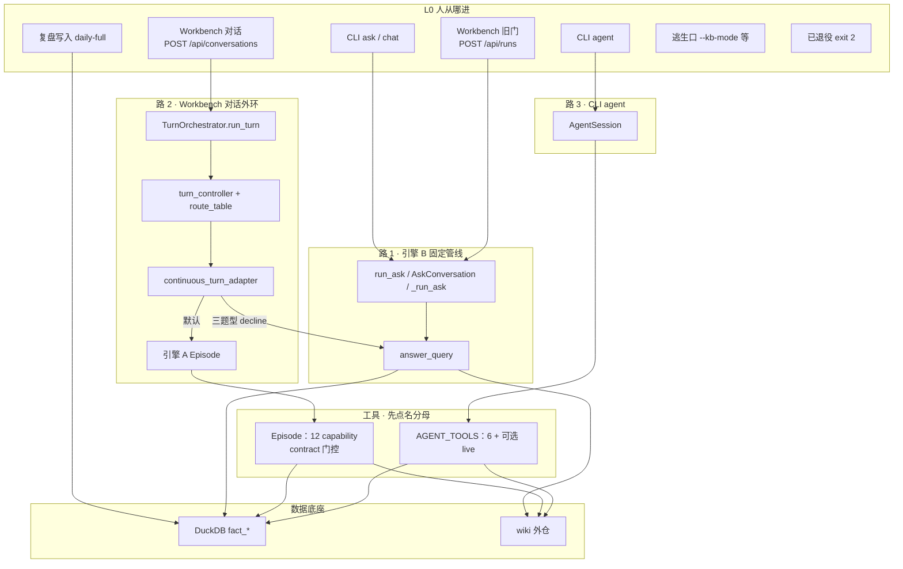

# 金融 Agent：产品门 / 引擎 / 积木

评接口深浅、找「入口」、看一次请求怎么转、宣称「我们没有 X」之前读本页。
能力有哪些节点仍以能力图谱为准，本页不抄工具表、不写死个数。

两把尺子不要混：「先分四层」评接口深浅；「三扇门三条路」画一次请求怎么走。后者不是再叠一层楼。

**深模块** = 调用方每学一单位接口能驱动多少行为。接口包括签名、不变量、必须知道的配置。数参数个数当深浅，会把测试旋钮当成生产门。

## 先分四层，不要压成一句「架构」

| 层 | 人话 | 代表物 | 是不是门 |
|---|---|---|---|
| **产品门** | 人/UI/脚本真正走进来的地方 | 见下一节 | 是 |
| **引擎** | 进门之后怎么跑一轮研究 | A 连续 Episode；B 写死流程 `answer_query`；C 是 CLI `agent` 的平行 loop | 不是门 |
| **组装** | 把零件接到引擎上 | `GLMAgentRuntime`、`episode_factory.build_episode_context`、`episode_tools`、`default_registry` | 不是门 |
| **积木** | 引擎内部的零件 | `ResearchToolRegistry`、`llm_refine`、`perspective_lab`、数据块注册表 | 不是门 |

删掉积木，复杂度会散到每条引擎；删掉门，人会找不到入口。两件事不要混着打分。

## 产品门（当前该走的入口）

| 谁 | 走哪扇门 | 合同 |
|---|---|---|
| 人 / 编码 agent 一次性提问 | `python3 -m intelligence.cli ask "<问题>"` | 默认只收问题字符串；`--wiki-rag-mode` 等是逃生口 |
| 同一会话追问 | `python3 -m intelligence.cli chat` | 首轮仍是 ask 管线 |
| 显式要模型自己选工具 | `python3 -m intelligence.cli agent` | opt-in，默认不影响 ask/chat |
| Workbench 对话 UI | `POST /api/conversations` → `TurnOrchestrator.run_turn` | 有 `conversation_id` / `run_id`；不要用 CLI 冒充这套 id |
| Workbench 单次提问旧门 | `POST /api/runs` → `_run_ask` → `answer_query` | 独立入口，走引擎 B。主对话不走这扇；客户端 `createRun` 还在 |
| 复盘写入（另一条面） | `python3 -m market_feature_store.cli daily-full` | 飞书 Bitable 写入已退役 |
| 飞书 IM（已退役，不是门） | `python3 -m intelligence.cli feishu-bot` | exit 2，不连 WebSocket。与 Bitable 写入退役是两件事 |

`cli route` / `cli orchestrate` 走 `question_router`，是老分诊，不是 Turn 主链，不要当正门。

编码任务「仓库里有没有现成实现」走 `python3 scripts/code_map.py query "<问题>"`，不是本页，也不是问答门。空图不得写成架构结论。

## 一次请求怎么转（三扇门三条路）

L0 只认「人从哪进」。进门之后是三条平行路，不是一座楼先进入 `TurnOrchestrator` 再往下分叉。按目录画图会把 `AskOptions` 测试旋钮当成生产门——任何「产品入口 vs 内部开关」系统都是这个坑。

**路 1 · CLI `ask` / `chat`，以及旧门 `/api/runs`**

进门就走引擎 B：分类 → `retrieval_planner` → 数据块（块自己的 `applies()` 做意图门控）→ 合成。没有 Turn 外环。预算在 `AskOptions`（`deadline` / `module_timeout`）上，不在 `TurnOrchestrator`。

**路 2 · Workbench 对话**

唯一建立「绝对 `expires_at` + 合成预留 + 双台账」的地方。相对秒每跳重计，总时长会膨胀，所以 deadline 传绝对时刻。`turn_controller` 只从 `route_table` 选一行，`required_outputs` 由表派生。默认引擎 A（模型按契约选只读工具）；`external_market` / `quick_fact` / `dated_market_review` 三种确定性题型 decline，回落路 1 的 B。A 还能开第三圈 `sub_research`（嵌套 Episode，产出只回注主环，不直接发布）。答案离开前过判官 / 发布门。

**路 3 · CLI `agent`**

`AgentSession`，默认 `max_steps=6`。工具面是 `AGENT_TOOLS`（6 件套；本地 DuckDB 可用才加 `search_market_live`），没有 Episode 那套 `contract.allowed_capabilities` 门控。问「有多少工具」必须先点名分母。

写入面不进问答 loop：`daily-full` 直写 DuckDB；`fact_sector_daily` 是 VIEW，只暴露 published 快照。逃生口是 `AskOptions` 旗标，写进日常口令就是把积木当门。退役入口留骨架、`exit 2`，旧调用方拿到明确退出码，比删文件后 `ImportError` 好诊断。

## 两条引擎（只在路 2 后面有调度器）

`TurnOrchestrator` / `conversation_orchestrator` 只在路 2。路 1 不经过它；路 3 是平行第三条 loop。路 2 上两条引擎都调 LLM，差别是**流程谁定**：

| 引擎 | 实现 | 何时用 |
|---|---|---|
| **A**（路 2 默认） | `continuous_turn_adapter` → `ContinuousAgentEpisode` | 模型按契约自选只读工具 |
| **B** | `ask.answer_query` | 路 1 的固定管线；路 2 仅 `external_market` / `quick_fact` / `dated_market_review` 回落（`DETERMINISTIC_OWNER_TYPES`） |
| **C**（路 3） | `AgentSession` | CLI `agent` opt-in；不经过 `TurnOrchestrator` |

不要把 `ask.answer_query` 写成「金融 Agent 的唯一深模块」。它是引擎 B。也不要为「少学零件」再加 `answer_door` / `EpisodeBuilder`：组装已经在 `GLMAgentRuntime` 和 `episode_factory`。

### 生产里谁在拼 `AskOptions`（为什么不加 `answer_door`）

不含测试。再加一层 `resolve_answer_door(query)` 通不过删除测试：删掉它，调用方仍要自带策略字段。

| 调用方 | 怎么进 | 是不是「只传 query」 |
|---|---|---|
| `cli ask` | 直接构 `AskOptions` → `run_ask`（薄包装，不再拷字段） | 否，经 CLI 默认填充 |
| `cli chat` / `cli agent` | 直接 `AskOptions` | 否 |
| 飞书 IM | `feishu-bot` **exit 2**；文件里还留着 `_run_ask_workflow`，`run()` 到不了 | 已退役，不是门 |
| `research_owner.py` | 直接 `AskOptions`，带 `compose` / `deadline` / `question_type_override` 等 | 否，策略调用方 |
| Workbench `app.py` `_run_ask` | 直接 `AskOptions` + `answer_query`，走 run/store | 否，UI 合同 |

问金融问题走 CLI `ask`；问「仓库里有没有现成实现」走 `python3 scripts/code_map.py query`。仓库里没有第四套 Python `answer_door`。`AskWorkflowOptions` 已不存在。真浅的若还要收，是删掉 `run_ask` 这层包装，不是再加转发。

## 积木（常见误判）

这些可以很深，但**调用方不是人，是引擎**：

- `ResearchToolRegistry`：授权、参数规范化、同 key 只跑一次、截止日期过滤。不是 `{name: runner}` 字典。超时/重试在 Episode 批次循环，不要搬进注册表（`services/` 不得 import `runtime/`）。
- `llm_refine`：传输（重试/流式/预算）+ 任务提示词焊在一个文件。不要合成万能 `generate(task_type)`。
- `perspective_lab.active_runtime_prompt`：视角注入门。模块里还有路径 helper，不要把整文件当成四方法闭环。
- 数据块（D0/D6/D9…）：意图门控在块自己的 `applies()`。调用方若要关某一块，只传 `AskOptions.enabled_providers`（或 `evidence_registry.without_providers(...)`）。**不要**再给每个块一个 `include_*_block`。

`force_moneyflow_block` 是「日报强制取 L2」，不是允许开关，仍留在 `AskOptions`。
`include_scenario_guidance` / `include_track_guidance` 是表达契约，不是数据块。

## 失败形状（本页要挡住的）

对着积木的公开方法数打「浅」、建议再包一层工厂、建议把超时重试塞进注册表——都是把积木当成了门。先问：调用方是人、是调度器、还是引擎内部？

把 `feishu-bot` 当问答正门，或把「飞书 Bitable 写入已退役」写成连 IM 长连接也没了——两扇门不是同一件事。IM 入口现在 exit 2。

把路 1 / 路 2 / 路 3 画成一座楼先进入 `TurnOrchestrator` 再往下分叉——调度器只在路 2。把「12 个工具」说成全产品能力、不问分母——12 只对 Episode 成立。
