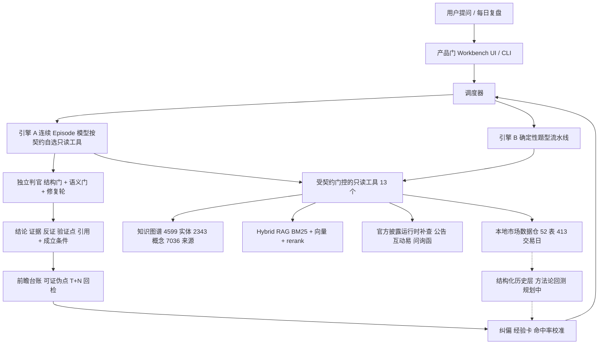

# 商业计划书：证据可追溯的 A 股个人研究工作台

- 版本：v0.2（2026-09-04；供创业比赛 / 孵化器申请）
- 变更记录：v0.1 初稿 11 章 + 附录 A–D；v0.2 新增第 8 章「市场进入与获客」、第 12 章「财务预测」、附录 E「评委问答预演」，修正技能数（37）、前瞻台账天数（23）与三处外部来源（Rogo 融资日期改为 2026-04、Hebbia 改引 TechCrunch 原报道、Perplexity 改引官方定价页）；单次研究推理成本用自用生产实例 356 个 run 实测替代占位（第 7.3 节）；配套 17 页路演 deck `2026-09-finance-agent-deck.md`（Marp 格式，含讲稿）。
- 产品名（占位）：市场情报工作台 / Market Intelligence Workbench
- 阅读方式：每一章对应一页路演页，章末「路演页要点」是那页的三句话。占位符统一写作 `【待填：…】`，全部清单见附录 C。
- 数据口径：仓内数字以 2026-09-02 数据日为准；外部数字逐条给来源（附录 B），无来源的一律标「估算」；财务数字全部为假设（第 12 章），不是预测。

---

## 1. 执行摘要

**一句话**：我们做一个让活跃个人投资者「把自己的研究方法变成可校准系统」的 AI 研究工作台——每一条结论都带证据和成立条件，每一次判断都进台账、事后被验证，用历史统计而不是单次对错来决定哪些方法值得保留。

**痛点**：A 股 2.5 亿投资者中自然人占 99.7%（中国结算 2025 年统计年报）。今天的 AI 金融问答（同花顺问财、东方财富妙想、Wind Alice 等）解决了「查得快」，没有解决三件事：答案会编造、千人一面、用户自己的判断从不被复盘校准。

**方案**：一个建立在本地市场数据仓（52 张表、413 个交易日、210 万条个股日行）和知识图谱（4,599 家公司实体、2,343 个概念、7,036 份来源）之上的研究 Agent，四个核心场景——每日复盘、题材研究、个股深挖、前瞻假设登记与后验验证。

**三张差异化牌**（竞品都没有）：
1. **证据链 fail-closed**：无证据不准出结论，独立判官二次审稿，结论携带成立条件与数据截止日。
2. **闭环学习**：用户纠偏、经验卡、可证伪点回检、命中率校准——系统越用越像你自己（当前已累计 124 条纠偏、83 个可证伪点）。
3. **方法论可回测**（雏形 + 规划）：把历史行情与题材编译成机器可查询的结构语言，任何一条用今天的视角写出的方法论都能在历史上算出成功率、基准率和置信区间——纠偏升级为经验必须过统计门，不因一次错误否定一套方法。

**现状**：生产实例已自用运行，主干 7,386 条自动化测试通过；邀请制内测的身份门与配额方案已完成设计与运行手册。

**怎么拿到用户**：内容先于产品、证据先于文案——每交易日一份公开复盘摘要、每周一篇题材拆解，全部过与产品同一条证据门；读者导入邀请码候补名单，Alpha 3–10 人 → Beta 50–200 人 → 公测。三个入口已经存在：研究发布门户、短视频、开源信息流阅读器（第 8 章）。

**本轮目标**：完成 3–10 人邀请制 Alpha，验证「愿意为证据可追溯付费」的假设；6 个月内进入托管 Beta 与付费测试。

**财务（假设）**：第 3 年末 1 万付费用户、年收入运行率 1,500 万元、综合毛利率约 70%；约 5,500 付费用户到达盈亏平衡；累计现金最低点约 −150 万元出现在第 2 年末（第 12 章）。单次研究推理成本已用自用生产实例 356 个 run 实测：旗舰档中位 0.34 元、p90 0.72 元，模型按 1 元计（第 7.3 节）。

**融资需求**：`【待填：金额】`；模型建议区间 200–300 万元（18 个月跑道 + 缓冲），用途见第 13 章。

> 路演页要点：谁（2.5 亿自然人投资者中的半专业层）/ 什么（证据可追溯 + 会校准自己的研究工作台）/ 为什么是我们（三张牌，已在生产环境跑起来）。

---

## 2. 问题与痛点

### 2.1 用户是谁

不是「所有股民」。我们瞄准的是 **有自己研究框架、每天复盘、愿意为工具付费的半专业个人投资者与独立研究员**。一个可量化的代理口径是融资融券信用账户的个人投资者——开立需要资产与经验门槛，2025 年末为 779.47 万户，且个人净增、机构净减（中国结算 2025 年统计年报，见附录 B-1）。

这群人的共同特征：已经在用同花顺 / 东财 / Wind，已经在看研报和复盘，痛点不是「没有信息」，而是「信息不可信、判断不可积累」。

### 2.2 三个恨点

| 恨点 | 现场表现 | 现有产品为什么解决不了 |
|---|---|---|
| **编造** | 问一只股票的客户结构，AI 给出一段看起来专业、实际上没有出处的话；问历史某天的板块表现，AI 拿今天的数据回答 | 通用 chatbot 的生成器没有「无证据即拒答」的硬门；大厂产品以流量和交易转化为目标，暴露错误率是负资产 |
| **千人一面** | 每个人问同一个题材得到同一段综述；用户说「我不这么看」，下一次照旧 | 大厂模型为规模化服务，个人纠偏无法进入系统 |
| **判断不被校准** | 用户每天做几十个判断，从不知道自己哪类判断靠谱、哪类是错觉；一次踩坑就否定整套方法 | 没有台账，没有事后验证，更没有历史统计 |

### 2.3 为什么现在

- **供给侧**：2025–2026 年国内头部平台全部完成大模型部署并转向 Agent 形态——同花顺问财升级为智能投研 Agent 并推出 iFinD MCP，东方财富推出「妙想 Claw」与「Skill 广场」，万得 2026 年 3 月发布 Wind Alice 个人版（附录 B-4/B-5/B-8）。**「是不是 Agent」已经不是差异化，「Agent 说的话能不能信、能不能校准」才是。**
- **需求侧**：50.43% 的个人投资者从未使用任何 AI 财富管理工具，深度使用者仅 14.8%（附录 B-15）——市场处在教育早期，第一批深度用户最在意的正是可信度。
- **监管侧**：2026 年 5–6 月证监会防非宣传月把「新型 AI 非法荐股」列为重点（附录 B-19）。合规压力会淘汰「AI 荐股」叙事，留下「研究工具」叙事——这正是我们的定位。

> 路演页要点：半专业个人投资者（信用账户 779 万户为代理）/ 三个恨点：编造、千人一面、判断不被校准 / 大厂都做了 Agent，可信与校准成为唯一空位。

---

## 3. 产品与解决方案

### 3.1 一句话定义

> 面向 A 股半专业个人投资者的 AI 研究工作台：回答「主线在哪、为什么发酵、谁受益、证据强不强、市场是否响应」，每个结论带证据与成立条件，每个判断进台账并事后验证。

### 3.2 四个核心场景

| 场景 | 用户做什么 | 系统做什么 | 输出 |
|---|---|---|---|
| **每日复盘** | 收盘后打开工作台 | 从本地数据仓生成市场阶段、容量板块、双红题材、涨停热度、新高映射；用用户自己的框架解读 | 结构化复盘 + 框架解读 + 明日观察点（作为可证伪假设登记） |
| **题材研究** | 输入一个新名词或事件 | 题材雷达：定义、产业链拆解、公司分层、证据索引、信号缺口；发酵链路回溯（消息面 × 盘面时间轴） | 只读研究报告，标明证据层级（L1 研报判断 / L2 基础画像 / L3 官方硬事实 / L4 市场信号） |
| **个股深挖** | 问「这只股怎么看」 | 客户证据硬度、收入结构、逻辑生命周期、强反证；估值带与隐含预期 | 结论 / 证据 / 反证 / 验证点 / 引用，五段缺一不发 |
| **前瞻假设与后验** | 写下自己的判断 | 登记为可证伪点，到期自动回检，按类别统计命中率；用户纠偏落台账并回灌 | 命中率校准报告、经验卡、纠偏记录 |

### 3.3 用户旅程（一天）

1. 盘后 18:30 数据自动入库并质检；20:00 生成当日复盘与研究队列。
2. 用户读复盘，对某个判断说「不对，应该是……」——系统当场记为纠偏，后续解读自动带上。
3. 用户问「XX 题材是怎么发酵起来的」——系统给出消息 → 首板 → 板块双红 → 补涨扩散的时间轴，每个节点带数据出处。
4. 用户写下「明天 XX 板块若放量则主线切换」——登记为可证伪点，T+1 / T+3 / T+5 自动回检。
5. 周末打开校准报告：哪类判断命中率高、哪类低、样本够不够下结论。

### 3.4 产品边界（与合规直接相关，详见第 9 章）

- 不输出个股买卖建议、目标价、买卖时点。
- 前瞻内容限定为**市场结构假设**，强制以「可证伪点」形式登记，界面标注「非投资建议」。
- 不做自动下单、不接交易。
- 不把仍在验证中的策略假设包装成确定性规则。

`【待填：3 张 demo 截图——复盘页 / 题材发酵时间轴 / 校准报告】`

> 路演页要点：四个场景一条线：复盘 → 研究 → 假设 → 验证 / 每个结论五段缺一不发 / 边界写在产品里，不是写在免责声明里。

---

## 4. 技术架构与壁垒

### 4.1 架构

五层：数据事实层（本地列存数据仓 + 每日快照）→ 数据管道层（唯一写入口、板块名单快照分代、覆盖审计）→ 分析与策略层（信号检测、板块回测、策略进化）→ 技能层（37 个技能，其中多数刻意不暴露给 Agent 以守住只读与无外呼红线）→ 智能层（一个调度器 + 两条引擎 + 独立判官 + 学习闭环）。

### 4.2 壁垒一：证据链 fail-closed

- **无证据不准出结论**：终局准入门检查每条结论是否绑定证据哈希，伪造哈希的稿件被驳回并进入修复轮。
- **独立判官**：判官与写手不是同一个模型上下文，看的是结构化的工具调用与证据，不看写手的自由文本——防止「话术说服自己」。
- **结论携带成立条件**：数据截止日、覆盖范围、被截断的行数、缺口声明，限定语排在被限定内容之前，永不被截断。
- **认不出来就 fail closed**：日期解析不出、板块名对不上、数据源返回异常，一律声明缺口而不是猜。

这些不是提示词里的「请注意」，是代码里的门禁，有 7,386 条自动化测试钉住。

### 4.3 壁垒二：闭环学习

系统整体是环，不是流水线：**输入 → 处理 → 质检 → 输出 → 评估 → 沉淀 → 回到输入**。

- 用户在对话里说「不对，应该是……」，当场落纠偏台账（当前 124 条），后续复盘的框架解读自动加载。
- 低分或高价值回答压成经验卡，下次合成时注入；多次验证后升级为稳定方法论；已固化进代码的卡退出注入，避免重复供给。
- 可证伪点登记后按期回检（当前 83 个），按类别、按来源统计命中率并回灌到前瞻提示。
- 视角蒸馏：把 KOL 方法论或用户自己的框架蒸成结构化画像，回答时显式切换「数据中立 / 单一视角 / 多视角并列」。

### 4.4 壁垒三：方法论可回测（雏形已在，规划中）

**问题**：闭环学习最容易被质疑的一点是「一次说错就改规则，不是过拟合吗？」我们的答案是：**纠偏升级为经验必须过统计门。**

**做法**：把历史行情与历史题材「编译」成机器可查询的结构语言——逐日、逐板块 / 题材 / 个股的离散标签（严格双红、连续双红计数、边际量拐点、多周期共振、涨停热度跃迁、主线切换、分歧日、MA5 峰谷确认、题材生命周期阶段）。所有标签由确定性规则生成、版本化、无前视（只在确认日打标）。

在此之上，任何一条方法论都写成声明式规则（条件 = 标签谓词 + 时间窗，结果 = 3/5/7/10 日多窗口收益、区间最高收益、峰值天数、峰值后回撤），由编译器转成参数化查询在历史上跑出：命中率、同期基准率、提升幅度、Wilson 置信区间、样本量、前后半段稳定性。结论四态：样本不足 / 与基准不可区分 / 支持 / 证伪。

**为什么这是壁垒**：
- 同花顺问财的「策略验证」只做条件选股回测，没有题材层、没有用户判断台账、不校准用户自己。
- 大厂产品逻辑是规模化与流量，不会为单个用户维护「你的方法论在历史上成功率多少」。
- 它把「AI 说」变成「数据说」——对半专业用户，这是从工具到伙伴的分界线。
- 中研普华 2026 年行业报告指出，60% 以上机构用户把「可解释性」和「与投研流程融合深度」作为选型核心，能形成「AI 预测—人工校准—AI 学习」闭环的平台将获得更高粘性与溢价（附录 B-13）。我们把这条逻辑下沉到个人。

**现状**：数据层（413 个交易日、双红定义、板块回测引擎、多窗口前瞻收益验证、可证伪点校准）已具备；结构化标签层与方法论编译器已立设计稿与可派发的 P0 工单（内部文件位置见附录 D），进入第 10 章里程碑 M1。

### 4.5 生产级 harness：为什么抄不走

一个人能把系统跑到生产级，靠的不是模型，是驾驭层。已在真实事故中验证并沉淀为可迁移原则的包括：配额在副作用前预占而不是事后计数、全链路 deadline 传绝对时刻、请求去重用 per-key single-flight、授予的额度必须传到最下游执行者、棘轮式门禁（存量免检、新增拦截）、单一真本源且从源码生成、测试收据携带成立条件。这套方法论本身已整理为跨项目的「设计 / 搭建 / 审计」工具包——它是团队效率的倍增器，也是第二阶段面向机构做定制部署（FDE 模式）时的交付物。

> 路演页要点：三张牌——fail-closed 证据链、闭环学习、方法论可回测 / 7,386 条测试钉住的是门禁不是文案 / 一个人 + 生产级 harness。

---

## 5. 市场分析

### 5.1 三层口径

| 层 | 口径 | 数字 | 来源 |
|---|---|---|---|
| **TAM** | A 股投资者总数（一码通口径） | 2025 年末 2.5 亿，2026 年 5 月末估算逼近 2.6 亿；自然人占 99.7% | B-1、B-2 |
| **可触达活跃层** | 第三方证券服务 APP 月活（代理） | 同花顺 3,867.73 万（2026-07），东方财富 1,947.43 万 | B-4 |
| **SAM** | 半专业个人投资者 × 深度使用意愿 × 年付费 | 信用账户个人 779.47 万户 × 深度使用 14.8% ≈ 115 万人；× 1,000–3,000 元/年 ≈ **11.5–34.6 亿元/年**（估算） | B-1、B-15、B-16 |
| **SOM（3 年目标）** | 付费用户 × ARPU | 1 万付费用户 × 1,500 元 ≈ **1,500 万元/年**（目标，非预测） | 本文假设 |

取数说明：
- 用信用账户个人投资者代理「半专业层」，因其开立有资产与经验门槛，且 2025 年个人净增 64.1 万户（B-1）。
- 付费区间取自个人投资者对 AI 工具年预算 100–5,000 元的调研区间（B-15）与「超七成付费项目为升级版技术指标」的既有付费习惯（B-16）；高端锚点是东方财富 Choice 普通账户 1.8 万/年、开通妙想 AI 后 2.9 万/年，AI 溢价 1.1 万/年（B-7）。

### 5.2 第二曲线：机构智能投研

三方估算 2023 年中国智能投研市场 156 亿元，预计 2029 年突破 800 亿元（B-13）；大模型驱动的智能投研与自动化报告生成 2026 年约 185 亿元，以机构采购为主（B-14，估算口径较宽，仅作参考）。我们不在第一阶段进入这个市场，但 fail-closed 证据链与可审计判官正是机构合规最需要的能力，第二阶段以 FDE 模式切入中小私募与独立研究团队。

### 5.3 趋势判断

1. 新增投资者持续流入：2026 年前 5 个月新开户 1,729.68 万户，同比 +57.94%（B-2）——用户教育成本在下降。
2. 平台商业模式已验证「卖工具」可行：同花顺不持券商牌照，2026 上半年增值电信业务收入 12.69 亿元、同比 +47.56%，毛利率 86.81%（B-5）。
3. 竞争从「有没有 AI」转向「AI 能不能信」：可解释性与流程融合成为选型核心（B-13）。

> 路演页要点：TAM 2.5 亿 → 活跃 3,900 万 → SAM 115 万人 / 11.5–34.6 亿元 → 3 年目标 1 万付费 / 卖工具的商业模式已被同花顺验证。

---

## 6. 竞品分析

### 6.1 主要玩家

| 玩家 | 形态 | 强项 | 与我们的差异 | 来源 |
|---|---|---|---|---|
| 同花顺 问财 / HithinkGPT | 免费 + 增值；2025-07 升级为自主规划智能体；iFinD MCP 面向 B 端 | 中文金融体验最成熟，月活 3,868 万，研发投入 11.45 亿（占营收 18.99%） | 面向全体散户、千人一面；「策略验证」是条件选股回测，无题材层、无用户判断台账 | B-4、B-5、B-6、B-7 |
| 东方财富 妙想 | 嵌入股吧 / 行情 / 交易全链路；妙想 Claw、Skill 广场；Choice AI 版 2.9 万/年 | 社区生态与交易闭环，机构投研助理 | 目标是生态内转化；证据可追溯与个人校准不是其产品逻辑 | B-4、B-5、B-7 |
| 万得 Wind Alice 个人版 | 2026-03 上线，积分计费，数百个金融 MCP 工具，技能广场 | 机构级数据底座，面向专业金融从业者 | 面向从业者而非个人投资者的 A 股复盘场景；不学习单个用户的判断 | B-8、B-9 |
| 华泰 AI 涨乐等券商 AI 终端 | 多专家 Agent，2026-04 用户 351 万 | 交易入口 + 牌照 | 服务自家客户、交易导向 | B-17 |
| 大智慧、雪球、通用大模型（Kimi / 豆包 / DeepSeek） | 接入第三方模型或通用问答 | 快、免费 | 无本地数据仓与证据门，编造风险最高 | B-7 |
| AlphaSense / Hebbia / Rogo（海外） | 机构级 AI 研究平台；AlphaSense 2026-06 估值 75 亿美元、ARR 超 6 亿美元；Rogo 2026-04 Series D 后估值 20 亿美元、250 余家机构客户；Hebbia 2024-07 估值约 7 亿美元 | 证明「可审计的 AI 研究」是高价值市场 | 面向机构与美股；验证了我们的方向，不构成直接竞争 | B-10、B-11、B-12 |
| Perplexity Finance | Pro 20 美元/月（年付 200 美元），Max 200 美元/月 | 每个论点附来源，是 C 端「可追溯」的定价与体验参照 | 无 A 股本地数据、无学习闭环 | B-21 |

### 6.2 差异化矩阵

| 维度 | 问财 | 妙想 | Wind Alice | 通用大模型 | 我们 |
|---|---|---|---|---|---|
| 无证据即拒答的硬门 | 否 | 否 | 部分（附数据来源） | 否 | **是** |
| 独立判官二次审稿 | 否 | 否 | 否 | 否 | **是** |
| 用户纠偏进入系统并回灌 | 否 | 否 | 否 | 否 | **是** |
| 判断登记台账 + 事后校准 | 否 | 否 | 否 | 否 | **是** |
| 方法论历史成功率回测 | 条件选股回测 | 否 | 策略回测（机构口径） | 否 | **题材 + 板块 + 个人判断三层**（规划） |
| A 股题材知识图谱 | 有（内部） | 有（内部） | 有 | 无 | 有（4,599 实体 / 2,343 概念，证据分层） |
| 定位 | 全体散户 | 生态内转化 | 专业从业者 | 通用 | 半专业个人研究者 |

### 6.3 大厂为什么不做

不是做不到，是产品逻辑不同：暴露错误率、允许用户纠正、给单个用户维护方法论台账，对流量与交易导向的平台是成本与负资产；对研究工具是信任资产。这条差异在组织层面比在技术层面更难跨越。

> 路演页要点：三家都已是 Agent + 技能广场 / 我们不比「快」，比「能不能信、会不会校准你」/ 海外 AlphaSense、Rogo 用估值验证了「可审计研究」的价值。

---

## 7. 商业模式

### 7.1 订阅分层（定价为假设，Alpha 期验证）

| 层 | 内容 | 定价假设 | 参照 |
|---|---|---|---|
| **免费** | 每日复盘摘要、题材雷达简版、有限次提问 | 0 | 获客与教育 |
| **Pro** | 完整研究工作台、可证伪点台账与校准、纠偏回灌、发酵链路回溯、方法论回测 | 199 元/月 或 1,999 元/年 | Perplexity Pro 20 美元/月（B-21）；个人年预算 100–5,000 元（B-15） |
| **Studio（小团队 / 私募 / 独立研究员）** | 多席位、私有数据与研报接入、自定义视角、导出研究底稿、优先支持 | 9,999 元/年/席起 | Choice AI 溢价 1.1 万/年（B-7） |

### 7.2 第二阶段：机构 FDE 部署与方法论输出

- 面向中小私募与独立研究团队做前置部署（FDE）：接入其私有数据与研究框架，交付可审计的研究 Agent。参照 Rogo「每个部署都是定制 + 白手套服务」的模式（B-11）。
- 生产级 harness「设计 / 搭建 / 审计」工具包作为咨询与培训产品，面向要自建垂直 Agent 的团队。

### 7.3 单位经济（假设）

- 主要变动成本是模型推理：多供应商抽象层已实现，可按任务选择模型档位；预算在副作用前预占，成本上限可控。
- 目标毛利率：单用户口径（推理 + 托管）从 Beta 起 ≥ 80%；含数据授权分摊的综合毛利率在规模化后（第 3 年）70% 以上（对标同花顺增值电信 86.81%，B-5；它自有数据，我们要付数据授权，所以上限更低）。
- 免费层的推理成本按获客成本记账，不进销售成本——免费层的功能就是获客，与付费用户的服务成本分开记，毛利率才可比。
- **单次研究推理成本（自用生产实例实测）**：2026-08-12 至 08-31 真人用户 356 个完成的研究 run，写手侧每次中位 3.8 万输入 / 1,400 输出 tokens，p90 8.0 万 / 2,900，输入占 96%。按智谱官方定价（B-22）折算：旗舰档 GLM-5.2（8 元 / 28 元每百万 tokens）中位 0.34 元、均值 0.43 元、p90 0.72 元；GLM-5 档均值约 0.33 元；轻量档 0.1 元量级。独立判官走另一条模型链未计入 token，按再加三到五成估，全口径 p90 约 1 元——第 12 章按每次 1 元计，是偏保守的上界。`【待填：Alpha 期含判官的全口径实测】`
- 降本杠杆：96% 的 token 是每次调用重复发送的上下文（系统提示、工具结果、对话历史），智谱缓存命中价是原价的 1/4（8 元 → 2 元），接上提示词缓存后输入成本可再降一半以上；判官与路由用轻量档模型是第二个杠杆。
- 用量口径提醒：创始人自用 20 天跑了 495 次（含测试），重度用户远超模型假设的每年 240 次——这正是 Pro 层必须有日配额、且配额在副作用前预占的原因。
- 三年模型见第 12 章。

> 路演页要点：免费 → Pro（199 元/月）→ Studio（9,999 元/年/席）/ 第二曲线：机构 FDE + harness 方法论 / 成本可控：预算预占 + 多模型档位。

---

## 8. 市场进入与获客

### 8.1 原则：内容先于产品，证据先于文案

我们卖的是「可信」，获客也必须可信。所有对外内容走已经建好的营销内容契约：产品「可说 / 不可说」边界、每条卖点绑定一项有证据的功能、禁用改写清单（例如「复盘告诉你明天买什么」「按分层买入稳赚」一律禁写）、发布前四道审查（事实、合规、隐私、质量）。营销与产品用同一条 fail-closed 纪律——目标用户第一次接触我们，看到的就是「这家的内容不吹」。

### 8.2 人群与渠道

| 人群 | 痛点 | 渠道 | 内容形态 | 行动号召 |
|---|---|---|---|---|
| **主观交易者**（主线） | 盘面、研报、消息太散，复盘靠感觉；题材来了不知道证据硬不硬 | 知乎长文、X / 微博 thread、抖音短视频 | 每交易日复盘摘要（结构化、带数据出处）；题材发酵链路回溯 | 申请邀请码 |
| **财经内容创作者**（主线） | 选题多消化慢；题材拆解耗时 | 知乎、短视频、社群 | 「从线索到证据分层」的工作流演示 | 看 demo、申请 Studio 试用 |
| **AI 工具爱好者**（辅线） | 想看真实 Agent 项目，不想看玩具 demo | X thread、知乎、开源社区 | 架构与 harness 文章（fail-closed、独立判官、预算预占） | 关注、参与开源 |
| 明确不面向 | 想要确定性荐股的用户 | 不投放、不接待 | — | — |

最后一行不是姿态，是风控：这类用户与「不选股、不预测」的产品边界天然冲突，转化后也留不住，还会把口碑带偏。

### 8.3 三个已有的入口

1. **研究发布门户**：已有面向读者与 AI 检索的静态研究网站（GEO——为 AI 搜索引擎准备可抓取的全文入口）。精选复盘与题材研究以公开文章沉淀，是搜索与 AI 引用带来的长尾入口，边际成本接近零。
2. **短视频**：已有短视频运营项目（程序化成片流水线）。每日复盘摘要本来就是结构化数据，可以程序化生成成片，一天一条不需要人剪。`【待确认：短视频账号现状】`
3. **开源信息流阅读器 FinHot**：本地优先的金融 RSS 阅读器，已开源。「FinHot 发现线索 → 工作台验证题材」是已登记的组合工作流卖点，可作为开发者与 AI 工具爱好者的入口。`【待拍板：是否纳入获客入口；当前自动抓取暂停】`

### 8.4 漏斗与阶段目标

| 阶段 | 获客动作 | 漏斗目标 | 对应里程碑 |
|---|---|---|---|
| 0–3 个月 | 创始人自有复盘圈层 + 门户 / 知乎文章导入候补名单；手工邀请 3–10 名可信用户（有研究框架、每天用、愿意反馈） | 候补名单 ≥ 200；Alpha 周活 ≥ 60% | M1 |
| 3–6 个月 | 候补名单分批放码；每位 Beta 用户 3 个邀请码（邀请制本身是增长机制）；开始付费测试 | 注册 ≥ 2,000；付费 50–200；转化 ≥ 10% | M2 |
| 6–12 个月 | 复盘摘要日更 + 每周一篇题材长文 + 每周两条短视频；与创作者合作（Studio 试用换内容） | 注册 ≥ 10,000；付费 1,000 | M3 |
| 12–24 个月 | 搜索 / AI 引用长尾 + 口碑推荐 + Studio 小团队；FDE 试点 | 付费 1 万 | M4 |

### 8.5 单位获客经济（假设）

- 获客成本（CAC）目标 ≤ 250 元 / 付费用户：以内容驱动为主，付费投放为辅。
- 用户生命周期价值（LTV）：ARPU 1,500 元 × 毛利 70% × 平均留存 1.5 年 ≈ 1,575 元，LTV / CAC ≈ 6；若留存只有 1 年，≈ 4.2，仍高于 3 的常用及格线。
- 不做：买荐股类 KOL 流量、收益承诺型文案、进股票群推广。

> 路演页要点：内容先于产品、证据先于文案（营销也过证据门）/ 三个已有入口：研究门户、短视频、开源阅读器 / 漏斗：候补 200 → 注册 1 万 → 付费 1,000（12 个月），CAC ≤ 250 元。

---

## 9. 合规与风险

### 9.1 监管边界

- 2012 年证监会《关于加强对利用「荐股软件」从事证券投资咨询业务监管的暂行规定》：具备**具体证券品种分析、价格走势预测、品种选择建议、买卖时机建议**功能并获取经济利益的软件，属于从事证券投资咨询业务，须取得资格（B-18、B-20）。
- 2026 年 5–6 月证监会第七届防非宣传月将「新型 AI 非法荐股」列为重点（B-19）；《金融产品网络营销管理办法》2026-09-30 起施行，禁止用模拟业绩误导投资者（B-18）。
- 证券投资咨询牌照长期停发（2004 年 108 张 → 2016 年 84 张，B-20），新创业公司自行取得资质不现实。

### 9.2 我们的产品边界设计

| 监管定义的投顾动作 | 我们的处理 |
|---|---|
| 具体品种选择建议 | 不输出；题材公司分层只标注证据层级与硬度，不排序为「买入名单」 |
| 买卖时机建议 | 不输出；前瞻限于市场结构假设，登记为可证伪点并标注「非投资建议」 |
| 价格走势预测 | 不输出目标价；估值模块只呈现估值带与隐含预期的计算过程 |
| 模拟业绩营销 | 方法论回测结果只对用户本人可见，显示样本量与置信区间，不用于营销 |

付费点是**数据、证据整理、台账与校准能力**，不是「荐股」。长期路径二选一：与持牌机构合作（白标 / 联合运营）或在具备条件时申请资质——在 M3 前完成决策。`【待填：合规顾问意见】`

### 9.3 数据源合规化

现状：市场数据主要来自复盘类第三方站点的会话抓取，适合自用，**不适合商业化叙事**。路线：
1. Alpha 期：交易所公开数据 + AKShare 等开源接口作为基础层，现有源作为复盘参考层过渡。
2. Beta 期：接入持牌数据商授权（iFinD / Wind 数据服务），费用已按 30 / 60 / 100 万元三年分档计入第 12 章模型，是模型里最大的不确定项。
3. 知识库中的研报与纪要只用于生成证据索引与引用，不复制分发原文。

### 9.4 其他风险与对策

| 风险 | 对策 |
|---|---|
| 模型供应商依赖与成本波动 | 多供应商抽象；判官与写手可分档；预算预占 |
| 大厂跟进（技能广场、纠偏功能） | 差异在产品逻辑而非功能点；先在半专业层建立台账与数据积累的切换成本 |
| 单人团队 | 生产级 harness 与 agent 协作已让单人维持 7,386 条测试的系统；M1 内招募金融研究合伙人 |
| 市场教育早期（50% 从未用过） | 免费层 + 复盘内容获客；只服务已有研究习惯的人 |
| 样本量不足导致回测结论过度自信 | 结论四态强制显示「样本不足」；置信区间与基准率并列 |
| 付费转化或 ARPU 低于假设（财务模型最敏感的两项，第 12.4 节） | Alpha / Beta 的首要验证指标就是付费意愿与留存，不是功能数量；转化不达标则收缩为小团队自用 + 小圈子路径（附录 E 第 12 问） |

### 9.5 与监管方向同向

监管 2026 年的重点是打击「AI 非法荐股」、保护个人投资者。我们的产品逻辑——不选股、不预测、每个结论带证据与成立条件、用户判断被事后校准——本质上是在帮个人投资者养成「看证据、看样本量、看基准率」的研究习惯，与投资者教育的方向一致。这是评审「社会价值」一项可以陈述的点，也是未来与持牌机构、投教基地合作的叙事基础。

> 路演页要点：三个不做——不选股、不给买卖时点、不预测价格 / 数据源分三步合规化 / 风险表每条都有对策，且与监管方向同向。

---

## 10. 现状与里程碑

### 10.1 已完成（截至 2026-09）

- 生产实例自用运行，一个调度器 + 两条引擎 + 独立判官 + 修复轮。
- 本地数据仓 52 张表，覆盖 2024-12-20 至 2026-09-02 共 413 个交易日；板块日表 105,880 行，个股日表 2,098,594 行，题材涨停热度 46,877 行。
- 知识图谱 4,599 家公司实体、2,343 个概念、7,036 份来源、350 篇综合。
- 学习闭环：124 条纠偏、83 个可证伪点、双盲前瞻答卷台账 23 个交易日（2026-06-30 至 09-03，含错因反思与已批准经验）。
- 质量：404 个测试文件，主干 7,386 条通过；11 道提交前门禁。
- 邀请制 Alpha 的身份门、日配额、并发守卫、备份与拨测已完成设计与运行手册。
- 对外内容基础设施：营销内容契约（可说 / 不可说边界、卖点绑定证据、发布前审查）与研究发布门户已在。

### 10.2 里程碑

| 阶段 | 时间 | 交付 | 可验证指标 |
|---|---|---|---|
| **M1 邀请制 Alpha** | 0–3 个月 | 3–10 名可信用户；方法论回测 P0（结构化标签层 + 规则编译器 + 统计口径）；数据源合规评估 | 候补名单 ≥ 200；周活留存 ≥ 60%；每用户每周 ≥ 5 次研究提问；判官通过率与用户纠偏率周报 |
| **M2 托管 Beta** | 3–6 个月 | 云端部署 + 托管认证；50–200 用户；付费测试；持牌数据源接入；方法论回测进产品 | 注册 ≥ 2,000；付费转化 ≥ 10%；NPS；每次研究平均成本实测 |
| **M3 公测与订阅** | 6–12 个月 | Pro 层上线；合规路径决策（合作持牌机构 / 资质） | 注册 ≥ 10,000；1,000 付费用户；单用户口径毛利（推理 + 托管）≥ 80% |
| **M4 Studio 与 FDE** | 12–24 个月 | 小团队版；1–2 家私募 FDE 试点 | 1 万付费用户；综合毛利率 ≥ 70%；FDE 合同 `【待填】` |

> 路演页要点：已经在生产里跑，不是 PPT / 四个里程碑每个都有可验证指标 / 下一步是 3–10 人 Alpha。

---

## 11. 团队

### 11.1 创始人

`【待填：姓名 / 背景 / 为什么做这件事 / 投资研究经历 / 用 agent 协作建出生产级系统的经历】`

可写的事实：非科班背景，以「边做边学」方式在一年内建成并持续运营上述系统；把踩过的坑沉淀为跨项目可复用的 Agent 工程方法论（设计 / 搭建 / 审计三件套）。

### 11.2 招募中

| 岗位 | 职责 | 阶段 |
|---|---|---|
| 金融研究合伙人 | 研究框架与视角库、机构渠道、合规对接 | M1 |
| 全栈工程师 | 托管部署、多租户、前端体验 | M2 |
| 增长 / 内容 | 免费层内容运营、社群、付费转化 | M2 |

### 11.3 顾问

`【待填：合规 / 数据 / 投资顾问】`

> 路演页要点：一个人 + agent 团队做到今天 / 三个岗位补齐研究、工程、增长 / 合规顾问优先。

---

## 12. 财务预测（假设模型）

这一章的每个数字都是假设或目标，不是预测；写出来是为了让评委看到「钱怎么花、什么时候打平、哪个变量最要命」，以及我们打算先验证哪个变量。

### 12.1 关键假设

| 假设 | 取值 | 依据 |
|---|---|---|
| 付费用户（年末） | 第 1 年 1,000 / 第 2 年 4,000 / 第 3 年 10,000 | 第 10 章里程碑 M3 / M4；第 5 章 SOM |
| 年内平均付费用户 | 300 / 2,500 / 7,000 | 年内线性爬坡取均值；付费自第 4 个月 Beta 起 |
| 综合 ARPU | 1,500 元 / 年 | Pro 年付 1,999、月付 199 × 12 = 2,388，扣促销与流失后的保守折算；Studio 与 FDE 收入不计入（上行空间） |
| 免费 / 注册用户 | 付费用户的 10 倍 | 第 8 章 10% 转化目标 |
| 付费用户推理成本 | 240 元 / 年 | 每周 5 次深度研究 × 48 周 × 每次 1 元。实测写手侧旗舰档 0.34–0.72 元（中位–p90），含判官估 ≤ 1 元（第 7.3 节），1 元为保守上界 `【待填：Alpha 期含判官全口径实测】` |
| 免费用户推理成本 | 20 元 / 年 | 复盘摘要一次生成全员共享，提问受日配额限制；计入市场费用 |
| 数据授权 | 30 / 60 / 100 万元 | 持牌数据商自 M2 起接入，随用户规模分档；最大不确定项 `【待填：报价】` |
| 托管与运维 | 5 / 15 / 30 万元 | 托管部署、备份、拨测、托管认证服务 |
| 人力 | 2.5 / 5 / 8 人年 × 30 万元 | 第 11 章招募计划，含创始人；30 万元为全成本口径假设 `【待填】` |
| 合规与法务 | 15 / 20 / 30 万元 | 合规顾问、产品边界审查、持牌机构合作谈判 |
| 市场与内容（不含免费层推理） | 20 / 60 / 150 万元 | 第 3 年新增约 6,000 付费用户 ÷ 150 万元 ≈ 250 元 CAC，与第 8.5 节一致 |

### 12.2 三年损益（万元，假设）

| 项目 | 第 1 年 | 第 2 年 | 第 3 年 |
|---|---|---|---|
| 收入（平均付费用户 × ARPU） | 45 | 375 | 1,050 |
| 销售成本：付费用户推理 | 7 | 60 | 168 |
| 销售成本：数据授权 | 30 | 60 | 100 |
| 销售成本：托管与运维 | 5 | 15 | 30 |
| **毛利** | **3** | **240** | **752** |
| 毛利率 | 6% | 64% | 72% |
| 运营费用：人力 | 75 | 150 | 240 |
| 运营费用：合规与法务 | 15 | 20 | 30 |
| 运营费用：市场与内容（含免费层推理 6 / 50 / 140） | 26 | 110 | 290 |
| **净利润** | **−113** | **−40** | **+192** |
| 累计 | −113 | −153 | +39 |

第 1 年毛利率只有 6%，原因是数据授权是固定支出而付费用户还少——这是模型的真实形状，不粉饰；第 3 年末收入运行率 1 万 × 1,500 = 1,500 万元，即第 5 章 SOM。

### 12.3 盈亏平衡与现金需求

- 按第 3 年成本结构：每付费用户年贡献 = 1,500 − 240 = 1,260 元；固定性支出（数据 100 + 运维 30 + 人力 240 + 合规 30 + 市场 290）= 690 万元；690 万 ÷ 1,260 ≈ **5,500 付费用户**到达月度盈亏平衡，预计出现在第 3 年上半年。
- 累计现金最低点约 **−153 万元**（第 2 年末）。融资建议按 18 个月跑道 + 30% 缓冲取整：**200–300 万元**（第 13 章）。
- 若比赛 / 孵化器额度只覆盖 M1–M2（6 个月），需求约 80–100 万元；但数据授权与合规支出会落在下一轮，建议一次覆盖到付费数据出来的时点（M2 结束）之后。

### 12.4 敏感性（对第 3 年的影响）

| 变量 | 基准 | 悲观情形 | 第 3 年毛利率 | 第 3 年净利润 |
|---|---|---|---|---|
| 每次研究推理成本 | 1 元 | 2 元 | 72% → 56% | +192 → +24 万元 |
| 数据授权 | 100 万元 | 200 万元 | 72% → 62% | +192 → +92 万元 |
| 付费转化（注册数不变） | 10% | 5% | 59% | 约 −250 万元 |
| 综合 ARPU | 1,500 元 | 1,000 元 | 57% | 约 −160 万元 |

结论：模型对**付费转化与 ARPU** 最敏感，对推理成本次之——所以 Alpha / Beta 的核心验证指标是付费意愿与留存，不是功能数量。这也是第 9.4 节风险表新增一行的原因。

### 12.5 口径说明

- 全部为假设与目标；Studio 席位、FDE 定制、harness 方法论输出未计入收入。
- 免费层推理成本计入市场费用而非销售成本（理由见第 7.3 节）。
- 收入按年内平均付费用户计，不按年末数计——年末数 × ARPU 会把爬坡期的收入高估约一倍。

> 路演页要点：第 3 年 1 万付费、收入运行率 1,500 万元、综合毛利率约 70% / 约 5,500 付费用户盈亏平衡，现金最低点约 −150 万元 / 最敏感的是转化率与 ARPU，所以 Alpha 先验证付费意愿。

---

## 13. 融资需求与资金使用

`【待填：融资金额与出让比例】`——模型建议区间 200–300 万元（第 12.3 节：18 个月跑道 + 30% 缓冲）。

用途结构来自第 12 章模型的 18 个月支出结构（比例随金额与数据商报价调整）：

| 用途 | 比例 | 说明 |
|---|---|---|
| 研发与人力（含推理与托管） | 55% | 托管部署、方法论回测产品化、模型推理、金融研究合伙人与全栈工程师 |
| 数据授权 | 15% | 持牌数据商接入（M2 起）；若报价高于假设，此项比例上调、市场比例下调 |
| 合规与法务 | 10% | 合规顾问、产品边界审查、合作持牌机构谈判 |
| 市场与内容 | 20% | 免费层内容与推理、社群、Alpha → Beta → 公测转化 |

对应里程碑：本轮资金覆盖 M1 至 M3 前半（0–18 个月）；M2 结束时以付费转化率与单次研究成本实测值决定是加速还是收缩。若额度只覆盖 6 个月，按第 12.3 节小额口径 80–100 万元申报，用途比例改为研发 60 / 数据 10 / 合规 10 / 市场 20。

> 路演页要点：金额 `【待填】`（建议 200–300 万元）/ 55-15-10-20 / 花到 M2 出付费数据，再决定加速还是收缩。

---

## 附录 A：路演页映射

| 页 | 内容 | 对应章 |
|---|---|---|
| 1 | 封面：一句话定位 | 1 |
| 2 | 三个恨点 | 2.2 |
| 3 | 用户是谁：半专业层 779 万 | 2.1 |
| 4 | 为什么现在：供给 / 需求 / 监管 | 2.3 |
| 5 | 产品：四个场景一条线 | 3.2 |
| 6 | Demo：复盘 → 发酵链路 → 校准报告 | 3.3 |
| 7 | 架构图 | 4.1 |
| 8 | 三张牌 | 4.2–4.4 |
| 9 | 市场三层口径 | 5.1 |
| 10 | 竞品矩阵 + 大厂为什么不做 | 6.2–6.3 |
| 11 | 商业模式 | 7 |
| 12 | 市场进入：三个入口 + 漏斗 | 8 |
| 13 | 合规：三个不做 | 9.1–9.2 |
| 14 | 现状数字 + 里程碑 | 10 |
| 15 | 团队与招募 | 11 |
| 16 | 财务预测：三年损益 + 盈亏平衡 | 12 |
| 17 | 融资需求 | 13 |

17 页对 10 分钟路演偏多；若限 12 页，合并 3+4（用户 + 为什么现在）、7+8（架构 + 三张牌）、14+15（里程碑 + 团队）、16+17（财务 + 融资），并把 12 页市场进入并进 11 页商业模式。附录 E 是问答环节的准备稿。

按此映射压好的 deck 在同目录 `2026-09-finance-agent-deck.md`：Marp 格式，每页 HTML 注释里是约 30 秒的讲稿与视觉建议；`npx @marp-team/marp-cli <文件> --pptx`（或 `--pdf`）可直接导出。本文是母本，数字先改这里再同步过去。

## 附录 B：外部来源

- B-1 中国结算 2025 年统计年报（财联社转述，2026-06-14）：2025 年末投资者 2.5 亿，新增 1,386.95 万，自然人 99.70%；个人信用账户 779.47 万户。https://www.163.com/dy/article/KVDFKLRD05198CJN.html
- B-2 财经 365（2026-06-03）：2026 年前 5 月新开户 1,729.68 万户，同比 +57.94%；投资者总数估算逼近 2.6 亿。http://www.caijing365.com/html/caijing/yaowen/20260603/228494.html
- B-3 财联社（2025-07-16）：2024 年末投资者 2.37 亿（一码通口径）。https://api3.cls.cn/share/article/2086830
- B-4 新浪财经 / 易观千帆（2026-08-19）：同花顺 7 月月活 3,867.73 万，东方财富 1,947.43 万。https://finance.sina.com.cn/stock/aigcy/2026-08-19/doc-ininvshu2650001.shtml
- B-5 新浪财经（2026-08-28）：同花顺上半年增值电信收入 12.69 亿元、+47.56%，毛利率 86.81%；问财升级智能投研 Agent，iFinD MCP；东方财富妙想 Claw、Skill 广场。https://finance.sina.com.cn/stock/zqgd/2026-08-28/doc-inipvrtz5659228.shtml
- B-6 证券之星（2026-06-01）：同花顺 2025 研发 11.45 亿元、占营收 18.99%、研发人员 3,141 人；东方财富研发 10.67 亿元。https://finance.stockstar.com/SS2026060100015842.shtml
- B-7 21 财经（2026-01-30）：东方财富 Choice 普通账户 1.8 万/年、妙想 AI 版 2.9 万/年；2025 年平均月活同花顺 3,549.91 万、大智慧 1,209.55 万；问财 2025-07 升级智能体。https://m.21jingji.com/article/20260130/2d1c4bd4d2b446ddfd76f6e44ed96357.html
- B-8 证券日报（2026-03-25）：Wind Alice 个人版发布。http://www.zqrb.cn/money/licai/2026-03-25/A1774422221194.html
- B-9 华尔街见闻：Wind Alice 积分计费、技能广场、AB1、WindClaw、AIFin Market。https://wallstreetcn.com/articles/3776586
- B-10 AlphaSense 新闻稿（2026-06-03）：融资 3.5 亿美元、估值 75 亿美元、ARR 超 6 亿美元。https://www.alpha-sense.com/press/alphasense-raises-350m-at-7-5b-valuation-and-surpasses-600m-in-annual-recurring-revenue/
- B-11 Rogo 新闻稿（PR Newswire，2026-04-29）：Series D 1.6 亿美元、Kleiner Perkins 领投、累计融资超 3 亿美元；估值 20 亿美元与 250 余家机构客户见同日彭博 / Contrary Research 转述。https://www.prnewswire.com/news-releases/rogo-raises-160m-series-d-to-scale-the-agentic-platform-for-finance-302756546.html
- B-12 TechCrunch（2024-07-09）：Hebbia Series B 1.3 亿美元、估值约 7 亿美元、当时 ARR 1,300 万美元。https://techcrunch.com/2024/07/09/ai-startup-hebbia-rased-130m-at-a-700m-valuation-on-13-million-of-profitable-revenue/
- B-13 中研普华（2026-07-07）：2023 年智能投研市场 156 亿元，2029 年预计突破 800 亿元；60% 以上机构用户重视可解释性与流程融合。https://m.chinairn.com/scfx/20260707/170536751.shtml
- B-14 三方报告（2026-06）：2026 年大模型驱动智能投研与自动化报告生成约 185 亿元（估算口径宽，仅参考）。https://max.book118.com/html/2026/0608/6052013050012144.shtm
- B-15 远瞻慧库 AI 财富管理报告：50.43% 个人投资者从未使用 AI 财富管理工具，深度使用者 14.8%；年预算区间 100–5,000 元。https://www.baogaobox.com/insights/250929000021339.html
- B-16 艾媒咨询（2022）：超七成互联网证券投资者付费项目为升级版技术指标；证券 APP 用户 1.5 亿（2021）。https://www.iimedia.cn/c1061/87018.html
- B-17 中研普华（2026-06-02）：华泰 AI 涨乐 2026-04 用户 351 万。https://www.chinairn.com/hyzx/20260602/091925753.shtml
- B-18 财联社（2026）：证券投顾三道新规；2012 年荐股软件规定；《金融产品网络营销管理办法》2026-09-30 施行；和讯「金投顾」处罚案。https://www.163.com/dy/article/L42U7GP005198CJN.html
- B-19 第七届全国防范非法证券期货基金宣传月（2026-05-15 至 06-15）：新型 AI 非法荐股列为重点。https://tqm.cn/investor/421.html
- B-20 中国法学网：智能投顾法律风险；证券投资咨询牌照 108 张（2004）→ 84 张（2016）。http://iolaw.cssn.cn/fxyjdt/201710/t20171017_4653461.shtml
- B-21 Perplexity 官方定价页（2026-09-04 核对）：Pro 20 美元/月或 200 美元/年，Max 200 美元/月，Enterprise Pro 40 美元/席/月。https://www.perplexity.ai/pro
- B-22 智谱开放平台定价页（2026-09-04 核对）：GLM-5.2 / 5.3 输入 8 元、输出 28 元、缓存命中 2 元（每百万 tokens）；GLM-5 输入 4–6 元、输出 18–22 元、缓存命中 1–1.5 元；GLM-4.6 系列输入 1–2 元、输出 3–8 元。https://bigmodel.cn/pricing

监管口径以监管机构原文为准；本文引用的媒体转述仅作定位参考。第 8 章与第 12 章除 B-22 定价外不引入新的外部数字，其余为内部资产事实与标注为假设的参数。

## 附录 C：待填与待拍板清单

| 项 | 位置 | 说明 |
|---|---|---|
| 产品名 / 品牌名 | 全文 | 当前占位「市场情报工作台」 |
| 创始人画像 | 11.1 | 背景、动机、可公开的经历 |
| 顾问 | 11.3 | 合规 / 数据 / 投资 |
| 融资金额、出让比例与跑道选择 | 1、12.3、13 | 建议 200–300 万元（18 个月）；若额度只够 6 个月按 80–100 万元申报，用途比例随之改 |
| Demo 截图 ×3 | 3.4 | 复盘页 / 发酵时间轴 / 校准报告 |
| 单次研究平均推理成本 | 7.3、12.1 | 写手侧已用自用 356 个 run 实测（旗舰档中位 0.34 元、p90 0.72 元）；待补判官侧与 Alpha 多用户口径。模型按每次 1 元、每付费用户每年 240 元 |
| 合规顾问意见 | 9.2 | 合作持牌机构 vs 申请资质 |
| FDE 合同目标 | 10.2 | M4 指标 |
| 定价三档 | 7.1 | 当前为假设，Alpha 期验证 |
| 短视频账号现状；FinHot 是否纳入获客入口 | 8.3 | 两个已有入口的对外表述需要你确认现状 |
| 持牌数据商报价；人力全成本口径 | 12.1 | 模型里最大的两项不确定成本 |
| 路演页数（17 页 vs 压到 12 页） | 附录 A | 按比赛时长定 |

## 附录 D：仓内事实核对（内部用，不进对外版）

| 主张 | 核对方式 |
|---|---|
| 52 张表、413 交易日、行数 | 只读查询 `fact_market_daily` / `fact_sector_daily` / `fact_stock_daily` / `fact_theme_limit_heat_daily`（2026-09-04） |
| 4,599 / 2,343 / 7,036 / 350 | 知识库仓 `wiki/entities` `wiki/concepts` `wiki/sources` `wiki/synthesis` 文件计数 |
| 124 纠偏 / 83 可证伪点 | 用户大脑目录 `corrections.jsonl` / `checkpoints.jsonl` 行数 |
| 双盲前瞻答卷台账 23 个交易日 | `docs/learning/forecast-review-ledger/` 唯一日期计数（2026-06-30 → 2026-09-03）；v0.1 写的「约 50 个交易日」无出处，已改。该夜跑 2026-09-03 用户拍板退役（`docs/learning/ledger-map.md`），对外表述用「已积累 23 个交易日的双盲前瞻与错因反思」，不要说「每日在跑」 |
| 7,386 通过 / 404 测试文件 | 项目交接记录 2026-09-02 主干门禁读数；`intelligence/tests/test_*.py` 计数 |
| 37 个技能 | `skills/` 目录 38 项减去 `lib/` 非技能目录（2026-09-04 `ls skills/` 核数）；CLAUDE.md 写的「31 含 lib 实为 30」已过期 |
| 一个调度器 + 两条引擎 + 13 个工具 | `docs/agent-product-door.md`；工具数以 `research_tool_registry.py::_DEFAULT_TOOL_METADATA` 键计数为准（2026-09-04 在 `gitea/main@2d8eaea5` 上 `sed -n '/^_DEFAULT_TOOL_METADATA/,/^}/p'` 数出 13，CLAUDE.md 写的 12 已过期，多了 `web_fetch`） |
| Alpha 身份门与配额 | `docs/workbench/hosted-alpha-gate.md` |
| 可迁移原则（预占配额等） | 项目交接记录「已确立的可迁移原则」 |
| 方法论回测设计稿与 P0 工单（§4.4） | `docs/superpowers/specs/2026-09-04-methodology-backtest-structured-history-design.md`、`…-p0-workorder.md`（工单 INDEX #21） |
| 营销内容契约、三个人群与渠道（§8.1–8.2） | `docs/marketing/{products,claims,features,personas}.yaml` + `README.md` 的 Review Gate；校验脚本 `scripts/validate_marketing_contracts.py` |
| 研究发布门户 / 短视频 / FinHot（§8.3） | 记忆底座项目笔记 `finance-research-site.md`（Astro + Cloudflare，GEO 文件 `llms.txt`）、`vidio.md`、`finhot.md`（public、AGPL-3.0；自动抓取 2026-08-29 暂停） |
| 财务模型算式（§12） | 12.2 每格可由 12.1 假设直接乘出；敏感性四行由基准表替换单一变量重算，未用外部数据 |
| 单次研究 token 实测（§7.3） | 生产用户目录（8792 的 `FORESIGHT_USERS_DIR`）`linxiaoqi5111/runs/*/continuous-episode.json` → `outcome.usage.{input_tokens,output_tokens,llm_calls,tool_calls}`；取 `run.json.status=completed` 且 usage>0 的 356 个 run（2026-08-12→08-31，全部 `task_type=ask`，`runtime_backend=continuous_glm`）；另 114 个 run 无 episode 文件（引擎 B 或旧 schema）、17 个 completed 但 usage=0，均未计。判官（grok CLI 链）token 不在此字段。中位 37,504 / 1,403，均值 48,292 / 1,719，p90 79,988 / 2,930，最大 283,156 / 7,253 |

## 附录 E：评委问答预演

每问三到五句，先给结论再给依据，最后指回对应章节。诚实项（数据源、单人团队、阈值过低）主动说，不等被挖出来。

**1. 同花顺、东方财富为什么不做？它们做了你怎么办？**
不是做不到，是产品逻辑不同：暴露错误率、允许用户纠正、给单个用户维护判断台账，对流量与交易转化导向的平台是成本和负资产。如果大厂跟进「纠偏」功能，我们的差异转移到两点：一是已积累的个人台账与校准数据（切换成本随使用时间增长），二是 fail-closed 不是一个功能点而是架构选择——千万月活的产品里任何拒答都是流失，它们很难把「无证据即拒答」设为默认。（第 6.3 节、第 9.4 节）

**2. 第一批付费用户从哪来？**
创始人自己就是第一个用户，已经每天在用。三个入口已经存在：研究发布门户、短视频流水线、开源阅读器；内容全部过与产品同一条证据门。漏斗目标：候补名单 200 → Alpha 3–10 人 → Beta 50–200 人付费测试 → 12 个月注册 1 万、付费 1,000。（第 8 章）

**3. 这算不算证券投资咨询？没有牌照怎么收费？**
2012 年规定把「具体品种选择、买卖时机、价格走势预测」三类建议界定为投顾业务，我们三个都不做，而且写在代码边界里，不是写在免责声明里；付费点是数据、证据整理、台账与校准工具。长期路径在 M3 前二选一：与持牌机构合作或申请资质，合规顾问是首个待补岗位。这是金融创业绕不开的问题，我们主动写而不是等被问。（第 9.1–9.2 节）

**4. AI 幻觉怎么防？**
不靠提示词里的「请注意」，靠门禁：结论必须绑定证据哈希，伪造哈希的稿件被驳回进修复轮；独立判官与写手不是同一个上下文，只看结构化证据不看自由文本；识别不出的日期、板块、异常数据源一律声明缺口不猜。7,386 条自动化测试钉住的是这些门。演示时可以现场问一个数据仓里没有的日期，看系统如何拒答。（第 4.2 节）

**5. 闭环学习会不会过拟合？一次纠偏就改规则？**
这正是第三张牌要解决的：纠偏升级为经验必须过统计门——历史标签层加声明式规则回测，给出命中率、同期基准率、Wilson 置信区间和前后半段一致性，结论四态（样本不足 / 与基准不可区分 / 支持 / 证伪）。一次纠偏只能在事件集里加一行，改不了任何结论。诚实地说，当前实现里这道门的最小样本阈值是 2，太低，我们已把修复列为 P0 工单。（第 4.4 节）

**6. 数据源现在合规吗？**
不完全：现在的主源是复盘类站点的会话抓取，适合自用，不适合商业化。三步走：Alpha 用交易所公开数据加开源接口做基础层；Beta 接持牌数据商授权，费用已按三年 30 / 60 / 100 万元列入模型，并标为最大不确定项；知识库中的研报只做证据索引与引用，不分发原文。（第 9.3 节、第 12.1 节）

**7. 一个人怎么做？**
一个人加 agent 团队把系统做到生产级（7,386 条测试、11 道门禁、生产实例自用运行），靠的是一套 harness 方法论，它已整理成可复用的设计 / 搭建 / 审计三件套，也是招到人之后的效率倍增器。M1 内招募金融研究合伙人，M2 招全栈与增长。风险表里单人团队列在前面，不回避。（第 4.5 节、第 11 章）

**8. 模型成本能扛住吗？**
先给实测：自用生产实例 356 个研究 run，写手侧每次中位 3.8 万输入 tokens，按智谱旗舰档定价折算中位 0.34 元、p90 0.72 元，加上判官全口径约 1 元以内。模型按每次 1 元、每付费用户每年 240 元计，占 ARPU 的 16%；即使翻倍到 2 元，第 3 年综合毛利率仍有 56%。结构上：多供应商抽象层按任务分档，判官与路由用低档模型；预算在副作用前预占，单次成本有硬上限；96% 的 token 是重复上下文，接提示词缓存还能再降一半。免费层用日配额与共享生成控制成本，并计入获客而非销售成本。（第 7.3 节、第 12.4 节）

**9. 用户为什么付 199 元/月？问财免费不够用吗？**
问财解决「查得快」，我们的用户本来就在用问财。付费买的是三件问财不给的东西：结论带证据和成立条件（省下自己核对的时间）、自己的判断被登记与校准（知道哪类判断靠谱）、自己的方法论能在历史上算出成功率。参照：Perplexity Pro 20 美元/月证明 C 端愿为「每个论点附来源」付费；东方财富 Choice 开 AI 版加价 1.1 万元/年。定价是假设，Alpha 期验证。（第 7.1 节）

**10. 为什么不直接做 To B？付费能力更强。**
付费能力强、合规更轻都是真的，但我们今天没有机构渠道，产品也是单人自用形态（无多租户、无 SLA）。先在半专业个人用户里把证据链与校准跑扎实，再以 FDE 模式切中小私募——fail-closed 证据链与可审计判官正是机构合规最需要的能力。海外 Rogo、AlphaSense 走的是机构路线，验证了方向。（第 5.2 节、第 7.2 节）

**11. 你的壁垒里哪部分是真抄不走的？**
三层叠加：一是时间积累——413 个交易日的结构化历史、每个用户的判断台账与校准记录，晚来一年就少一年样本；二是架构选择——fail-closed 与独立判官是第一天起的设计约束，改造已有产品的成本远高于新建；三是方法论——生产级 harness 的可迁移原则来自真实事故，写在工具包里，不在某个功能点上。单个功能都可以抄，抄不走的是三层叠加后的时间。（第 4 章）

**12. 如果三年只做到 2,000 付费用户呢？**
按模型算：年收入约 300 万元；把团队压回 3 人、数据授权按低档，年成本约 260 万元，接近打平。这是一条「小而美」路径——产品已在自用，不存在「做不出来」的风险，只有「长不大」的风险。这也是为什么本轮融资额度不大、目标是验证付费意愿，而不是先烧规模。（第 12 章、第 13 章）
