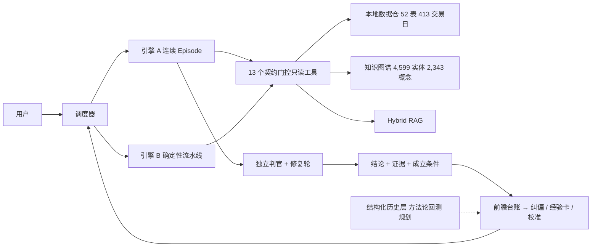

<!--
路演 deck · v0.2 · 2026-09-04
- 母本：docs/bp/2026-09-finance-agent-bp.md（附录 A 页映射）。数字改动先改母本，再同步到这里。
- 格式：Marp Markdown。转 PPTX：`npx @marp-team/marp-cli docs/bp/2026-09-finance-agent-deck.md --pptx`；转 PDF 把 `--pptx` 换成 `--pdf`。
- 每页 HTML 注释 = 讲稿（约 30 秒）+ 视觉建议。17 页按 10 分钟路演配速；限 12 页时合并 3+4、7+8、14+15、16+17，第 12 页并入第 11 页。
- 占位：`【待填】` 与母本附录 C 同步。
-->

# 【待填：产品名】

## 证据可追溯、会校准你的 A 股个人研究工作台

每一条结论带证据与成立条件；每一次判断进台账、事后被验证；用历史统计而不是单次对错决定哪些方法值得保留。

<small>【待填：创始人】 · 2026-09 · 创业比赛 / 孵化器申请</small>

<!--
讲稿：大家好。我做的是一个给认真做研究的个人投资者用的 AI 工作台。它和市面上金融 AI 问答最大的区别有两个字：可信。它说的每句话都带证据，说不出证据就不说；你做的每个判断它都记下来、事后帮你验证。今天十分钟，讲清楚三件事：谁的痛、我们怎么解、为什么是我们。
视觉：产品界面一张全屏截图做底，标题压在上面。
-->

---

# 三个恨点：今天的 AI 金融问答解决了「查得快」，没解决「能不能信」

| 恨点 | 现场 | 为什么现有产品解决不了 |
|---|---|---|
| **编造** | 问客户结构，AI 给一段没出处的「专业话」 | 生成器没有「无证据即拒答」的硬门 |
| **千人一面** | 你说「我不这么看」，下次照旧 | 规模化服务，个人纠偏进不了系统 |
| **判断不被校准** | 每天几十个判断，从不知道哪类靠谱；踩一次坑就否定整套方法 | 没有台账、没有事后验证、没有历史统计 |

<!--
讲稿：先说痛。用过同花顺问财、东财妙想的人都有三个恨点。第一编造：它给你一段看起来很专业的话，你去查，没有出处。第二千人一面：你纠正它，下次它照旧。第三最要命：你每天做几十个判断，从来不知道自己哪类判断靠谱，往往踩一次坑就把整套方法扔了。这三个恨点，大厂产品的逻辑决定了它们不会去解。
视觉：三列卡片，每列一个红色关键词。
-->

---

# 用户是谁：不是所有股民，是「有框架、天天复盘、愿意付费」的半专业层

- A 股投资者 **2.5 亿**，自然人 99.7%（中国结算 2025 年报）
- 代理口径：融资融券信用账户个人投资者 **779.47 万户**——开立有资产与经验门槛，且个人净增、机构净减
- 他们已经在用同花顺 / 东财 / Wind，已经在看研报和复盘
- 痛点不是「没有信息」，是「信息不可信、判断不可积累」

<!--
讲稿：我们的用户不是 2.5 亿股民。是里面那层有自己研究框架、每天复盘、愿意为工具付费的人。一个可以量化的代理口径是信用账户个人投资者，779 万户，开户有门槛，而且个人在净增。他们工具都不缺，缺的是可信和积累。
视觉：漏斗图 2.5 亿 → 779 万，右侧三条用户特征。
-->

---

# 为什么现在：三家都已经是 Agent + 技能广场，差异只剩「能不能信、会不会校准你」

- **供给**：问财升级智能投研 Agent、iFinD MCP；东财妙想 Claw + Skill 广场；万得 2026-03 发布 Wind Alice 个人版
- **需求**：50.43% 个人投资者从未用过 AI 财富管理工具，深度使用者仅 14.8%——教育早期，第一批深度用户最在意可信度
- **监管**：2026 年防非宣传月把「新型 AI 非法荐股」列为重点——「AI 荐股」叙事被淘汰，「研究工具」叙事留下

<!--
讲稿：为什么是现在。供给侧，同花顺、东财、万得在这一年里全部变成了 Agent 加技能广场，「是不是 Agent」不再是差异。需求侧市场在教育早期，第一批深度用户最在意的就是可信。监管侧今年重点打 AI 非法荐股，这会把荐股叙事清出去，留下研究工具叙事，正好是我们的位置。
视觉：三栏时间线，供给 / 需求 / 监管各一条。
-->

---

# 产品：四个场景一条线——复盘 → 研究 → 假设 → 验证

| 场景 | 系统做什么 | 输出 |
|---|---|---|
| **每日复盘** | 从本地数据仓生成市场阶段、容量板块、双红题材、涨停热度，用你自己的框架解读 | 结构化复盘 + 明日观察点（登记为可证伪假设） |
| **题材研究** | 题材雷达：定义、产业链、公司分层、证据索引、信号缺口；发酵链路回溯 | 只读报告，证据分四层标注 |
| **个股深挖** | 客户证据硬度、收入结构、强反证、估值带与隐含预期 | 结论 / 证据 / 反证 / 验证点 / 引用，五段缺一不发 |
| **前瞻假设与后验** | 判断登记为可证伪点，T+1 / T+3 / T+5 自动回检，按类别统计命中率 | 校准报告、经验卡、纠偏记录 |

边界写在产品里：不选股、不给买卖时点、不预测价格、不接交易。

<!--
讲稿：产品是四个场景串成一条线。收盘后它先生成复盘，用你的框架解读；你问一个题材，它给证据分层的研究报告；你问一只股，它给五段式结论，缺任何一段不发；你写下明天的判断，它登记成可证伪点，到期自动回检。四个场景闭成一环。边界写在代码里：不选股、不给时点、不预测价格。
视觉：四个场景横排，箭头首尾相接成环。
-->

---

# Demo

【待填：截图 1 复盘页——结构化复盘 + 框架解读 + 明日观察点】

【待填：截图 2 题材发酵时间轴——消息 → 首板 → 板块双红 → 补涨扩散，每个节点带数据出处】

【待填：截图 3 校准报告——哪类判断命中率高、哪类低、样本够不够】

<!--
讲稿：这三张图分别是复盘页、题材发酵时间轴和校准报告。现场演示建议：问一个数据仓里没有的日期，让评委看到系统怎么拒答——这比任何一页 PPT 都有说服力。
视觉：三张截图并排；如有时间现场演示拒答。
-->

---

# 架构：一个调度器、两条引擎、独立判官、学习闭环

<!--
讲稿：架构一句话：底下是本地市场数据仓和知识图谱，中间是一个调度器带两条引擎，工具全部只读、受契约门控；写手写完，独立判官审，不过就进修复轮；答案落进前瞻台账，回检结果回灌到下一次。虚线那块结构化历史层是下一步。
视觉：直接放这张图，右下角标注五层名称。
-->

---

# 三张牌：竞品都没有

1. **证据链 fail-closed**——无证据不准出结论；判官与写手不是同一个上下文；结论携带数据截止日与成立条件；认不出来就声明缺口，不猜。**7,386 条自动化测试钉住的是门禁，不是文案。**
2. **闭环学习**——你说「不对，应该是……」当场进台账（已 124 条）；可证伪点到期回检（已 83 个）；系统越用越像你自己。
3. **方法论可回测**（雏形 + 规划）——把历史行情与题材编译成逐日离散标签；任何方法论写成声明式规则，在历史上算出命中率、基准率、置信区间。**纠偏升级为经验必须过统计门，一次错误改不了任何结论。**

<!--
讲稿：三张牌。第一，证据链 fail-closed，说不出证据就不说，判官独立审稿，这些不是提示词里的「请注意」，是代码里的门，七千多条测试钉着。第二，闭环学习，你的纠偏和判断进台账、被回检，越用越像你。第三，也是最新的一张：方法论可回测，把历史编译成机器可查的结构语言，任何一条方法论都能在历史上算成功率——所以一次错误不会毁掉一套方法，这是对「闭环学习会不会过拟合」的回答。
视觉：三张牌并排，第三张标「雏形 + 规划」。
-->

---

# 市场：三层口径全部带来源

| 层 | 口径 | 数字 |
|---|---|---|
| **TAM** | A 股投资者总数 | **2.5 亿**（2026-05 估算逼近 2.6 亿） |
| **可触达活跃层** | 第三方证券 APP 月活（代理） | 同花顺 **3,868 万**、东方财富 1,947 万 |
| **SAM** | 信用账户个人 779 万 × 深度使用 14.8% × 年付 1,000–3,000 元 | **约 115 万人 / 11.5–34.6 亿元/年**（估算） |
| **SOM（3 年目标）** | 1 万付费 × ARPU 1,500 元 | **1,500 万元/年**（目标，非预测） |

卖工具的商业模式已被验证：同花顺不持券商牌照，2026 上半年增值电信收入 12.69 亿元、同比 +47.56%、毛利率 86.81%。

<!--
讲稿：市场三层。TAM 2.5 亿投资者；可触达的活跃层用同花顺 3,868 万月活代理；SAM 用信用账户乘深度使用率乘年付费，约 115 万人、十到三十亿；我们三年目标一万付费用户、一千五百万年收入。这条路已经有人验证：同花顺不持券商牌照，卖工具毛利 87%。
视觉：四层漏斗，右侧同花顺那条做脚注。
-->

---

# 竞品：我们不比「快」，比「能不能信、会不会校准你」

| 维度 | 问财 | 妙想 | Wind Alice | 通用大模型 | **我们** |
|---|---|---|---|---|---|
| 无证据即拒答的硬门 | 否 | 否 | 部分 | 否 | **是** |
| 独立判官二次审稿 | 否 | 否 | 否 | 否 | **是** |
| 用户纠偏进入系统并回灌 | 否 | 否 | 否 | 否 | **是** |
| 判断登记台账 + 事后校准 | 否 | 否 | 否 | 否 | **是** |
| 方法论历史成功率回测 | 条件选股 | 否 | 机构口径 | 否 | **题材 + 板块 + 个人判断**（规划） |

**大厂为什么不做**：不是做不到，是逻辑不同——暴露错误率、允许纠正、给单个用户维护台账，对流量与交易导向的平台是负资产，对研究工具是信任资产。海外 AlphaSense（估值 75 亿美元）、Rogo（20 亿美元）用估值验证了「可审计研究」的价值。

<!--
讲稿：竞品矩阵五个维度，前四个我们是唯一打勾的。评委一定会问大厂为什么不做：不是做不到，是产品逻辑。暴露错误率、允许用户纠正，对一个千万月活、靠交易转化的平台是负资产。海外 AlphaSense、Rogo 已经用几十亿美元估值证明可审计研究值钱，只是它们面向机构和美股。
视觉：矩阵表，「我们」一列高亮。
-->

---

# 商业模式：订阅三档，第二曲线是机构 FDE

| 层 | 内容 | 定价（假设，Alpha 期验证） |
|---|---|---|
| **免费** | 每日复盘摘要、题材雷达简版、有限次提问 | 0 |
| **Pro** | 完整工作台、可证伪点台账与校准、纠偏回灌、发酵回溯、方法论回测 | **199 元/月 或 1,999 元/年** |
| **Studio** | 多席位、私有数据与研报接入、自定义视角、导出研究底稿 | **9,999 元/年/席起** |

- 参照：Perplexity Pro 20 美元/月；东财 Choice 开 AI 版加价 1.1 万元/年
- 单次研究推理成本实测：旗舰档中位 **0.34 元**、p90 0.72 元；模型按 1 元计
- 第二阶段：面向中小私募做 FDE 定制部署 + harness 方法论输出

<!--
讲稿：商业模式是订阅三档：免费层拿复盘摘要获客，Pro 199 一个月是主力，Studio 面向小团队和独立研究员。定价参照 Perplexity 和东财 Choice 的 AI 溢价。成本这边我们有实测：一次深度研究写手侧中位三毛四，模型保守按一块钱算。第二曲线是面向私募做定制部署。
视觉：三档卡片，成本实测做右下角数字。
-->

---

# 市场进入：内容先于产品，证据先于文案

- **原则**：营销与产品过同一条证据门——卖点必须绑定有证据的功能，禁写「明天买什么」「稳赚」
- **三个已有入口**：研究发布门户（面向读者与 AI 检索）· 短视频流水线（复盘摘要程序化成片）· 开源信息流阅读器 FinHot
- **漏斗**：候补名单 200 → 注册 2,000 / 付费 50–200（6 个月）→ 注册 1 万 / 付费 1,000（12 个月）→ 付费 1 万（24 个月）
- **单位经济**：CAC ≤ 250 元；LTV / CAC ≈ 4–6
- **不做**：荐股类 KOL 流量、收益承诺文案、股票群推广

<!--
讲稿：第一批用户从哪来。原则是内容先于产品，而且营销也过证据门，评委看到的每篇文章都不吹。三个入口已经在手：研究网站、短视频流水线、开源阅读器。漏斗从候补名单 200 人开始，12 个月做到一万注册一千付费。获客成本目标 250 元以内，LTV 是它的四到六倍。
视觉：左侧漏斗四段，右侧三个入口图标。
-->

---

# 合规：三个不做，写在产品里，不是写在免责声明里

| 监管定义的投顾动作（2012 年荐股软件规定） | 我们的处理 |
|---|---|
| 具体品种选择建议 | 不输出；公司分层只标证据层级与硬度，不排「买入名单」 |
| 买卖时机建议 | 不输出；前瞻限于市场结构假设，登记为可证伪点并标「非投资建议」 |
| 价格走势预测 | 不输出目标价；估值只呈现估值带与隐含预期的计算过程 |
| 模拟业绩营销 | 回测结果只对本人可见，显示样本量与置信区间，不用于营销 |

- 付费点是数据、证据整理、台账与校准，不是荐股；M3 前决定合作持牌机构 vs 申请资质
- 数据源三步合规化：交易所公开数据 + 开源接口 → 持牌数据商授权（M2）→ 研报只做索引不分发
- 与监管方向同向：帮个人投资者养成「看证据、看样本量、看基准率」的习惯

<!--
讲稿：合规我们主动讲。2012 年的荐股软件规定界定了三类投顾动作，我们三个都不做，写在代码边界里。数据源坦白讲现在是自用口径，商业化分三步走，持牌数据授权费用已经进了财务模型。最后一点，我们和监管今年的方向是同向的：帮个人投资者看证据、看样本量。
视觉：左表右三条，底部一句「与监管同向」。
-->

---

# 现状与里程碑：已经在生产里跑，不是 PPT

**已完成**：生产实例自用运行 · 数据仓 52 表 / 413 交易日 / 210 万条个股日行 · 知识图谱 4,599 实体 / 2,343 概念 / 7,036 来源 · 124 纠偏 / 83 可证伪点 · 7,386 条测试通过、11 道提交前门禁 · Alpha 身份门与配额已有运行手册

| 里程碑 | 时间 | 可验证指标 |
|---|---|---|
| **M1 邀请制 Alpha** | 0–3 个月 | 候补 ≥ 200；3–10 用户周活 ≥ 60%；方法论回测 P0 |
| **M2 托管 Beta** | 3–6 个月 | 注册 ≥ 2,000；付费转化 ≥ 10%；持牌数据源接入 |
| **M3 公测与订阅** | 6–12 个月 | 注册 ≥ 1 万；1,000 付费；合规路径决策 |
| **M4 Studio 与 FDE** | 12–24 个月 | 1 万付费；综合毛利率 ≥ 70%；1–2 家私募试点 |

<!--
讲稿：现状一行数字：系统在生产里跑，五十二张表四百多个交易日，知识图谱四千多家公司，七千多条测试。四个里程碑每个都有可验证指标，下一步就是三到十个人的邀请制 Alpha。
视觉：上半是数字墙，下半是四段时间轴。
-->

---

# 团队：一个人 + agent 团队做到今天

**创始人**：【待填：姓名 / 背景 / 为什么做这件事】
非科班背景，以「边做边学」方式一年内建成并持续运营上述系统；把踩过的坑沉淀为跨项目可复用的 Agent 工程方法论（设计 / 搭建 / 审计三件套）。

| 招募 | 职责 | 阶段 |
|---|---|---|
| 金融研究合伙人 | 研究框架与视角库、机构渠道、合规对接 | M1 |
| 全栈工程师 | 托管部署、多租户、前端体验 | M2 |
| 增长 / 内容 | 免费层内容运营、社群、付费转化 | M2 |

顾问：【待填：合规 / 数据 / 投资】——合规顾问优先。

<!--
讲稿：团队目前是我一个人加一支 agent 团队。能把系统做到生产级，靠的是一套 harness 方法论，它已经整理成可复用的三件套，招到人之后是效率倍增器。M1 内招金融研究合伙人，M2 招全栈和增长；合规顾问放在最前面。
视觉：左创始人，右三个岗位。
-->

---

# 财务预测（全部为假设）：第 3 年 1 万付费、约 5,500 付费用户盈亏平衡

| 万元 | 第 1 年 | 第 2 年 | 第 3 年 |
|---|---|---|---|
| 收入（年内平均付费用户 300 / 2,500 / 7,000 × ARPU 1,500） | 45 | 375 | 1,050 |
| 毛利（毛利率） | 3（6%） | 240（64%） | 752（72%） |
| 净利润 | −113 | −40 | **+192** |
| 累计 | −113 | **−153** | +39 |

- 盈亏平衡约 **5,500 付费用户**（第 3 年上半年）；现金最低点约 **−153 万元**（第 2 年末）
- 最敏感：付费转化与 ARPU；推理成本翻倍到 2 元，第 3 年毛利率仍有 56%
- 所以 Alpha / Beta 首要验证的是付费意愿与留存，不是功能数量

<!--
讲稿：财务全部是假设，但每个格子都能从假设乘出来。三年收入 45、375、1050 万，第三年转正；累计现金最低点在第二年末，负一百五十万左右；五千五百个付费用户打平。敏感性告诉我们最怕的是转化率和 ARPU，不是模型成本，所以 Alpha 第一件事是验证付费意愿。
视觉：一张小表 + 一条累计现金曲线。
-->

---

# 融资需求：【待填：金额】（模型建议 200–300 万元，18 个月跑道）

| 用途 | 比例 | 说明 |
|---|---|---|
| 研发与人力（含推理与托管） | **55%** | 托管部署、方法论回测产品化、研究合伙人与全栈 |
| 数据授权 | **15%** | 持牌数据商接入（M2 起） |
| 合规与法务 | **10%** | 合规顾问、边界审查、持牌机构合作谈判 |
| 市场与内容 | **20%** | 免费层内容、社群、Alpha → Beta → 公测 |

- 覆盖 M1 至 M3 前半（0–18 个月）；M2 结束时以付费转化率与单次成本实测决定加速还是收缩
- 若额度只覆盖 6 个月：80–100 万元，比例改为 60 / 10 / 10 / 20

**产品已在自用运行——没有「做不出来」的风险，只有「长不大」的风险。本轮要验证的就是后者。**

<!--
讲稿：融资需求按模型算是两百到三百万，覆盖十八个月，花到 M2 出付费数据再决定加速还是收缩。用途五五、一五、一零、二零。最后一句话：产品已经在跑，不存在做不出来的风险，只有长不大的风险，本轮就是为了验证这一点。谢谢，欢迎提问。
视觉：饼图 + 一句结束语。问答准备见母本附录 E。
-->
