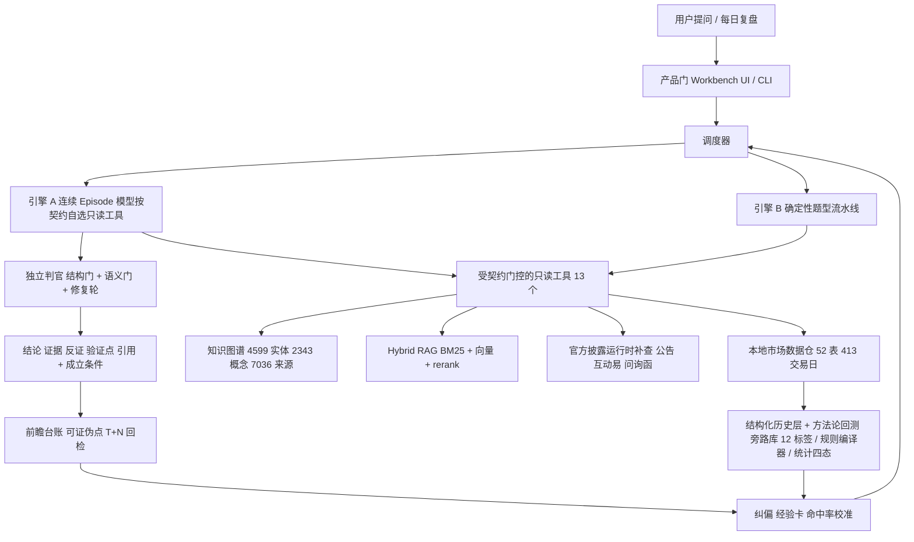

# Foresight 商业计划书：带你复盘、校准你判断的 A 股个人研究工作台

> 同一条时间长河，两个入口：不会复盘的人，用一套教过 1000+ 付费学员的授课框架每天带读，交出次日观察剧本（看什么、什么条件升级或放弃）；有自己框架的人，把方法沉进私有层，判断进台账，按历史成功率升格或证伪，而不是凭单次对错取舍。它不预测涨跌、不给买卖时点；结论带证据只是地板。

- 版本：v0.7（2026-09-05；**用途：申请入驻「创新国度 OPC 创业营」（杭州）的补充材料 + 项目路演。想法验证阶段，不融资；路演性质是分享项目、听投资人与同行的建议。** 申请表本体的填法见同目录 `2026-09-opc-application-form-answers.md`。）
- **变更记录 · v0.8 口径与语气（2026-09-05）**
  - **痛点重排**：新增第一痛「翻不动」（副业 / 盘后一小时 / 四五个 App / **认知投降**），一页纸、§1、§2.1、§2.2 同步；靶心收窄为「正在投降路上的人」，已投降的人明确不接——他要的是票，不会为「学会看」付费。
  - **§3.2 四场景改五场景**，补入**自选简报**（`intelligence/services/watchlist_digest_pack.py`，548 行实现 + 736 行测试 + CLI，已上线却从未进 BP）；§3.5 与附录 C 录屏由两段改三段，自选简报排第一段。
  - **§4.2 新增「与通用记忆框架的同与异」**：主动点名 Graphiti / Zep / Datomic / 金融 PIT，承认双时态与 as-of 不是我们发明的（仓内 `intelligence/eval/bitemporal_history.py` 自己也实现过一版），把「不用现成框架」的两条技术理由（输入端接不上、查询形状是区间中心而非实体中心）与「壁垒是补不回的存量」分开说；附录 E 新增第 21（记忆框架）、22（聚合器）两问。
  - **§9.2 用词纪律提出来单列成表**（原先散在本变更记录里），新增禁写：**辅助决策 → 辅助认知 / 带读与校准**（该词是荐股软件通用自称，且在附录 E 第 19 问里是评委质疑我们的原话）、**认知跃迁 → 认知复利**（后者是 §4.3 已有的钦定词，可证伪）。
  - **§10.2 新增 V1 观测项**（只观测，不设通过线）：提问结构分布（求票型 vs 求传导型）按周、单次研究耗时 p50 / p90。**耗时分布目前不存在**（仓内只有一条 `elapsed_s: 104.7` 单次读数），拉出来之前对外不得出现任何「省了多少时间」的数字。
  - **附录 A 页映射**：第 6 页改为「一天的人机来回」（自选简报 → 带读 → 顶一句 → 台账 → 次日回检），原壁垒页与 agent 团队页合并为第 7 页。
  - **三问改口，落到用户原话**：从「题材是什么 / 证据在哪 / 能不能信」（抽象、像产品经理写的）改为**「明天怎么看 / 为什么这么看 / 这话我能信几分」**，第三问拆成三个可核字段——**证据层级 L1–L4、受益程度 core / high / peripheral、产业链暴露**。这三个字段是图谱里的既有字段，不是新造概念。§11.1 补一张「用户原话 → 产品必须交的答案形态 → 仓内对应」的对照表；一页纸、§4.3、附录 E 第 20 问同步。
  - **语气**：一页纸、§1、§2.1、§2.2、§11.1 改短句重写。原文平均句长 63 字、25.7% 的句子超 80 字、全文 161 处破折号，读起来像生成的。**数字、三条线、§5 / §6 / §7 / §8 / §11 / §12 未动。**
  - 时态纪律沿用 v0.7：授课框架尚未代码化、舆论生命周期尚无阶段词表、时间长河尚无统一索引，对外一律写「在做」。缺口清单见 `docs/superpowers/specs/2026-09-05-time-river-gap-roadmap.md`（13 件，关键路径是创始人把课纲写成母本 G-01，agent 只能搭骨架不能替写）。
- 历史变更（v0.1–v0.7，折叠阅读）：**v0.7 终局对齐（2026-09-05）**——按 `docs/superpowers/specs/2026-09-05-time-river-endstate-design.md` 把定位从「只讲高手路径」扩成「同一条时间长河、两个入口」：新增小白路径（授课框架带读 → 次日观察剧本），高手路径保留校准；标题、一页纸、§1–§3、§4.3 / §4.6、§5.1、§6（新增「决策型投研 Agent」一档，不点名具体创业产品）、§7.1、§8.2–8.3、§9.2、§10.2–10.3、§11.1、§13.4、附录 A / B（B-25）/ C / D / E（新增第 14、15 问）/ F 同步；两条用词纪律新增——「第二天的方向」一律写成**观察剧本**、「策略」单独出现视为交易策略禁写（周期条件下的读法叫**环境剧本**）；**授课框架尚未代码化、舆论生命周期尚无阶段词表、时间长河尚无统一索引，对外版按「在做」写，不得写「已有」**；**删除 v0.2 起沿用的半专业层规模折算口径及由它算出的 SAM——那是起草时代入的，创始人从未认可；§5.1 改为不折算 SAM，天花板用活跃层与新开户说话**；§4.2 与附录 E 第 16 问补「与量化机构的同与异」；**资金独立成轨，时间长河从五轨改六轨**（盘面 / 题材 / 舆论 / 资金 / 个股 / 判断）；§6.1 新增「复盘 / 题材社区、舆情工具与 AI 交易日志类」一档（B-26–B-28），附录 E 第 17 问接住「不就是拼起来吗」；§3.2 / §3.4 / §9.1–9.2 收紧个股口径——可以点名，不给投资分析意见；附录 E 第 19 问（下沉 / 豆包 / 个股）、第 20 问（投资人质疑 know-how）；**同日补记**：投教实付价约 **1,000 元/月**；当年付费买的是「课 + 持牌投顾老师荐股」组合，方法未被单独验证——付费课程市场大，不证明纯带读卖得动；**老账号资产已没、号被封，连续开号靠内容再起，圈层不可召回**——§8 获客删「回原投教圈层」，§11.1 / 附录 E 第 20 问改口。不融资立场、三条线与 §12 账本数字不变。v0.1 初稿；v0.2 补市场进入、财务预测、评委问答，订正数字与来源，实测推理成本，配 deck；v0.3 靶心从「投资人」换成「OPC 社区评审」（一页纸版、验证计划、一人公司账本、入驻诉求）；**v0.4 壁垒重构**——证据可追溯从「壁垒一」降为「地板（入场券）」，「三张牌」改为「地板 / 上限 / 抬上限的机制」三层，标题与痛点排序跟着痛点三（判断不被校准）走，第 4 章重写，第 1、2、6 章与附录 A / E、deck、申请表同步；**v0.5 方法论回测从「规划」改为「已上线 + 首批读数」**——同日 P0 / P1 三个 PR 合入主干，§4.1 / §4.3 / §4.4 / §6.2 / §10 / §13.3 / 附录 D / 附录 E 第 6 问改写，把「三条种子规则全部没过自己的门」写成诚实品牌的自证；**v0.6 拍板四项**——产品名定 Foresight、评审体验入口定「录屏 + 现场演示」（不开评审账号）、公司注册状态改为「按社区要求再办」、创始人目标月收入定 1.5 万元，可持续线随之从「120–150」收敛为单值 **120**，§12.3 现金计划按此重算；§12.4 增补『人均月用量』敏感性行、点明日配额是成本闸（承接 §7.3）；§7.2 收紧 ToB 定位为「垂直 FDE（守护城河）」、显式排除现阶段做通用框架/插件平台；§8 获客口径校正——短视频现阶段不做、FinHot 不作获客入口，§8.3 改为「研究发布门户为主入口」；§11.1 与一页纸补齐创始人画像（实名林邦骞、投教创业经历、「三问」即出门纪律的来历），§8.1 补「内容获客已跑通过一次」；§12.1 两项支出落定——数据源 0 元（全公开免费数据）、开发用 agent 约 2,000 元/月，并拆出「开发期约 2,500 / 运营稳态约 500，三条线按 1,000 留余量」两个口径。
- 产品名：**Foresight**（不设中文名；全文、deck、申请表统一写作 `Foresight`，需要补语境时写 `Foresight · A 股个人研究工作台`）。
  - 名字不是新取的：它是系统自建起就在用的内部名——仓内 `FORESIGHT_USERS_DIR`、`foresight_judgments`、`foresight_methodology`、`foresight_memory`、`ForesightOptions` / `ForesightResult` 等共 400 余处裸出现，§7.3 那 356 个 run 的实测成本正是从 `FORESIGHT_USERS_DIR` 读出来的。
  - **它承诺的是带读与校准，不是预测**。名字自带「预见未来」的联想，与第 3 章的边界（不选股、不给买卖时点、不预测价格）相冲，所以第 1 页副标题与 deck 第 2 页开头必须立刻把它拧回来：Foresight 不告诉你明天涨跌，它每天带你把当天的盘按一套框架读一遍、交给你明天该观察什么，并把你今天的判断存下来、次日回检，长期告诉你在哪类题材上总错。对外任何物料不得让「Foresight」单独出现而不带这句限定；「明天的方向」一律写成**观察剧本**，不写买卖时机。
- 阅读方式：一页纸版可直接贴申请表；正文每章对应一页路演页，章末「路演页要点」是那页的三句话。占位符统一写作 `【待填：…】`，清单见附录 C。
- 数据口径：仓内数字以 2026-09-02 数据日为准；外部数字逐条给来源（附录 B），无来源的一律标「估算」；财务数字全部为假设（第 12 章、附录 F），不是预测。
- 阶段自评（按 OPC 社区通行的「有收入 > 有用户 > 有 Demo > 有 BP > 只有概念」梯队，B-23）：**有 Demo + 自用数据**——生产实例自用运行，20 天 495 次真实研究提问，尚无外部用户。材料重点因此放在可上手的体验入口与验证计划，不放在市场规模。

---

## 一页纸版（可直接贴入申请表）

**项目**：Foresight——带你复盘、校准你判断的 A 股个人研究工作台。

炒股对大多数人是副业。盘后翻四五个 App，一小时过去，还是说不清今天发生了什么。Foresight 每天替你把盘读完：今天主矛盾是什么、消息传到了哪一步、自选池里哪几只被打到了、明天该盯哪几个开关。它不预测涨跌，不给买卖时点。

同一条时间长河，两个入口。不会复盘的人，用一套教过 1000+ 付费学员的授课框架每天带读，交出次日观察剧本。有自己框架的人，把方法沉进私有层，判断进台账、次日回检，按历史成功率升格或证伪。

**我是谁**：林邦骞，浙江大学传播学本科（2025 届），持证券从业资格。2023–2025 联合创办金融投教项目（持股 30%），内容侧一个人扛课纲、长文、直播与答疑，三个号粉丝峰值 15 万、付费学员 1000+。两年里学员翻来覆去问的就三句话：**明天怎么看？为什么这么看？这话我能信几分？** 第三句是最难答的，因为它其实在问三件事——**证据是哪一层、这家公司受益多少、它挂在产业链哪个环节**。这三问现在是产品的出门纪律，问法和当年一字未改。2026 年起独立把方法沉淀成系统：一人公司、非科班背景，一个人带一支 agent 团队做到生产级（7,386 条自动化测试、11 道提交前门禁、生产实例每天自用），踩过的坑沉淀成跨项目可复用的 Agent 工程方法论（设计 / 搭建 / 审计三件套）；自己是第一个也是最重的用户。

**解决什么**：三个痛，按用户自己说得出口的顺序排。

第一是**时间**。炒股是副业，盘后可支配的就一小时，行情、消息、研报、社区分在四五个 App 里，翻完时间就没了。翻不动就不翻，慢慢也不判断了，跟着别人的票走——这叫**认知投降**。我不接已经投降的人，接还在挣扎的那批。

第二是**学不会**。课是静态的，盘每天变。创始人 2023–2025 的 15 万粉丝 / 1000+ 月付约 1,000 元学员是相邻圈层，但当年课里有持牌投顾荐股，人不全为方法而来。

第三是**判断不被校准**。有框架的人每天做几十个判断，从不知道哪类靠谱，踩一次坑就把整套方法扔了。没有产品替他记账、回检、算成功率。创始人自己先被这个痛折磨过：20 天 495 次研究提问、124 条纠偏、83 个可证伪点，全是自用留下的。

千人一面是次痛（纠正了下次照旧）。AI 编造是所有产品的地板，不是我们的招牌。

**怎么解**：本地市场数据仓（52 表、413 个交易日）+ 带时间与证据硬度的题材叙事图谱（4,599 家公司、2,343 个概念）之上的研究 Agent，四个场景一条线：每日复盘（授课框架或用户私有框架带读 → 次日观察剧本）→ 题材研究 → 个股深挖 → 判断登记为可证伪点并自动回检。壁垒分三层：**地板**是证据可追溯、无前视、无证据即拒答、跨会话记忆——入场券，不加分（决策型 Agent 一档已把记忆与决策记录做成默认）；**上限**是编码进系统的 know-how——以 as-of 交易日对齐盘面 / 题材 / 舆论 / 资金 / 个股 / 判断六条轨的**时间长河**、**授课框架**、一套看盘的结构语言（双红、边际量拐点、主线切换、题材生命周期……）、可回溯的题材叙事图谱、按历史成功率升格或证伪的方法论库（授课框架与验证过的方法进共享层，用户自己的进私有层）、专家纠偏数据；**抬上限的机制**是升格流水线 + 统计门、评测体系和一人公司 harness。

**边界**：不选股、不给买卖时点、不预测价格、不接交易——依据 2012 年荐股软件规定，写在代码里而不是免责声明里。小白问「明天买什么」，得到的是观察剧本（到指数 / 板块 / 题材层，不点个股）和一句「这不是投资建议」。

**现阶段要验证的一个假设**：「有人愿意为『每天被一套验证过的框架带着复盘 + 自己的判断被校准』付 199 元/月」。验证方式：3–10 人邀请制 Alpha（0–3 个月，两类入口都请进来，看周活与是否登记观察剧本 / 判断）→ 50–200 人 Beta 付费测试（3–6 个月，看转化 ≥ 10%，两类分开记）。每一步都有写好的停止判据。

**一人公司账本**：运营态固定支出约 1,000 元/月量级（数据源 0 元——全部公开免费数据；开发期另有约 2,000 元/月编码 agent 消耗，建成后回落，见 12.1）；单次研究推理成本实测中位 0.34 元；约 10 个 Pro 用户覆盖基础设施，约 **120** 个 Pro 用户达到可持续线（含创始人目标月收入 1.5 万元），1,000 付费用户是「小而美」目标。不融资。

**向社区要什么**：算力 / API 额度（推理是唯一大变动成本）、金融合规导师、首批种子用户与传播、同行 OPC 交流；能回馈的是 agent 工程方法论分享与开源项目。

**体验**：【待填：1 分钟核心功能录屏（自选简报 + 拒答 + 「登记观察剧本 / 判断 → 次日回检」三段）】；路演现场用创始人账号演示。**不开评审专用账号**——知识库未脱敏，开号等于让私有研报正文对评审可见（见 §3.5）。

---

## 1. 执行摘要

**一句话**：一个 A 股个人研究工作台，每天替你把盘读完。

底下是一条**时间长河**：每个交易日的盘面、题材、舆论、资金、个股、还有用户自己的判断，按 as-of 对齐存着，可以一起读。人翻不动四百个交易日，也看不出「消息出来到板块双红隔了几天」这种滞后——那要把几百个窗口并排看。**这件事人干不了，agent 干得了。所以它的价值不是记性好，是能把过去的区间联立起来读。**

上面开两个入口。不会复盘的人，由一套教过 1000+ 付费学员的授课框架每天带读，交出次日观察剧本。有自己框架的人，把方法沉进私有层，判断进台账、事后被验证，方法论按历史成功率升格或证伪，而不是凭单次对错取舍。

每条结论带证据与成立条件，那只是地板。**它由一个人加一支 agent 团队建成并运营，现在要验证的是有没有人愿意为它付费。**

**痛点**：A 股 2.5 亿投资者中自然人占 99.7%（中国结算 2025 年统计年报）。今天的 AI 金融问答（同花顺问财、东方财富妙想、Wind Alice 等）解决了「查得快」，新一档决策型 Agent（第 6 章）解决了「记得住」。没被解决的是三件事。

一，**时间**。炒股对大多数人是副业，盘后可支配的就一小时，行情、消息、研报、社区散在四五个 App 里。查得快解决的是单次提问，不解决「今天这一整天该怎么读」。翻不动就不翻，慢慢就不判断了——认知投降的起点是时间不够，不是不想学。

二，**没人每天带他把当天的盘按一套框架读一遍**。课是静态的，盘每天变。

三，**判断从不被校准**。每天几十个判断没人记账、没人回检、没有历史统计，一次踩坑就否定整套方法。

其次是千人一面，纠正了下次照旧。编造是第三个痛，但它是所有产品的地板。

**方案**：一个建立在本地市场数据仓（52 张表、413 个交易日、210 万条个股日行）和带时间与证据硬度的题材叙事图谱（4,599 家公司实体、2,343 个概念、7,036 份来源）之上的研究 Agent，四个核心场景——每日复盘（授课框架或私有框架带读，交次日观察剧本）、题材研究、个股深挖、前瞻假设登记与后验验证。

**壁垒分三层**（第 4 章）：
1. **地板（入场券）**：证据可追溯、无前视、无证据即拒答、独立判官、跨会话记忆与决策记录。必须有，不加分——Perplexity 已把附来源做成行业默认，Wind Alice 也在附数据来源，决策型 Agent 一档已把长期记忆与决策确认做成默认。
2. **上限（编码进系统的 know-how）**：以 as-of 对齐六条轨的时间长河、授课框架、一套看盘的结构语言、可回溯的题材叙事图谱、按历史成功率升格或证伪的方法论库（共享层 + 私有层，含证伪库）、专家纠偏数据（已 124 条）。全部是时间积累型：晚来一年就少一年。其中授课框架的代码化与时间长河的统一索引是终局零件里**尚未落地**的两件，V1 前落 v0（附录 C）。
3. **抬上限的机制**：升格流水线 + 统计门（方法论回测，P0 / P1 已在主干上线；首批三条「常识」规则全部没过自己的门）、评测体系、一人公司 harness——决定 know-how 积累的速度。再加一个结构性优势：**反定位**，不荐股、不预测、不给决策、暴露错误率，大厂能做但做了伤自己的流量与交易模型，决策型 Agent 能做但做了就得放弃「给建议」这个卖点。

**现状（有 Demo + 自用数据）**：生产实例自用运行，创始人 20 天内 495 次真实研究提问；主干 7,386 条自动化测试通过；邀请制内测的身份门、日配额、并发守卫已完成设计与运行手册；评审看 1 分钟录屏 + 现场演示（不开评审账号，理由见 §3.5）。尚无外部用户——这正是入驻后要做的事。

**一个人怎么做到的**：一支 agent 团队分担开发、评测、内容与运维（第 11 章），一套从真实事故里沉淀出来的 harness 方法论保证系统不会因为团队只有一个人而失控。推理成本已实测：单次研究中位 0.34 元（第 7.3 节）。

**现阶段只验证一个假设**：有人愿意为「每天被一套验证过的框架带着复盘 + 自己的判断被校准」付 199 元/月。0–3 个月邀请制 Alpha 3–10 人（两类入口都请进来）看留存与观察剧本 / 判断登记行为，3–6 个月 Beta 50–200 人看付费转化 ≥ 10%（两类分开记）；每一步都有写好的继续 / 停止判据（第 10 章）。

**怎么拿到用户**：内容先于产品、证据先于文案——每交易日一份公开的授课框架带读摘要（今天主矛盾、题材走到哪一段、明天观察什么，不点个股）、每周一篇题材拆解，全部过与产品同一条证据门，由 agent 生成、人审发布，一个人做得过来；免费层的带读摘要本身就是获客内容——创始人 2023–2025 用同一套框架卖过一次课，这次带读由系统每天生成；获客主入口是已上线的研究发布门户，文章沉淀后分发到知乎 / 微博 / X（第 8 章）。

**一人公司账本（假设）**：固定支出约 1,000 元/月量级；约 10 个 Pro 用户覆盖基础设施（自给线），约 **120** 个 Pro 用户达到含创始人目标月收入（1.5 万元）的可持续线，1,000 付费用户是「小而美」目标（第 12 章）。不融资；如果验证成功要不要扩张，那是 12 个月后的问题（附录 F）。

**向社区要什么**：算力 / API 额度、金融合规导师、首批种子用户与传播、同行 OPC 交流（第 13 章）。

> 路演页要点：一人公司 + agent 团队做出了一个已经在生产里跑的、会带读也会校准的研究工作台 / 一条时间长河两个入口：小白学会看，高手算清自己 / 壁垒三层：地板不加分（记忆也是地板），上限靠编码进系统的 know-how，机制决定积累速度 / 不融资，现阶段只验证「有人愿意为带读 + 校准付费」。

---

## 2. 问题与痛点

### 2.1 用户是谁

不是「所有股民」，是同一条河上的两个入口：

- **入口一：已经在交易、不会复盘、愿为「学会看」付钱的进阶学习者**。炒股是他的副业——白天上班，盘后可支配的时间就一小时，这个约束决定了他的痛点排序：先是翻不动，然后才是看不懂。翻不动久了就不翻了，判断交给别人，跟着票走，这个过程叫**认知投降**。**靶心是正在投降路上的人，不是已经投降的人**：后者要的是票，不是方法，他不会为「学会看」付费。也不是新开户、开口就要「明天买什么」的纯小白，不是要统计门的半专业研究员。规模不折算：创始人 2023–2025 三个号粉丝峰值 15 万、付费学员 1000+、月订阅约 **1,000 元**（§11.1）证明的是「课 + 持牌投顾老师荐股」这个组合有人买，**不是**纯方法被单独投过票。付费课程市场现在仍然大，大头同样往往在老师和票上。本产品拆掉荐股、只卖每天带读，转化必须重新测，不能把学员数折成用户数。市场侧 2026 年前 5 个月新开户 1,729.68 万（B-2），50.43% 的个人投资者从未用过任何 AI 工具（B-15）——触达够，不证明付费点。
- **入口二：有自己研究框架、每天复盘、愿意为工具付费的半专业个人投资者与独立研究员**。这群人没有公开统计口径，本文不为它编一个数字（§5.1）。他们已经在用同花顺 / 东财 / Wind，已经在看研报和复盘，痛点不是「没有信息」，而是「信息不可信、判断不可积累」。

两个入口是一个产品：小白学会之后就是高手，把授课框架用顺了再往私有层里沉自己的东西；产品不分两套，只是第一次打开时默认走带读（第 3 章）。

### 2.2 恨点（按入口与痛的程度排）

| 恨点 | 谁的 | 现场表现 | 现有产品为什么解决不了 | 我们的定位 |
|---|---|---|---|---|
| **翻不动：时间不够，信息散在四五个 App** | 两者（入口一更痛） | 炒股是副业，盘后可支配一小时；行情一个 App、消息一个、研报一个、社区一个，翻完一小时没了，还是说不清今天发生了什么；自选池里哪几只今天被打到了，得一只一只点 | 聚合器给的是**更多信息**，不是读完了的结论；问答型产品按单次提问服务，不按「一天」服务；没有产品把用户的自选清单和当日盘面做确定性接合，更没有一个会主动说「你这只今天哪个袋都没进」 | **入口**：自选简报（清单 × 当日四袋接合，主张分事实 / 推断 / 缺口三档） |
| **看不懂、学不会** | 入口一 | 盘后不知道今天发生了什么、题材从哪来到哪去、明天该看什么；复盘课听完还是不会——课是静态的，盘每天变 | 问答型产品答「是什么」，不按一套框架带你读「怎么演变、下一步看什么」；投教内容不接盘面数据，不能每天更新；决策型 Agent 直接给建议，跳过了「学会看」 | **主攻之一**：授课框架每天带读 + 次日观察剧本 |
| **判断不被校准** | 入口二 | 每天做几十个判断，从不知道自己哪类判断靠谱、哪类是错觉；一次踩坑就否定整套方法；用了三年的方法说不清成功率是多少 | 没有台账，没有事后验证，更没有历史统计；为单个用户维护判断台账对流量型产品不划算；决策型 Agent 记得住你的决策，但不算基准率与置信区间 | **主攻之二**：台账 + 统计门 |
| **千人一面** | 两者 | 每个人问同一个题材得到同一段综述；用户说「我不这么看」，下一次照旧 | 大厂模型为规模化服务，个人纠偏无法进入系统 | 差异化：纠偏回灌、私有方法论层 |
| **编造** | 两者 | 问一只股票的客户结构，AI 给出一段看起来专业、实际上没有出处的话；问历史某天的板块表现，AI 拿今天的数据回答 | 生成器没有「无证据即拒答」的硬门 | **地板**：必须解，但 Perplexity、Wind Alice 都在解，不是招牌 |

排序说明：**「翻不动」排第一，因为它是四个痛里唯一一个用户自己说得出口的。**「看不懂」和「判断不被校准」都要先教会他这是个痛，他才认；获客文案的入口因此在第一行，付费理由在第二、三行。

创始人两头都踩过：「看不懂」这个痛是两年投教里 1000+ 学员天天问出来的（§11.1）；「判断不被校准」自己先被折磨过——自用 20 天 495 次研究提问、124 条纠偏、83 个可证伪点，全是从「我想知道自己哪类判断靠谱」这一件事上长出来的。

### 2.3 为什么现在

- **供给侧**：2025–2026 年国内头部平台全部完成大模型部署并转向 Agent 形态——同花顺问财升级为智能投研 Agent 并推出 iFinD MCP，东方财富推出「妙想 Claw」与「Skill 广场」，万得 2026 年 3 月发布 Wind Alice 个人版（附录 B-4/B-5/B-8）；创业侧，2026 年起多家团队的决策型投研 Agent（多在内测，本文不点名）以长期记忆、工具卡片、决策接受 / 拒绝为主卖点，开源本地 A 股 agent 也已在做复盘 + 记忆 + 建议命中率（B-25）。**「是不是 Agent」「记不记得住」都已不是差异化，「每天能不能带你读懂、判断能不能被校准」才是。**
- **需求侧**：50.43% 的个人投资者从未使用任何 AI 财富管理工具，深度使用者仅 14.8%（附录 B-15）——市场处在教育早期，第一批深度用户最在意的正是可信度。
- **监管侧**：2026 年 5–6 月证监会防非宣传月把「新型 AI 非法荐股」列为重点（附录 B-19）。合规压力会淘汰「AI 荐股」叙事，留下「研究工具」叙事——这正是我们的定位。

> 路演页要点：靶心是已经在交易、不会复盘的进阶学习者，不是纯小白也不是真高手 / 15 万粉 / 1000+ 学员 / 月费约 1000 元验证的是「课 + 投顾荐股」组合，方法没被单独卖过；付费课市场大 ≠ 纯带读市场 / 恨点：看不懂学不会、判断不被校准；编造是地板。

---

## 3. 产品与解决方案

### 3.1 一句话定义

> 面向 A 股个人投资者的 AI 研究工作台，底下是一条按交易日对齐的时间长河。它回答「主线在哪、为什么发酵、谁受益、证据强不强、市场是否响应」，每个结论带证据与成立条件；不会复盘的人由授课框架每天带读、交次日观察剧本，有框架的人每个判断进台账并事后验证。

**时间长河**（终局设计见附录 D 指向的 spec）：以 as-of 交易日为主键，六条轨对齐——盘面轨（量价、双红、涨停热度、指数阶段）、题材轨（叙事版本、发酵节点、生命周期阶段）、舆论轨（这个逻辑被多少人、以哪个版本在喊）、资金轨（板块 / 题材资金流、龙虎榜席位；北向、两融等没有的按缺口声明）、个股轨（公告、订单、财报、相对强度等节点，不是推荐名单）、判断轨（用户决策 + agent 判断 + 观察剧本，到期回检）。读河的方式由框架决定：默认是授课框架，用户可以换成自己的私有框架。缺哪条轨就声明缺口，不用别的轨补编；换一个模型，同一天的标签与回测收据必须能重算出来——重算不了的不算在河里，只算聊天。

### 3.2 五个核心场景

| 场景 | 用户做什么 | 系统做什么 | 输出 |
|---|---|---|---|
| **自选简报**（`WatchlistDigestPack`，已上线） | 维护一份自选清单，收盘后先看它 | 把用户画像清单与当日盘面四袋（主线 / 严格双红 / 涨停热度 / 全市场）做确定性接合。盘面事实**只经一次委托**取得，模块内零库连接、零袋内口径，有机械核查测试钉死 | 每条主张带档位与方法行：**（事实）**= 袋内锁定数字、**（推断）**= 接合陈述不引入袋外数字、**（缺口）**= 你清单里这只今天没进任何袋。**不产任何买卖动作句，词面在测试里锁死** |
| **每日复盘（两个入口的共同起点）** | 收盘后打开工作台 | 从本地数据仓生成市场阶段、容量板块、双红题材、涨停热度、新高映射；默认用授课框架带读（小白入口），有私有框架的用私有框架解读；题材生命周期与盘面阶段并排（舆论轴在做） | 结构化复盘 + 框架解读 + **次日观察剧本**（看什么、什么条件升级或放弃；登记为可证伪点；到指数 / 板块 / 题材层，不含个股方向与时点） |
| **题材研究** | 输入一个新名词或事件 | 题材雷达：定义、产业链拆解、公司分层、证据索引、信号缺口；发酵链路回溯（消息面 × 盘面时间轴） | 只读研究报告，标明证据层级（L1 研报判断 / L2 基础画像 / L3 官方硬事实 / L4 市场信号）；公司可以点名，分层按证据硬度，不排序为买入名单 |
| **个股深挖** | 用户点名一只股，问「证据在哪、逻辑走到哪一段」 | 客户证据硬度、收入结构、逻辑生命周期、强反证；估值带与隐含预期的**计算过程** | 五段缺一不发：结论只陈述事实与证据硬度（「客户集中度来自哪份公告、逻辑处在兑现还是证伪」），不答「该不该买、涨到多少、几点买」；问「这只股怎么看 / 能不能买」一律翻译成证据整理 + 非投资建议声明 |
| **前瞻假设与后验** | 写下自己的判断 | 登记为可证伪点，到期自动回检，按类别统计命中率；用户纠偏落台账并回灌 | 命中率校准报告、经验卡、纠偏记录 |

### 3.3 用户旅程（一天）

1. 盘后 18:30 数据自动入库并质检；20:00 生成当日复盘与研究队列。
2. **小白入口**：打开就是授课框架带读——今天的盘面是由哪几条消息传导出来的、传到了哪一步（消息 → 首板 → 板块双红 → 补涨扩散，每个节点带数据出处）、主线题材走到生命周期的哪一段、盘面阶段是什么；读完系统问「明天你打算看什么」，用户勾选或改写观察剧本（看什么、什么条件升级或放弃），登记为可证伪点。
3. **高手入口**：读复盘，对某个判断说「不对，应该是……」——系统当场记为纠偏，后续解读自动带上；用顺了之后把自己的框架沉进私有层，带读就换成自己的框架。
4. 用户问「XX 题材是怎么发酵起来的」——系统给出消息 → 首板 → 板块双红 → 补涨扩散的时间轴，每个节点带数据出处。
5. 用户写下「明天 XX 板块若放量则主线切换」——登记为可证伪点，T+1 / T+3 / T+5 自动回检。
6. 周末打开校准报告：哪类判断命中率高、哪类低、样本够不够下结论；小白看的是「我按框架写的观察剧本，多少次看对了方向要看的变量」。

### 3.4 产品边界（与合规直接相关，详见第 9 章）

- 不输出个股买卖建议、目标价、买卖时点。**个股名字可以出现**：发酵链路、公司分层、用户点名的个股深挖都可以点名——规定禁的不是「出现股票代码」，是「对具体品种给投资分析意见、选股、择时、测价」（§9.1 原文四项）。观察剧本主动推送不到个股层；用户自己点名才进个股深挖。
- 前瞻内容限定为**市场结构假设**，强制以「可证伪点」形式登记，界面标注「非投资建议」。
- 小白入口的观察剧本到指数 / 板块 / 题材层，不点个股；用户问「明天买什么」，一律翻译成观察剧本 + 非投资建议声明。「第二天的方向」这个词不进产品，产品语言只有观察剧本。
- 不做自动下单、不接交易。
- 不把仍在验证中的方法假设包装成确定性规则；「策略」一词不单独出现，周期条件下的读法叫**环境剧本**（某类流动性 / 指数环境下历史走过几次、共性、出口在哪），不是交易策略。

### 3.5 给评审的体验入口

OPC 社区评审对「有 Demo」阶段的要求是能看到真东西。**已定：录屏 + 现场演示，不开评审专用账号**（2026-09-05 拍板）。我们给两样：

1. `【待填：1 分钟核心功能录屏】`——三段：**(a) 自选简报**（一份自选清单 → 当日四袋接合 → 每条主张标出事实 / 推断 / 缺口，全篇没有一句买卖动作）；**(b) 拒答**（问一个数据仓里没有的日期 → 系统声明缺口）；**(c) 回检**（读完带读、登记一个观察剧本 / 判断 → 次日回检结果）。**这是默认的体验入口**，路演现场再用创始人账号演示题材发酵链路。
   - 第 (a) 段单位时间信息量最高：一次同时演示了省时间（一次委托取完四袋）、不吹（三档主张 + 缺口自曝）、合规写在代码里（不产买卖动作句，词面在测试里锁死）三件事。三段里它排第一。
2. `【待填：3 张截图——复盘页 / 题材发酵时间轴 / 校准报告】`——放进申请表与 deck。
**为什么不开评审账号**：邀请制身份门（邮箱验证码登录、日配额、并发守卫、方法论端点门）已有运行手册，加人只要一分钟——技术上随时能开。不开是产品决定：**当前知识库未脱敏**，内测账号的 `kb_search` / `evidence_*` 连的是全量私有知识库（研报正文、私有笔记），这正是 Alpha 只给签了协议的可信用户的原因。给一批不认识的评审开号，等于把这条边界放开，换来的只是「评审可以自己点」——而「有 Demo」阶段的社区要求是能看到真东西，不是人人有账号。真正该拿这条边界换的是脱敏后的 Beta，不是一次路演。

评审若在现场明确要求自己上手，回答是：现在给你演示任何一个你指定的问题，账号在知识库脱敏（Beta 硬门槛，见 §10）之后开放。三个选项的完整比较与开号操作步骤留在同目录 `2026-09-opc-reviewer-access-checklist.md`，本次选 A。

> 路演页要点：四个场景一条线：带读复盘 → 研究 → 观察剧本 / 假设 → 验证 / 每个结论五段缺一不发；小白拿到的是观察剧本不是方向 / 评审当场点题、现场演示，不是照着 PPT 念。

---

## 4. 技术架构与壁垒

### 4.1 架构

五层：数据事实层（本地列存数据仓 + 每日快照）→ 数据管道层（唯一写入口、板块名单快照分代、覆盖审计）→ 分析与策略层（信号检测、板块回测、策略进化）→ 技能层（37 个技能，其中多数刻意不暴露给 Agent 以守住只读与无外呼红线）→ 智能层（一个调度器 + 两条引擎 + 独立判官 + 学习闭环）。

壁垒不按功能列，按三层列：**地板**是入场券，有了不加分；**上限**是编码进系统的 know-how，决定产品能有多好；**抬上限的机制**决定 know-how 积累得有多快。判断一样东西属于哪层，看的是「竞争对手能不能、愿不愿意复制，复制要多久」。

### 4.2 地板：入场券，不是壁垒

- **无证据不准出结论**：终局准入门检查每条结论是否绑定证据哈希，伪造哈希的稿件被驳回并进入修复轮。
- **独立判官**：判官与写手不是同一个模型上下文，看的是结构化的工具调用与证据，不看写手的自由文本。
- **结论携带成立条件**：数据截止日、覆盖范围、被截断的行数、缺口声明，限定语排在被限定内容之前。
- **无前视（PIT）**：历史查询按 as-of 日期取数，标签只在确认日打上；认不出的日期、板块、异常数据源一律声明缺口而不是猜。
- **日频截面、as-of 无未来函数、滚动区间、回测带基准率与显著性——这四条在量化机构是十几年的日常**，我们照抄它们的纪律，同样归入地板。与量化的区别不在底座，在河上放的东西、目标函数和规则语言（附录 E 第 16 问）。

这些有 7,386 条自动化测试钉住，但**我们不把它当卖点**：Perplexity 已经把附来源做成行业默认，Wind Alice 附数据来源，问财也在跟。它的作用是让 4.3 节的校准可信——系统自己的结论不可信，它对你判断的校准就更不可信。

一个区分：能力是入场券，**在这条纪律下攒的存量是资产**。例如板块名单快照分代能回答「那一天用的是哪一版板块清单」，数据供应商换过名单之后，这段历史谁都补不回来。

**与通用记忆框架的同与异。** 时间长河容易被听成「我们发明了一种记忆」，不是。带时间维度的记忆是成熟技术，主动说清楚比被评委点名强：

- **同**：双时态（事实在世界上何时为真 / 系统何时知道它）与 as-of 查询早有现成实现——Graphiti / Zep 一类的时序知识图谱把 `valid_at` / `invalid_at` 与 `created_at` / `expired_at` 分开建模，Datomic 把 `as-of` 做成一等查询原语，XTDB、SQL:2011 的 system-versioned 表同理；金融业的 point-in-time 数据库更是几十年的老手艺。仓内 `intelligence/eval/bitemporal_history.py` 就是我们自己实现的一版。**所以「记得住、查得回」归地板，和跨会话记忆同档，不加分。**
- **异其一，输入端接不上**：六条轨里有五条（盘面 / 题材 / 舆论 / 资金 / 个股）不是对话产物。通用记忆框架的记忆下游是会话，我们的五轨来自数据仓与人审入库，所以底座是 52 张表 + 标签层，不是记忆库。这是选型结论，不是将就。
- **异其二，查询形状不同**：记忆框架是**实体中心**的——「T 时刻我们关于 X 知道什么」，检索的是子图。我们要的是**区间中心**的——「历史上哪些窗口六条轨呈现同一种指纹，后来各自走成什么样」（`market_regime_analogs.py`，只报复现次数与后续事实，不编概率）。更进一步是**时滞结构**：消息 → 首板 → 板块双红 → 补涨扩散各隔几天，这是跨轨的 lag structure，形状接近事件研究，不是记忆检索。**人翻不动四百个交易日 × 六条轨，也并排不了几百个窗口——这是 agent 相对人的真实增量，不是相对记忆框架的增量。**

结论不变：**壁垒不在机制，在河上攒下的存量。** 评委举出任何一个能存双时态的框架，答案都一样——它能存，但它存不出 2024-12-20 起每天人审入库的题材硬度与证据档。`【待核：本节所列框架的能力对照截至 2026-05，路演前复核一次是否有新实现】`

### 4.3 上限：编码进系统的 know-how

know-how 只有编码进系统、能被回测、能被版本化，才是公司的资产；留在创始人脑子里的不算。下面每一层都满足这个标准，并且都是时间积累型：晚来一年就少一年。

| 层 | 是什么 | 护城河类型 | 现状 |
|---|---|---|---|
| **时间长河** | 以 as-of 交易日为主键，把盘面 / 题材 / 舆论 / 资金 / 个股 / 判断六条轨对齐成可联立查询的对象；缺轨声明缺口，换模型可重算 | 独占资源：每条轨都已在按日积累（快照分代、逐日标签、判断台账），统一索引一旦建成，这段历史谁都补不回来 | 六轨数据大多在（§10.1；资金轨有板块 / 题材资金流与龙虎榜，北向、两融无表按缺口声明），散在数据仓 / 图谱 / 用户态；**统一的 as-of 联立读取面待做**（查询面，不是新库）；舆论轨只有事实硬度 × 舆情广度两条线，**阶段词表待定**；题材轴两套词表待统一 |
| **授课框架** | 创始人两年课纲里被学员反复追问出来的底层看盘（三问：明天怎么看 / 为什么这么看 / 能信几分——第三问拆成证据层级、受益程度、产业链暴露），编码为共享层的默认判读——进阶学习者第一次打开就有坐标系，不是空聊天 | 独占资源 + 品牌：方法带着人和课纲出处；**不能写成「已被付费单独验证」**——当年月费约 1,000 元买的是课 + 持牌投顾荐股。已收的 KOL 判读（25 条 A 类结构）只作差分参考，不反客为主 | **尚在课纲与创始人脑中，未代码化**——先落词表与判读规则，数字阈值进回测队列，过统计门才变硬判据；V1 前完成 v0（附录 C）。对外不得写「已有」 |
| **结构语言** | 一套看盘的词表及其精确定义：严格双红（涨幅 > 0 且边际量 > 10% 且成交额 > 500 亿）、连续双红第几天、边际量拐点、MA5 峰谷确认日、多周期共振、涨停热度跃迁、主线切换、分歧日、新高映射、题材生命周期阶段。全部确定性规则、版本化、只在确认日打标 | 切换成本：用户一旦用这套词想问题、写方法论，换产品要把方法重新翻译一遍（Bloomberg 的函数名、TradingView 的脚本语言都是这种锁） | 已是可版本化的标签层：12 个逐日逐实体标签、671,440 行、从主库只读重建，`data_gap` 自动打标（2026-09-04 上线） |
| **题材叙事图谱** | 不是概念板块，是「题材什么时候出现、消息 → 首板 → 板块双红 → 补涨扩散的时间轴、每家公司挂上去时的证据是 L1 研报判断、L2 基础画像、L3 官方硬事实还是 L4 市场信号，硬度多少」 | 独占资源：4,599 家公司 × 2,343 个概念 × 时间 × 证据硬度，人审入库一年攒出来的，没有数据商卖这个 | 已有 7,036 份来源、350 篇综合；发酵链路回溯已能跑 |
| **方法论库：共享层 + 私有层** | 共享层默认位是授课框架；验证过的方法（含已收的 KOL 判读、未来匿名化的方法族）经回测 → 统计门后升格进代码，全员共享；用户自己的方法论在私有层沉淀，只对本人回测与校准——高手路径的「认知复利」就落在这里 | 切换成本 + 弱网络效应：用户越多、被验证的方法越多、共享层越厚——所有层里唯一可能超线性增长的 | 视角蒸馏、经验卡、可证伪点回检已有；统计门已上线（经验卡带规则号的晋升必须持 `supported` 收据，无收据即拒）；纠偏 → 候选规则的登记入口已上线；私有层容器（`user_framework` 慢变量画像）已设计待落；共享层待设计（合规硬门见 4.4） |
| **证伪库** | 被回测证伪的方法、被市场打脸的判断类型、「这个阶段这招不灵」 | 独占资源里最稀缺的一种：研报和 KOL 只发成功案例，没人系统地攒失败；对使用者来说「知道什么不灵」比「知道什么灵」更省钱 | 统计门四态里的 refuted 就是它的来源；收据格式已统一、可单独收集，按阶段汇总的报表待做 |
| **按市场阶段条件化 → 环境剧本** | 同一方法在不同大盘阶段的成功率分开算，「怎么看行情」从经验变成 阶段 × 方法 的矩阵；终局收成**环境剧本**对象：判定当前指数阶段 + 流动性指纹 → 在河上查同指纹窗口历史走过几次、后续事实、共性、失效边界 → 标出近期流动性出口 → 套上框架读。只报复现次数与后续事实，不编概率，不是交易策略 | 上限的放大器 | 大盘阶段已是规则里可用的谓词（首条种子规则就按「主升 / 反弹」阶段过滤）、按阶段基准率的四态已上线；市场级情绪对标已能跑；**环境剧本对象与流动性出口待做**，按阶段拆读数的汇总报表待做 |
| **专家纠偏数据** | 124 条「模型这样读盘面是错的，因为……」 | 独占资源：金融专家从不给模型打标；今天当记忆用，明天是微调或检索语料 | 已有，每天在长 |

### 4.4 抬上限的机制

**升格流水线 + 统计门（方法论回测，2026-09-04 上线）。** 闭环学习最容易被质疑的一点是「一次说错就改规则，不是过拟合吗」。答案是：纠偏升级为经验必须过统计门。任何一条方法论写成声明式规则（条件 = 标签谓词 + 时间窗，结果 = 3/5/7/10 日多窗口收益、区间最高收益、峰值天数、峰值后回撤），由编译器转成参数化查询在历史上跑出命中率、同期基准率、Wilson 置信区间、样本量、前后半段稳定性，结论四态：样本不足 / 与基准不可区分 / 支持 / 证伪。一次纠偏只能在事件集里加一行，改不了任何结论。流水线是：纠偏 → 登记为候选规则 → 回测出收据 → 经验卡晋升必须持「支持」收据 → 固化进代码 → 退出注入。**方法论回测因此不只是验证阶段的一个交付，它是壁垒生成器**：上限抬多快，取决于这条流水线一年能把多少 know-how 编码进去。

现状（主干已合入，附录 D 可核）：标签层 12 个逐日标签、前瞻结果表、规则编译器、统计四态、命令行与自测全部上线；校准的最小样本阈值从 2 提到 10；经验卡带规则号的晋升由统计门把关。**第一批读数是对我们自己的打脸**：三条从内部方法论文档里抄下来的「常识」规则（连续三日双红后延续、边际量拐点后五日上涨、涨停热度跃迁后三日上涨）在 413 个交易日上没有一条能与基准率区分开；其中「连续双红延续」看起来有 10 个百分点的提升，换成按事件日精确配对的基准率后变成 −1 个百分点——那 10 个点全是择时（触发日本身是强势日，当天随便一个板块 5 日上涨概率就有 69%），没有选择效应。我们把这个结果当产品最好的自证：**一个会否定自己方法论的系统，才配去校准用户的**。

**评测体系。** 冻结题集、独立判官、变异测试、离线重判收据、多臂对照。这是敢换模型、敢改提示词、敢接新数据源的底气——竞品可以抄功能，抄不到「这次改动到底变好还是变坏」的判断力。用户看不见，评审看得懂。

**一人公司 harness。** 一个人能把系统跑到生产级，靠的不是模型，是驾驭层：配额在副作用前预占而不是事后计数、全链路 deadline 传绝对时刻、请求去重用 per-key single-flight、授予的额度必须传到最下游执行者、棘轮式门禁（存量免检、新增拦截）、单一真本源且从源码生成、测试收据携带成立条件。已整理为跨项目的「设计 / 搭建 / 审计」工具包，是团队效率的倍增器，也是可以回馈社区的东西。

**共享层的合规硬门。** 「验证过的方法论 + 历史成功率」一旦对外，离「模拟业绩营销」和「策略排行」只有一步。设计时写成硬门而不是约定：只对登录用户可见；必带样本量与置信区间；只到板块和题材层，不到个股名单；不用于任何对外内容；KOL 方法论以「方法族 / 视角」匿名化呈现，署名与授权另议。小白入口多一道：授课框架带读交出的观察剧本同样只到指数 / 板块 / 题材层，不点个股，不写方向与时点——带读是教人看，不是替人决定。

### 4.5 反定位与诚实品牌

- **反定位**：拒答等于流失，暴露错误率等于负资产，为单个用户校准等于不规模化——大厂不是做不到，是做了伤自己的流量与交易模型。对决策型 Agent 也成立：它们的卖点是「给建议」，改成只交观察剧本就等于放弃卖点。这条差异在组织层面比在技术层面更难跨越，也是最经典的一类护城河。
- **诚实品牌**：在一片「AI 荐股」「AI 决策」里做那个会说「我不知道」、只教你看不替你决定的产品。一人公司最便宜的护城河，靠内容纪律攒（营销内容也过证据门，第 8.1 节），起点不是零——授课框架背后有 1000+ 付费学员的口碑。

### 4.6 护城河类型对照

| 护城河类型 | 我们对应的层 | 强度 |
|---|---|---|
| 切换成本 | 结构语言、授课框架（用它想问题就换不走）、私有方法论层、判断台账与校准数据 | 随使用时间增长 |
| 独占资源 | 时间长河（六轨 as-of 对齐历史）、题材叙事图谱、证伪库、专家纠偏数据、连续的快照分代历史 | 随时间增长，不可回填 |
| 流程能力 | 升格流水线 + 统计门、评测体系、harness | 决定积累速度 |
| 反定位 | 不荐股、不预测、不给决策、暴露错误率、拒答 | 结构性，大厂做了亏，决策型 Agent 做了丢卖点 |
| 网络效应 | 共享方法论层 | 弱，需要设计，合规最敏感 |
| 品牌 | 诚实 + 授课框架的学员口碑 | 靠内容纪律攒，起点不是零 |
| —— | 证据可追溯、PIT、RAG、Agent 框架、模型、跨会话记忆 | **不是护城河**，是入场券 |

> 路演页要点：壁垒三层——地板不加分（记忆也是地板）、上限靠编码进系统的 know-how（时间长河 + 授课框架是新加的两件，未落地先说在做）、机制决定 know-how 积累的速度 / 反定位：大厂能做但做了亏，决策型 Agent 能做但做了丢卖点 / 方法论回测不是一个功能，是壁垒生成器。

---

## 5. 市场分析

### 5.1 三层口径

| 层 | 口径 | 数字 | 来源 |
|---|---|---|---|
| **TAM** | A 股投资者总数（一码通口径） | 2025 年末 2.5 亿，2026 年 5 月末估算逼近 2.6 亿；自然人占 99.7% | B-1、B-2 |
| **可触达活跃层** | 第三方证券服务 APP 月活 | 同花顺 3,867.73 万（2026-07），东方财富 1,947.43 万 | B-4 |
| **增量层** | 新开户 | 2026 年前 5 个月新开户 1,729.68 万户，同比 +57.94% | B-2 |
| **入口一已验证样本** | 创始人用同一套授课框架服务过的学习者 | 三个号粉丝峰值 15 万、付费学员 1000+、月费约 1,000 元、团队营收 500 万+（2023–2025）——验证的是「课 + 持牌投顾荐股」组合有人买，不是纯带读的可转化人数 | §11.1 |
| **一人公司三条线** | 付费用户 × ARPU 1,500 元/年 | 自给线约 **10** 个 Pro 用户（覆盖基础设施）；可持续线约 **120** 个（含创始人目标月收入 1.5 万元）≈ 18 万元/年；小而美 **1,000** 付费 ≈ **150 万元/年** | 第 12 章 |
| 扩张情形（参考，非本轮目标） | 若验证成功且选择扩张 | 1 万付费 ≈ 1,500 万元/年 | 附录 F |

**本文不折算 SAM。** 入口二没有公开统计口径，不编。付费课程市场现在仍然大，但大头往往是老师和票，不能折成「纯方法 / 纯带读」的市场规模。天花板只回答「够不够一个人活」：同花顺一个 APP 的月活就有 3,868 万，一人公司要的 120 / 1,000 个付费用户占它不到十万分之三——够高，所以只验证付费意愿。15 万粉 / 1000+ 学员 / 月费约 1,000 元是组合产品的历史，V2 测的是拆掉荐股之后还有没有人付 199。

取数说明：
- 付费区间参照个人投资者对 AI 工具年预算 100–5,000 元的调研区间（B-15）与「超七成付费项目为升级版技术指标」的既有付费习惯（B-16）；高端锚点是东方财富 Choice 普通账户 1.8 万/年、开通妙想 AI 后 2.9 万/年，AI 溢价 1.1 万/年（B-7）。这些只用于第 7 章定价参照，不用于折算市场规模。

### 5.2 第二曲线：机构智能投研

三方估算 2023 年中国智能投研市场 156 亿元，预计 2029 年突破 800 亿元（B-13）；大模型驱动的智能投研与自动化报告生成 2026 年约 185 亿元，以机构采购为主（B-14，估算口径较宽，仅作参考）。我们不在第一阶段进入这个市场，但 fail-closed 证据链与可审计判官正是机构合规最需要的能力，第二阶段以 FDE 模式切入中小私募与独立研究团队。

### 5.3 趋势判断

1. 新增投资者持续流入：2026 年前 5 个月新开户 1,729.68 万户，同比 +57.94%（B-2）——用户教育成本在下降。
2. 平台商业模式已验证「卖工具」可行：同花顺不持券商牌照，2026 上半年增值电信业务收入 12.69 亿元、同比 +47.56%，毛利率 86.81%（B-5）。
3. 竞争从「有没有 AI」转向「AI 能不能信」：可解释性与流程融合成为选型核心（B-13）。

> 路演页要点：TAM 2.5 亿 → 活跃层 3,868 万 → 前 5 个月新开户 1,730 万 / 不折算 SAM——半专业层没有公开口径，不编数字；一人公司要的 120 个可持续、1,000 个小而美，占同花顺月活不到十万分之三 / 卖工具的商业模式已被同花顺验证。

---

## 6. 竞品分析

### 6.1 主要玩家

| 玩家 | 形态 | 强项 | 与我们的差异 | 来源 |
|---|---|---|---|---|
| 同花顺 问财 / HithinkGPT | 免费 + 增值；2025-07 升级为自主规划智能体；iFinD MCP 面向 B 端 | 中文金融体验最成熟，月活 3,868 万，研发投入 11.45 亿（占营收 18.99%） | 面向全体散户、千人一面；「策略验证」是条件选股回测，无题材层、无用户判断台账 | B-4、B-5、B-6、B-7 |
| 东方财富 妙想 | 嵌入股吧 / 行情 / 交易全链路；妙想 Claw、Skill 广场；Choice AI 版 2.9 万/年 | 社区生态与交易闭环，机构投研助理 | 目标是生态内转化；为单个用户校准判断、纠偏回灌不是其产品逻辑 | B-4、B-5、B-7 |
| 万得 Wind Alice 个人版 | 2026-03 上线，积分计费，数百个金融 MCP 工具，技能广场 | 机构级数据底座，面向专业金融从业者 | 面向从业者而非个人投资者的 A 股复盘场景；不学习单个用户的判断 | B-8、B-9 |
| 华泰 AI 涨乐等券商 AI 终端 | 多专家 Agent，2026-04 用户 351 万 | 交易入口 + 牌照 | 服务自家客户、交易导向 | B-17 |
| 大智慧、雪球、通用大模型（Kimi / 豆包 / DeepSeek） | 接入第三方模型或通用问答 | 快、免费 | 无本地数据仓与证据门，编造风险最高 | B-7 |
| AlphaSense / Hebbia / Rogo（海外） | 机构级 AI 研究平台；AlphaSense 2026-06 估值 75 亿美元、ARR 超 6 亿美元；Rogo 2026-04 Series D 后估值 20 亿美元、250 余家机构客户；Hebbia 2024-07 估值约 7 亿美元 | 证明「可审计的 AI 研究」是高价值市场 | 面向机构与美股；验证了我们的方向，不构成直接竞争 | B-10、B-11、B-12 |
| Perplexity Finance | Pro 20 美元/月（年付 200 美元），Max 200 美元/月 | 每个论点附来源，是 C 端「可追溯」的定价与体验参照 | 无 A 股本地数据、无学习闭环 | B-21 |
| **复盘 / 题材社区、舆情工具与 AI 交易日志类**：韭研公社（产业库、时间轴、涨停解析、社区复盘）、萝卜投研（舆情监控、事件生命周期「爆发 → 发酵 → 扩散 → 回落」、关联图谱）、个人可用的量化回测平台（聚宽一类，PIT 日频数据 + 策略回测）、AI 交易日志类 App（本文不点名：按策略 × 持仓周期算胜率与纪律分，明确不给买卖指令） | 每一件都把终局的一个零件做成了产品：题材时间轴、舆情生命周期、PIT 回测、交易纪律统计 | 没有一家把它们按同一个目标函数拼在一条 as-of 河上；题材社区靠人发帖不靠框架带读，舆情工具的生命周期不和题材 / 盘面阶段并排、不进统计门，回测平台服务写代码的人，交易日志校准的是**成交盈亏**（混了仓位、执行与运气），我们校准的是**判断**——看对没看对与做对没做对分开。诚实项：舆论生命周期不是我们的发明，不当卖点 | B-26、B-27、B-28 |
| **决策型投研 Agent**：若干创业团队的内测产品（本文不点名）；开源本地 A 股研究 agent（luoome、明仓、openInvest 等） | 创业侧：聊天流内工具调用卡片 + 长期记忆面板（关注条目、风险偏好、记忆积累天数）+ 结论接受 / 拒绝确认，主打「千人千面」，示例场景是标的跟踪、行情扫描，多有机构融资与整队团队。开源侧：已把复盘、记忆、建议命中率自校准做成本地工具 | 证明「记住用户 + 记录决策」已是这一档的默认，且有钱有人 | 它们交的是**决策**（加仓 / 减仓、买卖 / 持有建议、无溯源概率），正是 2012 年规定与 2026 防非宣传月盯的动作；我们不给决策，给带读与校准。记忆与证据回溯在我们这里是入场券，差异在 as-of 时间长河、授课框架、统计门 | B-25（开源侧）；创业侧为公开产品页与报道口径，不点名不引 |

### 6.2 差异化矩阵

| 维度 | 问财 | 妙想 | Wind Alice | 通用大模型 | 决策型 Agent（创业 / 开源） | 我们 |
|---|---|---|---|---|---|---|
| 无证据即拒答的硬门 | 否 | 否 | 部分（附数据来源） | 否 | 未披露 / 部分 | **是** |
| 独立判官二次审稿 | 否 | 否 | 否 | 否 | 未披露 | **是** |
| 跨会话记忆、用户纠偏进入系统并回灌 | 否 | 否 | 否 | 否 | **是**（记忆面板、接受 / 拒绝） | **是**（入场券） |
| 判断登记台账 + 事后校准 | 否 | 否 | 否 | 否 | 部分（记录决策；开源有按信心桶的命中率；无基准率、无置信区间、无统计门） | **是**（四态 + 基准率 + Wilson 区间） |
| 方法论历史成功率回测 | 条件选股回测 | 否 | 策略回测（机构口径） | 否 | 未披露 | **板块 + 题材层已上线**（基准率 + 置信区间 + 四态结论）；个股层与个人判断接入在做 |
| 按框架每天带读、交观察剧本（不点个股） | 否 | 否 | 否 | 否 | 否（直接给建议） | **是**（授课框架代码化中） |
| A 股题材知识图谱 | 有（内部） | 有（内部） | 有 | 无 | 未披露 | 有（4,599 实体 / 2,343 概念，证据分层） |
| 交付物 | 查询结果 | 综述 + 生态转化 | 数据与研报 | 综述 | **决策建议** | **观察剧本 + 校准报告** |
| 定位 | 全体散户 | 生态内转化 | 专业从业者 | 通用 | 个人决策助手 | 想学会看盘的人 + 半专业个人研究者 |

第一行是地板：Wind Alice 已经附数据来源，问财在跟，一两年内这一行会全部变成「是」。第三行也是地板：决策型 Agent 一档已把记忆与决策确认做成默认，我们有、不加分。差异集中在后面——统计门校准、方法论回测、按框架带读、交付物是观察剧本而不是决策——它们围着两个痛点：想学会看的人没人每天带，有框架的人判断从不被校准。

### 6.3 大厂为什么不做，决策型 Agent 为什么不是我们：反定位

不是做不到，是做了伤自己：暴露错误率、允许用户纠正、拒答、给单个用户维护方法论台账，对流量与交易导向的平台是成本与负资产；对研究工具是信任资产。这就是反定位——在位者能复制但复制会损害自身核心业务的策略，是最经典的一类护城河，也是它在组织层面比在技术层面更难跨越的原因。

决策型 Agent 的情况不同但结论一样：它们把记忆和决策确认做成了默认，这一层我们有、不加分；分野在交付物——它交加仓区和建议，我们交观察剧本和校准报告。前者是监管 2026 年点名的动作（§9.1），后者与投教方向同向（§9.5）。它们要变成我们，得放弃「给建议」这个卖点；我们不打算变成它们。

> 路演页要点：三家都已是 Agent + 技能广场，创业公司做了记忆 / 附来源和记忆都是地板，差异在带读与校准 / 反定位：大厂能做但做了亏，决策型 Agent 能做但做了丢卖点；海外 AlphaSense、Rogo 用估值验证了「可审计研究」的价值。

---

## 7. 商业模式

### 7.1 订阅分层（定价为假设，V2 付费测试验证）

| 层 | 内容 | 定价假设 | 参照 |
|---|---|---|---|
| **免费** | 每日复盘摘要、题材雷达简版、有限次提问 | 0 | 获客与教育 |
| **Pro** | 完整研究工作台、可证伪点台账与校准、纠偏回灌、发酵链路回溯、方法论回测 | 199 元/月 或 1,999 元/年 | Perplexity Pro 20 美元/月（B-21）；个人年预算 100–5,000 元（B-15） |
| **Studio（小团队 / 私募 / 独立研究员）** | 多席位、私有数据与研报接入、自定义视角、导出研究底稿、优先支持 | 9,999 元/年/席起 | Choice AI 溢价 1.1 万/年（B-7） |

两个入口不设两档价：Pro 同一价，进阶学习者拿到的是授课框架带读 + 观察剧本 + 校准，高手多用的是私有层与方法论回测。定价锚点要诚实：创始人 2023–2025 投教月订阅约 **1,000 元**，但那是「课 + 持牌投顾老师荐股」的组合价，不是纯方法的价。199 比 1,000 便宜，交付也更薄（没有票）。不能说「比当年便宜所以更好卖」；V2 测的正是有没有人愿为薄的这一层付钱。观测到再决定是否拆档。

### 7.2 第二阶段：机构 FDE 部署与方法论输出（ToB）

ToB 的主形态是**垂直 FDE**，不是通用 agent 平台——卖的是嵌了金融方法论与 fail-closed 纪律的可审计部署，不是空壳编排层。

- 面向中小私募与独立研究团队做前置部署（FDE）：接入其私有数据与研究框架，交付可审计、判断可回测的研究 Agent。参照 Rogo「每个部署都是定制 + 白手套服务」的模式（B-11）。护城河（金融数据连接器 + 校准台账 + 独立判官）随部署一起交付，正是买家付费的理由。
- 生产级 harness「设计 / 搭建 / 审计」工具包作为**咨询、培训与参考实现**产品，面向要自建垂直 Agent 的团队——是知识与服务，不是要运营的平台生态。
- **为什么现阶段不做「通用框架 + 插件市场」平台**：编排 / harness 这层是本行业最可复制的部分，正面对手众多；平台生态要成需要开发者关系、插件市场、SLA 与销售团队，是团队 + 融资量级的第二家公司，与「一人公司、不融资」的验证阶段定位冲突。留作 12 个月验证跑通后的可选项，不进本阶段材料。

### 7.3 单位经济（假设）

- 主要变动成本是模型推理：多供应商抽象层已实现，可按任务选择模型档位；预算在副作用前预占，成本上限可控。
- 目标毛利率：单用户口径（推理 + 托管）从 Beta 起 ≥ 80%；含数据授权分摊的综合毛利率在规模化后（第 3 年）70% 以上（对标同花顺增值电信 86.81%，B-5；它自有数据，我们要付数据授权，所以上限更低）。
- 免费层的推理成本按获客成本记账，不进销售成本——免费层的功能就是获客，与付费用户的服务成本分开记，毛利率才可比。
- **单次研究推理成本（自用生产实例实测）**：2026-08-12 至 08-31 真人用户 356 个完成的研究 run，写手侧每次中位 3.8 万输入 / 1,400 输出 tokens，p90 8.0 万 / 2,900，输入占 96%。按智谱官方定价（B-22）折算：旗舰档 GLM-5.2（8 元 / 28 元每百万 tokens）中位 0.34 元、均值 0.43 元、p90 0.72 元；GLM-5 档均值约 0.33 元；轻量档 0.1 元量级。独立判官走另一条模型链未计入 token，按再加三到五成估，全口径 p90 约 1 元——第 12 章按每次 1 元计，是偏保守的上界。`【待填：Alpha 期含判官的全口径实测】`
- 降本杠杆：96% 的 token 是每次调用重复发送的上下文（系统提示、工具结果、对话历史），智谱缓存命中价是原价的 1/4（8 元 → 2 元），接上提示词缓存后输入成本可再降一半以上；判官与路由用轻量档模型是第二个杠杆。
- 用量口径提醒：创始人自用 20 天跑了 495 次（含测试），重度用户远超模型假设的每年 240 次——这正是 Pro 层必须有日配额、且配额在副作用前预占的原因。日配额因此是**成本闸**而非限速：它把单用户月成本封在可测上限内；可持续线对人均用量的敏感性见 §12.4。
- 一人公司账本见第 12 章，扩张情形见附录 F。

> 路演页要点：免费 → Pro（199 元/月）→ Studio（9,999 元/年/席）/ 第二曲线：机构 FDE + harness 方法论 / 成本可控：预算预占 + 多模型档位。

---

## 8. 市场进入与获客

### 8.1 原则：内容先于产品，证据先于文案

我们卖的是「可信」，获客也必须可信。所有对外内容走已经建好的营销内容契约：产品「可说 / 不可说」边界、每条卖点绑定一项有证据的功能、禁用改写清单（例如「复盘告诉你明天买什么」「按分层买入稳赚」一律禁写）、发布前四道审查（事实、合规、隐私、质量）。营销与产品用同一条 fail-closed 纪律——目标用户第一次接触我们，看到的就是「这家的内容不吹」。

这条打法不是纸上推演：创始人 2023–2025 用内容矩阵跑通过获客——号被封就开下一个，粉丝峰值合计 15 万、付费学员 1000+（§11.1）。**证明的是内容持续被认，不是私域资产还在。** 这次卖的不是课而是工具，带读由 agent 生成、人只审，一个人做得过来；V1 的人从 OPC 社区和公开门户重新找，不假装能召回老学员。

### 8.2 人群与渠道

| 人群 | 痛点 | 渠道 | 内容形态 | 行动号召 |
|---|---|---|---|---|
| **学习型个人投资者**（入口一，主线） | 不会复盘、看不懂题材演变、明天不知道该看什么 | 研究发布门户、知乎 / 微博 / X；OPC 社区种子用户 | 每交易日「授课框架带读」公开摘要：今天主矛盾、主线题材走到哪一段、明天观察什么——不点个股、不给方向 | 申请邀请码 |
| **主观交易者**（入口二，主线） | 盘面、研报、消息太散，复盘靠感觉；题材来了不知道证据硬不硬 | 知乎长文、X / 微博 thread | 每交易日复盘摘要（结构化、带数据出处）；题材发酵链路回溯 | 申请邀请码 |
| **财经内容创作者**（主线） | 选题多消化慢；题材拆解耗时 | 知乎、社群 | 「从线索到证据分层」的工作流演示 | 看 demo、申请 Studio 试用 |
| **AI 工具爱好者**（辅线） | 想看真实 Agent 项目，不想看玩具 demo | X thread、知乎、开源社区 | 架构与 harness 文章（fail-closed、独立判官、预算预占） | 关注、参与开源 |
| 明确不面向 | 想要确定性荐股的用户 | 不投放、不接待 | — | — |

最后一行不是姿态，是风控：这类用户与「不选股、不预测」的产品边界天然冲突，转化后也留不住，还会把口碑带偏。

### 8.3 已有的获客入口

**研究发布门户**：已有面向读者与 AI 检索的静态研究网站（GEO——为 AI 搜索引擎准备可抓取的全文入口）。精选复盘与题材研究以公开文章沉淀，是搜索与 AI 引用带来的长尾入口，边际成本接近零。近期获客即以它为主入口：每日带读摘要与题材长文在门户沉淀，再分发到知乎 / 微博 / X。

**带读摘要既是产品也是内容**：免费层的「每日授课框架带读」和付费层里小白看到的是同一份东西的公开版——创始人 2023–2025 卖的课本质上就是带读，这次带读由系统每天从数据仓生成、过同一条证据门，人只审不写。内容和产品第一次是同一个物件，所以一个人做得过来。

短视频与开源阅读器 FinHot 现阶段都不作获客入口——短视频尚未运营（未来可选），FinHot 自动抓取已暂停、只作为开源项目对社区开放（见 §13.2）。

### 8.4 漏斗与阶段目标

| 阶段 | 获客动作 | 漏斗目标 | 对应验证阶段 |
|---|---|---|---|
| 0–3 个月 | **不依赖老学员名单**（账号已封、资产不在）。OPC 社区同行 + 门户 / 知乎文章导入候补名单；手工邀请 3–10 名可信用户（已在交易、能接受不荐股、愿意每天回来读） | 候补名单 ≥ 100；Alpha 周活 ≥ 60% | V1 |
| 3–6 个月 | 候补名单分批放码；每位 Beta 用户 3 个邀请码（邀请制本身是增长机制）；开始付费测试 | 注册 ≥ 500；50–200 人参与付费测试；转化 ≥ 10% | V2 |
| 6–12 个月 | 复盘摘要日更 + 每周一篇题材长文，全部 agent 生成、人审发布；与创作者合作（Studio 试用换内容） | 注册 ≥ 1,200；付费 **120**（可持续线） | V3 |
| 12–24 个月 | 搜索 / AI 引用长尾 + 口碑推荐 + Studio 小团队 | 付费 **1,000**（小而美线） | V4 |

一个人做内容运营的前提是内容由系统生成：每日复盘摘要本来就是结构化产物，题材长文是题材雷达报告的改写——人的工作是审核与回复，不是生产。

### 8.5 单位获客经济（假设）

- 获客成本（CAC）目标 ≤ 250 元 / 付费用户：以内容驱动为主，不做付费投放（一人公司现金优先）。
- 用户生命周期价值（LTV）：ARPU 1,500 元 × 毛利 70% × 平均留存 1.5 年 ≈ 1,575 元，LTV / CAC ≈ 6；若留存只有 1 年，≈ 4.2，仍高于 3 的常用及格线。
- 不做：买荐股类 KOL 流量、收益承诺型文案、进股票群推广。

> 路演页要点：内容先于产品、证据先于文案（营销也过证据门）/ 每日带读摘要既是免费层产品也是获客内容，创始人用同一套框架卖过一次课 / 获客主入口：研究发布门户（文章沉淀 + 分发到知乎 / 微博 / X） / 漏斗：候补 100 → 12 个月 120 付费（可持续）→ 24 个月 1,000 付费（小而美）；内容由 agent 生产，人只做审核。

---

## 9. 合规与风险

### 9.1 监管边界

- 2012 年证监会《关于加强对利用「荐股软件」从事证券投资咨询业务监管的暂行规定》（证监会公告〔2012〕40 号）原文四项：**(一) 提供涉及具体证券投资品种的投资分析意见，或者预测具体证券投资品种的价格走势；(二) 提供具体证券投资品种选择建议；(三) 提供具体证券投资品种的买卖时机建议；(四) 提供其他证券投资分析、预测或者建议**。向投资者销售或提供并获取经济利益，须取得证券投资咨询业务资格。只做「证券信息汇总或者证券投资品种历史数据统计」、不具备以上四项的，不属于荐股软件（B-18、B-20）。灰色地带在第（一）项：「点名一只股 + 给投资分析意见」——所以个股深挖只交证据与事实硬度，不交「怎么看该不该买」。
- 2026 年 5–6 月证监会第七届防非宣传月将「新型 AI 非法荐股」列为重点（B-19）；《金融产品网络营销管理办法》2026-09-30 起施行，禁止用模拟业绩误导投资者（B-18）。
- 证券投资咨询牌照长期停发（2004 年 108 张 → 2016 年 84 张，B-20），新创业公司自行取得资质不现实。

### 9.2 我们的产品边界设计

| 监管定义的投顾动作 | 我们的处理 |
|---|---|
| 涉及具体品种的投资分析意见（第（一）项，最容易踩） | 个股可以点名；输出限于证据、事实硬度、生命周期位置与缺口。问「怎么看 / 能不能买」不生成意见，翻译成证据整理 + 非投资建议声明 |
| 具体品种选择建议 | 不输出；题材公司分层只标注证据层级与硬度，不排序为「买入名单」 |
| 买卖时机建议 | 不输出；前瞻限于市场结构假设，登记为可证伪点并标注「非投资建议」 |
| 价格走势预测 | 不输出目标价；估值模块只呈现估值带与隐含预期的计算过程 |
| 模拟业绩营销 | 方法论回测结果只对用户本人可见，显示样本量与置信区间，不用于营销 |
| 「明天该看什么」被读成荐股 | 小白入口只交**观察剧本**：到指数 / 板块 / 题材层，写「看什么、什么条件升级或放弃」，不点个股、不给方向与时点；观察剧本本身登记为可证伪点并标注「非投资建议」；「第二天的方向」「策略」两个词不进产品语言 |

**用词纪律（对外物料、agent 输出、营销文案共用一张表）。** 以前散在变更记录里，现在提出来单列，§8.1 营销内容契约与 deck 文件头引用本表：

| 禁写 | 改写成 | 为什么 |
|---|---|---|
| 第二天的方向 / 明天买什么 | **观察剧本** | 「方向」会被读成买卖建议 |
| 策略（单独出现） | **环境剧本**（周期条件下的读法） | 单写「策略」一律被读成交易策略 |
| **辅助决策 / 辅助决策系统** | **辅助认知**，或直接写「带读与校准」 | 「辅助决策系统」是荐股软件的通用自称，与 §9.1 第（一）项贴身；这个词在附录 E 第 19 问里是**评委质疑我们的原话**，不能同时是我们的定位词 |
| 认知跃迁 | **认知复利**（§4.3 已有的钦定词） | 前者不可证伪、无通过线，且是投教话术；后者定义明确，挂在私有层与切换成本上 |
| AI 决策 / 加仓区 / 目标价 | 不写 | §9.1 四项 |

付费点是**带读、数据、证据整理、台账与校准能力**，不是「荐股」，也不是「决策」。长期路径二选一：与持牌机构合作（白标 / 联合运营）或在具备条件时申请资质——在 V2（第 6 个月）前完成决策，这是向社区要合规导师的直接原因。`【待填：合规顾问意见】`

### 9.3 数据源合规化

现状：市场数据主要来自复盘类第三方站点的会话抓取，适合自用，**不适合商业化叙事**。路线：
1. V1 起：交易所公开数据 + AKShare 等开源接口作为基础层，现有源作为复盘参考层过渡——一人公司阶段把数据授权成本压到 0。
2. V2 起：拿持牌数据商（iFinD / Wind 数据服务）的分发授权报价并试用，报价决定小而美线的利润厚度（第 12.2 节）；扩张情形按 30 / 60 / 100 万元三年分档（附录 F）。这是向社区要「数据商对接」的原因。
3. 知识库中的研报与纪要只用于生成证据索引与引用，不复制分发原文。

### 9.4 其他风险与对策

| 风险 | 对策 |
|---|---|
| 模型供应商依赖与成本波动 | 多供应商抽象；判官与写手可分档；预算预占 |
| 大厂跟进（技能广场、纠偏功能） | 差异在产品逻辑而非功能点；先在半专业层建立台账与数据积累的切换成本 |
| 单人团队 | 生产级 harness 与 agent 协作已让单人维持 7,386 条测试的系统；不雇佣、按需合作（第 11.3 节），验证成功再谈人；创始人不可用时的兜底是系统继续自用、承诺公开复盘 |
| 市场教育早期（50% 从未用过） | 免费层 + 复盘内容获客；只服务已有研究习惯的人 |
| 样本量不足导致回测结论过度自信 | 结论四态强制显示「样本不足」；置信区间与基准率并列 |
| 付费转化或 ARPU 低于假设（账本最敏感的两项，第 12.4 节） | V1 / V2 的首要观测就是付费意愿与留存，不是功能数量；触发停止线则按第 10.3 节两条退路切换（附录 E 第 11 问） |

### 9.5 与监管方向同向

监管 2026 年的重点是打击「AI 非法荐股」、保护个人投资者。我们的产品逻辑——不选股、不预测、不给决策、每个结论带证据与成立条件、用一套框架带人学会看盘、用户判断被事后校准——本质上是在帮个人投资者养成「看证据、看样本量、看基准率」的研究习惯，与投资者教育的方向一致；创始人本人持证券从业资格、做过两年投教，小白入口就是投教的产品化。这是评审「社会价值」一项可以陈述的点，也是未来与持牌机构、投教基地合作的叙事基础。

> 路演页要点：三个不做——不选股、不给买卖时点、不预测价格 / 数据源分三步合规化 / 风险表每条都有对策，且与监管方向同向。

---

## 10. 现状与验证计划

### 10.1 已完成（截至 2026-09）

- 生产实例自用运行，一个调度器 + 两条引擎 + 独立判官 + 修复轮。
- 本地数据仓 52 张表，覆盖 2024-12-20 至 2026-09-02 共 413 个交易日；板块日表 105,880 行，个股日表 2,098,594 行，题材涨停热度 46,877 行。
- 知识图谱 4,599 家公司实体、2,343 个概念、7,036 份来源、350 篇综合。
- 学习闭环：124 条纠偏、83 个可证伪点、双盲前瞻答卷台账 23 个交易日（2026-06-30 至 09-03，含错因反思与已批准经验）。
- 方法论回测（2026-09-04 合入主干）：结构化历史标签层（12 个逐日标签、671,440 行、旁路库从主库只读重建）、前瞻结果表、声明式规则 → 参数化查询编译器、Wilson 区间 + 同期基准率 + 前后半段 + 多重检验校正的四态结论；校准最小样本 2 → 10；经验卡晋升统计门；纠偏 → 候选规则登记入口。首批三条种子规则真库读数全部「与基准不可区分」。
- 质量：404 个测试文件，主干 7,386 条通过；11 道提交前门禁。
- 邀请制 Alpha 的身份门、日配额、并发守卫、备份与拨测已完成设计与运行手册。
- 对外内容基础设施：营销内容契约（可说 / 不可说边界、卖点绑定证据、发布前审查）与研究发布门户已在。

### 10.2 验证计划：每一步都写好「继续」和「停止」

想法验证阶段最容易犯的错是把里程碑写成愿望清单。下面每个阶段都预先写死通过线和停止线——停止不等于失败，等于换路径（见 10.3）。

| 阶段 | 时间 | 做什么 | 通过线（进入下一阶段） | 停止线（触发 10.3） |
|---|---|---|---|---|
| **V1 邀请制 Alpha** | 0–3 个月 | 3–10 名可信用户上手，两个入口都请（配比 `【待拍板】`，建议各半）；授课框架代码化 v0 上线并作为默认带读；方法论回测接进用户判断（可证伪点带规则号、登记时回显该规则的历史四态）与个股标签；数据源合规评估 | 周活 ≥ 60%；每用户每周 ≥ 5 次研究提问；**≥ 半数用户主动登记过观察剧本或判断**（带读有没有人天天回来读、校准功能有没有人用，是假设的核心）；两类分开记 | 3 个月后周活 < 30%，或没有人登记——说明「带读 + 校准」不是真需求；若只有一类活着，进 10.3 路径 A 收缩到那一类 |

**V1 观测项（只观测，不设通过线——3–10 人样本不足以支撑判据）**：

- **提问结构分布，按周**：求票型（「买什么」「明天涨不涨」）占比 vs 求传导型（「传导到第几步」「这个条件成立没有」）占比。这是「认知复利」唯一能被观测的代理量，把一个形容词换成一条曲线。创始人自用的 495 次提问可作为历史基线，需先补打这个标。
- **省时读数**：单次研究 wall-clock 耗时的 p50 / p90。§7.3 已有 token 分布，**没有耗时分布**；仓内目前只有一条 `elapsed_s: 104.7`（`intelligence/eval/measurements/2026-08-03-a4-post-release-fix-verdict.json`，单次）。356 个 run 若带时间戳可直接拉出分布——**在拉出来之前，对外不得出现任何「省了多少时间」的数字**。
| **V2 付费测试 Beta** | 3–6 个月 | 托管部署 + 托管认证；50–200 人；199 元/月开始收费；持牌数据源报价与合规路径落定 | **付费转化 ≥ 10%**（两个入口分开记）；付费用户次月留存 ≥ 70%；单次研究全口径成本实测 ≤ 1 元 | 转化 < 5%，或合规路径无解（既无持牌合作方也不具备资质条件） |
| **V3 可持续线** | 6–12 个月 | 公开订阅；内容日更全部 agent 生成人审 | 付费 **120**（含创始人目标月收入 1.5 万元的可持续线）；月度现金流为正 | 12 个月付费 < 50——产品可用但市场太窄，转 10.3 路径 B |
| **V4 小而美** | 12–24 个月 | Studio 小团队版；方法论回测进产品 | 付费 **1,000**；年收入约 150 万元 | 不设停止线：到这里已经是一份好的一人公司生意，扩不扩张见附录 F |

### 10.3 验证失败怎么收

- **路径 A（V1 停止：两个入口只有一个活着，或都不活）**：收缩到活着的那一个。若校准不是真需求——砍掉私有层与方法论回测的产品面，收缩为「授课框架带读 + 观察剧本 + 带证据的题材研究」，这是创始人已经验证过一次付费意愿的那一半，台账与统计门留作系统自用；若带读没人回来读——收缩回 v0.6 的半专业校准工作台。两个都不活，再验证第二个更窄的假设；系统本身继续自用，沉没成本接近零。
- **路径 B（V2 / V3 停止：付费太少或合规无解）**：产品转为自用 + 小圈子免费工具；商业化转向已经沉淀的 Agent 工程方法论——面向要自建垂直 Agent 的团队做设计 / 搭建 / 审计咨询与培训（第 7.2 节第二曲线提前），这条线不碰金融合规。
- 两条路径都不需要退还任何人的钱，因为不融资；对社区的承诺是把验证过程和结论公开分享。

> 路演页要点：已经在生产里跑，不是 PPT / 四个验证阶段每个都有通过线和停止线 / 停止不等于失败，等于换路径——两条退路都已写好。

---

## 11. 团队：一个人怎么带一支 agent 团队

### 11.1 创始人

**林邦骞**，浙江大学传播学本科（2025 年 6 月毕业），持证券从业资格。

**这套系统是我先给自己用的。** 2026 年起我给自己搭它，每天用它复盘——20 天问了 495 次，攒下 124 条纠偏、83 个可证伪点。用着用着有个念头压不住：

我以前干的就是这件事——这批人自己没有判断能力，我教他们最基本的框架，把认知提上去，两年，一千多个付费学员。但一个人一节一节课地教，能教多少？课讲完，盘又变了。**现在我自己每天在用的这个东西，能每天教一遍，而且不累。**

**那它就不该只有我一个人用得上。** 这是做成产品的动机，不是看见 AI 火了才来做。

**做过什么**：2023.03–2025.04 联合创办金融投教项目并持股 30%，内容侧从 0 到 1 全部本人产出——课纲与课程体系、公众号长文、直播主讲、社群答疑；多个号接力做到粉丝峰值合计 15 万，按月订阅约 **1,000 元** 转化付费学员 1000+，团队营收 500 万+。课程里同时有**持牌投顾老师可以荐股**，学员付钱不全是为了方法。**账号后来被封、资产不在了，圈层召不回**——连续开下一个号还能被认，证明的是内容方法本身，不是私域名单还在。2026 年起独立开发本系统：自建底座 harness 与领域 harness，约 4.5 万行核心代码，生产自用。

**为什么是这件事**：两年一线交付，学员在社群里翻来覆去问的就三句话——**明天怎么看？为什么这么看？这话我能信几分？**

第三句最难答。用户嘴上说的是「信不信」，实际上在问三件事：**证据是哪一层、这家公司受益多少、它挂在产业链哪个环节**。当年只能靠人一条条回，所以内容纪律是「答案必须带证据编号，缺证据就裁剪，不许编」。

现在这三问是产品的出门纪律，一句一句对上：

| 用户的原话 | 产品必须交的答案形态 | 仓内对应 |
|---|---|---|
| 明天怎么看 | **观察剧本**：看什么、什么条件升级、什么条件放弃。到指数 / 板块 / 题材层，不给方向与时点 | 可证伪点 + 次日回检 |
| 为什么这么看 | **传导链**：消息 → 首板 → 板块双红 → 补涨扩散，每个节点带数据出处 | 题材发酵链路回溯 |
| 能信几分 | 三个字段一起给，缺一个就声明缺口：**证据层级**（L1 研报判断 / L2 基础画像 / L3 官方硬事实 / L4 市场信号）、**受益程度**（core / high / peripheral）、**产业链暴露**（挂在链条哪个环节） | 证据层级与暴露关系已是图谱里的既有字段，不是新造的概念 |

第三行是这个产品最不像别人的地方：**大部分产品答完「为什么」就停了，我们必须把「这话有多硬」也一起交出来**——包括交不出来的时候明说交不出来。

课纲里那套被反复问倒的底层看盘结构，就是本 BP 说的**授课框架**——它是产品的默认人格，现在要做的是把它从课纲代码化成词表与可回测的规则（§4.3、附录 C）。**产品约束来自那三问；付费验证来自「课 + 荐股」组合。这次拆掉荐股、只卖每天带读，是新生意，不是把旧课换个壳再卖一次。**

**为什么是我**：三段复合——懂产业（金融投教两年 + 证券从业资格，从产业链与公司基本面入手）；接过一线（直接对付费用户交付，知道真实需求会在哪里被问倒）；能落地（把经验沉淀成可复用的方法与系统，同一套设计动作已在两个独立项目上复现）。非计算机科班出身，这既是「边做边学」的代价，也正是这个产品立得住的原因：我先是这个痛点的受害者和交付方，才是它的开发者。

**自己是第一个用户**：20 天 495 次研究提问、124 条纠偏、83 个可证伪点，全部是自用留下的真实数据（第 10 章）。

### 11.2 agent 团队的分工（这不是比喻，是现在每天的运转方式）

| 岗位 | 由谁承担 | 人做什么 |
|---|---|---|
| 规划与设计 | 规划型 agent 写设计稿与可派发工单（工单有统一索引、七要素模板） | 拍板方向、否掉方案 |
| 开发执行 | 执行型 agent 在隔离的代码树上按工单施工，提 PR | 决定合不合 |
| 验收与审计 | 独立验收会话重跑门禁、做变异测试；每条修复预登记「改完会看到什么」并回填 confirmed / refuted | 读收据，不读代码 |
| 生产运行 | 写手 agent + 独立判官 + 修复轮；每晚定时任务做数据入库、质检、判断回检 | 当用户，记纠偏 |
| 内容 | 内容 agent 按营销契约生成复盘摘要、题材长文 | 审核后发布，回复读者 |
| 记忆 | 跨 agent 共享的记忆底座（项目笔记、约定、交接记录），每次交接必写 | 维护约定，删过期结论 |

让一个人带得动这支团队的不是模型，是纪律：**11 道提交前门禁**（层级、路径、字段契约、数据集注册、工具可达性等）拦住 agent 的越界；**棘轮式门禁**存量免检、新增拦截；**测试收据携带成立条件**，人只读收据；**预算在副作用前预占**，agent 跑飞也烧不穿上限。这些原则每一条都来自一次真实事故，写在方法论工具包里，可以直接分享给社区里其他一人公司。

### 11.3 不雇佣，按需合作

一人公司的原则是先用协作替代雇佣，验证成功后再谈人：

| 需要 | 方式 | 阶段 |
|---|---|---|
| 金融合规 | 合规顾问按次咨询（希望由社区对接） | V1–V2 |
| 研究框架与视角 | 与研究者 / KOL 合作，把方法论「蒸馏」成系统里的视角（视角蒸馏功能已在），按分成或互换 | V2 起 |
| 托管与前端 | 先用托管服务（认证、部署）替代全栈工程师 | V2 |
| 内容分发 | 与财经内容创作者互换：Studio 试用换内容 | V3 |

**公司注册状态**：尚未注册，入驻后按社区要求办理——理由与「为什么这不影响判断经营能力」见 §13.3。

> 路演页要点：一个人 + 六个 agent 岗位，现在每天就是这么运转的 / 带得动靠的是门禁和收据，不是模型 / 不雇佣、按需合作，验证成功再谈人。

---

## 12. 一人公司账本（假设）

这一章回答 OPC 评审最关心的一件事：**这个人靠这件事活得下来吗，要多久。** 每个数字都是假设或估算，标注了依据；创始人时间不计价。

### 12.1 现在每月花多少（自用口径，估算）

| 项 | 月支出 | 说明 |
|---|---|---|
| **开发用 agent 与模型 CLI** | **约 2,000 元** | 编码 agent、模型 CLI 的 token 消耗——**开发阶段的大头**，随开发强度走，系统建成后回落 |
| 模型推理（写手 + 判官，自用 run） | 约 300–500 元 | 自用约 500 次/月 × 全口径 0.5–1 元（第 7.3 节实测） |
| 托管与运维 | 约 100 元 | 边缘隧道与认证走免费档；异地备份与拨测用一台小 VPS |
| 数据源订阅 | **0 元** | 全部使用公开免费数据（交易所公开数据 + 开源接口），当前无任何付费数据订阅 |
| **合计（开发阶段，即现在）** | **约 2,400–2,600 元/月** | 不含创始人时间 |

**两个口径要分清。** 上表是「把系统建出来」的开销，其中 2,000 元是开发期烧在编码 agent 上的 token；**系统建成后进入运营态，这块基本只剩单次 run 的推理消耗，稳态固定支出回落到约 400–600 元/月**。第 12.2 节起的三条线一律按**稳态口径 1,000 元**计——比实际稳态高出近一倍，是刻意留的余量，也让「10 个 Pro 用户自给」这个结论不依赖开发期什么时候结束。

### 12.2 三条线：自给、可持续、小而美

单位经济：Pro 用户实付约 180 元/月（月付 199、年付 1,999 ≈ 167 的混合），单用户推理成本约 20 元/月（240 元/年，第 7.3 节），托管边际成本接近零 → **每个 Pro 用户月贡献约 160 元**。

| 线 | 月支出构成 | 需要的 Pro 用户 | 含义 |
|---|---|---|---|
| **自给线** | 固定支出约 1,000 元（稳态口径，见 12.1） | 1,000 ÷ 160 ≈ 6，取 **10** 留余量 | 产品不再花创始人的钱 |
| **可持续线** | 固定 1,000 + 合规顾问按次约 2,000 + 数据授权 0–2,000 + **创始人目标收入 15,000** ≈ 18,000–20,000 元 | ≈ 113–125，取 **120** | 一人公司靠这件事生活 |
| **小而美线** | 1,000 付费 × ARPU 1,500 元/年 = 收入 150 万元/年；成本约 70–100 万元/年（推理 24 万 + 数据授权 30–60 万 `【待填：报价】` + 托管 5 万 + 合规 5 万 + 内容工具 5 万） | **1,000** | 创始人可支配 50–80 万元/年，可选按需合作者 |

数据授权是三条线里最大的未知数：**自用阶段已经压到 0**——当前全部走交易所公开数据与开源接口，无任何付费订阅（见 12.1）。但「自己看公开数据」和「把公开数据加工后分发给付费用户」是两件事，商业化后持牌数据商的分发授权报价决定小而美线的利润厚度——这也是向社区要「数据商对接」的原因，也是可持续线仍然保留 0–2,000 元这一档的理由。

### 12.3 12 个月现金计划（不融资，估算）

| 阶段 | 月支出 | 月收入 | 说明 |
|---|---|---|---|
| V1（第 1–3 月） | 约 1,200 元（固定 1,000 + Alpha 10 人推理约 200） | 0 | 累计约 −3,600 元 |
| V2（第 4–6 月） | 约 4,500 元（托管认证约 300 + 200 名测试用户推理约 3,000，受日配额约束） | 1,000–4,000 元（5–20 名付费） | 月净 −3,500 至 −500；V2 末累计约 −0.5 万至 −1.4 万元 |
| V3（第 7–12 月） | 从约 5,000 元线性爬至约 8,000 元（固定 1,000 + 合规 2,000 + 付费用户推理 120 × 20 + 免费用户推理约 2,600） | 从约 4,000 元线性爬坡至约 21,600 元（120 × 180） | 第 8 个月单月转正；累计最低点在**第 7 个月**，约 −0.6 万至 −1.5 万元；累计转正在第 9–11 个月之间（取决于 V2 末的位置） |

V3 逐月（线性插值，收入 4,000 → 21,600 分 6 步，支出 5,000 → 8,000 分 6 步；累计列给的是 V2 末「乐观 −0.51 万 / 悲观 −1.41 万」两端）：

| 月 | 月收入 | 月支出 | 月净 | 累计（乐观 → 悲观） |
|---|---|---|---|---|
| 7 | 4,000 | 5,000 | −1,000 | −0.61 万 → −1.51 万 |
| 8 | 7,520 | 5,600 | +1,920 | −0.42 万 → −1.32 万 |
| 9 | 11,040 | 6,200 | +4,840 | **+0.07 万** → −0.83 万 |
| 10 | 14,560 | 6,800 | +7,760 | +0.84 万 → −0.06 万 |
| 11 | 18,080 | 7,400 | +10,680 | +1.91 万 → **+1.01 万** |
| 12 | 21,600 | 8,000 | +13,600 | +3.27 万 → +2.37 万 |

**结论：验证这个假设需要的现金约 1.5 万元和 12 个月（悲观口径；乐观口径不到 0.7 万），全部由创始人自有资金覆盖。这就是不融资的理由——不是融不到，是不需要。** 若 V3 结束停在 50 个付费用户（触发 10.3 停止线），累计亏损也不超过 3–4 万元。

### 12.4 敏感性（对可持续线的影响）

| 变量 | 基准 | 悲观情形 | 可持续线变为 |
|---|---|---|---|
| 人均月用量 | 20 次/月（≈ 240 次/年，约 20 元成本） | 60 次/月（投入用户，仍在日配额内；月贡献 160 → 120） | 约 150–167 人 |
| 单次推理成本 | 1 元 | 2 元（月贡献 160 → 140） | 约 129–143 人 |
| 数据授权 | 0–2,000 元/月 | 10,000 元/月 | 约 175 人 |
| 付费转化 | 10% | 5% | 用户数不变，所需注册量翻倍至约 2,400——内容产能是瓶颈，不是现金 |
| 实付 ARPU | 180 元/月 | 125 元/月（全员年付 + 促销） | 约 170–190 人 |

结论：一人公司口径下最敏感的是**人均用量**与**转化留存**这两条。用量是把双刃剑——轻用（20 次/月）120 人即可持续，投入用户（60 次/月）要 150–167 人，重度用户（如创始人自用的 700+ 次/月）在包月制下单人就亏钱；所以 Pro 的**日配额不是限速、是成本闸**：配额在副作用前预占预算（§7.3），把单用户月成本封在可测上限内，可持续线的用量口径也因此锁在配额那一档、不会滑向无解。相较之下数据授权报价与推理单价次要（单价翻倍只把线从 120 推到 129–143，约 15%）。所以 V1 / V2 的观测重点是三件事：有没有人登记判断、有没有人付钱、**人均用量落在哪一档**。

### 12.5 口径说明

- 全部为假设与估算；Studio 席位、方法论咨询收入未计入。
- 免费层推理成本按获客成本看待，不摊进付费用户的毛利（第 7.3 节）。
- 若验证成功后选择扩张而非小而美，三年扩张情形与对应的融资需求见附录 F——那是 12 个月后的决策，不是现在的。

> 路演页要点：每月约 1,000 元固定支出，10 个 Pro 用户自给，120 个可持续，1,000 个小而美 / 验证只需约 1.5 万元现金和 12 个月，所以不融资 / 最敏感的是转化与留存，V1、V2 只盯这两个数。

---

## 13. 入驻诉求与对社区的回馈

### 13.1 向社区要什么

| 需求 | 为什么 | 量级 |
|---|---|---|
| **算力 / API 额度** | 推理是唯一大的变动成本，V2 期 200 名测试用户的推理约 3,000 元/月 | 12 个月约 3–5 万元等值额度 |
| **金融合规导师 / 法务对接** | 投顾边界是这类产品的生死线；合作持牌机构还是自行申请资质要在 V2 拍板 | 每季度 1–2 次咨询 |
| **首批种子用户与传播** | 社区里的 AI 工具爱好者与主观交易者正是目标画像；路演与媒体曝光帮候补名单起步 | 候补 100 人中约一半来自社区 |
| **持牌数据商对接** | 决定小而美线的利润厚度（12.2） | V2 期一次报价与试用 |
| **同行 OPC 交流** | 注册、财税、合同、定价这些一人公司的经营问题，同行比顾问懂 | 持续 |
| 工位 | 可选：主要工作在本机与云端，需要的是社区不是桌子 | `【待拍板】` |

### 13.2 能给社区什么

- **方法论**：一个人带一支 agent 团队把系统跑到生产级的完整方法论（设计 / 搭建 / 审计三件套，每条原则都来自真实事故），可以做工作坊或一对一交流，社区里要自建垂直 Agent 的一人公司直接可用。
- **开源**：本地优先的金融信息流阅读器 FinHot 已开源；方法论回测的规则标签层设计稿可公开讨论。
- **公开的验证过程**：四个验证阶段的通过 / 停止判据与实际读数按季度公开——包括失败。这对社区其他早期项目是可复用的样本。

### 13.3 入驻后 3 / 6 / 12 个月承诺

| 时点 | 承诺 |
|---|---|
| 3 个月 | Alpha 3–10 人上线并出首份周报；候补名单 ≥ 100；方法论回测接进用户判断台账并公开首份「我们自己的方法论有几条过了门」读数；合规评估完成 |
| 6 个月 | 付费测试开始并公开转化读数；合规路径拍板；单次研究全口径成本实测公开 |
| 12 个月 | 到达可持续线 120 付费用户；或按 10.3 切换路径并向社区公开复盘 |

**公司注册状态**：尚未注册。这是想法验证阶段的刻意选择——12 个月现金计划里没有一分钱依赖主体资格，收款、开票、合规咨询在验证期都可以按个人身份或按次外包解决；先注册反而要在还没有付费用户时先背上固定的财税与年报成本。**入驻后按社区要求办理**，社区若把主体资格列为入驻前置条件，我们随时办。判断这个项目有没有经营意识，请看 §12 那本账：月贡献 160 元怎么来的、自给线为什么是 10 个用户、可持续线为什么是 120、现金最低点落在第几个月——这些比一张执照更能说明问题。

### 13.4 路演上想请教的三个问题

这场路演的性质是分享项目、听投资人和同行的建议，不是拉融资。与其把最后一页留给「融资需求」，不如留给三个我们真正拿不准、而评审席上的人有经验的问题：

1. **付费点**：小白为「每天被一套框架带读」付费、高手为「自己的判断被校准」付费——两类能不能是同一个 199 元/月？如果只能先做一类，先做哪一类？不成立的话，更可能是价格问题还是价值感知问题？
2. **合规路径**：合作持牌机构（白标 / 联合运营）还是等条件成熟自行申请资质——在杭州、以一人公司的体量，哪条更现实，第一步该找谁谈？
3. **一人公司的边界**：到小而美线（1,000 付费、年收入约 150 万元）之后要不要扩张？如果要，什么信号出现时该扩，第一个该雇的人是谁？

> 路演页要点：要的是算力、合规导师、第一批用户和数据商对接，不要钱 / 给的是方法论、开源和公开的验证过程 / 结尾不是融资需求，是三个想请教的问题：两类付费点先做哪个、合规路径、一人公司的边界。

---

## 附录 A：路演页映射

OPC 社区路演通常 5–8 分钟 + 评委问答，评审维度是 AI 原生程度、个体 / 极小团队结构、AI 深度协同、全链路闭环、自我造血、成本优势、快速迭代、场景价值、数据与经营意识、开放协同（B-24）。12 页按 8 分钟配速，顺序按「人 → 痛 → 产品（能上手）→ 怎么一个人做到 → 活得下来 → 要什么」组织，市场规模只占半页。

| 页 | 内容 | 对应章 | 命中的评审维度 |
|---|---|---|---|
| 1 | 封面：一句话（盘后一小时翻不动 → 每天替你把盘读完）+ 一条河两个入口 + 一人公司 + 阶段自评「有 Demo + 自用数据」 | 一页纸 | 个体结构 |
| 2 | 恨点四行，第一行是「翻不动」：副业、一小时、四五个 App、认知投降 + 用户是谁（靶心是正在投降路上的人） | 2.1–2.2 | 场景价值 |
| 3 | 为什么现在：三家都是 Agent、创业公司做了记忆，差异只剩带读与校准 | 2.3 | 场景价值 |
| 4 | 产品：时间长河六轨 + 五个场景一条线 + 三个不做（观察剧本 ≠ 方向） | 3.1、3.2、3.4 | 全链路闭环 |
| 5 | Demo：录屏三段（自选简报 / 拒答 / 回检） | 3.5 | 有 Demo |
| 6 | **一天的人机来回**：早上自选简报 → 收盘带读 → 你顶一句「不对」→ 落台账 → 次日回检。一页讲完闭环 | 3.2、3.3、4.4 | AI 深度协同、全链路闭环、场景价值 |
| 7 | 壁垒三层 + 一个人怎么带六个 agent 岗位：地板（记忆是入场券，双时态早有现成实现）/ 上限（补不回的存量）/ 机制（升格流水线 + 11 道门禁） | 4、11 | AI 原生、技术壁垒、快速迭代 |
| 8 | 成本：单次研究 0.34 元实测、每月 1,000 元固定 | 7.3、12.1 | 成本优势、数据意识 |
| 9 | 市场半页 + 商业模式半页：不折算 SAM，天花板用活跃层说话，1,000 付费占同花顺月活不到十万分之三 | 5.1、7.1 | 增长潜力、商业闭环 |
| 10 | 验证计划：四个阶段的通过线与停止线 + 两条退路 | 10.2–10.3 | 经营意识 |
| 11 | 三条线与 12 个月现金：约 2 万元、不融资 | 12.2–12.3 | 自我造血 |
| 12 | 向社区要什么 / 给什么 / 3-6-12 承诺 / 想请教的三个问题（两类付费点、合规路径、一人公司边界） | 13 | 开放协同、长期意愿 |

竞品矩阵（第 6 章）、市场进入（第 8 章）、合规细则（第 9 章）不单独成页，放进问答准备（附录 E）和备用页。

按此映射压好的 deck 在同目录 `2026-09-finance-agent-deck.md`：Marp 格式，每页 HTML 注释里是约 40 秒的讲稿与视觉建议；`npx @marp-team/marp-cli <文件> --pptx`（或 `--pdf`）可直接导出。本文是母本，数字先改这里再同步过去。

## 附录 B：外部来源

- B-1 中国结算 2025 年统计年报（财联社转述，2026-06-14）：2025 年末投资者 2.5 亿，新增 1,386.95 万，自然人 99.70%。https://www.163.com/dy/article/KVDFKLRD05198CJN.html
- B-2 财经 365（2026-06-03）：2026 年前 5 月新开户 1,729.68 万户，同比 +57.94%；投资者总数估算逼近 2.6 亿。http://www.caijing365.com/html/caijing/yaowen/20260603/228494.html
- B-3 财联社（2025-07-16）：2024 年末投资者 2.37 亿（一码通口径）。https://api3.cls.cn/share/article/2086830
- B-4 新浪财经 / 易观千帆（2026-08-19）：同花顺 7 月月活 3,867.73 万，东方财富 1,947.43 万。https://finance.sina.com.cn/stock/aigcy/2026-08-19/doc-ininvshu2650001.shtml
- B-5 新浪财经（2026-08-28）：同花顺上半年增值电信收入 12.69 亿元、+47.56%，毛利率 86.81%；问财升级智能投研 Agent，iFinD MCP；东方财富妙想 Claw、Skill 广场。https://finance.sina.com.cn/stock/zqgd/2026-08-28/doc-inipvrtz5659228.shtml
- B-6 证券之星（2026-06-01）：同花顺 2025 研发 11.45 亿元、占营收 18.99%、研发人员 3,141 人；东方财富研发 10.67 亿元。https://finance.stockstar.com/SS2026060100015842.shtml
- B-7 21 财经（2026-01-30）：东方财富 Choice 普通账户 1.8 万/年、妙想 AI 版 2.9 万/年；2025 年平均月活同花顺 3,549.91 万、大智慧 1,209.55 万；问财 2025-07 升级智能体。https://m.21jingji.com/article/20260130/2d1c4bd4d2b446ddfd76f6e44ed96357.html
- B-8 证券日报（2026-03-25）：Wind Alice 个人版发布。http://www.zqrb.cn/money/licai/2026-03-25/A1774422221194.html
- B-9 华尔街见闻：Wind Alice 积分计费、技能广场、AB1、WindClaw、AIFin Market。https://wallstreetcn.com/articles/3776586
- B-10 AlphaSense 新闻稿（2026-06-03）：融资 3.5 亿美元、估值 75 亿美元、ARR 超 6 亿美元。https://www.alpha-sense.com/press/alphasense-raises-350m-at-7-5b-valuation-and-surpasses-600m-in-annual-recurring-revenue/
- B-11 Rogo 新闻稿（PR Newswire，2026-04-29）：Series D 1.6 亿美元、Kleiner Perkins 领投、累计融资超 3 亿美元；估值 20 亿美元与 250 余家机构客户见同日彭博 / Contrary Research 转述。https://www.prnewswire.com/news-releases/rogo-raises-160m-series-d-to-scale-the-agentic-platform-for-finance-302756546.html
- B-12 TechCrunch（2024-07-09）：Hebbia Series B 1.3 亿美元、估值约 7 亿美元、当时 ARR 1,300 万美元。https://techcrunch.com/2024/07/09/ai-startup-hebbia-rased-130m-at-a-700m-valuation-on-13-million-of-profitable-revenue/
- B-13 中研普华（2026-07-07）：2023 年智能投研市场 156 亿元，2029 年预计突破 800 亿元；60% 以上机构用户重视可解释性与流程融合。https://m.chinairn.com/scfx/20260707/170536751.shtml
- B-14 三方报告（2026-06）：2026 年大模型驱动智能投研与自动化报告生成约 185 亿元（估算口径宽，仅参考）。https://max.book118.com/html/2026/0608/6052013050012144.shtm
- B-15 远瞻慧库 AI 财富管理报告：50.43% 个人投资者从未使用 AI 财富管理工具，深度使用者 14.8%；年预算区间 100–5,000 元。https://www.baogaobox.com/insights/250929000021339.html
- B-16 艾媒咨询（2022）：超七成互联网证券投资者付费项目为升级版技术指标；证券 APP 用户 1.5 亿（2021）。https://www.iimedia.cn/c1061/87018.html
- B-17 中研普华（2026-06-02）：华泰 AI 涨乐 2026-04 用户 351 万。https://www.chinairn.com/hyzx/20260602/091925753.shtml
- B-18 财联社（2026）：证券投顾三道新规；2012 年荐股软件规定；《金融产品网络营销管理办法》2026-09-30 施行；和讯「金投顾」处罚案。https://www.163.com/dy/article/L42U7GP005198CJN.html
- B-19 第七届全国防范非法证券期货基金宣传月（2026-05-15 至 06-15）：新型 AI 非法荐股列为重点。https://tqm.cn/investor/421.html
- B-20 中国法学网：智能投顾法律风险；证券投资咨询牌照 108 张（2004）→ 84 张（2016）。http://iolaw.cssn.cn/fxyjdt/201710/t20171017_4653461.shtml
- B-21 Perplexity 官方定价页（2026-09-04 核对）：Pro 20 美元/月或 200 美元/年，Max 200 美元/月，Enterprise Pro 40 美元/席/月。https://www.perplexity.ai/pro
- B-22 智谱开放平台定价页（2026-09-04 核对）：GLM-5.2 / 5.3 输入 8 元、输出 28 元、缓存命中 2 元（每百万 tokens）；GLM-5 输入 4–6 元、输出 18–22 元、缓存命中 1–1.5 元；GLM-4.6 系列输入 1–2 元、输出 3–8 元。https://bigmodel.cn/pricing
- B-23 OPC 圈《2026 年 OPC 社区入驻指南》：入驻竞争力梯队「有收入 > 有用户 > 有 Demo > 有 BP > 只有概念」；有 Demo 阶段要给可点的体验链接或 1 分钟内录屏；材料通常含营业执照（或注册意向与时间表）、项目介绍、团队介绍。https://www.opcquan.com/news/cmop5s2rq00006pn70zz4x3xw
- B-24 极客部落 OPC 入驻路演评审（2026-05，北京朝阳）：评审围绕团队能力、AI 原生程度、技术壁垒、场景价值、商业模式、增长路径；筛选规则列 12 项能力——AI 原生驱动、个体或极小团队结构、AI 深度协同、全链路闭环、产品化与规模化、商业闭环与自我造血、高效产出与成本优势、快速迭代、场景价值、增长潜力、数据与经营意识、开放协同与长期发展意愿。https://www.xinfinite.net/t/topic/19454
- B-26 韭研公社 App Store 页（2026-09-05 核对）：基本面驱动的股票研究社区，产业库与时间轴、涨停解析、工分激励、券商信息分享。https://apps.apple.com/tw/app/id1514578934
- B-27 萝卜投研（通联数据）官网与第三方介绍（2026-09-05 核对）：舆情监控与预警、热点事件「爆发期—发酵期—扩散期—回落期」生命周期追踪、情绪分析、关联图谱；面向个人投资者的智能投研。https://r.datayes.com/ · https://www.benpikaisyou.com/archives/15126.html
- B-28 AI 交易日志类 App（App Store / 官网，2026-09-05 核对，本文不点名）：结构化复盘、按策略 × 持仓周期的胜率与盈亏比趋势、计划遵守率与纪律评分、AI 行为模式分析；明确「不给买卖指令」。用于说明「用成交盈亏做纪律统计」已是成品，我们校准的对象是判断而非盈亏。
- B-25 开源本地 A 股研究 agent 样本（GitHub，2026-09-05 核对，用于说明「复盘 + 记忆 + 建议命中率」已是开源默认）：KowL/luoome（advisor agent，个股 / 持仓建议，历史 advice 按信心桶聚合 hitRate 的 confidence 自校准）；zeeechenn/MingCang「明仓」（本地优先 A 股研究 agent，复盘归因 → 人工确认 → 可信记忆）；longsizhuo/openInvest（agent 的投资决策 runtime，干预 ↔ 执行 ↔ 结果闭环）。https://github.com/KowL/luoome · https://zeeechenn.github.io/MingCang/ · https://github.com/longsizhuo/openInvest

监管口径以监管机构原文为准；本文引用的媒体转述仅作定位参考。第 8 章与第 12 章除 B-22 定价外不引入新的外部数字，其余为内部资产事实与标注为假设的参数。B-25 只用于竞品定位（第 6 章「决策型投研 Agent」一档的开源侧）；创业侧产品一律不点名，其未公开的能力一律写「未披露」，不推断。B-26 / B-27 / B-28 只用于第 6 章「复盘 / 题材社区、舆情工具与 AI 交易日志类」一档，功能描述以其公开页面为限，本文未逐一试用。B-23 / B-24 只用于校准材料形式与评审维度；目标社区已定为创新国度 OPC 创业营（杭州），其申请表字段见 `2026-09-opc-application-form-answers.md`，路演时长以其正式通知为准。

## 附录 C：待填与待拍板清单

按「申请表当天就要」的顺序排：

| 项 | 位置 | 说明 |
|---|---|---|
| ~~目标社区名称与其材料要求~~ 已定：创新国度 OPC 创业营（杭州），材料 = 申请表 + 补充材料（BP / Demo 链接 / 网站 / 数据 / 录屏）+ 路演 | 头部、`…-form-answers.md` | 申请表已填草稿；**路演时长与页数限制仍待确认**，12 页 / 8 分钟版与 7 页 / 5 分钟讲法都在 deck 文件头 |
| ~~公司注册状态 / 注册意向与时间表~~ **已定（2026-09-05）**：尚未注册，入驻后按社区要求办理，不给时间表 | 13.3 | 经营意识改由 §12 那本账承担；若社区把主体资格列为入驻前置条件，随时办 |
| **1 分钟核心功能录屏** | 3.5、一页纸 | 默认体验入口；录**三段**——自选简报（三档主张 + 缺口）、拒答不存在的日期、登记判断 → 次日回检，脚本见 `…-reviewer-access-checklist.md` §4（**脚本需按三段改写**）。**选了 A 方案后这是唯一的体验入口，卡住它就等于没 Demo** |
| ~~评审专用账号：开还是不开~~ **已定（2026-09-05）**：选 A，不开账号 | 3.5 | 知识库未脱敏，开号 = 私有研报正文对评审可见；换脱敏后的 Beta 才值得。三个选项的比较留在 `…-reviewer-access-checklist.md` §0 备查 |
| ~~产品名 / 品牌名~~ **已定（2026-09-05）**：`Foresight`，不设中文名 | 全文 | 沿用系统内部既有命名（仓内 400 余处）；对外物料必须带「不预测、只校准」的限定，见头部 |
| ~~创始人画像~~ **已定（2026-09-05）**：实名林邦骞，写浙大传播学 + 投教创业经历与「三问」出门纪律来历 | 11.1、一页纸 | 已落 §11.1 与一页纸；不写现任职 |
| Demo 截图 ×3 | 3.5 | 复盘页 / 发酵时间轴 / 校准报告 |
| ~~创始人目标月收入~~ **已定（2026-09-05）**：1.5 万元/月 | 12.2 | 可持续线随之收敛为单值 **120**；§12.3 逐月现金表按此重算 |
| ~~当前月支出里的两项~~ **已定（2026-09-05）**：数据源 0 元（全部公开免费数据）、开发用 agent 约 2,000 元/月（开发阶段） | 12.1 | 已落 12.1；12.2 起的三条线仍按稳态口径 1,000 元计，留余量 |
| 是否需要工位 | 13.1 | 主要工作在本机与云端，按社区权益决定 |
| 合规顾问意见 | 9.2 | 合作持牌机构 vs 申请资质，V2 前拍板 |
| 持牌数据商报价 | 12.2、9.3 | 小而美线利润厚度的决定项，V2 期拿 |
| 定价三档 | 7.1 | 当前为假设，V2 验证 |
| ~~短视频账号现状；FinHot 是否纳入获客入口~~ 已定（2026-09-05）：短视频现阶段不做、FinHot 不作获客入口，§8.3 改为「研究发布门户为主入口」 | 8.3 | — |
| 单次研究全口径成本 | 7.3、12.1 | 写手侧已实测；判官侧需加一行 usage 埋点后才能量，可作 V1 观测项 |
| **授课框架代码化 v0** | 4.3、10.2、11.1 | v0.7 新增的终局零件，**V1 前必须有**：课纲 → 词表与判读规则（结构先落、数字阈值进回测队列）→ 作为共享层默认带读。落地前对外只能写「代码化中」；缺口清单见 `docs/superpowers/specs/2026-09-05-time-river-gap-roadmap.md` |
| ~~投教项目订阅价~~ **已定（2026-09-05）**：月费约 1,000 元；组合含持牌投顾荐股，方法未被单独计价 | 7.1、2.1、11.1 | 199 不是「比当年便宜所以更好卖」；V2 测拆掉荐股后的付费意愿 |
| Alpha 两个入口的配比 | 10.2 | 建议各半；决定录屏与首批邀请名单怎么挑 |
| 舆论生命周期阶段词表 | 3.1、4.3 | 三维对照的第三维，仓内只有两条线；V1 不依赖，V2 前钦定 |

## 附录 D：仓内事实核对（内部用，不进对外版）

| 主张 | 核对方式 |
|---|---|
| 52 张表、413 交易日、行数 | 只读查询 `fact_market_daily` / `fact_sector_daily` / `fact_stock_daily` / `fact_theme_limit_heat_daily`（2026-09-04） |
| 4,599 / 2,343 / 7,036 / 350 | 知识库仓 `wiki/entities` `wiki/concepts` `wiki/sources` `wiki/synthesis` 文件计数 |
| 124 纠偏 / 83 可证伪点 | 用户大脑目录 `corrections.jsonl` / `checkpoints.jsonl` 行数 |
| 双盲前瞻答卷台账 23 个交易日 | `docs/learning/forecast-review-ledger/` 唯一日期计数（2026-06-30 → 2026-09-03）；v0.1 写的「约 50 个交易日」无出处，已改。该夜跑 2026-09-03 用户拍板退役（`docs/learning/ledger-map.md`），对外表述用「已积累 23 个交易日的双盲前瞻与错因反思」，不要说「每日在跑」 |
| 7,386 通过 / 404 测试文件 | 项目交接记录 2026-09-02 主干门禁读数；`intelligence/tests/test_*.py` 计数 |
| 37 个技能 | `skills/` 目录 38 项减去 `lib/` 非技能目录（2026-09-04 `ls skills/` 核数）；CLAUDE.md 写的「31 含 lib 实为 30」已过期 |
| 一个调度器 + 两条引擎 + 13 个工具 | `docs/agent-product-door.md`；工具数以 `research_tool_registry.py::_DEFAULT_TOOL_METADATA` 键计数为准（2026-09-04 在 `gitea/main@2d8eaea5` 上 `sed -n '/^_DEFAULT_TOOL_METADATA/,/^}/p'` 数出 13，CLAUDE.md 写的 12 已过期，多了 `web_fetch`） |
| Alpha 身份门与配额 | `docs/workbench/hosted-alpha-gate.md` |
| 可迁移原则（预占配额等） | 项目交接记录「已确立的可迁移原则」 |
| 方法论回测设计稿、工单与实施读数（§4.4、§10.1） | 设计稿 `docs/superpowers/specs/2026-09-04-methodology-backtest-structured-history-design.md`（§6 分期、§10 学习闭环路线图）、`…-p0-workorder.md`（工单 INDEX #21）；实施读数抄自三份交接 `docs/handoffs/inflight/feat-methodology-backtest-{p0,p1-gate,p1-propose}.md`：PR #573 / #576 / #581，2026-09-04 合入 `gitea/main`；671,440 行 / 12 标签 / 610,704 行 outcomes / 三条种子规则 N=88、27,186、13,006 均 `not_distinguishable`；种子规则 1 全日期基准率 lift +10.1% vs 事件日配对基准率 lift −1.0%；`DEFAULT_CALIBRATION_MIN_N` 2→10；主门禁 7699P/0F/15S/1x。**本 BP 未重跑这些数字**，导出对外版前若要引用，先在主树 `scripts/methodology_backtest.py report` 重出一次 |
| 判官 token 记账工单（§7.3 全口径成本的缺口） | `docs/superpowers/specs/2026-09-04-judge-token-usage-workorder.md`（工单 INDEX **#23**——原登记 #22，与主干 RAG worker 工单撞号后改号）；待派 |
| 学习闭环下一步（§4.4「校准用户判断」与 §10.2 V1「可证伪点带规则号」） | 工单 INDEX **#24** `…-checkpoint-rule-id-bias-catalog-workorder.md`（可证伪点带 `rule_id`、登记时回显四态、偏差目录 v1）与 **#25** `…-historical-replay-engine-workorder.md`（历史重放引擎：AI 站 D0 出结构化判断 → 自动判分 → 分格校准读数；严格 PIT 只 33 个快照日，其余标 `trade_date_only`；模型训练截止日分栏）；均待派。**对外版不得写「AI 已学会回顾历史」**——引擎未实施，且实施后的读数要按 `pit_grade / memory_bucket` 分开引用 |
| 结构语言的现有定义（§4.3） | 严格双红：CLAUDE.md「pct_chg>0 且 diff_ratio>10 且 amount>500」（`strategy1-matrix`，amount 单位亿）；MA5 峰谷确认日与大盘放量 >10%：`scripts/detect_turning_points.py`（只在确认日输出，无前视）；题材生命周期阶段（新出现 / 高位分歧 等）见 `exports/<date>-daily-agent.md` 的「生命周期」字段；L1–L4 证据层级见 CLAUDE.md「知识库回填与 theme-radar 红线」 |
| 板块名单快照分代（§4.2 存量论据） | CLAUDE.md「板块快照分代」：`ops_sector_universe_snapshot_daily` / `fact_sector_universe_daily` / `*_generation` 表，`fact_sector_daily` 是只暴露 published 版的 VIEW |
| 营销内容契约、三个人群与渠道（§8.1–8.2） | `docs/marketing/{products,claims,features,personas}.yaml` + `README.md` 的 Review Gate；校验脚本 `scripts/validate_marketing_contracts.py` |
| 研究发布门户（§8.3 获客主入口）；FinHot 开源给回（§13.2） | 记忆底座项目笔记 `finance-research-site.md`（Astro + Cloudflare，GEO 文件 `llms.txt`）、`finhot.md`（public、AGPL-3.0；自动抓取 2026-08-29 暂停） |
| 一人公司账本算式（§12） | 月贡献 160 = 实付 180 − 推理 20；自给线 1,000 ÷ 160 ≈ 6 → 取 10；可持续线 (1,000 + 2,000 + 0–2,000 + **15,000**) ÷ 160 = 113–125 → 取 **120**（v0.6 拍板创始人目标月收入 1.5 万元后收敛为单值）；12.3 按线性爬坡逐月累加（收入 4,000 → 21,600 = 120 × 180 分 6 步，支出 5,000 → 8,000 分 6 步），单月转正第 8 个月、累计最低点第 7 个月约 −0.6 万至 −1.5 万；12.4 每行替换单一变量重算。**v0.5 及以前那版（收入终点 27,000、最低点第 8 个月 −1.5 万至 −2 万、第 9 个月单月转正）的月级结论与它自己给的端点在线性插值下对不上**——按 150 × 180 的端点算，第 8 个月月净已经是 +2,800，不可能是最低点。v0.6 把逐月表显式写进 12.3，端点、步长、累计三者可当场复算 |
| 扩张情形（附录 F） | 与 v0.2 第 12 章同一模型：平均付费 300 / 2,500 / 7,000 × ARPU 1,500；每格可由假设直接乘出；敏感性四行由基准表替换单一变量重算，未用外部数据 |
| 时间长河 / 双入口 / 观察剧本 / 环境剧本（v0.7 §1–§4 的终局用词） | 权威设计 `docs/superpowers/specs/2026-09-05-time-river-endstate-design.md`（§2 钦定词、§3 五轨——§13.2 F9 已改六轨加资金、§11 三道分叉的审阅记录在 §13）；词表 `UBIQUITOUS_LANGUAGE.md`「产品终局」节；缺口与顺序 `docs/superpowers/specs/2026-09-05-time-river-gap-roadmap.md`。**对外版三条红线**：授课框架未代码化（仓内 `rg 课纲|授课` 只命中词表与 spec，`perspective_lab.py` 的 `user_framework` 画像仍是占位符）、舆论轴无阶段词表（只有 `skills/opinion-cross/scripts/consensus_staging.py` 的事实硬度 × 舆情广度两轨）、时间长河无统一 as-of 读取面（六轨散在 DuckDB / 图谱 / `.foresight/` JSONL）——三者一律写「在做」 |
| 已有的三维零件（§3.1、§4.3 的「已有」口径） | 题材轴：`intelligence/services/theme_lifecycle.py`（八阶段诊断）与 `theme_lifecycle_timeline.py`（酝酿→首发→发酵→主升→分歧→退潮→回流）——两套词表，引用必须标模块；盘面轴：标签层 12 个逐日标签 + `intelligence/services/market_regime_analogs.py`（D10 市场级情绪对标，只报后续事实）；舆论轴：`skills/opinion-cross/`；已收 KOL 判读 25 条 A 类 + 4 条 B 类见 `docs/learning/reading-rules-inventory-2026-08-19.md`（是差分参考，不是授课框架） |
| 决策型 Agent 一档（§6.1） | 仓内已有对该档产品的蒸馏笔记（`docs/learning/` 下，E-006 记忆生命周期实测、q1–q15）；本 BP 对外**不点名任何一家创业产品**，只写该档共有的公开能力，蒸馏稿里的推断不进对外版 |
| 单次研究 token 实测（§7.3） | 生产用户目录（8792 的 `FORESIGHT_USERS_DIR`）`linxiaoqi5111/runs/*/continuous-episode.json` → `outcome.usage.{input_tokens,output_tokens,llm_calls,tool_calls}`；取 `run.json.status=completed` 且 usage>0 的 356 个 run（2026-08-12→08-31，全部 `task_type=ask`，`runtime_backend=continuous_glm`）；另 114 个 run 无 episode 文件（引擎 B 或旧 schema）、17 个 completed 但 usage=0，均未计。判官（grok CLI 链）token 不在此字段。中位 37,504 / 1,403，均值 48,292 / 1,719，p90 79,988 / 2,930，最大 283,156 / 7,253 |

## 附录 E：评审问答预演（OPC 社区口径）

每问三到五句，先给结论再给依据，最后指回对应章节。诚实项（尚无外部用户、数据源自用口径、校准阈值过低）主动说，不等被挖出来。

**1. 你现在到底处在什么阶段？有用户吗？**
有 Demo + 自用数据，没有外部用户。生产实例每天自用，20 天 495 次真实研究提问、124 条纠偏、83 个可证伪点，7,386 条测试钉着门禁。评审看录屏和现场演示就能看到真东西；要自己上手也可以开时限账号。入驻后的第一件事就是把 3–10 个外部用户请进来——这是验证计划 V1。（一页纸、第 10 章）

**2. 一个人怎么做出来的，又怎么维护得住？**
一个人加六个 agent 岗位：规划、执行、验收、生产运行、内容、记忆，现在每天就是这么运转的。带得动的原因不是模型强，是纪律：11 道提交前门禁拦住 agent 的越界，测试收据带成立条件所以人只读收据，预算在副作用前预占所以跑飞也烧不穿。这些原则每条来自一次真实事故，已经整理成可分享的方法论。（第 11 章、第 4.5 节）

**3. 为什么不融资？为什么要进社区？**
验证「有人愿意为可信 + 校准付费」这件事需要的现金是约 2 万元和 12 个月，创始人自有资金覆盖得了，不需要融资。进社区要的是钱买不到的：金融合规导师、第一批种子用户、数据商对接和一人公司同行——这四样直接决定 V2 能不能过。（第 12.3 节、第 13 章）

**4. 这算不算证券投资咨询？没有牌照怎么收费？**
2012 年规定原文四项，最容易踩的是第（一）项「涉及具体品种的投资分析意见」。我们不是「画面上不能出现股票代码」——发酵链路和用户点名的个股深挖都可以点名；不做的是对这只股给投资意见、选股、择时、测价。付费点是带读、证据整理、台账与校准。合作持牌机构还是自行申请资质，在 V2（第 6 个月）前拍板，这正是向社区要合规导师的原因。（第 9.1–9.2 节）

**5. AI 幻觉怎么防？**
不靠提示词里的「请注意」，靠门禁：结论必须绑定证据哈希，伪造哈希的稿件被驳回进修复轮；独立判官与写手不是同一个上下文，只看结构化证据；识别不出的日期、板块、异常数据源一律声明缺口不猜。现场可以问一个数据仓里没有的日期，看系统怎么拒答。（第 4.2 节、第 3.5 节）

**6. 闭环学习会不会过拟合？一次纠偏就改规则？**
这正是「抬上限的机制」要解决的：纠偏升级为经验必须过统计门——历史标签层加声明式规则回测，给出命中率、同期基准率、置信区间和前后半段一致性，一次纠偏只能在事件集里加一行，改不了任何结论。这道门 2026-09-04 已在主干上线，校准的最小样本阈值同时从 2 提到 10。最有说服力的证据是它先打了我们自己：内部文档里三条「常识」规则，没有一条能与基准率区分开；其中一条看似有 10 个点的提升，按事件日精确配对基准率后归零——全是择时。一个会否定自己方法论的系统，才配去校准用户的。（第 4.4 节）

**7. 数据源现在合规吗？**
不完全：现在的主源是复盘类站点的会话抓取，自用没问题，商业化不行。一人公司阶段先用交易所公开数据加开源接口把数据授权成本压到 0，V2 拿持牌数据商报价决定小而美线的利润厚度；研报只做证据索引与引用，不分发原文。（第 9.3 节、第 12.2 节）

**8. 成本扛得住吗？**
有实测：356 个真实研究 run，单次写手侧中位 0.34 元、p90 0.72 元，含判官约 1 元以内；每月固定支出约 1,000 元。10 个 Pro 用户就覆盖基础设施，推理成本翻倍只把可持续线推高 15%。96% 的 token 是重复上下文，接提示词缓存还能再降一半。（第 7.3 节、第 12.4 节）

**9. 用户为什么付 199 元/月？问财免费不够用吗？**
问财解决「查得快」，我们的用户本来就在用问财。付费买的是问财不给的带读与校准。定价要先认一句：创始人当年投教月费约 1,000 元，买的是课 + 持牌投顾荐股，不是纯方法；付费课程市场现在仍然大，大头往往也在老师和票。199 比 1,000 便宜，但没有票，所以不是「更便宜所以更好卖」。参照 Perplexity Pro 20 美元/月和东财 Choice 的 AI 加价 1.1 万元/年。定价是假设，V2 测的是拆掉荐股之后还有没有人付钱——这是整个计划唯一真正要验证的东西。（第 7.1 节、第 10.2 节）

**10. 同花顺、东方财富为什么不做？它们做了你怎么办？**
不是做不到，是做了伤自己——这叫反定位：暴露错误率、允许纠正、拒答、给单个用户维护台账，对千万月活、靠交易转化的平台是负资产。它们跟进的话，一人公司的应对是不正面竞争：守住最在意带读与校准的那一小撮人，靠授课框架、台账、私有方法论层和校准数据的切换成本留住人。一人公司要的是 120 和 1,000 个付费用户，不需要和大厂抢规模。（第 6.3 节、第 5.1 节）

**11. 验证失败怎么办？**
两条退路写好了。V1 发现两个入口只有一个活着——收缩到活着的那一个：校准没人用就收缩为「授课框架带读 + 观察剧本 + 带证据的题材研究」，带读没人回来读就收缩回半专业校准工作台；都不活再验证一个更窄的假设。V2 / V3 付费太少或合规无解——产品回到自用与小圈子免费，商业化转向已经沉淀的 Agent 工程方法论，做咨询与培训，这条不碰金融合规。两条都不欠任何人钱，对社区的承诺是把过程公开。（第 10.3 节）

**12. 如果做成了，会一直是一人公司吗？**
到小而美线（1,000 付费、年收入约 150 万元）是一人公司加按需合作者就能运营的规模，我不预设一定扩张。扩张情形和它需要的资源在附录 F 里算过，但那是 12 个月后拿着真实转化数据再做的决策；现在设目标只会让验证阶段自欺。（第 12.2 节、附录 F）

**13. 证据可追溯 Perplexity 也有，你们的壁垒到底是什么？**
先承认：证据可追溯不是壁垒，是入场券，我们不拿它当卖点；跨会话记忆也是入场券。壁垒是编码进系统、随时间积累的 know-how——一条按交易日对齐六条轨的时间长河（每天都在长，谁都补不回历史）、一套教过 1000+ 学员的授课框架（用户用它想问题就换不走）、带时间与证据硬度的题材叙事图谱（没有数据商卖）、按历史成功率升格或证伪的方法论库（验证过的进共享层，自己的进私有层）、证伪库和专家纠偏数据；抬上限的是统计门、评测体系和 harness——决定这些东西攒得有多快。单个功能都能抄，抄不走的是时间：晚来一年就少一年样本。诚实项：授课框架的代码化和时间长河的统一索引还在做，V1 前落 v0。（第 4.3–4.6 节）

**14. 决策型 Agent 也有长期记忆、也让用户接受或拒绝结论，你们差在哪？**
记忆和决策确认这一层我们有，但它是地板，不加分。差在两处。第一是交付物：它们交决策——加仓区、买卖持有建议、概率数字；我们交观察剧本和校准报告，不给方向、不给时点。这不只是合规口径，是产品选择：给建议的产品没法同时告诉你「你这类判断历史上有六成是错的」。第二是记忆的用法：它们把记忆当上下文复用，我们把判断当可证伪点回检、过统计门、算基准率和置信区间——记忆被召回的次数不是胜率。它们要变成我们，得放弃「给建议」这个卖点。（第 6.1–6.3 节、第 4.4 节）

**15. 小白入口是不是又回到投教？会不会变成变相荐股？**
是回到投教的**方法那一层**，而且是有意的；不是把当年的课原样再卖一次。当年 1000+ 学员月付约 1,000 元，课里有持牌投顾老师荐股，人不全是为方法来的。这次不卖课、不卖票，卖的是「方法每天套在当天的盘上」——由系统从数据仓生成、过同一条证据门。不会变成荐股，边界写在代码里：用户拿到的是观察剧本——看哪个指数、哪个板块、哪个题材，什么条件升级、什么条件放弃——到板块和题材层，不点个股，不给方向和时点；用户问「明天买什么」，得到的是观察剧本加一句「这不是投资建议」。监管 2026 年打的是 AI 荐股，鼓励的是投资者教育，我们在后一边。付费意愿因此比「回到老学员」更窄，必须重新测。（第 3.4 节、第 7.1 节、第 9.2 节、第 9.5 节）

**16. 日频截面、PIT、区间回测——量化机构十几年前就在做了，你这套和量化有什么区别？**
底座上没有区别，也不该有：日频为最小单元、as-of 无未来函数、滚动区间、回测要有基准率和显著性——这是量化的日常纪律，我们照抄，在第 4 章里它们属于地板，不当卖点。区别在三处。一是河上放的东西：量化把世界压成「交易日 × 股票」的数值因子面板；我们的轨上还有数值化不了的对象——题材叙事当天是哪个版本、舆论走到哪一段、个股节点的证据硬度是研报判断还是官方硬事实，以及用户自己当天的判断。量化不存最后这一条，它也不需要。二是目标函数：量化优化的是组合收益，输出信号和仓位，机器替代人；我们优化的是一个人判断的校准和他看盘的能力，输出观察剧本和校准报告，机器教人、不替人。三是规则语言：量化的规则是连续因子做横截面排序；我们的规则是主观交易者的离散词表——双红、边际量拐点、主线切换、题材生命周期——第一次被做成可版本化、可回测的标签。主观派不写代码，量化派不碰这套词，这个空位一直空着。诚实项：我们的样本量永远比不上量化——413 个交易日 × 板块，不是几千只股票 × 几千天——所以统计门的正确参照不是因子研究，是**预测校准**：一个人一周几十个判断，看的是命中率对基准率、置信区间和按环境拆的稳定性，不是 IC。还有一条常被追问的：量化的这套 PIT 基础设施只存在于机构内部、服务机构自己的资金，个人投资者拿不到；我们把同一套纪律用在个人的判断上——自有的是**加工层**（逐日标签、快照分代、题材叙事图谱、纠偏与判断台账），原始行情走公开数据与持牌数据商（§9.3），不把「数据是我们的」说成原始数据私有。（第 4.2–4.3 节、第 3.1 节、第 9.3 节）

**17. 韭研公社有题材时间轴，萝卜投研有舆情生命周期，交易日志 App 会算胜率——你这不就是把它们拼起来？**
是拼起来，而且我们把这件事当优点说：每个零件都有人验证过有需求，风险不在零件，在拼法。拼法上有三处别人没做的。第一，它们各自有自己的时间轴，我们的是**同一条**——同一个交易日，题材走到哪一段、舆论走到哪一段、盘面在哪个阶段、资金往哪走、你当天怎么判断，六条轨按 as-of 对齐，错位本身是信息；题材社区靠人发帖，舆情工具的阶段不和题材、盘面并排。第二，读河的是一套教过 1000+ 学员的框架，不是信息流——题材社区给你信息，我们给你坐标系。第三，交易日志校准的是成交盈亏，盈亏里混着仓位、执行和运气；我们校准的是判断——「看对没看对」和「做对没做对」分开算，这是预测校准和交易复盘的根本区别，也是为什么我们的校准能过统计门而盈亏不能。诚实项两条：舆情生命周期不是我们发明的，我们只是把它和题材、盘面并排并送进统计门；「拼起来」的成本是维护每天的叙事版本与舆论阶段要人审，一人公司只能先覆盖主线题材，不覆盖全部两千多个概念。（第 6.1 节、第 3.1 节、第 4.3 节）

**18. 本地部署、数据不出用户电脑，是不是就不算投顾、不用管合规了？**
不是。2012 年规定的判断标准是两条：软件有没有「具体品种分析、价格走势预测、品种选择建议、买卖时机建议」这四类功能，以及提供方有没有因此获取经济利益——卖软件、收会员费都算。它管的是「你卖的东西输出什么、你收不收钱」，不管程序跑在哪台机器上；本地跑一个会给个股买卖点的付费软件，仍然是荐股软件。本地部署解决的是另一件事：隐私与数据合规——研报正文不出库、用户的判断台账留在本机，这对 Beta 的脱敏门槛有帮助。真正让我们站在线外的是产品设计：不输出原文四项，观察剧本到板块题材层，个股可以点名但只交证据与事实硬度，不交「该不该买」；再加 V2 前拍板合作持牌机构还是申请资质。自用不收钱当然没有投顾问题，但那不是商业模式。（第 3.4 节、第 9.1–9.2 节、第 3.5 节）

**19. 下沉市场、会用豆包就会用——那你们到底能不能出个股？用户要的不就是辅助决策吗？**
能出个股名字，不能出个股决策。规定禁的不是「屏幕上出现 600519」，是「对 600519 给投资分析意见、告诉你买不买、几点买、涨到多少」。用户点名一只股，系统交的是证据在哪、逻辑走到哪一段、反证是什么；主动推送的观察剧本停在板块和题材。下沉不是把豆包换成会荐股的豆包——豆包已经免费荐股了，那条路监管在打、也没有付费点。下沉是交互门槛：打开就能读完今天的盘，不用学 Wind、不用写公式。付费买的是「每天按同一套框架读完 + 每句带出处 + 第二天认账」，辅助的是用户自己的决策，不是替他做决策。「会用豆包就会用」说的是门槛，不是用户要的答案和豆包一样。路演上打动评委的也不是这句话，是现场点一个题材，把消息怎么传到盘面上走一遍，再登记一条观察剧本看次日回检——评委席要的是「有 Demo、一个人能做成、账算得过来」，不是更大的 TAM。（第 3.2–3.4 节、第 9.1–9.2 节、第 3.5 节）

**20. 投资人说你没有 know-how——课纲还没代码化，三条常识规则全没过门，你又不是计算机科班，壁垒在哪？**
先承认三件他们说得对的：授课框架现在还在课纲里，没进代码；统计门第一批读数打的是我们自己的脸；创始人不是计算机科班。再补第四件：1000+ 学员月付约 1,000 元，买的是课 + 持牌投顾荐股，**方法没有被单独用钱投过票**。Know-how 不在「我会看盘、你信我」，在已经能指给评委看的东西。第一，**时间积累、补不回的存量**：413 个交易日的快照分代、4,599 × 2,343 的题材叙事图谱、124 条纠偏、83 个可证伪点。第二，**被追问出来的框架**：两年里学员反复问倒的三问（明天怎么看 / 为什么这么看 / 能信几分），第三问那三个字段——证据层级、受益程度、产业链暴露——已经是图谱里的既有字段，不是 PPT 上的新词；现在要把三问写成可回测的规则，V1 前落 v0，没落之前对外只说「代码化中」。第三，**会打自己脸的机制**：统计门已经上线，三条内部常识规则全部没过门。投资人若要的是「你有别人没有的选股 alpha」，我们没有，也不做那个生意。若问「老学员会不会回来」，老实答：**回不来**——号封了、资产没了，连续开号证明的是内容还能被认，不是名单还在。V1 的人从社区和公开带读重新找。现场能核的：拒答一段、回检一段、三条种子规则的四态收据。（第 4.3–4.4 节、第 7.1 节、第 11.1 节、第 10.1 节）

**21. 带时间的记忆早就有了（Graphiti / Zep / Datomic，金融业的 PIT 更老），你为什么不用现成的？「时间长河」是不是换了个说法？**
先认下来：**是，双时态和 as-of 查询不是我们发明的**，仓内 `intelligence/eval/bitemporal_history.py` 就是我们自己实现的一版，所以 §4.2 把「记得住、查得回」放在地板，和跨会话记忆同档，不加分。不用现成框架有两个技术原因。一是**输入端接不上**：六条轨里五条（盘面 / 题材 / 舆论 / 资金 / 个股）不是对话产物，通用记忆框架的记忆下游是会话，我们的五轨来自数据仓和人审入库，所以底座是 52 张表加标签层。二是**查询形状不同**：它们是实体中心的（「T 时刻我们关于 X 知道什么」，检索子图），我们要的是区间中心的（「历史上哪些窗口六条轨呈现同一种指纹，后来各自走成什么样」），再进一步是时滞结构（消息 → 首板 → 板块双红 → 补涨扩散各隔几天），形状接近事件研究，不是记忆检索。**但这两条都只是选型理由，不是壁垒。** 壁垒还是那句：框架能存，存不出 2024-12-20 起每天人审入库的题材硬度与证据档——**这段历史谁都补不回来**。评委举出任何一个新框架，答案不变。（第 4.2–4.3 节）

**22. 省时间的产品很多，一个聚合器就能做，你差在哪？**
聚合器给的是**更多信息**，我们给的是**读完了的结论和它的成立条件**。三处能当场看：一，自选简报的盘面事实只经一次委托取四袋，模块内零库连接、零袋内口径，有机械核查测试钉死——不是把四个源拼在一页上。二，每条主张标档：（事实）是袋内锁定数字、（推断）是接合陈述不引入袋外数字、（缺口）是「你这只今天哪个袋都没进」——**会主动告诉你它没看见什么的产品很少**。三，全篇不产买卖动作句，词面在测试里锁死。聚合器省的是找信息的时间，我们省的是**读**的时间，而且省完之后你比昨天多会一点。（第 3.2 节、第 2.2 节第一行）

## 附录 F：扩张情形参考（非本轮目标）

只回答一个问题：如果验证成功并选择扩张，这件事的上限在哪、要什么。全部为假设，与第 12 章一人公司账本使用同一套单位经济（ARPU 1,500 元/年、每付费用户推理 240 元/年、免费用户是付费的 10 倍、免费层推理计入市场费用）。

| 万元 | 第 1 年 | 第 2 年 | 第 3 年 |
|---|---|---|---|
| 年内平均付费用户 | 300 | 2,500 | 7,000 |
| 收入 | 45 | 375 | 1,050 |
| 销售成本（推理 + 数据授权 30 / 60 / 100 + 托管 5 / 15 / 30） | 42 | 135 | 298 |
| 毛利（毛利率） | 3（6%） | 240（64%） | 752（72%） |
| 运营费用（人力 2.5 / 5 / 8 人年 × 30 万 + 合规 + 市场含免费层推理） | 116 | 280 | 560 |
| 净利润 | −113 | −40 | +192 |
| 累计 | −113 | −153 | +39 |

- 盈亏平衡约 5,500 付费用户（第 3 年上半年）；累计现金最低点约 −153 万元（第 2 年末）——**走这条路才需要融资**，18 个月跑道 + 缓冲约 200–300 万元。
- 最敏感变量仍是付费转化与 ARPU：转化 5% 时第 3 年净利约 −250 万元，ARPU 1,000 元时约 −160 万元；推理成本翻倍只把毛利率从 72% 压到 56%。
- 与一人公司路径的分界点是数据授权与人力：小而美线靠公开数据和按需合作可以不付这两笔大钱，扩张线必须付。这也是为什么决定推迟到有真实转化数据之后。
- **v0.7 记账，不重算**：双入口改变的是漏斗顶部与转化路径，不是单位经济。上表沿用「免费用户是付费的 10 倍」的假设；若小白入口的免费带读摘要把顶部做大、且学会看的人有一部分转成校准用户，付费用户数与免费层推理成本会同向上升，毛利率结构不变。若有一天要走扩张线，钱该花在三件事上而不是先招人：把时间长河的轨与年份铺全（历史谁都补不回）、把授课框架更快代码化并过统计门、把带读摘要的获客漏斗跑到创始人上一次做到的规模。这三件事的数字要等 V2 有两个入口分开记的转化读数之后再进表，现在写进来只会是编的。
