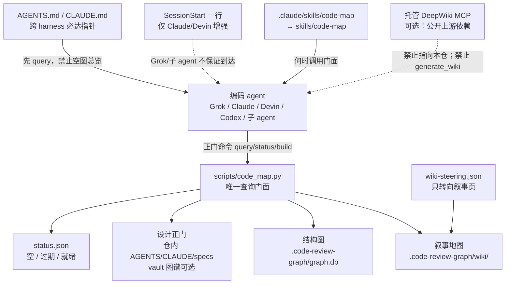
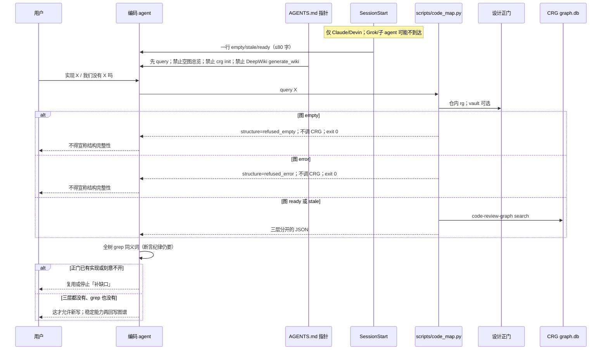

# 本地代码地图：把 DeepWiki 的可问形状接到 code-review-graph 的结构图上，并用设计正门压住造轮子

- 日期：2026-08-19
- 修订：2026-08-20 交稿——仅落本文，不改业务代码。探针改为对 hits **集合**断言（「技能桥」标题行与 `skill_tools.py` 不在同一行）；示例 JSON 拆成两条 hit，`retired` 只挂在含退役词的那一行
- 作者：Grok（design-doc-writer）
- 状态：Draft（Q1/Q2/Q3 已按用户 2026-08-20 选择收口：不上传、wiki 第二期、执行面=AGENTS+CLI+skill 软链）
- 范围：给本仓编码 agent 一条**单一查询门面**，把三件已经存在、但互不说话的东西接到同一份查询契约上：
  1. 设计正门（`AGENTS.md` / `CLAUDE.md` / 能力图谱 / `docs/superpowers/specs/`）
  2. 结构图（本地 `code-review-graph`，下文简称 CRG）
  3. 叙事地图（DeepWiki 那种「可问的架构页 + 引用」，在本机生成，不走托管）
- 目标：agent 在实现或宣称「我们没有 X」之前，能先拼出整体结构、找到已有正门和实现，少造轮子、少把刻意约束当缺口去「补」
- 非目标：不把本仓源码交给 Cognition 托管 DeepWiki；不另建第二份能力清单；不把 CRG 社区划分当成用户心里的模块；不把 MCP 已连接误写成「地图已可用」；**禁止**跑 `code-review-graph init|install`；第一期**不**把入口挂进 `python3 -m intelligence.cli`

> 本文不发明产品名。落地物就叫 **本地代码地图**，查询入口是 `scripts/code_map.py`。与 `skills/opinion-cross` 内部缓存 `code_map.json` 只是碰巧同名，入口不撞，不必改名。

---

## 1. 当前判断

**能不能结合？能。但不是「让 agent 同时调两个 MCP」。**

Naive 结合（agent 想起了就调 `deepwiki__ask_question`，再调 `code-review-graph__semantic_search_nodes_tool`）今天已经失败，而且失败方式是静默的：

| 工具 | 今天的真实状态（2026-08-19 本树实测） | 它真正回答的问题 | 它回答不了的问题 |
|---|---|---|---|
| 托管 DeepWiki MCP（`https://mcp.deepwiki.com/mcp`） | 已挂上。当前**公开**三个工具均要求 GitHub `owner/repo`。账号若升到 private mode，还会出现 `generate_wiki` / `list_available_repos` / 一批 `devin_*`——那是另一条上传路径，Q1=否时不得启用 | 公开 GitHub 仓的叙事架构页 | 本仓（私有、日常远程是本机 Gitea、有脏树）；「飞书 Bitable 写入已废弃」 |
| CRG MCP（`uvx --from code-review-graph code-review-graph serve`，包版本 2.3.7） | 已连接；本地库 `.code-review-graph/graph.db` 存在 | 符号、调用、社区、执行流、影响半径 | 「哪条路是正门、哪条已退役、为什么这样设计」 |
| 能力图谱 + 断言纪律 | 图谱在 vault；Claude/Devin 的 SessionStart 会注入指针。**Grok 会跑 `session_facts.sh` 但不把 stdout 注入模型；子 agent 没有 SessionStart** | 「我们有没有编排层 / 技能桥只开一个是不是故意的」 | 函数级调用完整性；未写入图谱的局部设计 |

CRG 库此刻是**空 schema**：`nodes=0, edges=0, communities=0, flows=0, embeddings=0`，`metadata` 只有 `schema_version=9`。文件 159 744 字节，时间戳 2026-08-19 23:36，是 MCP 连上时建出来的空壳。`~/.code-review-graph/` 空目录，没有 `registry.json`。**连接 MCP ≠ 有地图。** 空图上谈「架构总览」就是假证据——和本仓反复踩过的「health 全绿、字段没人读」是同一形状（见 `scripts/check_unread_fields.py`）。

因此结合点不是新数据库，而是：

```text
查询契约（先正门、再结构、再叙事，缺层必须说缺）
  + 新鲜度（空图/过期必须 fail closed）
  + 单一门面（scripts/code_map.py，CLI 是正门，MCP 只是运输）
```

三层都不复制：门面只编排，不把能力图谱抄进 SQLite，也不把 CRG 节点抄进 markdown 清单。

---

## 2. 领域术语与边界

本 spec 统一使用以下术语。四者**禁止压成一句「完整性」**。说「没漏代码」时必须点名是哪一种：

| 术语 | 定义 | 权威来源 | 不能做什么 |
|---|---|---|---|
| **设计正门** | 哪条入口是当前该走的、哪条已退役、为什么这样设计、哪项能力是刻意不开 | 手工维护：`AGENTS.md` / `CLAUDE.md` 的 canonical 条目；仓内软链 `.agent-memory/10_knowledge/finance-agent-capability-graph.md`（缺失不算门面失败）；`docs/superpowers/specs/`；硬门 `python3 .agent-memory/scripts/graph_audit.py`（vault 在时才跑） | 不能从调用图推断「该不该存在」。技能桥只注册 `serenity-alpha` 是设计，不是漏接 |
| **叙事地图** | 可问、带引用的架构页（DeepWiki 的产品形状） | 本机生成：`.code-review-graph/wiki/`；目录由 `wiki-steering.json` 转向，不由 Leiden 社区名决定 | 不能覆盖正门。页写「飞书还是复盘写入口」而 AGENTS 写已废弃 → 正门赢，页算漂移 |
| **结构图** | 文件 / 函数 / 类节点，import 与调用边，社区，从入口点出发的执行流，影响半径 | CRG：Tree-sitter（把源码解析成语法树）解析 + SQLite；库路径 `.code-review-graph/graph.db` | 不能回答「canonical / retired / why」。本仓工具注册大量「函数当值传递」，CRG 调用边在本仓实测精度约 1/3（`scripts/check_unread_fields.py` 已记），缺边 ≠ 没有这条路 |
| **检索召回** | 这次查询有没有把该回的正门/符号/页带回来 | 门面返回的 `hits[]` + 验收探针（见 §13.2） | 召回成功不是架构正确；召回失败不能直接写成「我们没有 X」 |

这和知识库 / theme-radar 已经用的分层是**同一形状**，不要再造一套三字母栈名：

| theme-radar 层 | 它回答 | 代码地图对应 | 混用时的失败 |
|---|---|---|---|
| 研报上下文 / L1 产业翻译 | 叙事上怎么连 | 叙事地图 | 把生成 wiki 写成正门 |
| 图谱暴露 / graph_only | 谁和谁有边 | 结构图 | 把 Leiden 社区写成用户模块 |
| L2/L3 硬事实与正门 | 稳定底座、可执行入口 | 设计正门 | 把退役脚本当成还活着的写入链 |
| L4 市场信号 | 盘面热不热 | 检索召回（这次搜没搜到） | 把「搜到了」当成「应该用这条路」 |

不变量：

1. **正门压过生成物。** 叙事页、Leiden 社区名、CRG 架构总览，任一与 `AGENTS.md` / 能力图谱冲突，以正门为准，生成物标 `drift`。第一期没有叙事页，`conflicts` 恒为 `[]`（机械规则见 §6.2）。
2. **空图不得回答结构完整性。** `nodes=0` 时，门面必须拒绝「结构图 / 叙事地图」结论；设计正门仍可答（它不依赖 CRG）。
3. **禁止第二份能力清单。** 新增稳定能力只回写 vault 那一页，然后跑 `graph_audit.py`。`wiki-steering.json` 只转向叙事页，不登记工具、不登记 skill、不登记 CLI。
4. **MCP 不是契约。** 契约是 `scripts/code_map.py` 的 JSON。CRG MCP 与 DeepWiki MCP 都是运输。Grok 的 `~/.grok/config.toml` 已为 CRG 配了 `uvx`；Claude/Devin 未必同配。CLI 跨 harness 可测。
5. **「我们没有 X」仍走断言纪律。** 用户级 hook 已强制：全树 grep 同义词 + 读能力图谱 + 读项目笔记。本设计给编码任务补上「走代码地图门面」，不是替换前三步。CRG 搜空不能单独下负面结论。不要把「我们有没有」做成 dispatcher 触发词。
6. **禁止 `code-review-graph init|install`。** 它会把仓根 `.gitignore` 写成忽略整个 `.code-review-graph/`（挡住要提交的 `wiki-steering.json`），并往 CLAUDE.md 注入「先 `list_graph_stats` 再 `get_architecture_overview_tool`」——正是本 spec 要消灭的 naive 空图路径。门面 `build` 不得代跑 init。

---

## 3. 背景与动机

### 3.1 用户的真实痛点

不是「有没有 GitHub 那种扫全仓的工具」。是：

- 编码 agent 拼不出整体架构，随机读文件；
- 已有设计 / 实现找不到，再写一套；
- 把刻意非能力当成缺口去补（技能桥只开一个、飞书写入已废弃、`fact_sector_daily` 是 VIEW）。

### 3.2 两件现成工具各自缺哪一层

**托管 DeepWiki（Cognition）** 的有用形状：可转向的 wiki 目录、可问、答案带引用。它的实体实现绑死 GitHub `owner/repo`，公开 API 对本仓返回 `Not Found`。`docs/layered-rebuild-roadmap.md` 已写死：要让外部服务索引本仓等于发布私有代码，需要显式授权，不要顺手做。它也看不见本机脏树。`.devin/wiki.json` 这种转向文件是为托管产品准备的；本仓 `.devin/config.json` 已经在管 SessionStart / SessionEnd hook，再塞一份 DeepWiki 目录会变成第三个身份。

**CRG** 的有用结构：增量语法树图、调用/import 边、Leiden 社区（一种图聚类，把经常互相调用的符号捆成「社区」）、入口点执行流、SQLite 全文检索（FTS，full-text search）、可选向量、影响半径、`generate_wiki_tool` 往 `.code-review-graph/wiki/` 写页。CLI 已覆盖 `build / update / postprocess / status / search / wiki / architecture / flows`（**没有** `--postprocess` 参数，见 §8.3）。缺的是：本仓图是空的；社区 ≠ `intelligence/runtime` vs `services` 这种分层；不知道正门。

### 3.3 第三层已经在挡系统级造轮子

2026-08-04 起，CLAUDE.md 写明：连续三次把已有能力 / 刻意约束判成缺口，差点组织人去「补」。对策已经落地：

- 能力图谱是回答「有哪些节点」的权威事实源，改能力回写它；
- `graph_audit.py` 按 `path::symbol` fail-closed，exit 0 还自述审的是哪个分支 / sha / 是否脏；
- 正门例句：复盘写入 `python3 -m market_feature_store.cli daily-full`；飞书 Bitable 写入已废弃；`fact_sector_daily` 是 VIEW；`scripts/fast_daily_sync.py` 停用（exit 2）。

只接 DeepWiki + CRG、不经过这一层，agent 仍会去接飞书写复盘、或把 skill 全挂进 agent 工具面。

### 3.4 本仓已有的「事实投递」模式，不要另起炉灶——但要按 harness 拆到达率

`scripts/session_facts.sh` 自己把信息分成三层（按「失效会怎样」，不按「哪个位置显眼」）：

1. **门禁**（pre-commit）：违反有后果 → 到达率 100%；
2. **SessionStart hook**：必须知道，否则走弯路 → 对 **Claude / Devin** 无条件注入，预算 2000 字符；
3. **skill / AGENTS.md**：需要时才查。

对 **Grok / 子 agent**，第 2 层实际到不了：

- Grok 官方文档：`SessionStart` / `PostToolUse` 的 **stdout 被忽略**；`session_facts.sh` 写的是 Claude/Devin 的 `hookSpecificOutput.additionalContext` JSON。Grok 虽可能因兼容扫描 `.claude/settings.json` 而**跑**该脚本，但不保证把 JSON 注入模型。
- 同一份文档：`SessionStart does not fire for a subagent's own session.` 编码实现经常被派到 Build/explore 子 agent；它们读 AGENTS.md，不读 hook 一行。
- Grok / Claude Code 的 skill 发现根是 `.claude/skills/`、`.grok/skills/` 等，**不扫仓根 `skills/`**。Claude Code 能看到的是 `.claude/skills/` 里那批软链（例：`.claude/skills/theme-radar -> ../../skills/theme-radar`）。只写 `skills/code-map/SKILL.md` 而不做软链，加载器捡不到。
- dispatcher 不是 Grok 的默认第一步；不要把 dispatcher 触发词当成跨 harness 到达。
- Codex：`.codex/hooks.json` 在根 `.gitignore` 里。第一期不接 Codex hook，通道同样是 AGENTS.md。

因此代码地图的**跨 harness 必达通道是 AGENTS.md / CLAUDE.md 的一行指针**，不是 SessionStart。SessionStart 一行只当 Claude/Devin 的增强。提醒的到达率不可靠——解释器那条已经用文档拦过二十多次，全部失败——所以指针必须短、具体、打脸「MCP 已连 = 有地图」，并且 **PR2 必做，不是可选**。

---

## 4. 目标与非目标

### 目标

1. 编码 agent 有一条正门命令：`python3 scripts/code_map.py query "…"`，一次返回三层，并标注哪一层缺席。
2. 空图 / 过期图 **在 AGENTS.md 必达指针里被看见**；Claude/Devin 另有 SessionStart 一行增强。对结构图问题 fail closed，不允许空壳总览。
3. 第一次把 CRG 图 build 起来，并规定增量（`update --base <built_at_sha>`，无收据则 `--full`）、何时跑社区/流、何时重生叙事页。
4. 「实现前先搜正门 + 结构图」成为默认动作：AGENTS 指针 + `.claude/skills/code-map` 软链 + CLI。不是 MCP 工具列表里的装饰。
5. 能力变更仍只回写既有能力图谱。

### 非目标

- 不把本仓推给 `mcp.deepwiki.com` / Cognition 索引（默认否，见开放问题 Q1）。禁止调用 DeepWiki `generate_wiki` / private index。
- 不在 `intelligence/services/research_tool_registry.py` 加代码地图工具。那张表是金融研究用的，受 `contract.allowed_capabilities` 门控，且技能桥刻意只开一个；扩注册表要先论证不破「只读 + 无外呼」。编码 agent 与金融问答 agent 是两条面，不要焊死。
- 第一期不把 `code-map` 做成 `python3 -m intelligence.cli` 的子命令。
- 不把整仓塞进上下文（gitingest / Repomix）。
- 不引入 Sourcegraph / SCIP 作为本期底座。
- 不让 Leiden 社区改 `layer_audit.py` 的分层，也不用社区名替换 `intelligence/runtime` vs `services`。
- 不在本期做云端向量（OpenAI / Google / MiniMax embedding 会把符号名和签名送出本机）。
- 不自动在每次 SessionStart 全量 build。
- **不要跑 `code-review-graph init|install`。** 不要 copy 一份 `parse_node_table` 进本仓。不要在实现里写死家目录下的 vault 路径。

---

## 5. 已核验事实（实现时当不变量用）

开工树：`feat/reading-rules-baseline-batch1` @ `78391e8e`，工作区有大量他人未提交文件。实现必须另开干净树 / 新分支，**禁止在这棵脏树上改文件或跑「全量对账」当本 spec 的收据**。

1. DeepWiki **公开**工具：`deepwiki__read_wiki_structure` / `deepwiki__read_wiki_contents` / `deepwiki__ask_question`。参数 `repoName` 为 GitHub `owner/repo`（`ask_question` 最多 10 个仓）。没有「本地路径」参数。private mode 另有 `generate_wiki` 等，Q1=否时不得启用、门面不得封装。
2. CRG 对本仓有意义的 MCP 工具（非穷尽）：`build_or_update_graph_tool`、`run_postprocess_tool`、`list_graph_stats_tool`、`semantic_search_nodes_tool`、`get_impact_radius_tool`、`detect_changes_tool`、`get_review_context_tool`、`list_communities_tool`、`get_architecture_overview_tool`、`list_flows_tool`、`get_flow_tool`、`generate_wiki_tool`（写 `.code-review-graph/wiki/`）、`get_wiki_page_tool`、`get_suggested_questions_tool`、`refactor_tool`、`embed_graph_tool`、`get_minimal_context_tool`。CLI 子命令：`build/update/postprocess/status/search/wiki/architecture/flows`。**CLI 没有 `--postprocess`。** `build`/`update` 的映射是：默认 = 门面的 `full`；`--skip-flows` = `minimal`（签名+FTS，跳过流/社区）；`--skip-postprocess` = `none`。`update --base` 默认 `HEAD~1`。另有独立子命令 `postprocess`（`--no-flows` / `--no-communities` / `--no-fts`）。
3. CRG 解析范围：优先 `git ls-files`（只含已跟踪文件），再套默认忽略 + 可选 `.code-review-graphignore`。`.gitignore` 里的 `.env*`、`*.duckdb`、`intelligence/users/*/corrections.jsonl` 等默认不会进图。`git ls-files` 失败才会退回整树 walk——门面在 git 不可用时必须拒绝 build，避免扫到密钥。**这只保护 wrapper**；有人直接调 MCP `build_or_update_graph_tool` 仍靠 ignore + `git ls-files`。
4. 默认忽略已含 `**/.code-review-graph/**`、`**/.venv/**`、`**/node_modules/**`、`*.db`；**不含** `*.duckdb`、`.venv-workbench/`（默认只匹配 `**/.venv/**`）、`intelligence/eval/runs/`、`intelligence/users/`、`复盘/`、`docs/handoffs/`。这些要写进 `.code-review-graphignore`。
5. CRG 已有 provenance 信封：`graph_provenance()` 读 `metadata.last_updated / git_branch / git_head_sha`，并和活 HEAD 比 `head_matches_build`。空库现在连这些键都没有，只有 `schema_version`。`update` 成功后会把 `git_head_sha` 写成当前 HEAD——若 `--base` 不是 `built_at_sha`，就会 **fail-open 的假就绪**。
6. SessionStart：项目级 `scripts/session_facts.sh`（经 `.devin/config.json` 与 Claude `.claude/settings.json`）投递树 / 解释器 / 脏文件 / 收据 / 在途交接，预算 2000 字符；本树实测 additionalContext 已约 1902/2000。用户级 hook 投递能力图谱指针 + 负面断言纪律。**不要再抄一份断言正文进 CLAUDE.md**（2026-08-12 抄件已漂过）。Grok 忽略 SessionStart stdout；子 agent 无 SessionStart。
7. 金融 agent 工具目录仍是 `_DEFAULT_TOOL_METADATA`；条目数用 AST 数，禁止写死。
8. 仓内软链 `.agent-memory -> ../agent-memory`（gitignore）。CI / 无 vault 的克隆没有这份目录。正门第一期必须只靠仓内文件就能绿。
9. `.claude/skills/` 现有条目是指向 `../../skills/<name>` 的软链（刻意子集）。Grok 会扫 `./.claude/skills/`。

---

## 6. 推荐架构

### 6.1 总览



数据流：门面**不**把正门抄进 `graph.db`，也**不**把 CRG 节点抄进能力图谱。冲突时只在本次 JSON 里标 `resolution: doors_win`。

### 6.2 查询契约（核心，不是口号）

一次 `query` 必须按固定顺序取三层，并在输出里分开。禁止「搜到啥算啥」的混排。

```text
Q  = 用户问题 / 拟实现的能力名
1. doors     正门检索（机械规则见下；不依赖 CRG）
2. graph     empty → refused_empty；error → refused_error；二者都不调 CRG
             其余（ready / stale）才包 `code-review-graph search`
3. narrative 第一期恒 missing；第二期按 steering 取页
4. 交叉     第一期 conflicts 恒 []；第二期用机械 drift，禁止 LLM 判冲突
5. 收口     每条 hit 带 layer；completeness_claim 必须用下列枚举
```

人话版：先问「这件事有没有官方说法和退役警告」，再问「代码里符号在哪、谁调用谁」，最后才读生成的解说页。解说页和聚类结果都可能错；正门才挡「补一个已经做过的决定」。

#### 6.2.1 正门匹配（第一期就必须机械，禁止 LLM）

1. **分词。** 按 Unicode 空白和标点切 token，但 **不要切开 `[_-]`**（`daily-full`、`fact_sector_daily` 各算一个 token）。丢掉长度 < 2 的；ASCII 做大小写折叠。不做中文分词词表。实现时不要用未过滤的 `string.punctuation` / Unicode `P*` 一刀切。
2. **检索语料（第一期，按顺序）：**
   - **必做（CI 只靠这些）：** `AGENTS.md`、`CLAUDE.md` 的**全文**；`docs/superpowers/specs/*.md` **只搜标题**（文件名 stem + 文中第一个 `^# ` 行），不搜正文。
   - **可选：** 若存在 `.agent-memory/10_knowledge/finance-agent-capability-graph.md`，解析「节点清单」表的节点名与 Spec.path。加载方式：`importlib` 从 **相对仓根** 的 `.agent-memory/scripts/graph_audit.py` 取 `parse_node_table`（文件不存在则用表格正则，**不要**把该解析器复制进本仓当第二份模块）。**禁止**源码里出现家目录绝对路径。vault 缺失时 JSON 加 `"vault": "unavailable"`，`doors` 仍可 `ok`（仓内命中即可）。
3. **命中。** token 对语料做**子串 OR**（任一 token 命中该**行**即算一条 hit；hit 的粒度是行，不是文件）。
4. **排序与 top-K。** 匹配到的互异 token 数降序；同分时 `AGENTS.md` > `CLAUDE.md` > vault 节点 > specs 标题。每层最多返回 **20** 条 hit，截断后的不进 JSON。
5. **`doors.state`。** `hits` 非空 → `ok`；否则 `missing`。
6. **hit 字段粒度（禁止 NER / LLM 抽短名）：**
   - `title` = 命中行去掉首尾空白后**截断到 40 个字符**，不加省略号、不改写；
   - `excerpt` = 命中行去掉首尾空白后的**整行**；
   - `retired[]` = 若该行含 `退役|禁止|已废弃|刻意|不要跑|停用` 之一，把**同一整行**写入（去重）。探针用子串「含」匹配整行，不要改词表除非同时改测试。
7. **`completeness_claim.doors`。** `missing` = 0 hit；`ok` = 每个长度≥2 的 token 都至少命中一处；`partial` = 有 hit 但有 token 没命中。

#### 6.2.2 drift（分两期，禁止 LLM）

- **第一期：** `conflicts` 恒为 `[]`；`narrative.state` 恒为 `missing`。测试不得编造 drift。
- **第二期（PR6）：** 若 `narrative` 或 `structure` 的 excerpt **包含** `doors.retired` 中任一项的字面，且同一 excerpt **不含** 退役语境词（`退役|禁止|已废弃|刻意|不要跑|停用|废弃`），则追加 `{ "layer": "...", "retired_item": "...", "resolution": "doors_win" }`；若犯规层是 narrative，则 `narrative.state=drift`。

#### 6.2.3 `completeness_claim` 枚举（测试钉住；禁止顶层 `"complete": true`）

| 字段 | 允许值 | 何时 |
|---|---|---|
| `doors` | `ok` / `partial` / `missing` | 见 §6.2.1.7 |
| `structure` | `ok` / `missing` / `stale` / `unavailable` | `unavailable` = `refused_empty` 或 `refused_error`；`stale` = 图可搜但 sha 落后；`ok` = 图可搜且 ≥1 hit；`missing` = 图可搜但 0 hit |
| `narrative` | `ok` / `missing` / `drift` / `unavailable` | 第一期恒 `unavailable` |
| `recall` | `untested` | 生产与测试**都恒** `untested`。探针是否召回由测试自己断言 `layers.doors.hits`（path/excerpt 子串），禁止把测试结论写回被测字段，也不要为探针开魔术 query 列表 |

#### 6.2.4 JSON 形状

```json
{
  "query": "daily-full",
  "status": "empty",
  "vault": "unavailable",
  "layers": {
    "doors": {
      "state": "ok",
      "hits": [
        {
          "title": "python3 -m market_feature_store.cli dail",
          "path": "CLAUDE.md",
          "symbol": null,
          "excerpt": "python3 -m market_feature_store.cli daily-full --trade-date YYYY-MM-DD",
          "retired": []
        },
        {
          "title": "> ⚠ 飞书 Bitable 写入已废弃，复盘数据",
          "path": "CLAUDE.md",
          "symbol": null,
          "excerpt": "> ⚠ 飞书 Bitable 写入已废弃，复盘数据统一走 `daily-full` → DuckDB 路径。",
          "retired": ["> ⚠ 飞书 Bitable 写入已废弃，复盘数据统一走 `daily-full` → DuckDB 路径。"]
        }
      ]
    },
    "structure": {
      "state": "refused_empty",
      "hits": []
    },
    "narrative": {
      "state": "missing",
      "hits": []
    }
  },
  "conflicts": [],
  "completeness_claim": {
    "doors": "ok",
    "structure": "unavailable",
    "narrative": "unavailable",
    "recall": "untested"
  },
  "next_action": "structure 层不可用：禁止把空图写成架构结论。正门见 layers.doors。"
}
```

上表 `title` / `excerpt` / `retired` 均来自 `CLAUDE.md` 真实行：`title` 是该 hit 自己的 excerpt 截断到 40 字符；`retired` 只填**同一整行**里带「退役|禁止|已废弃|刻意」的那条，禁止把另一行的退役词借到命令行 hit 上。实现不得改写成「复盘写入正门」这类概括标题，也不得为过测试去合并相邻行。

`status` 顶层取值：`empty | stale | ready | error`（与 `status` 子命令同一套）。`query` 在契约合法时 **exit 0**，即使 `status=empty` 或 `status=error`——完整性只写在 JSON 里，不复用 `status` 的 exit 2/3（避免 `set -e` 把正门探针当失败）。`next_action` **不要**点尚未存在的子命令；PR4 落地之后，empty 的 `next_action` 才允许追加 `python3 scripts/code_map.py build --full`。

### 6.3 编码 agent 必走的顺序



「先问用户比先搜快」仍然成立：用户两秒能答「我们有没有编排层」。门面是搜的正门，不是禁止开口。

### 6.4 生成 vs 手工；冲突谁赢

| 产物 | 谁写 | 提交吗 | 冲突时 |
|---|---|---|---|
| 能力图谱 + `graph_audit.py` | 人（稳定能力变更时） | **vault 仓**另一次 commit，不是本仓 PR 的文件列表 | **最高优先级** |
| AGENTS/CLAUDE 正门句 | 人 | 本仓 | 与图谱同级；细则以写了「退役/禁止」的那句为准 |
| `docs/superpowers/specs/` | 人 | 本仓 | 设计意图；被代码否定时改 spec 或改代码，不改生成 wiki 来「圆」 |
| `.code-review-graph/graph.db` | CRG build | 否（gitignore） | 只证明符号存在，不证明该用 |
| `.code-review-graph/wiki/` | `generate_wiki` + 门面按 steering 填的正门页 | 否 | 负于正门 |
| `.code-review-graph/wiki-steering.json` | 人 | **是**（gitignore 例外） | 只决定「该有哪些叙事页」，不拥有能力 |
| `.code-review-graph/status.json` | `code_map.py status/build` | 否 | 新鲜度收据，不是架构 |

Leiden 社区页可以存在，但索引上必须标「算法捆簇，不是分层审计」。用户心里的模块仍是 `layer_audit.py` 那套：`intelligence/runtime`（底座）vs `intelligence/services`（积木）vs `market_feature_store` vs `skills/`。

---

## 7. 文件放哪里

优先扩展 `.code-review-graph/` 和既有能力图谱。**禁止**新建 `docs/architecture-wiki/` 当第二份能力清单，也禁止 `.devin/wiki.json`（`.devin/` 已是 Devin hook 配置；托管 DeepWiki 不是本仓真源）。

```text
.code-review-graph/
  graph.db / graph.db-wal / graph.db-shm   # 生成，忽略
  status.json                               # 生成，忽略
  wiki/                                     # 生成，忽略
  wiki-steering.json                        # 手工，提交；只转向叙事页
  .gitignore                                # 显式名单，放行 steering

.code-review-graphignore                    # 提交；解析黑名单
scripts/code_map.py                         # 门面 CLI（正门）
tests/test_code_map.py
skills/code-map/SKILL.md
.claude/skills/code-map -> ../../skills/code-map   # 发现根软链；Grok/Claude 都扫这里
AGENTS.md / CLAUDE.md                       # PR2 必做一行指针，不抄契约正文
```

`.code-review-graph/.gitignore` 今天是 CRG 自动写的 `*`。PR1 改成显式名单（必须含 `graph.db`、`graph.db-wal`、`graph.db-shm`、`wiki/`、`status.json`），否则 `wiki-steering.json` 进不了版本库。CRG 的 `_write_data_dir_gitignore()` 只在内层文件不存在时写 `*`，改过之后 **build 不会覆盖**；**`init|install` 会改仓根 gitignore**，所以禁止跑它们。若有人已经跑过 init：从 CLAUDE.md 删 CRG 注入的 explore-codebase 段，从根 `.gitignore` 删整目录 `.code-review-graph/` 那一行（改回只忽略 db/wiki/status）。

仓根 `.gitignore` 不要写成忽略整个 `.code-review-graph/`。只列生成物。根里已有 `*.db`，`graph.db` 双保险仍要在内层写明 wal/shm。

`wiki-steering.json` 示例（实现可增页，不得在此文件列工具名当作注册表）：

```json
{
  "purpose": "steer narrative pages only; not a capability inventory",
  "pages": [
    {"id": "daily-review-door", "title": "复盘写入正门", "queries": ["daily-full", "飞书 Bitable", "fast_daily_sync"]},
    {"id": "agent-tool-surface", "title": "Agent 工具面与技能桥", "queries": ["research_tool_registry", "skill_tools", "serenity-alpha"]},
    {"id": "duckdb-views", "title": "板块事实表是 VIEW", "queries": ["fact_sector_daily", "sector_universe_snapshot"]},
    {"id": "intelligence-layers", "title": "intelligence 分层", "queries": ["layer_audit", "runtime", "services"]}
  ]
}
```

能力图谱只加**一行节点**，例如「本地代码地图门面」→ `scripts/code_map.py::main`。这是 **vault 仓的配套 commit**，不要写进本仓 PR 的「影响文件」假装 CI 会跑到。不要把 CRG 社区列表贴进图谱。

---

## 8. 门面接口

不把命令挂到 `intelligence.cli` 第一期。`intelligence/cli.py` 已是金融问答 / 复盘 / foresight 聚合入口；代码地图是给编码 agent 的，放 `scripts/` 与 `layer_audit.py`、`session_facts.sh` 同类。若二期发现编码 agent 只记得 `python3 -m intelligence.cli`，再加一个**薄转发**子命令，正逻辑仍在 `scripts/code_map.py`。

```text
python3 scripts/code_map.py status [--json] [--one-line]
python3 scripts/code_map.py query  "<问题>" [--json]
python3 scripts/code_map.py build  [--full] [--postprocess full|minimal|none]
python3 scripts/code_map.py ask    "<问题>"          # 第二期：抽取式拼接，默认不调 LLM
```

门面自己的 `--postprocess` 可以保留，**必须在 wrapper 里翻译成 CRG CLI 旗标**，不要假装上游有 `--postprocess`。

### 8.1 `status`

读 `.code-review-graph/graph.db`（SQLite 只读 URI，timeout 短，学 CRG `graph_provenance` 的 50 ms 量级，避免和 build 抢锁）：

- 无库或 `COUNT(nodes)=0` → `empty`，exit 2
- 有节点但缺少 `git_head_sha`，或 `git_head_sha != HEAD` → `stale`，exit 1
- 有节点且 sha 一致 → `ready`，exit 0（**不**声称工作区干净；CRG 自己也只比 commit，不比脏文件）
- git/sqlite 失败 → `error`，exit 3

`--one-line` 给 SessionStart，**≤80 字符**，不要塞 build 命令（PR1/PR2 落地时 `build` 子命令还不存在）。

| 状态 | 一行（示例，均 ≤80） |
|---|---|
| `empty` | `代码地图: empty n=0 ← 禁止空图架构结论；正门=AGENTS` |
| `stale` 轻 | `代码地图: stale 落后N commit，仍可搜` |
| `stale` 重 | `代码地图: stale 落后N且触及 intelligence/ ← 勿当当前架构` |
| `ready` | `代码地图: ready n=1234 @abc1234` |
| `error` | `代码地图: error ← 状态未知，禁止假装 ready` |

**轻/重 stale：** `N = git rev-list --count <built_at_sha>..HEAD`。`N ≥ 5` **或** `built_at_sha..HEAD` 触及 `intelligence/`、`market_feature_store/`、`scripts/` → 用重句。否则轻句。第一期几乎每次 commit 后都会 stale；永远刺眼的黄灯会被学成忽略，所以默认轻句。

Hook 本身退出码继续恒 0（观测故障不得阻断会话）。

### 8.2 `query`

退出码：契约合法 → **exit 0**（含 `status=empty` 与 `status=error`）。参数错误 / 写不出 JSON → 非 0。测试钉住空图下 `query daily-full` 的进程码是 0。

正门检索：§6.2.1。不 `import` 家目录下的 `graph_audit`。

结构检索（在调任何 CRG 命令之前先看顶层 `status`）：

| 顶层 `status` | `structure.state` | 是否调 `code-review-graph search` |
|---|---|---|
| `empty` | `refused_empty` | 否 |
| `error` | `refused_error` | 否 |
| `ready` / `stale` | 随后按搜结果填 `ok` / `missing` / `stale` | 是，**只包这一层** |

`empty` / `error` 时 **禁止**调用 `get_architecture_overview_tool` 和 `search`。测试：把 db 换成损坏文件或让 sqlite 超时，`query` 仍 exit 0、`structure.state=refused_error`、subprocess 未被调用。

可搜时：

```text
uvx --from code-review-graph code-review-graph search "<问题>"
```

该 CLI 走 `hybrid_search`（有 embedding 则 FTS+向量 RRF，没有则退 FTS/LIKE）。第一期不做 embed，行为就是 FTS。**不要**再手写一条 `nodes_fts` SQL 造成双路。需要影响半径 / 流时再调对应 CLI，不把 30 个 MCP 工具暴露成「请自行挑选」。

叙事检索：第一期恒 `missing`。

### 8.3 `build`

包装 CRG CLI，不重写解析器，**不跑 `init`/`install`**。

门面 `--postprocess` → 真实 CLI：

| 门面 | 实际命令 |
|---|---|
| `full`（默认） | `uvx --from code-review-graph code-review-graph build` 或 `update --base <sha>`，不加 skip |
| `minimal` | 同上，加 `--skip-flows` |
| `none` | 同上，加 `--skip-postprocess` |

增量（**PR4 就必须正确，不要拖到 PR7**）：

```text
# 有 status.json.built_at_sha
uvx --from code-review-graph code-review-graph update --base <built_at_sha> --skip-flows

# 无收据 / schema 不兼容 / --full
uvx --from code-review-graph code-review-graph build
```

禁止依赖 `update` 默认 `--base HEAD~1`：上次 full 之后若有 ≥2 个 commit，只解析相对 HEAD~1 的文件，却把 metadata `git_head_sha` 写成当前 HEAD → `status=ready` 而中间 commit 的符号缺失。

无 `uvx`：fail closed，stderr 写「需要 uv/uvx（https://docs.astral.sh/uv/），不要改去直调 MCP build」。不要猜测 Python API 的 `uvx` import 路径。

门面在调用前：

1. `git rev-parse --is-inside-work-tree` 必须成功，否则拒绝（防止 walk 扫到 `.env`）；
2. 确认 `.code-review-graphignore` 存在；
3. 多 worktree 共用一个 `.git`，但 **`.code-review-graph/` 在每棵树各自一份**——build 只写当前树，禁止写主树来「帮忙」；
4. 写 `status.json`：`built_at_sha`、`node_count`、`postprocess`、`wiki_generated`。

何时门面 `postprocess=full`：首次全量；或相对上次 full，触及 `intelligence/`、`market_feature_store/`、`scripts/` 的文件数 ≥ 30（阈值写进 `status.json`）。日常小改动：`minimal`。

何时重生 wiki：只在 `postprocess=full` 之后。第一期**不**生成 wiki（见 §16：用户未回复则按此默认）。社区页用 CRG `wiki` 子命令；正门页由门面按 steering 填，正文是 query 结果的 markdown 投影，不是模型自由发挥。

`embed_graph`：第一期不做。若做，只允许 `provider=local`。云端 embedding 视为「代码离开本机」，与 Q1 绑定。

---

## 9. 新鲜度

| 事件 | 动作 | 预算（量级，本机实测后再写进收据，此处不是 SLA） |
|---|---|---|
| MCP 首次连接 | 只建空 schema，**不**算就绪 | 秒级 |
| 第一期 `build --full` | 解析已跟踪的 py/ts（`intelligence/` 约 500 个 `.py`；与 `market_feature_store/`+`scripts/`+`evolution/` 合计约 667） | 未在本机跑过全量，不得把「数分钟」写成验收；CI 不跑全量 |
| 日常 `update --base <built_at_sha>` | 只解析该 sha 之后的改动文件 | 秒到数十秒 |
| 门面 `postprocess=full` | Leiden + 流 | 全量后一次 |
| `generate_wiki` | 社区页 + steering 正门页 | 第二期，跟在 full 后 |
| SessionStart | 只 `status --one-line`（≤80 字） | <200 ms；超时则写「状态未知」 |
| 宣称架构 | `status` 非 empty；query 探针（§13） | 秒级 |

过期策略：

- `empty`：结构/叙事问题 fail closed。
- `stale`：可以搜。JSON 顶层 `status=stale`。one-liner 用轻句，除非 §8.1 的重句条件。agent 把过期图写成「当前架构」仍视为违规，但不靠每天刺眼的黄灯。
- 脏工作区：status **不**因为脏文件变 empty。未提交的新文件本来就不在 `git ls-files` 里；门面在 `status.json` 里加 `worktree_dirty_code: true`（复用 `session_facts.sh` 同一套代码路径前缀）。这和 CRG `#458` 的教训一致：不要用 `is_stale=False` 暗示工作区已被索引。

---

## 10. 执行面：什么让「先搜」成为默认

MCP 存在已经失败。要按 harness 拆到达，不能假装 SessionStart 覆盖 Grok 和子 agent。

| 候选 | 实际到达率 | 适合投递什么 | 本设计怎么用 |
|---|---|---|---|
| **AGENTS.md / CLAUDE.md 一行指针** | 子 agent、Grok、Codex 都会读项目说明 | 打脸空图 + 正门命令 + 禁止 `crg init` + 禁止 DeepWiki `generate_wiki` / 对本仓 private index | **跨 harness 主通道，PR2 必做** |
| SessionStart 事实注入 | Claude/Devin：高；Grok：stdout 忽略；子 agent：**不触发** | ≤80 字 empty/stale/ready | **仅 Claude/Devin 增强**，不是主通道 |
| `.claude/skills/code-map` 软链 | Grok 扫 `./.claude/skills/`；Claude Code 同根。仓根 `skills/` **不是**发现根 | 查询顺序、禁止事项 | **PR5 必做软链**。dispatcher 触发词只服务仍走 dispatcher 的 Claude 会话，**不是** Grok 默认动作 |
| Workbench `research_tool_registry` | 金融 Episode 才看得见 | 无 | 明确不做 |
| pre-commit | 提交时 100% | 可选警告：结构性 diff 且 `status=empty` | 第三期；不拦「没先搜就写」；不做全量 build |
| Codex `.codex/hooks.json` | 根 gitignore，未接线 | — | 第一期不做；靠 AGENTS |

**主执行面：AGENTS/CLAUDE 必达指针 + CLI；SessionStart 一行与 skill 软链为增强。**

Skill 触发词（写进 SKILL.md frontmatter；**收窄**，避免 dispatcher 抢走复盘问句）：

`代码地图`、`code-map`、`code-review-graph`、`deepwiki`、`造轮子`、`现有实现`

不要用：`架构`、`正门`、`我们有没有`。

Grok / Claude / Devin 说明里只**指针**到 skill 和 `scripts/code_map.py`，不复制查询顺序正文（同一份清单两处必漂）。

用户级 `session-context.sh` 是否加「编码任务走 `code_map.py query`」仍等 Q3。未回复则**不加**。

**验收（Q3 相关，实现时要跑，不是默认为真）：** 分别在 Claude 父会话、Grok 父会话、Grok 子 agent 里看「代码地图」是否出现。Grok 若 hook 注入失败，**改走 AGENTS 指针 + skill，不要假装 hook 跨 harness**。

---

## 11. 托管 DeepWiki 剩下的角色

**对本仓本地真源：零。**

允许的辅路（只读、可选、默认关）：用 `deepwiki__ask_question` 问**公开**上游 GitHub 依赖，例如 `docs/layered-rebuild-roadmap.md` 已举例的 `earendil-works/pi`。`repoName` 必须是公开 `owner/repo`。禁止把 `linxiaoqi5111-del/finance-workspace-private` 或任何 Gitea 路径填进去。

**禁止**调用任何 DeepWiki `generate_wiki` / private index / `list_available_repos` 去索引本仓。Q1=否时不要启用 DeepWiki private mode。门面不封装托管 DeepWiki——所以这一条要写进 **PR2 的 AGENTS/CLAUDE 必达指针**（与禁止空图 overview、禁止 `crg init` 同一行），否则 Grok 仍会直接调已挂上的 DeepWiki MCP。

若用户将来明确选择「上传本仓换托管 wiki」（Q1），必须另开 spec：脱敏范围、不可逆性、脏树不可见、与能力图谱双真源风险。本期当硬否。

---

## 12. 安全与隐私

威胁模型（编码 agent + 本地索引，不是多租户 SaaS）：

| 威胁 | 严重度 | 缓解 |
|---|---|---|
| 托管 DeepWiki / 云端 embedding 上传私有源码 | 高 | 默认禁止；门面不调托管 API；禁止 `generate_wiki`；`embed` 仅 local |
| wiki / 图吞进 `.env`、飞书凭证、duckdb、用户纠偏 | 高 | build 要求 git；`.code-review-graphignore` 黑名单；CRG 默认 `git ls-files`；红线文件本就 gitignore |
| `graph.db` 含绝对路径与符号表被提交 | 中 | 内层+根 gitignore（含 wal/shm）；pre-commit 已拦 `*.db` |
| `code-review-graph init` 忽略整目录 + 注入空图 explore skill | 高 | 硬禁 init/install；AGENTS 写明 |
| 生成 wiki 把 `intelligence/users/*/corrections.jsonl` 写进页 | 高 | users 运行时文件 gitignore + ignore 文件；wiki 只从节点/正门投影 |
| 多 worktree 抢同一 graph.db | 中 | 每棵树各自 `.code-review-graph/`；禁止跨树写 |
| MCP 直调 build 绕过门面的 git 检查 | 中 | ignore 文件仍生效；`git ls-files` 仍是 CRG 主路径。门面拒绝非 git **只保护 wrapper** |

`.code-review-graphignore` 第一期至少：

```text
intelligence/users/
intelligence/eval/runs/
intelligence/dream/_local_store/
intelligence/foresight_*.jsonl
market_feature_store/exports/
复盘/
docs/handoffs/
docs/learning/forecast-review-ledger/
work/
state/
*.duckdb
.env*
secrets.py
credentials.json
cookie*
feishu_config.json
mcp_config.json
.venv-*/
.venv-workbench/
```

`feishu_config.json` / `mcp_config.json` 实际多在家目录 shared 或 `skills/ifind/`；写在仓根 ignore 无害，**不要以为覆盖了 `shared/` 软链另一端**。vault 在仓外，CRG 不会索引。

Wiki 生成不得 `open()` 上述路径。测试用临时仓放一个假 `.env` 和假 `secrets.py`（未跟踪），断言节点表不出现它们。

内层 `.code-review-graph/.gitignore`：

```text
graph.db
graph.db-wal
graph.db-shm
wiki/
status.json
```

不要用 `*` 再例外——`init` 不该被请来维护这份文件。

---

## 13. 可观测性

不要仪表盘。便宜验收优于好看的灯。

### 13.1 地图在不在、新不新

```text
python3 scripts/code_map.py status --json
# empty → exit 2；ready → 0；stale → 1；error → 3

python3 scripts/code_map.py query "daily-full" --json
# 空图也 exit 0；structure.state=refused_empty
# status=error 时同样 exit 0；structure.state=refused_error；不调 search
```

SessionStart（仅 Claude/Devin）：`bash scripts/session_facts.sh` 的 JSON 里 `additionalContext` 含 `代码地图:`，且该行 ≤80 字符。Grok 父会话 / 子 agent：**不要求** hook 行出现，要求 AGENTS.md 指针出现。

### 13.2 检索召回（正门探针，第一期就钉）

空图下也必须过（`query` exit 0）：

| 查询（必须是仓内真实子串） | 正门层必须命中 | 禁止出现 |
|---|---|---|
| `daily-full` | `layers.doors.hits` 的 `path` 含 `CLAUDE.md`，`excerpt` 含子串 `daily-full` 与 `market_feature_store.cli`；至少一条 `retired` 含子串 `已废弃` 或 `停用`（如飞书 Bitable / `fast_daily_sync`） | 把飞书写复盘当成现行正门 |
| `技能桥` | 对 **hits 集合**断言：任一条 `excerpt` 含子串 `intelligence/services/skill_tools.py`，任一条含「刻意」或「只开一个」（仓内这两句不在同一行，禁止为过测试合并相邻行） | 「把 skill 都接到 agent」当作缺口 |
| `fact_sector_daily` | `path` 含 `CLAUDE.md`（**不在** AGENTS.md）；`excerpt` 含子串 `VIEW` 或 `*_generation` 或 `snapshot` | 「往 fact_sector_daily insert」 |

这三条只 rg 仓内文件即可绿，不依赖 vault、不依赖 CRG build。**不要**用仓内不存在的连续四字「复盘写入」当 query。`completeness_claim.recall` 在这些测试里也必须是 `untested`；召回对错看 `layers.doors.hits`，不看 `recall`。

图 build 之后加一条结构探针：`query daily-full` 的 `layers.structure.hits` 至少含 `market_feature_store/cli.py` 附近符号。这一条标 `@pytest.mark.skipif` 直到本机 `status=ready`，CI 不必上传 `graph.db`。

### 13.3 门面有没有被用

机械抓「实现前没 query」成本高，第一期不做。第二期若要：在 `code_map.py` 记本地 jsonl（gitignore），review 时抽查。

### 13.4 PR4 wrapper 怎么证明（不真 build）

mock `uvx`/`code-review-graph` 子进程：断言 `update` 的 argv 含 `--base <built_at_sha>`、`minimal` 时含 `--skip-flows`、从未出现 `--postprocess`、从未出现 `init`。无 `uvx` 的 PATH 下 `build` 非 0 且 stderr 含安装提示。不断言分钟级耗时。

---

## 14. 备选方案

### A. 只接托管 DeepWiki

- 优点：可问、带引用，零本地 build。
- 缺点：读不了本仓；看不见脏树；不知道正门；大仓会跳页；上传即泄密。
- 结论：不采用。公开上游依赖可作辅路。

### B. 只 build CRG，agent 自由选用 MCP

- 优点：结构完整性最好的本地工具；CLI/MCP 已齐。
- 缺点：今天就是这个状态——MCP 连着、图是空的、agent 不查、查了也不知道退役正门。`get_architecture_overview_tool` 在空图/错社区上会生产自信的错地图。
- 结论：build 是必要零件，不是设计。必须加契约 + 空图 fail-closed + 正门层。

### C. 整仓塞长上下文 / gitingest / Repomix

- 优点：实现简单，不维护图。
- 缺点：`intelligence/` 已是数万到数十万行且在涨，加脚本和 skill 远超窗口；仍分不清正门与退役；每次会话重复付 token；和 AGENTS「禁止为了探索通读 entities」同一纪律相反。
- 结论：不采用。检索（先召回再读）是正道；这和金融侧 RAG（向量 + BM25 + rerank）是同一类取舍——面试常问「为什么不把文档全塞进 prompt」。

### D. Sourcegraph / SCIP

- 优点：精确跳转、跨语言、工业界常见。
- 缺点：新守护进程和新真源；本仓主语言 Python，Tree-sitter + 本机 SQLite 已够第一期；SCIP 仍不编码「退役 / 刻意不开」。
- 结论：本期不上。若 CRG 调用边精度 1/3 成为真实痛点，再单独立项对比 SCIP，不提前换底座。

### E. 只加厚 AGENTS.md

- 优点：正门已经在这里，继续写不引入工具。
- 缺点：文档拦不住用错解释器（二十多次）；能力图谱抄进 CLAUDE.md 已经漂过；agent 缺的是「先搜再写」的到达率和函数级地图，不是再加三节散文。
- 结论：正门继续手工维护；**跨 harness 指针必须写在 AGENTS**，但指针不是检索层本身。

### F. 把托管 DeepWiki 当本仓 wiki

- 优点：产品完整（ask + 引用 + 转向文件）。
- 缺点：私有仓 + Gitea-first + 脏树；双真源（托管页 vs 能力图谱）必漂；与「资料不离开本机」红线冲突。
- 结论：硬否，除非用户在 Q1 明确授权并另写泄密评审。

### G. Naive：两个 MCP 都挂上，prompt 里写「请两个都用」

- 优点：零代码。
- 缺点：当前失败模式的名字。
- 结论：这就是本 spec 要消灭的方案。

---

## 15. 风险

| 风险 | 严重度 | 缓解 |
|---|---|---|
| 生成 wiki 相对正门漂移 | 高 | 正门赢；第一期无 wiki；第二期机械 drift；正门探针 CI |
| Leiden 社区 ≠ 用户模块 | 中 | 社区页降级为「算法捆簇」；分层仍以 `layer_audit.py` 为准 |
| Grok / 子 agent 看不到 SessionStart | 高 | AGENTS 指针必做；skill 软链；实测三处到达，Grok hook 失败不算缺陷 |
| 空图假信心（MCP 已连） | 高 | `status=empty` 拒绝 architecture；禁止 init 注入的 overview 路径 |
| `update` 默认 HEAD~1 造成假就绪 | 高 | PR4 就必须传 `--base <built_at_sha>` |
| 有人跑 `crg init` 忽略整目录并注入 naive skill | 高 | 硬禁；文档写回滚步骤 |
| CRG 调用边本仓精度约 1/3 | 中 | 结构层不得单独支撑负面断言 |
| stale 一行永远黄、被学成忽略 | 中 | 默认轻句；重句有机械门槛 |
| 全量 build 过慢 / 锁库 | 中 | hook 不 build；CI 不跑全量；mock wrapper |
| 把代码地图登记进 `research_tool_registry` 或 `intelligence.cli` | 中 | 第一期非目标；评审时拦 |
| steering / 门面变成第二份能力清单 | 高 | 文件头写死 purpose；图谱仍只认 vault 那一页 |
| 正门 `import` 家目录 vault 被 path-literals 拦、CI 没 vault | 高 | 第一期只 rg 仓内；禁止硬编码家目录 |

---

## 16. 滚动计划

**用户未回复开放问题则按推荐默认：做本仓 PR1–PR5；不含用户级 `session-context.sh`；不含 PR6 wiki。** 实现不得 silently 改这道边界。

1. **第一期 = PR1–PR5：** 空图 fail-closed + `status` + AGENTS 必达指针 + Claude/Devin SessionStart 一行 + `query` 正门层 + skill 软链 + 本机 `build` 包装（含正确 `--base`）。**不**生成 wiki，**不**接托管 DeepWiki，**不** embedding。
2. **第二期 = PR6：** steering + 本地 wiki + `ask`（抽取式，默认无 LLM）。等 Q2；未回复则不做。
3. **第三期 = PR7：** stale 重句已经在 PR1/PR4；本阶段只补可选 pre-commit 警告、本地 jsonl 看门面是否被调用。

回滚：删 AGENTS/CLAUDE 指针、hook 那一行、skill 软链和 `scripts/code_map.py`；`graph.db` 本就未跟踪。vault 那一行节点若已加，在 vault 仓删并跑 `graph_audit.py`。

实现分支：从最新 `gitea/main` 开 `feat/code-map-facade`（或按用户命名），**不要**在当前脏树 `feat/reading-rules-baseline-batch1` 上做。合 main 等用户点头。

---

## 17. 开放问题（已于 2026-08-20 拍板）

**Q1. 本仓是否允许任何代码离开本机去 Cognition DeepWiki？**

- **已选：否。** 禁止 `generate_wiki` / private mode / 对本仓做托管索引。托管 DeepWiki 只读公开上游 GitHub。

**Q2. 第一期是不是只做「强制先搜」+ 把空图 build 起来，wiki 生成放第二期？**

- **已选：是。** wiki = PR6，第一期不做。范围锁定 **本仓 PR1–PR5**。

**Q3. 执行面落在哪？**

- **已选：AGENTS.md/CLAUDE.md 一行必做 + CLI + `.claude/skills/code-map` 软链。** SessionStart 一行仅 Claude/Devin 增强。不加用户级 `session-context.sh`。不进 workbench 工具表。
- 验收见 §10：Claude 父会话 / Grok 父会话 / Grok 子 agent。Grok hook 注入失败时以 AGENTS 指针为准。

---

## 18. 原理与选型（给非科班读者）

- **为什么不能只靠「把仓库读完」？** 上下文窗口是有限注意力。金融侧已经用 RAG（检索增强生成：先找回片段再生成）+ Hybrid（BM25 关键词 + 向量）。代码地图是同一形状：正门是「标签化的硬事实」，CRG search 是关键词召回，wiki 是可读摘要。先检索再读，而不是整仓塞进去。
- **为什么要三层而不是一层「架构」？** theme-radar 用 L1/L2/L3/L4 就是为了防止「研报叙事」冒充「公司硬事实」。代码同样：生成 wiki 会写得像真的，调用图会漏「函数当值」，只有正门编码了「退役」和「刻意不开」。混用就会再发明一条飞书写入链。
- **为什么门面是 CLI 不是 MCP？** MCP 是把工具挂进某个 harness 的插座。本仓同时用 Grok / Claude / Devin / Codex，插座各挂各的。CLI + 退出码可以测试、可以写进 AGENTS，不绑死一家。
- **为什么 AGENTS 指针比 SessionStart 更「正门」？** 子 agent 不触发 SessionStart；Grok 忽略这段 stdout。项目说明文件是少数几份所有 harness、所有嵌套会话都会读的东西。
- **可迁移点：** 「生成物不得覆盖手工正门」+「空索引 fail closed」+「提醒改成打脸事实」+「增量更新必须相对上次索引的 sha，不能默认 HEAD~1」，换任何有 agent 的私有仓都适用。

---

## Key Decisions

1. **结合方式 = 查询契约 + 新鲜度 + 单一门面，不是新库，也不是双 MCP 自由选用。** Naive 结合已在空图上失败。
2. **托管 DeepWiki 不是本仓真源。** 只保留公开上游依赖的只读辅路；默认禁止上传本仓；禁止 `generate_wiki` / private index。**PR2 的 AGENTS/CLAUDE 指针必须写出这条禁令**（门面不封装该 MCP）。
3. **复用 DeepWiki 的形状（可转向页 + 可问 + 引用），在本机用 CRG wiki + steering + 门面 `ask` 落地。** 用户未回复则 wiki 放第二期（PR6）。
4. **CRG 是本地结构索引；把空图 build 起来是一等公民工作。** 连接 MCP 不算就绪。
5. **设计正门（能力图谱 / AGENTS / specs）是第三层，也是挡系统级造轮子的那一层。** 禁止第二份能力清单；steering 只转向叙事页。
6. **正门压过生成 wiki 和 Leiden 社区。** 第一期 `conflicts=[]`；第二期机械 drift，不用 LLM。
7. **空图 fail closed。** 不得输出结构总览 / 叙事完整性；正门检索仍可用；`query` 此时 exit 0。
8. **跨 harness 主执行面 = AGENTS/CLAUDE 必达指针 + CLI。** SessionStart 一行只增强 Claude/Devin。`.claude/skills/code-map` 软链是 skill 发现根。不进 `research_tool_registry`；第一期不进 `intelligence.cli`；pre-commit 不做全量 build。
9. **文件落在 `.code-review-graph/` + `scripts/code_map.py` + `skills/code-map/` + `.claude/skills/code-map` 软链。** 不用 `.devin/wiki.json`。与 opinion-cross 的 `code_map.json` 不改名。
10. **解析范围 = `git ls-files` + `.code-review-graphignore` 黑名单。** git 不可用则拒绝 **wrapper** build。禁止 `code-review-graph init|install`。
11. **向量检索与云端 embedding 第一期不做。** 结构检索只包 `code-review-graph search` 一条路。
12. **增量 `update` 必须 `--base <built_at_sha>`，无收据则 full。** 这是 PR4 的正确性，不是 PR7 的优化。
13. **第一期正门只 rg 仓内文件。** vault 经 `.agent-memory/` 可选；禁止硬编码家目录；不要复制 `parse_node_table`。
14. **实现必须另开干净分支，不在当前脏树上施工。**
15. **Q1/Q2/Q3 已拍板：不上传、wiki 第二期、执行面=AGENTS+CLI+skill 软链。做 PR1–PR5，不含用户级 hook，不含 PR6。**

---

## PR Plan

每条都应可独立审查、独立合并（合 main 仍须用户确认）。测试用 `.venv-workbench/bin/python`。

**阶段边界：** 用户未回复则只做下面的 PR1–PR5。PR6 等 Q2。用户级 hook 等 Q3。

### PR1 — 空图 fail-closed 与 status 门面

- **标题：** `feat: 代码地图 status 对空图 fail-closed`
- **影响文件：** `scripts/code_map.py`（只实现 `status`，**不要**实现 `build`）；`tests/test_code_map.py`；`.code-review-graph/.gitignore`（显式 db/wal/shm/wiki/status，放行 steering）；仓根 `.gitignore`（不要忽略整个 `.code-review-graph/`）；`.code-review-graphignore`（含 `.venv-*/`、`secrets.py`、wal 不在此文件而在内层 gitignore）
- **依赖：** 无
- **说明：** 在**当前空库**上即可测：`status` exit 2、JSON `status=empty`、`--one-line` ≤80 且含「禁止空图架构结论」，**不得**出现 `scripts/code_map.py build`。不改 hook。

### PR2 — 跨 harness 必达指针 + Claude/Devin SessionStart 一行

- **标题：** `feat: AGENTS 指针与 SessionStart 注入代码地图状态`
- **影响文件：** `AGENTS.md`、`CLAUDE.md`（**必做**一行：先 `python3 scripts/code_map.py query`；禁止空图 `get_architecture_overview`；禁止 `code-review-graph init|install`；**禁止 DeepWiki `generate_wiki` / 对本仓做 private index**。不抄查询契约正文）；`scripts/session_facts.sh`（≤80 字，紧跟解释器之后；超预算声明截断）
- **依赖：** PR1（只用 `status --one-line`，不依赖 `build`）
- **说明：** 子 agent / Grok 的真通道是 AGENTS，不是 hook。hook 退出码仍恒 0。

### PR3 — query 的正门层（不依赖 CRG 已 build）

- **标题：** `feat: 代码地图 query 先返回设计正门`
- **影响文件：** `scripts/code_map.py`（`query`）；`tests/test_code_map.py`（§13.2 三条探针断言 `layers.doors.hits` 子串，且 `recall=untested`；空图与 `status=error` 均 exit 0；error 时不调 search；`conflicts=[]`；枚举）
- **依赖：** PR1
- **说明：** 只 rg 仓内 `AGENTS.md`/`CLAUDE.md`/specs 标题。vault 缺失 → `"vault":"unavailable"` 仍绿。`daily-full` / `技能桥` / `fact_sector_daily` 三条必须绿。禁止家目录字面量。`next_action` 不点 `build` 子命令。

### PR4 — 本机 CRG build 包装（含正确增量 base）

- **标题：** `feat: 代码地图 build 包装 CRG 并按 built_at_sha 增量`
- **影响文件：** `scripts/code_map.py`（`build`）；测试 mock CLI
- **依赖：** PR1
- **说明：** 翻译 `--postprocess` → `--skip-flows` / `--skip-postprocess`。`update --base <built_at_sha>`；无收据则 `build` 全量。无 `uvx` fail closed。git 不可用拒绝。永不传 `--postprocess`、永不跑 `init`。CI 不真 build、不上传 db。结构探针 `skipif`。可与 PR3 并行。落地后把 empty 的 `next_action` 补上 build 命令（同 PR 改 query 字符串即可）。

### PR5a — 本仓 skill 与发现根软链

- **标题：** `feat: code-map skill 与 .claude/skills 软链`
- **影响文件：** `skills/code-map/SKILL.md`；`.claude/skills/code-map -> ../../skills/code-map`；若有生成的 `skills.registry.json` / AGENTS 技能表则跑现有 `scripts/build_registry.py`（不手改生成段）
- **依赖：** PR1、PR3（skill 里写的 `query` 必须已存在；`build` 可写成「若子命令存在」）
- **说明：** 触发词收窄见 §10。禁止在 skill 里复制能力清单。不要把 dispatcher 写成 Grok 默认第一步。

### PR5b — vault 仓配套：能力图谱一行节点

- **标题：**（在 **agent-memory** 仓）`docs: 能力图谱增加代码地图门面节点`
- **影响文件：** `.agent-memory/10_knowledge/finance-agent-capability-graph.md`（节点一行 `scripts/code_map.py`）；跑 `python3 .agent-memory/scripts/graph_audit.py` exit 0
- **依赖：** PR1（符号存在）
- **说明：** **不是本仓 PR。** 分开 commit / 分开 remote。本仓 CI 不得依赖这次提交才绿。

### PR6 — 叙事页（第二期；Q2 未回复则不开工）

- **标题：** `feat: 按 steering 生成本地叙事页`
- **影响文件：** `.code-review-graph/wiki-steering.json`；`scripts/code_map.py`（`ask` 抽取式；调用 CRG `wiki`）；测试：机械 drift
- **依赖：** PR4（图非空）、PR3
- **说明：** 无托管 DeepWiki。默认无 LLM。社区页标注算法捆簇。

### PR7 — 可选 stale 警告与使用痕迹（第三期）

- **标题：** `feat: 代码地图 empty 的 pre-commit 警告`
- **影响文件：** 可选 pre-commit **警告**（非红灯）：本次 staged 触及 `intelligence/` 且 `status=empty`；可选本地 jsonl
- **依赖：** PR4、PR2
- **说明：** **不再**负责 `update --base`（已在 PR4）。不要把全量 build 做成提交门禁。

---

## 参考

- `docs/layered-rebuild-roadmap.md` §附：DeepWiki 读不了本仓
- `docs/superpowers/specs/2026-07-20-agent-capability-monotonicity-design.md`
- `docs/superpowers/specs/2026-07-21-unified-evidence-capability-registry-design.md`（单一注册表，禁止第三套）
- `docs/superpowers/specs/2026-08-04-finance-agent-improvement-loop-design.md`
- `docs/superpowers/specs/2026-08-19-workbench-production-agent-hardening-design.md`（语气与不变量写法参照）
- 仓内软链 `.agent-memory/10_knowledge/finance-agent-capability-graph.md` 与 `.agent-memory/scripts/graph_audit.py`（缺失则跳过，不要写死家目录）
- `scripts/session_facts.sh`、`scripts/check_unread_fields.py`、`scripts/fast_daily_sync.py`、`scripts/check_path_literals.py`
- `intelligence/services/research_tool_registry.py`、`intelligence/services/skill_tools.py`
- `skills/theme-radar/references/evidence-layers.md`
- CRG 2.3.7：`cli.py`（`build`/`update` 的 `--skip-flows` / `--skip-postprocess`，`update --base` 默认 `HEAD~1`，`init`/`install`）、`incremental.py`（`git ls-files`、`ensure_repo_gitignore_excludes_crg`）、`wiki.py`、`tools/_common.py`（`graph_provenance` / `head_matches_build`）
- Grok 文档：`~/.grok/docs/user-guide/10-hooks.md`（SessionStart stdout 忽略；子 agent 不触发）、`08-skills.md`（发现根含 `./.claude/skills/`，不含仓根 `skills/`）
- 用户级偏好：`.agent-memory/30_conventions/preferences.md`
