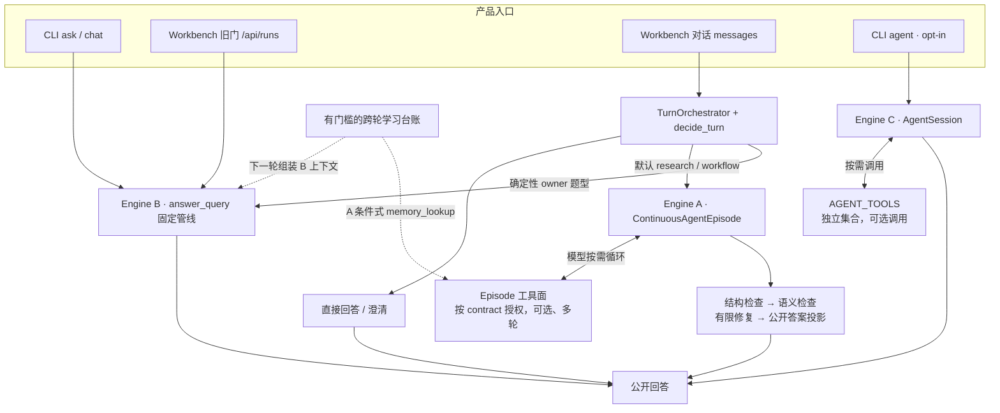

# Code Map Agent 产品入口与运行路径叙事页设计

- 日期：2026-08-24
- 状态：Approved（用户纠偏后修订）
- 原始基线：`gitea/main@904aba62`
- 目标分支：`codex/code-map-request-loop`

## 1. 目标

让编码 agent 从一个稳定的 Code Map 叙事入口找到金融 Agent 的产品入口和真实运行路径，同时严格分开三个问题：

1. **请求怎样运行**：由运行路径图回答；
2. **每种责任落在哪里**：由职责映射表回答；
3. **Code Map 怎样帮助找代码**：由 Door / Structure / Narrative 三种查询视图回答。

本变更只修正导航和教学表达，不修改生产运行逻辑，也不宣称覆盖全仓所有代码。

## 2. 被纠正的问题

旧设计把接收、调度、工具、验收、学习命名为 L0–L4，并把它们与 Door、Structure、Narrative 强制逐列对齐。这个模型会制造三种错误：

- 本仓已有 Harness L1–L6、Theme Radar 证据 L1–L4 等坐标系，复用 L 字母会串义；
- CLI `ask`、Workbench 对话、CLI `agent` 是平行入口，不会先共同进入 `TurnOrchestrator`；
- 工具、语义验收和学习回写并非每轮必经，视觉对齐会把“可选或跨轮”画成“顺序必经”。

因此旧 `agent-request-loop` steering 页及其五个内部符号锚点不再保留。

## 3. 运行时事实

### 3.1 产品入口与三条路径

| 产品入口 | 主要路径 | 关键边界 |
|---|---|---|
| CLI `ask` / `chat` | Engine B：`answer_query` 固定管线 | 不经过 `TurnOrchestrator` |
| Workbench 旧门 `/api/runs` | Engine B：`_run_ask` → `answer_query` | 与主对话入口并列 |
| Workbench 对话 messages | `TurnOrchestrator.run_turn` 外环 | 可直接回答、走 Engine A，或回落 Engine B |
| CLI `agent` | Engine C：`AgentSession` | 独立 loop 和独立工具集合 |

Workbench 外环内部再分三种结果：

- chat / meta / clarify，以及无需检索的 knowledge，可直接形成回答；
- research / workflow 默认进入 Engine A `ContinuousAgentEpisode`；
- 确定性 owner 题型由 continuous adapter decline，再交给 Engine B。

### 3.2 工具、验收与学习不是统一阶段

- Engine A 的循环由 `ContinuousAgentEpisode` 拥有；`episode_tools` 负责按 contract 装配工具，`ResearchToolRegistry` 是被引擎使用的积木。
- Engine A 的研究结果依次经过结构检查、语义检查、有限修复和公开答案投影；其他路径不应被画成必经同一 verifier。
- `experience_cards`、`corrections`、`checkpoints` 是带门槛的跨轮状态。Engine B 会在后续请求组装上下文时读取；Engine A 只在身份和 capability 同时满足时通过 `memory_lookup` 读取相应用户判断与纠偏。

## 4. 方案比较

### 方案 A：实际流图 + 职责表 + 独立 Code Map 视图（采用）

运行箭头只表达真实调用和分叉；普通表允许某项责任对某条路径“不适用”；Code Map 三视图另行解释。

优点：不会伪造一一对齐，既能教学又能追到源码；Mermaid 只承担它擅长的节点和边。

### 方案 B：单张 C4 / 四层静态图

按产品门、引擎、组装、积木分类。

优点：适合评接口和模块边界。缺点：不能清楚表达一次请求的时间顺序与条件分叉。

### 方案 C：交互式多视图图

在运行路径、静态分层和 Code Map 查询层之间切换。

优点：教学体验强。缺点：增加独立可视化产物和维护面，不适合作为仓库内唯一真源。

## 5. 采用设计

### 5.1 Code Map steering

用人类入口词和真实产品门替换内部实现符号序列：

```json
{
  "id": "agent-runtime-paths",
  "title": "Agent 产品入口与运行路径",
  "queries": [
    "产品入口",
    "CLI ask",
    "Workbench UI",
    "CLI agent",
    "TurnOrchestrator"
  ]
}
```

这些查询应命中 AGENTS / CLAUDE 中的正门约束，并把读者引向 canonical 的 `docs/agent-product-door.md`。它们不承担结构图职责；`ResearchToolRegistry`、`ContinuousAgentEpisode`、`episode_semantic_verifier` 等实现符号继续由 Structure 实时查询。

full build 还必须把 `wiki/doors/` 对账成当前有效 steering IDs 的文件集合。该目录只由 `_write_steering_pages()` 生成；删除配置中的页面时，旧 Markdown 必须同时回收，不能继续被 index 或全文 Narrative 检索命中。

### 5.2 请求运行图



这张图只回答“请求怎样运行”。它不是全仓架构图，也不把 Code Map 当成运行时组件。

### 5.3 职责映射

| 责任 | 适用范围 | 代码职责 | 为什么拆开 |
|---|---|---|---|
| 请求合法化 | 各产品入口分别负责 | API / CLI 把外部输入收成合法状态 | 非法状态不应进入深层执行 |
| 调度 | 只属于 Workbench 对话外环 | 分 lane、冻结任务框架、预算和引擎选择 | 决定做什么与真正执行分离 |
| 工具执行 | A、B、C 各有自己的机制 | 授权、校参、执行、去重和观测 | 最小授权，且不假装共享同一个 loop |
| 出口验收 | 主要属于 Engine A | 结构检查、语义检查、修复和公开投影 | 执行者不能成为唯一裁判 |
| 跨轮学习 | 有门槛且常在本轮之外 | 写台账，下一轮按路径分别召回 | 防止未验证结果污染后续判断 |

### 5.4 Code Map 三视图

| 视图 | 回答的问题 | 事实来源 |
|---|---|---|
| Door | 人或编码 agent 应从哪里进、哪些路径已退役？ | AGENTS、CLAUDE、spec 标题和能力图谱 |
| Structure | 当前代码里有哪些符号、调用和依赖？ | `graph.db` 的实时结构查询 |
| Narrative | 哪些相关 Door 结果值得聚在一个阅读入口？ | tracked steering 生成的 wiki 投影 |

三者是正交查询，不与运行图中的节点逐格对齐；发生冲突仍由 Door 胜出。

## 6. 改动范围

Tracked 文件：

- `.code-review-graph/wiki-steering.json`
- `scripts/code_map.py`
- `tests/test_code_map.py`
- 本设计文档
- 对应实施计划

生成但不提交：

- `.code-review-graph/graph.db`
- `.code-review-graph/status.json`
- `.code-review-graph/wiki/`

生成器改动只允许：

- `_write_steering_pages()` 删除不再属于当前有效 steering IDs 的旧生成页；
- 不改变 JSON schema、查询排序、Door 扫描或冲突优先级。

明确不修改：

- `intelligence/` 生产代码
- 另一工作树正在修改的 `docs/agent-product-door.md`、`AGENTS.md`、`CLAUDE.md`

## 7. 验收

### 7.1 Tracked 配置契约

1. 不再存在 `agent-request-loop` steering 页。
2. 恰好存在一个 `agent-runtime-paths`。
3. 标题和五个人类查询词与设计一致，无 L0–L4 或五个内部阶段锚点。
4. steering 文件继续被 Git 跟踪。

### 7.2 Build / query 公共 seam

1. full build 生成 `wiki/doors/agent-runtime-paths.md` 并登记到 index。
2. 五个查询词和页面标题都能命中该 narrative 页。
3. 生成页的每个查询都有真实 Door 命中，不生成全空目录。
4. `ResearchToolRegistry` 不因本 steering 页被误标为 Narrative；它只在可用时由 Structure 回答。
5. 预先存在的旧 `agent-request-loop.md` 会被 full build 删除，index 也不再引用它。

### 7.3 本地收据

1. `python3 scripts/code_map.py build --full --postprocess full` 成功。
2. `status=ready`、`head_matches_build=true`、`commits_behind=0`。
3. tracked worktree 无意外改动，生成物保持 ignored。

## 8. 失败处理与回滚

- 某个人类查询没有 Door 命中：先修正查询词或等待 canonical Door 文档落地，不用内部符号伪造命中。
- Structure 为空或 stale：拒绝据此下架构结论，执行 full build 后重查。
- Narrative 与 Door 冲突：沿用 `doors_win`，不调整优先级。
- 回滚只需恢复 steering 条目、生成集合对账逻辑和测试；重新 full build 即可重生 ignored 产物。

## 9. 非目标

- 不建立“所有代码都属于五层”的目录规范。
- 不复用 L0–L4 描述请求生命周期。
- 不把 Door、Structure、Narrative 画成 5×3 矩阵。
- 不宣称工具、verifier 或学习写回每轮必经。
- 不手写生成 wiki 页，也不修改或合并 `main`。
