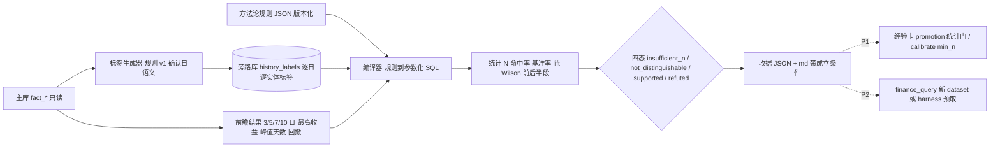

# 设计：结构化历史层 + 方法论回测（把「图像」编译成可查询的结构语言，用历史成功率给纠偏设统计门）

- 日期：2026-09-04
- 状态：**P0 已合入**（PR #573，2026-09-04 19:50）；**P1 前两刀已合入**（PR #576 统计门 + `min_n` 2→10；PR #581 `propose` 登记入口 + 日期配对基准率）。剩余 P1 / P2 见 §6；学习闭环的整体路线见 §10。P0 工单：`docs/superpowers/specs/2026-09-04-methodology-backtest-p0-workorder.md`；实施读数以三份交接为准：`docs/handoffs/inflight/feat-methodology-backtest-{p0,p1-gate,p1-propose}.md`。
- 来源：用户 2026-09-04 原话——「我们这个是需要频繁做决策的，但不是每一次决策都可以拿来升级成纠偏和经验的，要基于历史去推论，不能因为一次错误就否定；历史的行情、历史的题材都要代码可查，要把图像转化成结构语言，可以用现在的视角和方法论去看历史上这样的方法论成功率有多少；什么算法去编译可能是一个壁垒。」
- 相邻 spec（已拍决策，本单不重开）：
  - `docs/superpowers/specs/2026-08-20-asof-prefetch-dual-red-design.md` §1：**不给 agent 开 Shell / 任意 SQL**；`finance_query` 是参数化查询构建器；对齐的是「桌上的事实」不是「通道」。本单的「结构语言」因此必须是**声明式规则 → 参数化 SQL**，不是自由 SQL。
  - `skills/strategy-evolve/SKILL.md`：`suggest` 只建议、不自动改 `params.json`。本单同理：回测只出读数与四态结论，**不自动改任何规则、卡、画像**。
  - CLAUDE.md「市场假设验证 / 跑马策略执行规则」：后验不能只看固定第 10 日终值，必须比较 3/5/7/10 日窗口、区间最高收益、峰值天数、峰值后回撤。本单的 outcome 口径直接照抄。
- 引擎无关：P0 是分析师 / CLI 侧能力，不进 Workbench 合同；P2 才谈 agent 暴露面。
- BP 位置：`docs/bp/2026-09-finance-agent-bp.md` §4.4「抬上限的机制」。P0 / P1 合入后 BP 已改写为「已落地 + 首批读数」；BP 里只能引用交接文档里核过的数字，不得写本设计稿的规划项为「已完成」。

## 0. 一句话

把历史行情与题材从「人眼看图」变成**逐日、逐实体、版本化、无前视的离散标签**；把方法论从「一段话」变成**声明式规则**，由编译器转成参数化 DuckDB 查询，在历史上跑出命中率、基准率、置信区间、样本量与前后半段稳定性；纠偏升级为经验必须过这道统计门，**一次错误只能产生一个样本，不能产生一个结论**。

## 1. 判别变量（验收只锁这些）

1. 任一标签在任一 (实体, 交易日) 上的值，只依赖该日及之前的事实（确认日语义）；把 outcome 整体前移一天的「作弊夹具」必须被前视检测抓出。
2. 任一规则的历史读数必须同时给出：N、命中率、同期基准率、提升幅度、Wilson 95% 区间、前半段 / 后半段各自命中率、四态结论之一。缺任一项不得输出「支持 / 证伪」。
3. N < `min_n` 时结论只能是 `insufficient_n`，无论命中率多高多低。
4. 所有产物可从主库 + 规则文件**确定性重建**（同输入同输出，`rule_version` 与 `label_version` 进产物）。
5. 回测不写主库、不写用户台账、不改 `params.json` / 经验卡 / 画像。

## 2. 现状盘点：什么已经有，缺什么

### 2.1 已有实物（复用勿重造）

| 层 | 实物 | 能直接用的 |
|---|---|---|
| 事实 | `db/market_feature_store.duckdb`：52 表，`fact_market_daily` 413 交易日（2024-12-20 → 2026-09-02），`fact_sector_daily`（VIEW，105,880 行，含 `pct_chg/amount/diff_ratio/strength/multi_period_resonance`），`fact_stock_daily` 2,098,594 行，`fact_theme_limit_heat_daily` 46,877 行（`rank/limit_up_count/market_share`），`fact_mainline_theme_daily`、`fact_historical_mapping`（供应商给的相似日 `similarity/external_cycle/cycle_day`） | 全部标签的输入 |
| 定义 | 严格双红 `pct_chg>0 且 diff_ratio>10 且 amount>500`（`skills/strategy1-matrix`）；MA5 峰谷 + 放量 >10% 的确认日算法（`scripts/detect_turning_points.py::detect`） | 标签规则 v1 直接引用，不重新定义 |
| 回测 | `scripts/backtest_sector.py::SectorBacktestEngine`（只读 canonical 表、fail closed）；`evolution/validate.py::forward_returns / aggregate`（多窗口前瞻收益） | outcome 计算移植其交易日历与多窗口逻辑 |
| 校准 | `intelligence/services/checkpoints.py::calibrate / CategoryStat / Calibration`，`DEFAULT_CALIBRATION_MIN_N = 2` | 四态结论的接入点；**min_n=2 是本单要治的病灶** |
| 经验 | `intelligence/services/experience_cards.py`：`promotion` 状态（`promoted_to_code` / `invalidated` 跳过注入） | P1 统计门挂在 promotion 之前 |
| 对齐 | `skills/theme-fermentation-tracer/scripts/trace.py`：消息面（KB `evidence_index / theme_signals`）× 盘面按日对齐；`selftest.py` 用 `schema.sql` 造最小样本库零凭证自测 | P1 题材消息面标签；**P0 自测直接照它的形状写** |
| 配置 | `config_strategy_rule(rule_name, rule_type, params_json, enabled)`、`config_theme_sector_link` | 规则登记表现成；题材→板块映射现成 |
| 窗口特征 | `feature_sector_window / feature_stock_window / feature_market_window`（无活跃消费者） | 不复用其表结构（语义是区间聚合不是逐日标签），但可作 outcome 交叉核对 |

### 2.2 缺口（本单要补的）

1. **没有逐日离散标签层**：双红是查询时现算的谓词，不是可枚举、可版本化、可回溯的历史事实；「连续双红第几天」「边际量拐点」「热度跃迁」每次各自手写。
2. **方法论没有机器可读形态**：CLAUDE.md、SKILL.md、经验卡里的规则是自然语言，回测要人翻成 SQL，翻法不一致就不可比。
3. **没有基准率与区间**：`calibrate` 只算命中率点估计，`min_n=2`，两次就能给出「可靠性」标签——这就是「一次错误否定一套方法」的机制来源。
4. **纠偏 → 经验的升级没有统计门**：`promotion` 由人拍，没有「历史上这条规则支持还是证伪」的读数。

## 3. 三层设计



### 3.1 结构化历史层（「图像 → 结构语言」）

用户说的「图像」是人眼从 K 线、板块热度、涨停梯队里读出来的形态。本层把它变成表里的一行：

```
(entity_type, entity_id, trade_date, label, value_num, value_text, label_version, computed_at)
```

标签目录 v1（P0 只做前三类；每条都引用已有定义，不新造口径）：

| 实体 | 标签 | 定义 | 输入表 |
|---|---|---|---|
| sector | `dual_red_strict` | `pct_chg>0 且 diff_ratio>10 且 amount>500` | `fact_sector_daily` |
| sector | `dual_red_streak` | 截至当日的连续双红天数（当日不双红则 0） | 同上 |
| sector | `diff_ratio_turn_up` | `diff_ratio` 由 ≤0 转 >0 的当日 | 同上 |
| sector | `multi_period_resonance` | 直接投影现有布尔列 | 同上 |
| sector | `amount_rank_top10` | 当日成交额在 published 名单内排名 ≤10 | 同上 |
| theme | `limit_heat_rank` | `fact_theme_limit_heat_daily.rank`（按 `dimension/scope` 固定一档，P0 写死一档并记入 `label_version`） | `fact_theme_limit_heat_daily` |
| theme | `limit_heat_rank_jump` | 排名较前一交易日提升 ≥ 5 | 同上 |
| theme | `mainline_flag` | 当日出现在 `fact_mainline_theme_daily` | `fact_mainline_theme_daily` |
| market | `market_stage` | 直接投影 `fact_market_daily.market_stage` | `fact_market_daily` |
| market | `volume_surge` | `amount_vs_yesterday_pct > 10`（与 `detect_turning_points` 同口径） | 同上 |
| market | `ma5_peak_confirmed` / `ma5_valley_confirmed` | 复用 `detect_turning_points.detect` 的确认日算法，标在**确认日** | 同上 |
| stock（P1） | `limit_up` / `first_board` / `new_high_1y` | `fact_limit_advance_daily` / `fact_stock_high_daily` | — |
| theme（P1） | `lifecycle_stage`（启动 / 发酵 / 高潮 / 分歧 / 退潮） | 需先设计规则并用 `theme-fermentation-tracer` 的历史链路做人工标注对照 | — |
| theme（P1） | `news_event`（消息面事件） | KB `evidence_index / theme_signals.recognition_timeline` 按日对齐 | 知识库仓 |

**为什么先做规则标签、不做图像识别 / 学习表征**（三条路对比，结论写死，执行方不要重开）：

| 路线 | 是什么 | 优点 | 代价 | 本单 |
|---|---|---|---|---|
| **A. 规则标签** | 用已有金融口径（双红、拐点、共振、排名跃迁）写确定性谓词 | 可审计、可版本化、与 fail-closed 证据链同一语言、零训练数据 | 表达力受限于已知口径；新形态要人写规则 | **P0** |
| B. 符号化时间序列 | SAX / PAA / shapelet / motif：把序列离散成符号串再找重复形态 | 能发现人没命名的形态；「相似历史日」有现成理论 | 符号没有金融语义，解释要二次翻译；`fact_historical_mapping` 已有供应商相似度可先用 | P2 探索，只用于「找相似日」，不进结论 |
| C. 学习表征 | CNN 看 K 线图 / 时序基础模型 embedding | 表达力最强 | 不可审计、与「无证据不准出结论」定位冲突、413 个交易日训练必过拟合 | **不做** |

原理一句话：**回测的可信度上限 = 标签的可解释度**。标签本身说不清，成功率再高也只是曲线拟合。这也是为什么 A 路线才配得上「壁垒」——壁垒不在算法多聪明，在口径多干净、历史多长、版本多可追。

### 3.2 方法论 DSL 与编译器（「一段话 → 可执行查询」）

规则 v0 形态（JSON，进 git，`methodology/rules/<rule_id>.v<version>.json`）：

```json
{
  "rule_id": "dual_red_streak3_continuation",
  "version": 1,
  "title": "连续三日严格双红的板块，后 5 日仍上涨",
  "scope": {"entity_type": "sector", "universe": "published_snapshot"},
  "condition": {"all": [
    {"label": "dual_red_strict", "op": "==", "value": true, "lag": 0},
    {"label": "dual_red_streak", "op": ">=", "value": 3, "lag": 0},
    {"entity": "market", "label": "market_stage", "op": "in", "value": ["扩张", "高潮"], "lag": 0}
  ]},
  "outcome": {
    "target": "pct_chg",
    "horizons": [3, 5, 7, 10],
    "metrics": ["fwd_return", "max_return", "days_to_peak", "drawdown_after_peak"],
    "success": {"metric": "fwd_return", "horizon": 5, "op": ">", "value": 0}
  },
  "baseline": {"kind": "same_universe_all_days"},
  "min_n": 20
}
```

编译器职责：`condition` 的每个谓词 → 对标签表的一次 join（按 `lag` 位移交易日）；`entity: market` 的谓词 → 按日 join 大盘标签；交集 = 事件集；事件集 join 前瞻结果表 → 逐事件 metrics；`success` → 命中布尔；`baseline` → 同 universe 同日期范围内全部 (实体, 日) 的同一 success 比例。输出 SQL 全部参数化，谓词值走绑定参数，`label` / `op` 走白名单，**不接受任何自由 SQL 片段**。

**为什么是声明式 JSON → SQL**（四条路对比）：

| 路线 | 代价 | 本单 |
|---|---|---|
| Python 函数一条方法论一个 | 灵活；但不可比、不可审计、agent 不能安全调用 | 不做 |
| 存自由 SQL 字符串 | 违反 2026-08-20 已拍决策；schema 试探、注入、判官无法对账 | **禁止** |
| **声明式 JSON，编译成参数化 SQL** | 可版本化、可 diff、可被 `finance_query` 复用同一套白名单；表达力够 v0 | **P0** |
| LLM 每次即时写 SQL | 不确定性进了度量本身，同一规则两次跑出两个数 | 不做 |

可迁移知识点：这和 Qlib / WorldQuant 把因子写成表达式语言、和数据库把 SQL 编译成执行计划是同一个形状——**声明什么，不声明怎么做**；编译器是唯一知道表结构的地方。面试里叫 DSL + query planner。

### 3.3 统计口径与四态结论（「一次错误只能是一个样本」）

给定事件集 N、命中 k、基准率 p0：

- 命中率 `p = k / N`
- **Wilson 95% 区间** `[lo, hi]`（不用正态近似：N 小、p 接近 0 或 1 时正态区间会越界，Wilson 不会——这就是 N=20 级别样本必须用它的原因）
- 提升 `lift = p − p0`
- 前后半段：按日期把事件集切成两半，各算 `p_first / p_second`
- 结论：
  - `insufficient_n`：N < `min_n`
  - `supported`：`lo > p0` 且 `p_first > p0` 且 `p_second > p0`
  - `refuted`：`hi < p0` 且 `p_first < p0` 且 `p_second < p0`
  - `not_distinguishable`：其余

**为什么是基准率而不是 50%**：板块日收益为正的基准率在牛市里可能是 65%，一条「双红后上涨」规则命中 66% 等于什么都没说。没有 p0 的命中率是伪指标。

**多重检验**：`--scan` 一次跑多条规则时，按 Benjamini–Hochberg 校正后再定 `supported`，并给每条打 `exploratory=true`；单条手工跑不校正但收据里注明「单次检验」。原因：跑 20 条随机规则总有 1 条在 95% 下「显著」。

**与用户诉求的对应**：一次纠偏 = 事件集里多一行，不会改变任何四态结论；只有当累计到 `min_n` 且区间整体离开基准率，规则才升级或降级。这就是「不能因为一次错误就否定」的机器实现。

**为什么不用贝叶斯**：Beta 先验 + 后验区间在 N 小时更平滑，理论上更好；但先验要拍，拍法本身要向用户解释，P0 先用 Wilson（无参数）把口径立住，P2 可加 Beta(1,1) 后验作对照列。

### 3.4 与学习闭环的接法（P1；三条都已合入，读数见交接）

| 现状（09-04 早） | 改法 | 层 | 结果（09-04 晚） |
|---|---|---|---|
| `DEFAULT_CALIBRATION_MIN_N = 2` | 先**量**：用 `min_n ∈ {2, 10, 20}` 各跑一遍现有 83 个可证伪点的 `calibrate`，看有多少类别从「有标签」变成「样本不足」；量完再改默认值，改值需开分支 + 用户确认 | services | 消融读数 {2, 1, 1}：`min_n=2` 时有标签的第二个类别是 n=2 的「duckdb_flow/市场路径」，即病灶实例。默认值改为 **10**（PR #576），四个消费者同闸 |
| 经验卡 `promotion` 由人拍 | 卡若能映射到一条规则（`rule_id` 字段），`promoted` 前置条件 = 该规则最近一次收据 `supported`；`invalidated` 前置 = `refuted`；映射不到的卡走原流程 | services | 已落 `gate_promotion`（PR #576）：无收据 = 无证据一律拒；`promoted_to_code` 同门；真库实测 `not_distinguishable` 的种子规则晋升被拒、退出码 2 |
| 纠偏 `corrections.jsonl` | 不改写入；只加一步「纠偏 → 候选规则」的人工登记入口（占位工单） | 用户态 | 已落 `methodology_backtest.py propose`（PR #581）：人写谓词短句，程序过白名单，纠偏 id / ts / 原文钉进规则 `provenance`；不做 LLM 自动翻译 |

## 4. 无前视与数据陷阱（执行方必读）

1. **确认日语义**：MA5 峰谷只在确认日打标（`detect_turning_points` 已如此）；`dual_red_streak` 只用到当日；任何用到 `t+1` 数据的标签都是 bug。前视检测夹具：把 outcome 表整体前移一天，`supported` 结论必须消失或翻转，否则编译器有前视泄漏。
2. **板块名单分代**：`fact_sector_daily` 是 VIEW，只暴露 `published` 快照；universe 取「当日 published 名单」，不是「今天的名单」——否则幸存者偏差（今天还在名单里的板块历史上表现自然更好）。
3. **`.TI` 代码 vs 中文名**：2–4 月按代码存、5 月起按中文名存；标签表 `entity_id` 统一用 `sector_ts_code`，展示时 join `dim_sector`。
4. **`diff_ratio` 全零日**：供应商偶发全板块 `diff_ratio=0`；标签生成器检测「当日 >90% 板块 diff_ratio=0」即打 `data_gap`，该日不参与双红类标签统计并进收据的成立条件。
5. **`fact_theme_limit_heat_daily` 多维度多口径**：`dimension/scope/data_stage/is_realtime` 组合多，P0 写死一档（收盘定稿、非实时）并把选择记进 `label_version`。
6. **413 个交易日是硬上限**：很多规则会落在 `insufficient_n`，这是正确输出不是失败；D8 剧本库回补 2019–2024 历史是另一张单（项目 MOC 任务看板），本单不做。
7. **同一时间只有一个写入连接**：标签库落旁路文件，主库只读打开（`read_only=True`），与夜跑写入不抢锁。

## 5. 存储决策：旁路库

| 选项 | 代价 | 本单 |
|---|---|---|
| 主 schema 加 `fact_history_label_daily` | 改 `schema.sql` 与写入契约，标签规则还没稳就冻进正典 | P2（规则稳定后再迁） |
| **旁路 DuckDB `db/history_labels.duckdb`，从主库只读重建** | 零改主库；`ATTACH` 主库只读做 join；`*.duckdb` 已 gitignore；先例 `fph2026` 旁路库 | **P0** |
| 只用 VIEW 不落盘 | 零存储；但每次回测重算 41 万行标签，`--scan` 不可用 | 不做 |

「单一真本源且生成」：旁路库任何时候可删，`build-labels` 从主库 + 规则文件重建；产物带 `label_version` 与源库 `max(trade_date)`。

## 6. 分期

### P0（✅ 已合入 PR #573，2026-09-04；交接 `feat-methodology-backtest-p0.md`）

1. 标签生成器 v1（sector / theme / market 三类，表 3.1 前 12 行）+ `data_gap` 检测 + 旁路库落盘。→ 真库 671,440 行、12 个标签、`max(trade_date)`=2026-09-02 与主库一致；删库重建行数一致；`data_gap` 命中 2026-03-30（零占比 98.65%）。
2. 前瞻结果表（3/5/7/10 日 `fwd_return / max_return / days_to_peak / drawdown_after_peak`，交易日历取 `fact_market_daily`）。→ 610,704 行；窗口不含 D0。
3. 规则 JSON schema v0 + 编译器 + 白名单校验；三条种子规则进 `methodology/rules/`。→ 三组拒绝夹具各带字段路径、不触库。
4. 统计模块（Wilson / 基准率 / lift / 前后半段 / BH 校正）+ 四态结论。→ Wilson 与公开表值一致到三位小数；另加精确二项 p。
5. CLI `scripts/methodology_backtest.py {build-labels,outcomes,run,scan,report}`；收据 JSON + md，带成立条件。
6. 零凭证自测：阳性 → `supported`（N=288, lo=0.987）；阴性 → `not_distinguishable`（12 seed 0 假阳性）；前视（outcome 前移一交易日）→ `refuted`，重建后恢复。变异：`WINDOW_START_OFFSET` 1→0 时 4 例测试变红。
7. 真库三条种子规则**全部 `not_distinguishable`**：`dual_red_streak3_continuation` N=88 p=68.2% p0=58.0% Wilson[57.9%, 77.0%] 前后半段 81.8% / 54.5%；`diff_ratio_turn_up_5d` N=27,186 lift −1.0%；`limit_heat_rank_jump_3d` N=13,006 lift +0.6%。scan BH 后仍全 `exploratory=true`。**这是正确输出**：三条从 CLAUDE.md / SKILL.md 抄下来的「常识」规则，在 413 个交易日上没有一条能与基准率区分开——正是本设计要暴露的东西。
8. 实施偏离设计稿之处（执行方决策，已在交接写明）：`mainline_flag` 取 `fact_mainline_sector_daily` 而非 `fact_mainline_theme_daily`（后者 `theme_code` 与题材实体 ID 不同空间无法 join）；种子规则 1 的 `market_stage` 用真库实际值「主升阶段/主升/反弹阶段/反弹」而非设计稿示例「扩张/高潮」（数据里不存在）；`data_gap` 单独落 `history_data_gaps` 表不占 12 个标签名额。

### P1（前两刀 ✅ 已合入；余下 ⏳）

- ✅ `calibrate` 的 `min_n` 消融读数 → 默认值 2→10（PR #576）。
- ✅ 经验卡 `rule_id` 映射与 promotion 统计门（PR #576）。
- ✅ 纠偏 → 候选规则的人工登记入口 `propose`（PR #581）。
- ✅ 日期精确配对基准率 `same_universe_event_days` 作对照列（PR #581）：种子规则 1 全日期口径 lift +10.1%，事件日口径 lift **−1.0%**——那 10 个点全是择时效应（触发日本身是强势日，随便一个板块 5 日上涨概率 69%），没有选择效应。对照列的存在意义就是把「提升来自择时还是选择」拆开。
- ⏳ 个股标签（`limit_up / first_board / new_high_1y`；需给个股建价格序列；树 `fwp-wt-methodology-backtest-p1c` 已开，尚无提交）。
- ⏳ 题材消息面标签（复用 `theme-fermentation-tracer` 对齐逻辑）；`lifecycle_stage` 规则设计 + 人工对照集。
- ⏳ `report --refuted` 按大盘阶段汇总证伪库；`invalidated` 的写入口（目前 jsonl 手改，门的 refuted 分支只在纯函数层生效）。
- ⏳ 收据保鲜：门只看最近一次收据，不看 `source_max_trade_date` 是否过期；「超过 N 个交易日未刷新视为无收据」。
- ⏳ **本节下方三条产品约束的占位字段从未实现**：P0 工单 §2.3 是 2026-09-04 21:07 补入的，P0 已于 19:50 合入（`rules.py` `_TOP_KEYS` 无 `owner / source_perspective`，`scope` 是实体范围对象 `{entity_type, universe}`）。占位改由工单 #25 承接，字段名改为 `sharing{level, owner, source_perspective}`；收据文件名不再要求含 verdict（`latest_receipt` 按 `generated_at` 取，证伪库收集走 `report --refuted` 扫 JSON 的 `verdict`）。

以下三条是 2026-09-04 BP v0.4 壁垒重构后补入的产品约束（BP §4.3–4.4），**P0 不实施，但 P0 的规则文件与收据格式要为它们留字段**：

- **规则的归属层：共享层 / 私有层。** 规则 JSON 增加 `scope ∈ {shared, private}` 与 `owner`（私有规则 = 用户 id；共享规则 = `shared`，来源写 `source_perspective`，即经视角蒸馏的 KOL 方法论或系统内置）。私有规则只对本人回测与校准，共享规则的升格（`private → shared`）必须过统计门 `supported` 且由人拍板；收据带 `scope`。P0 三条种子规则全部标 `shared`，`owner=system`，字段先占位。
- **证伪库是资产，不是副产物。** 四态里的 `refuted` 收据不只是打回：单独落 `methodology/refuted/` 并进台账地图登记，字段至少含 `rule_id / rule_version / market_stage / N / ci / refuted_at`。P1 提供 `report --refuted` 按大盘阶段汇总（「这个阶段这招不灵」）。P0 只要求 refuted 收据与 supported 收据同格式、可被后续单独收集。
- **共享层的合规硬门。** 任何 `scope=shared` 规则的成功率对外呈现必须同时满足：仅登录用户可见；必带 `N` 与 Wilson 区间；实体粒度只到板块 / 题材层（`entity_type ∈ {sector, theme, market}`），不到个股名单；不进入任何营销内容（`docs/marketing/` 契约 `prohibited_rewrites` 追加「策略成功率」条目）；KOL 来源以「策略族 / 视角」匿名化呈现，署名与授权另议。这四条写成渲染层的硬门（缺任一字段即不渲染），不写成约定。依据：BP §9.2「模拟业绩营销」一行与 2026-09-30 起施行的《金融产品网络营销管理办法》。

### P2（占位）

- 标签层迁入主 schema；`finance_query` 新增 `history_labels` / `methodology_verdicts` 数据集（按 2026-08-20 决策走 dataset 扩展或 harness 预取，**不开 run_sql**）。
- 「相似历史日」：`fact_historical_mapping` 供应商相似度 + SAX 符号串对照。
- Beta 后验对照列；用户自定义规则 UI。

## 7. 非目标（写死认领，工单里逐条 ❌）

- ❌ 图像识别 / CNN / 时序基础模型（3.1 路线 C，不做）。
- ❌ 缠论 / MACD 背离标签（`~/.claude/skills/fph2026` 旁路库已有，不重复）。
- ❌ 给 agent 开 Shell / `run_sql`（2026-08-20 决策）。
- ❌ 改 `finance_query` / Episode 合同 / 判官（P2）。
- ❌ 改 `experience_cards` / `checkpoints` 运行时（P1）。
- ❌ 自动改 `params.json` / 经验卡 / 画像（strategy-evolve 原则）。
- ❌ 个股买卖信号 / 实时盘中（产品边界，BP §3.4）。
- ❌ 回补 2019–2024 历史（D8 另单）。
- ❌ 改 `market_feature_store/schema.sql`（P2）。
- ❌ 写 `docs/prediction-ledger.md`（收据不是预注册假设；若要立案另按 R-号流程）。

## 8. 成立条件

- 树：`/Users/a77/fwp-wt-finance-agent-bp` @ `docs/finance-agent-bp`，起草基线 `gitea/main@2d8eaea5`；09-04 晚已合入 `gitea/main@5c7fe2eb`（含 P0 / P1 三个 PR）。
- 数字：主库只读查询于 2026-09-04；`DEFAULT_CALIBRATION_MIN_N` 起草时读自 `intelligence/services/checkpoints.py:56` 为 2，PR #576 后为 10。§3.4 / §6 里的实施读数抄自三份交接，本文未重跑。
- 本文是设计稿，零运行时改动。

## 9. 可迁移知识点（教学备注）

- **回测三件事缺一不可**：基准率（否则命中率是伪指标）、区间（否则 N=5 和 N=500 看起来一样）、前视检测（否则一切读数无效）。这三条在 A/B 实验、推荐系统离线评估里同样成立。
- **确认日语义**：信号只在「当时就能知道」的那天成立。任何回测框架的第一个 bug 都是这里。
- **声明式 DSL 编译成参数化查询**：把「用户能表达什么」和「系统怎么执行」分开，是让 LLM 安全触库的通用做法（与 `finance_query` 同一原理）。
- **统计门作为棘轮**：单样本只能加行不能改结论，这是把「不要过拟合」从提醒变成机制——与本仓「棘轮式门禁」「事实投递 > 提醒」同族。

## 10. 学习闭环路线图（2026-09-04 用户理念对照）

用户 2026-09-04 晚原话（六句）：「理性的决策要巩固，让 AI 辅助复现；非理性的决策要让 AI 帮我们规避。AI 先学会总结历史经验（目前是我们把经验喂给它），后续它要发现新的市场规律；要学会回顾历史行情，先理解为什么市场这么运行，再站在相似的节点去推导，拿后续的走势来验证——这是让它学习的过程。」

本节做三件事：把六句话逐条对到系统已有的实物上；指出四处需要先说清、否则会把闭环做歪的地方；给出分期。**本节不派单、不取号**，工单另立。

### 10.1 六句话各自落在哪一层

| 用户原话 | 系统里对应的实物 | 现状 | 缺口 |
|---|---|---|---|
| ① 理性的决策要巩固，AI 辅助复现 | 声明式规则（`methodology/rules/`）+ 收据 `supported` → 经验卡 `promoted_to_code`（PR #576 统计门）→ 退出注入、固化进管线 | 链路已通；三条种子规则尚无一条 `supported` | 「复现」= 把编译器跑在**今天**的标签上，列出今日触发的规则及其历史四态读数（P2，`finance_query` 的 `methodology_verdicts` 数据集）。合规上只到板块 / 题材层 |
| ② 非理性的决策要 AI 帮规避 | 判断登记为可证伪点（决策前）→ 回检 → 按类别校准（`calibrate`，`min_n=10`）→ 弱类别进 `red_team.weak_categories` 与 foresight 提示词 | 「哪类判断不靠谱」已能算，只有 1 个类别达 `min_n` | 缺**偏差目录**（见 10.2 第一条）；缺「本次判断偏离了你自己登记的哪条规则」的对照——需要判断登记时带 `rule_id`（P1 已给经验卡加了这个字段，可证伪点还没有） |
| ③ AI 先学会总结历史经验（我们喂） | 纠偏 `corrections.jsonl`（124 条）→ `propose` 人工登记为候选规则（PR #581）→ 回测出收据；经验卡；视角蒸馏 | 喂的通道已通，纯人工翻译 | 「总结」目前是人做的：把一句纠偏翻成谓词短句。AI 参与总结 = 10.2 第二条的「提议者」 |
| ④ 后续 AI 发现新的市场规律 | §3.1 路线 B（SAX / motif，P2 只用于找相似日）；`--scan` + BH 校正 | 未做 | 见 10.2 第二条：发现只能产出**候选规则**，进同一道门 |
| ⑤ 回顾历史行情，先理解为什么市场这么运行 | `theme-fermentation-tracer`（消息 → 首板 → 板块双红 → 补涨扩散的时间轴，消息面 × 盘面按日对齐）；`fidelity_replay` 的人审三维（事件时间线顺序 / 阶段特征与当时可得事实一致 / 因果陈述绑定证据）；KB `evidence_index / theme_signals.recognition_timeline` | 单题材链路可跑；人审金标准格式已有（2026-07 pilot） | 见 10.2 第三条：「为什么」只能是**假设**，落地形态是候选规则 + 时间轴证据，不是一段叙事 |
| ⑥ 站在相似的节点推导，拿后续走势验证 | **历史重放**：`intelligence/eval/fidelity_replay.py` + `bitemporal_history.py`——`input.snapshot.json` 只含 D0 及以前的行并绑定 D0 当时的 wiki commit，`outcome.snapshot.json` 由独立命令在答卷冻结后生成，`updated_at < as_of + 1 day` 才算 PIT；**双盲前瞻答卷台账**（2026-06-30 → 09-03，23 个交易日，真正的向前验证）；`fact_historical_mapping` 供应商相似日 | 重放骨架 2026-07 已建并跑过 10 日 pilot；判分靠人审金标准 | 见 10.2 第四条：两种泄漏，其中**模型记忆泄漏全仓目前无守门**；「相似」的定义只能用 as-of 特征；重放判分要从人审升到「结构化判断 → 对 outcome 标签自动判分」 |

结论先说：六句话没有一句与已拍决策冲突，且其中四句（①②③⑥）在仓内已有实物。要补的不是新方向，是四条**守门规则**——不写清楚，闭环会朝「事后归因 + 数据挖掘 + 模型背答案」三个方向同时跑歪。

### 10.2 四处要先说清的地方

**第一条：「理性 / 非理性」按过程定义，不按结果定义。**
一次判断亏了不等于非理性，赚了不等于理性——按结果贴标签就是结果偏差（outcome bias），也正是 §3.3「一次错误只能是一个样本」要治的病。本设计采用的定义：

- **理性判断** = 决策时刻有可查的方法论依据（能映射到一条 `rule_id`，该规则最近收据 ≠ `refuted`）+ 只用了当时可得的信息（确认日语义）+ **在结果出来之前**已登记（可证伪点）。三个条件都是过程条件，与后来涨跌无关。
- **非理性判断** = 偏离了自己登记的方法论（有 `rule_id` 可对照但当日规则未触发 / 触发的是相反方向）、或无任何规则可依、或命中**偏差目录**里的一条。偏差目录 v1 四条（工单 #24，名字以工单为准）：`late_streak` 追高 / 末段登记（关联板块在登记日 `dual_red_streak ≥ 4` 或热度前三连续 ≥ 3 日）、`post_miss_streak` 近因（同类判断连错 ≥ 2 次后 3 个交易日内再登记同类）、`rule_not_firing` 偏离自己的规则（带 `rule_id` 但规则在登记日对该实体未触发——用编译器以窗口 `[D0, D0]` 取事件集）、`revenge_reentry` 连错再登记（同一标的上一条判断刚落空，5 个交易日内再登记）。每条都要能从可证伪点 + 旁路库确定性算出来，算不出来的不进目录；原拟的「锚定」（判断引用了 D0 之前 ≥ n 日的旧值）因 claim 是自由文本 v1 算不出，**已替换为 `rule_not_firing`**。数据不齐时给 `unverifiable`，规则不适用时不产 flag——两者不混。
- 「AI 帮规避」的机器实现 = 登记判断时系统当场给出：这条判断对应哪条规则、该规则当前四态、命中偏差目录哪一条。**只提示，不拦截，不改判断**——与 `strategy-evolve` 的 `suggest` 同一原则。
- 合规边界：全文的「决策」在产品口径里一律是**研究判断**（主线在哪、题材在哪个阶段、板块强弱），不是买卖时点。私用无妨；一旦进产品文案，「AI 辅助复现理性决策」四个字就踩在 BP §3.4 的红线上，要写成「校准研究判断」。

**第二条：「发现新规律」是提议者，不是裁决者。**
413 个交易日上任何「发现」都逃不开数据挖掘偏差：假设空间越大，凭运气显著的越多。所以：

- 发现的**唯一合法输出**是一条规则 JSON（同 §3.2 schema，`scope=private`、`owner=<提议者>`、`provenance.kind=discovered`），进同一个编译器、同一道统计门。AI 不得直接产出「规律 X 成立」的结论。
- 提议者可以是 LLM。§3.2 否掉的是「LLM 每次即时写 SQL」——不确定性进了**度量**；LLM 写规则 JSON 再由确定性编译器执行，不确定性只在**假设生成**这一步，度量仍是确定的。这是两件事。
- 发现窗与验证窗分开：在窗 A 上提出的规则，收据里必须单列窗 B（A 之后）的四态，`supported` 只认窗 B。`--scan` 的 BH 校正照旧，`exploratory=true` 照旧。
- 预期大多数发现落 `insufficient_n`。这是正确输出；治它的是 D8 回补 2019–2024 历史（另单），不是放宽 `min_n`。

**第三条：「理解为什么」要防事后归因。**
任何历史走势事后都能编出一个通顺的故事——这是最难防的一种泄漏，因为它不违反任何数据边界。守门方式：

- 「为什么」的落地形态不是一段叙事，是 **as-of 信息集重建 + 时间轴 + 候选规则**：站在 D0，只用 D0 及以前的标签、`market_stage`、KB `evidence_index` 里 `source_time ≤ D0` 的消息，让 AI 产出「当时可见的因果链」（消息 → 首板 → 板块双红 → 扩散，`theme-fermentation-tracer` 的形状），链上每个节点绑证据。
- 因果链里可泛化的部分必须被写成规则 JSON 才算「理解了」；写不成规则的部分只是叙事，进人审金标准（`fidelity_replay` 三维：时间线顺序 / 阶段特征 / 因果绑定），不进结论。
- 反向检验：同一个 D0 让 AI 在**不知道后续走势**（重放模式）与**知道后续走势**（回顾模式）下各写一次因果链，两份差异大的部分就是事后归因的成分，这个差异本身值得量化并进收据。

**第四条：「站在节点推导 → 后续验证」有两种泄漏，第二种目前全仓没有守门。**

| 泄漏 | 是什么 | 仓内现状 | 守门 |
|---|---|---|---|
| **数据泄漏** | D0 之后的行 / 文档进了 D0 的输入 | 已有：`input.snapshot.json` 只含 `updated_at < as_of + 1 day` 的行，绑定 D0 当时的 wiki commit；标签确认日语义；前视对照夹具 | 沿用；新增的重放入口只能从 `fidelity_replay` 的冻结快照取输入，不得直接连主库（主库行会被 D0 之后的回填改写） |
| **模型记忆泄漏** | LLM 训练语料里可能就有 D0 之后的 A 股行情与新闻——它「站在 2025-03」推导时，可能是在背答案 | **无守门**。仓内现有的「泄漏」检查全是文本层的：`ceiling_leakage` 查的是封印基准指令有没有把题集答案（`post_cutoff_result` 指基准冻结日之后的结果语句）漏进运行时指令；`fidelity_replay` 查的是数据 as-of。同族原则只在服务侧出现过一次（`task_frame.py` 检索地板：带日历日期的题不许靠模型记忆答，必须取数），评测侧没有对应物：没有任何收据记录所用模型的训练截止日，也没有把重放节点按截止日分栏 | 三件：（a）收据必带模型标识与训练截止日，重放节点按「截止日之前 / 之后」分两栏报读数，之前那栏标 `memory_contaminated`；若之前栏命中率显著高于之后栏，判定为记忆而非能力；（b）重放提示词做**实体匿名化**（板块 / 题材名 → 代码，绝对日期 → 相对 T−n）作对照臂，匿名与不匿名的命中率差就是记忆成分的上界；（c）**双盲前瞻答卷台账是唯一无泄漏的地面真值**，重放买的是吞吐（一天跑几百个节点），台账买的是效力；重放按类别的命中率必须与台账同类别命中率对得上，对不上就是重放在漏 |

另外两条与⑥直接相关：

- 「相似的节点」的相似度只能用 as-of 特征算（D0 及以前的标签向量 / `market_stage` / 热度排名），不能用「后来都涨了」倒推相似。`fact_historical_mapping` 的供应商相似度先当黑盒对照，P2 用 SAX 符号串做可审计版本。
- 重放判分要从「人审金标准」升级为「结构化判断 → 自动判分」：AI 站在 D0 的输出必须是可证伪点格式（类别 + 方向 + 窗口 + 阈值），由 `outcomes` 表自动判对错，再进 `calibrate` 按类别出 AI 自己的校准读数。人审只留给自动判不了的语义维度。这样 ② 里「哪类判断不靠谱」就同时有了用户的读数和 AI 的读数，可以并排比。

### 10.3 顺序建议：发现是闭环的产出，不是闭环的一步

用户原话的顺序是 ③ 喂经验 → ④ 发现新规律 → ⑤ 理解为什么 → ⑥ 站节点验证。建议把 ④ 挪到最后——没有验证引擎之前的「发现」只能产出未验证的故事：

1. **喂经验**（已通）：纠偏 → `propose` → 规则 JSON → 收据。
2. **重放引擎**（⑥，P1.5）：站 D0 → 结构化判断 → `outcomes` 自动判分 → AI 按类别的校准读数；带模型截止日分栏与匿名化对照臂。先用**现有三条规则**当 AI 的「方法论」，量 AI 复现规则判断的一致率——这一步不发现任何新东西，只是把尺子立起来。
3. **理解为什么**（⑤，P2）：as-of 因果链 + 重放 / 回顾双模式差异量化；可泛化部分写成规则。
4. **AI 作提议者**（③ 的 AI 化 + ④，P2）：从重放与因果链里提候选规则，`provenance.kind=discovered`，发现窗 / 验证窗分开。
5. **过门**：候选进同一道统计门；`supported` 者按 §6 P1 约束升格（私有 → 共享须人拍板），`refuted` 者进证伪库——**证伪库在这条路上会比方法论库长得快，这是预期，不是失败**。
6. **复现与规避**（①②，P2）：今日触发规则表 + 判断登记时的规则 / 四态 / 偏差目录提示。

「AI 学习」在本设计里的含义是**系统知识层的增长**（规则库、证伪库、校准读数、纠偏），不是模型权重的变化。微调 / 蒸馏是另一个层面的决定，BP §4.3 只把纠偏数据标为「明天可作微调或检索语料」，本设计不展开。

### 10.4 与分期的对应

| 项 | 落在 | 备注 |
|---|---|---|
| 可证伪点登记带 `rule_id`；登记时回显规则四态 | P1 → **工单 #24** `2026-09-04-checkpoint-rule-id-bias-catalog-workorder.md` | 经验卡已有同字段（PR #576），可证伪点补齐；读者 = `calibrate.by_rule` |
| 偏差目录 v1（4 条，全部可从台账 + 旁路库算） | P1 → **工单 #24** | 只提示不拦截；`checkpoints.py` 保持只用标准库，目录另开 `checkpoint_bias.py` |
| 重放引擎：结构化判断 → 自动判分 → AI 校准读数；模型截止日分栏；匿名化对照臂 | **P1.5 → 工单 #25** `2026-09-04-historical-replay-engine-workorder.md` | 复用 `fidelity_replay` 快照、双盲 `hypotheses[]` 格式与 `auto_verdict`、`history_outcomes`、`calibrate`；**PIT 现实**：严格边界只 33 个快照日（07-10→09-02）/ `updated_at` 只过 17 日，其余 380 日只能 `trade_date_only`，两档分开报 |
| 发现窗 / 验证窗分开的收据字段；`provenance.kind=discovered`；`sharing` 占位 | P1.5 → **工单 #25** | schema 加字段，编译器不变。P0 §2.3 的占位字段（`scope∈{shared,private}` 等）从未实现——它们是 P0 合入后 77 分钟才补进工单的；且 `scope` 已被实体范围对象占用，改名 `sharing` |
| as-of 因果链 + 双模式差异量化 | P2 | 复用 `theme-fermentation-tracer` |
| LLM 提议者 | P2 | 输出只能是规则 JSON |
| 今日触发规则表（`methodology_verdicts` 数据集） | P2 | 已在 §6 P2 |
| SAX 相似日（可审计版） | P2 | 已在 §6 P2 |
| D8 回补 2019–2024 | 另单 | 治 `insufficient_n` 的唯一正道 |
