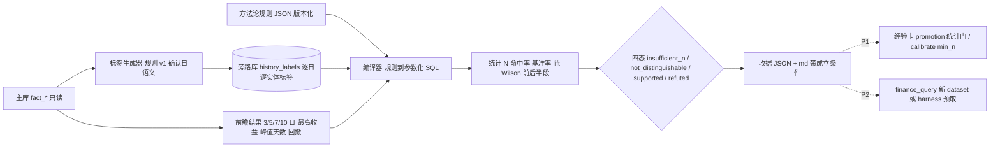

# 设计：结构化历史层 + 方法论回测（把「图像」编译成可查询的结构语言，用历史成功率给纠偏设统计门）

- 日期：2026-09-04
- 状态：Draft v1，**未实施**。P0 工单：`docs/superpowers/specs/2026-09-04-methodology-backtest-p0-workorder.md`（可独立分发）。
- 来源：用户 2026-09-04 原话——「我们这个是需要频繁做决策的，但不是每一次决策都可以拿来升级成纠偏和经验的，要基于历史去推论，不能因为一次错误就否定；历史的行情、历史的题材都要代码可查，要把图像转化成结构语言，可以用现在的视角和方法论去看历史上这样的方法论成功率有多少；什么算法去编译可能是一个壁垒。」
- 相邻 spec（已拍决策，本单不重开）：
  - `docs/superpowers/specs/2026-08-20-asof-prefetch-dual-red-design.md` §1：**不给 agent 开 Shell / 任意 SQL**；`finance_query` 是参数化查询构建器；对齐的是「桌上的事实」不是「通道」。本单的「结构语言」因此必须是**声明式规则 → 参数化 SQL**，不是自由 SQL。
  - `skills/strategy-evolve/SKILL.md`：`suggest` 只建议、不自动改 `params.json`。本单同理：回测只出读数与四态结论，**不自动改任何规则、卡、画像**。
  - CLAUDE.md「市场假设验证 / 跑马策略执行规则」：后验不能只看固定第 10 日终值，必须比较 3/5/7/10 日窗口、区间最高收益、峰值天数、峰值后回撤。本单的 outcome 口径直接照抄。
- 引擎无关：P0 是分析师 / CLI 侧能力，不进 Workbench 合同；P2 才谈 agent 暴露面。
- BP 位置：`docs/bp/2026-09-finance-agent-bp.md` §4.4「壁垒三」。BP 写的是「雏形 + 规划」，本单落地前不得在 BP 里升格为「已完成」。

## 0. 一句话

把历史行情与题材从「人眼看图」变成**逐日、逐实体、版本化、无前视的离散标签**；把方法论从「一段话」变成**声明式规则**，由编译器转成参数化 DuckDB 查询，在历史上跑出命中率、基准率、置信区间、样本量与前后半段稳定性；纠偏升级为经验必须过这道统计门，**一次错误只能产生一个样本，不能产生一个结论**。

## 1. 判别变量（验收只锁这些）

1. 任一标签在任一 (实体, 交易日) 上的值，只依赖该日及之前的事实（确认日语义）；把 outcome 整体前移一天的「作弊夹具」必须被前视检测抓出。
2. 任一规则的历史读数必须同时给出：N、命中率、同期基准率、提升幅度、Wilson 95% 区间、前半段 / 后半段各自命中率、四态结论之一。缺任一项不得输出「支持 / 证伪」。
3. N < `min_n` 时结论只能是 `insufficient_n`，无论命中率多高多低。
4. 所有产物可从主库 + 规则文件**确定性重建**（同输入同输出，`rule_version` 与 `label_version` 进产物）。
5. 回测不写主库、不写用户台账、不改 `params.json` / 经验卡 / 画像。

## 2. 现状盘点：什么已经有，缺什么

### 2.1 已有实物（复用勿重造）

| 层 | 实物 | 能直接用的 |
|---|---|---|
| 事实 | `db/market_feature_store.duckdb`：52 表，`fact_market_daily` 413 交易日（2024-12-20 → 2026-09-02），`fact_sector_daily`（VIEW，105,880 行，含 `pct_chg/amount/diff_ratio/strength/multi_period_resonance`），`fact_stock_daily` 2,098,594 行，`fact_theme_limit_heat_daily` 46,877 行（`rank/limit_up_count/market_share`），`fact_mainline_theme_daily`、`fact_historical_mapping`（供应商给的相似日 `similarity/external_cycle/cycle_day`） | 全部标签的输入 |
| 定义 | 严格双红 `pct_chg>0 且 diff_ratio>10 且 amount>500`（`skills/strategy1-matrix`）；MA5 峰谷 + 放量 >10% 的确认日算法（`scripts/detect_turning_points.py::detect`） | 标签规则 v1 直接引用，不重新定义 |
| 回测 | `scripts/backtest_sector.py::SectorBacktestEngine`（只读 canonical 表、fail closed）；`evolution/validate.py::forward_returns / aggregate`（多窗口前瞻收益） | outcome 计算移植其交易日历与多窗口逻辑 |
| 校准 | `intelligence/services/checkpoints.py::calibrate / CategoryStat / Calibration`，`DEFAULT_CALIBRATION_MIN_N = 2` | 四态结论的接入点；**min_n=2 是本单要治的病灶** |
| 经验 | `intelligence/services/experience_cards.py`：`promotion` 状态（`promoted_to_code` / `invalidated` 跳过注入） | P1 统计门挂在 promotion 之前 |
| 对齐 | `skills/theme-fermentation-tracer/scripts/trace.py`：消息面（KB `evidence_index / theme_signals`）× 盘面按日对齐；`selftest.py` 用 `schema.sql` 造最小样本库零凭证自测 | P1 题材消息面标签；**P0 自测直接照它的形状写** |
| 配置 | `config_strategy_rule(rule_name, rule_type, params_json, enabled)`、`config_theme_sector_link` | 规则登记表现成；题材→板块映射现成 |
| 窗口特征 | `feature_sector_window / feature_stock_window / feature_market_window`（无活跃消费者） | 不复用其表结构（语义是区间聚合不是逐日标签），但可作 outcome 交叉核对 |

### 2.2 缺口（本单要补的）

1. **没有逐日离散标签层**：双红是查询时现算的谓词，不是可枚举、可版本化、可回溯的历史事实；「连续双红第几天」「边际量拐点」「热度跃迁」每次各自手写。
2. **方法论没有机器可读形态**：CLAUDE.md、SKILL.md、经验卡里的规则是自然语言，回测要人翻成 SQL，翻法不一致就不可比。
3. **没有基准率与区间**：`calibrate` 只算命中率点估计，`min_n=2`，两次就能给出「可靠性」标签——这就是「一次错误否定一套方法」的机制来源。
4. **纠偏 → 经验的升级没有统计门**：`promotion` 由人拍，没有「历史上这条规则支持还是证伪」的读数。

## 3. 三层设计



### 3.1 结构化历史层（「图像 → 结构语言」）

用户说的「图像」是人眼从 K 线、板块热度、涨停梯队里读出来的形态。本层把它变成表里的一行：

```
(entity_type, entity_id, trade_date, label, value_num, value_text, label_version, computed_at)
```

标签目录 v1（P0 只做前三类；每条都引用已有定义，不新造口径）：

| 实体 | 标签 | 定义 | 输入表 |
|---|---|---|---|
| sector | `dual_red_strict` | `pct_chg>0 且 diff_ratio>10 且 amount>500` | `fact_sector_daily` |
| sector | `dual_red_streak` | 截至当日的连续双红天数（当日不双红则 0） | 同上 |
| sector | `diff_ratio_turn_up` | `diff_ratio` 由 ≤0 转 >0 的当日 | 同上 |
| sector | `multi_period_resonance` | 直接投影现有布尔列 | 同上 |
| sector | `amount_rank_top10` | 当日成交额在 published 名单内排名 ≤10 | 同上 |
| theme | `limit_heat_rank` | `fact_theme_limit_heat_daily.rank`（按 `dimension/scope` 固定一档，P0 写死一档并记入 `label_version`） | `fact_theme_limit_heat_daily` |
| theme | `limit_heat_rank_jump` | 排名较前一交易日提升 ≥ 5 | 同上 |
| theme | `mainline_flag` | 当日出现在 `fact_mainline_theme_daily` | `fact_mainline_theme_daily` |
| market | `market_stage` | 直接投影 `fact_market_daily.market_stage` | `fact_market_daily` |
| market | `volume_surge` | `amount_vs_yesterday_pct > 10`（与 `detect_turning_points` 同口径） | 同上 |
| market | `ma5_peak_confirmed` / `ma5_valley_confirmed` | 复用 `detect_turning_points.detect` 的确认日算法，标在**确认日** | 同上 |
| stock（P1） | `limit_up` / `first_board` / `new_high_1y` | `fact_limit_advance_daily` / `fact_stock_high_daily` | — |
| theme（P1） | `lifecycle_stage`（启动 / 发酵 / 高潮 / 分歧 / 退潮） | 需先设计规则并用 `theme-fermentation-tracer` 的历史链路做人工标注对照 | — |
| theme（P1） | `news_event`（消息面事件） | KB `evidence_index / theme_signals.recognition_timeline` 按日对齐 | 知识库仓 |

**为什么先做规则标签、不做图像识别 / 学习表征**（三条路对比，结论写死，执行方不要重开）：

| 路线 | 是什么 | 优点 | 代价 | 本单 |
|---|---|---|---|---|
| **A. 规则标签** | 用已有金融口径（双红、拐点、共振、排名跃迁）写确定性谓词 | 可审计、可版本化、与 fail-closed 证据链同一语言、零训练数据 | 表达力受限于已知口径；新形态要人写规则 | **P0** |
| B. 符号化时间序列 | SAX / PAA / shapelet / motif：把序列离散成符号串再找重复形态 | 能发现人没命名的形态；「相似历史日」有现成理论 | 符号没有金融语义，解释要二次翻译；`fact_historical_mapping` 已有供应商相似度可先用 | P2 探索，只用于「找相似日」，不进结论 |
| C. 学习表征 | CNN 看 K 线图 / 时序基础模型 embedding | 表达力最强 | 不可审计、与「无证据不准出结论」定位冲突、413 个交易日训练必过拟合 | **不做** |

原理一句话：**回测的可信度上限 = 标签的可解释度**。标签本身说不清，成功率再高也只是曲线拟合。这也是为什么 A 路线才配得上「壁垒」——壁垒不在算法多聪明，在口径多干净、历史多长、版本多可追。

### 3.2 方法论 DSL 与编译器（「一段话 → 可执行查询」）

规则 v0 形态（JSON，进 git，`methodology/rules/<rule_id>.v<version>.json`）：

```json
{
  "rule_id": "dual_red_streak3_continuation",
  "version": 1,
  "title": "连续三日严格双红的板块，后 5 日仍上涨",
  "scope": {"entity_type": "sector", "universe": "published_snapshot"},
  "condition": {"all": [
    {"label": "dual_red_strict", "op": "==", "value": true, "lag": 0},
    {"label": "dual_red_streak", "op": ">=", "value": 3, "lag": 0},
    {"entity": "market", "label": "market_stage", "op": "in", "value": ["扩张", "高潮"], "lag": 0}
  ]},
  "outcome": {
    "target": "pct_chg",
    "horizons": [3, 5, 7, 10],
    "metrics": ["fwd_return", "max_return", "days_to_peak", "drawdown_after_peak"],
    "success": {"metric": "fwd_return", "horizon": 5, "op": ">", "value": 0}
  },
  "baseline": {"kind": "same_universe_all_days"},
  "min_n": 20
}
```

编译器职责：`condition` 的每个谓词 → 对标签表的一次 join（按 `lag` 位移交易日）；`entity: market` 的谓词 → 按日 join 大盘标签；交集 = 事件集；事件集 join 前瞻结果表 → 逐事件 metrics；`success` → 命中布尔；`baseline` → 同 universe 同日期范围内全部 (实体, 日) 的同一 success 比例。输出 SQL 全部参数化，谓词值走绑定参数，`label` / `op` 走白名单，**不接受任何自由 SQL 片段**。

**为什么是声明式 JSON → SQL**（四条路对比）：

| 路线 | 代价 | 本单 |
|---|---|---|
| Python 函数一条方法论一个 | 灵活；但不可比、不可审计、agent 不能安全调用 | 不做 |
| 存自由 SQL 字符串 | 违反 2026-08-20 已拍决策；schema 试探、注入、判官无法对账 | **禁止** |
| **声明式 JSON，编译成参数化 SQL** | 可版本化、可 diff、可被 `finance_query` 复用同一套白名单；表达力够 v0 | **P0** |
| LLM 每次即时写 SQL | 不确定性进了度量本身，同一规则两次跑出两个数 | 不做 |

可迁移知识点：这和 Qlib / WorldQuant 把因子写成表达式语言、和数据库把 SQL 编译成执行计划是同一个形状——**声明什么，不声明怎么做**；编译器是唯一知道表结构的地方。面试里叫 DSL + query planner。

### 3.3 统计口径与四态结论（「一次错误只能是一个样本」）

给定事件集 N、命中 k、基准率 p0：

- 命中率 `p = k / N`
- **Wilson 95% 区间** `[lo, hi]`（不用正态近似：N 小、p 接近 0 或 1 时正态区间会越界，Wilson 不会——这就是 N=20 级别样本必须用它的原因）
- 提升 `lift = p − p0`
- 前后半段：按日期把事件集切成两半，各算 `p_first / p_second`
- 结论：
  - `insufficient_n`：N < `min_n`
  - `supported`：`lo > p0` 且 `p_first > p0` 且 `p_second > p0`
  - `refuted`：`hi < p0` 且 `p_first < p0` 且 `p_second < p0`
  - `not_distinguishable`：其余

**为什么是基准率而不是 50%**：板块日收益为正的基准率在牛市里可能是 65%，一条「双红后上涨」规则命中 66% 等于什么都没说。没有 p0 的命中率是伪指标。

**多重检验**：`--scan` 一次跑多条规则时，按 Benjamini–Hochberg 校正后再定 `supported`，并给每条打 `exploratory=true`；单条手工跑不校正但收据里注明「单次检验」。原因：跑 20 条随机规则总有 1 条在 95% 下「显著」。

**与用户诉求的对应**：一次纠偏 = 事件集里多一行，不会改变任何四态结论；只有当累计到 `min_n` 且区间整体离开基准率，规则才升级或降级。这就是「不能因为一次错误就否定」的机器实现。

**为什么不用贝叶斯**：Beta 先验 + 后验区间在 N 小时更平滑，理论上更好；但先验要拍，拍法本身要向用户解释，P0 先用 Wilson（无参数）把口径立住，P2 可加 Beta(1,1) 后验作对照列。

### 3.4 与学习闭环的接法（P1，本单只画边界）

| 现状 | 改法 | 层 |
|---|---|---|
| `DEFAULT_CALIBRATION_MIN_N = 2` | 先**量**：用 `min_n ∈ {2, 10, 20}` 各跑一遍现有 83 个可证伪点的 `calibrate`，看有多少类别从「有标签」变成「样本不足」；量完再改默认值，改值需开分支 + 用户确认 | services |
| 经验卡 `promotion` 由人拍 | 卡若能映射到一条规则（`rule_id` 字段），`promoted` 前置条件 = 该规则最近一次收据 `supported`；`invalidated` 前置 = `refuted`；映射不到的卡走原流程 | services |
| 纠偏 `corrections.jsonl` | 不改写入；只加一步「纠偏 → 候选规则」的人工登记入口（占位工单） | 用户态 |

## 4. 无前视与数据陷阱（执行方必读）

1. **确认日语义**：MA5 峰谷只在确认日打标（`detect_turning_points` 已如此）；`dual_red_streak` 只用到当日；任何用到 `t+1` 数据的标签都是 bug。前视检测夹具：把 outcome 表整体前移一天，`supported` 结论必须消失或翻转，否则编译器有前视泄漏。
2. **板块名单分代**：`fact_sector_daily` 是 VIEW，只暴露 `published` 快照；universe 取「当日 published 名单」，不是「今天的名单」——否则幸存者偏差（今天还在名单里的板块历史上表现自然更好）。
3. **`.TI` 代码 vs 中文名**：2–4 月按代码存、5 月起按中文名存；标签表 `entity_id` 统一用 `sector_ts_code`，展示时 join `dim_sector`。
4. **`diff_ratio` 全零日**：供应商偶发全板块 `diff_ratio=0`；标签生成器检测「当日 >90% 板块 diff_ratio=0」即打 `data_gap`，该日不参与双红类标签统计并进收据的成立条件。
5. **`fact_theme_limit_heat_daily` 多维度多口径**：`dimension/scope/data_stage/is_realtime` 组合多，P0 写死一档（收盘定稿、非实时）并把选择记进 `label_version`。
6. **413 个交易日是硬上限**：很多规则会落在 `insufficient_n`，这是正确输出不是失败；D8 剧本库回补 2019–2024 历史是另一张单（项目 MOC 任务看板），本单不做。
7. **同一时间只有一个写入连接**：标签库落旁路文件，主库只读打开（`read_only=True`），与夜跑写入不抢锁。

## 5. 存储决策：旁路库

| 选项 | 代价 | 本单 |
|---|---|---|
| 主 schema 加 `fact_history_label_daily` | 改 `schema.sql` 与写入契约，标签规则还没稳就冻进正典 | P2（规则稳定后再迁） |
| **旁路 DuckDB `db/history_labels.duckdb`，从主库只读重建** | 零改主库；`ATTACH` 主库只读做 join；`*.duckdb` 已 gitignore；先例 `fph2026` 旁路库 | **P0** |
| 只用 VIEW 不落盘 | 零存储；但每次回测重算 41 万行标签，`--scan` 不可用 | 不做 |

「单一真本源且生成」：旁路库任何时候可删，`build-labels` 从主库 + 规则文件重建；产物带 `label_version` 与源库 `max(trade_date)`。

## 6. 分期

### P0（本单工单，现在派）

1. 标签生成器 v1（sector / theme / market 三类，表 3.1 前 12 行）+ `data_gap` 检测 + 旁路库落盘。
2. 前瞻结果表（3/5/7/10 日 `fwd_return / max_return / days_to_peak / drawdown_after_peak`，交易日历取 `fact_market_daily`）。
3. 规则 JSON schema v0 + 编译器 + 白名单校验；三条种子规则进 `methodology/rules/`。
4. 统计模块（Wilson / 基准率 / lift / 前后半段 / BH 校正）+ 四态结论。
5. CLI `scripts/methodology_backtest.py {build-labels,run,scan,report}`；收据 JSON + md，带成立条件（源库 max 日、label_version、rule_version、N、data_gap 日数）。
6. 零凭证自测（照 `theme-fermentation-tracer/selftest.py` 造最小库）：阳性对照（植入已知命中率的形态必须被复原）、阴性对照（随机标签必须落 `not_distinguishable` 或 `insufficient_n`）、前视对照（outcome 前移一天必须翻转）。
7. 真库跑三条种子规则出收据；台账地图登记新台账行。

### P1（占位）

- 个股标签（`limit_up / first_board / new_high_1y`）；题材消息面标签（复用 `theme-fermentation-tracer` 对齐逻辑）；`lifecycle_stage` 规则设计 + 人工对照集。
- `calibrate` 的 `min_n` 消融读数 → 改默认值（分支 + 用户确认）。
- 经验卡 `rule_id` 映射与 promotion 统计门。
- 纠偏 → 候选规则的人工登记入口。

### P2（占位）

- 标签层迁入主 schema；`finance_query` 新增 `history_labels` / `methodology_verdicts` 数据集（按 2026-08-20 决策走 dataset 扩展或 harness 预取，**不开 run_sql**）。
- 「相似历史日」：`fact_historical_mapping` 供应商相似度 + SAX 符号串对照。
- Beta 后验对照列；用户自定义规则 UI。

## 7. 非目标（写死认领，工单里逐条 ❌）

- ❌ 图像识别 / CNN / 时序基础模型（3.1 路线 C，不做）。
- ❌ 缠论 / MACD 背离标签（`~/.claude/skills/fph2026` 旁路库已有，不重复）。
- ❌ 给 agent 开 Shell / `run_sql`（2026-08-20 决策）。
- ❌ 改 `finance_query` / Episode 合同 / 判官（P2）。
- ❌ 改 `experience_cards` / `checkpoints` 运行时（P1）。
- ❌ 自动改 `params.json` / 经验卡 / 画像（strategy-evolve 原则）。
- ❌ 个股买卖信号 / 实时盘中（产品边界，BP §3.4）。
- ❌ 回补 2019–2024 历史（D8 另单）。
- ❌ 改 `market_feature_store/schema.sql`（P2）。
- ❌ 写 `docs/prediction-ledger.md`（收据不是预注册假设；若要立案另按 R-号流程）。

## 8. 成立条件

- 树：`/Users/a77/fwp-wt-finance-agent-bp` @ `docs/finance-agent-bp`，基线 `gitea/main@2d8eaea5`。
- 数字：主库只读查询于 2026-09-04；`DEFAULT_CALIBRATION_MIN_N` 读自 `intelligence/services/checkpoints.py:56`。
- 本文是设计稿，零运行时改动；实施读数以 P0 工单收据为准。

## 9. 可迁移知识点（教学备注）

- **回测三件事缺一不可**：基准率（否则命中率是伪指标）、区间（否则 N=5 和 N=500 看起来一样）、前视检测（否则一切读数无效）。这三条在 A/B 实验、推荐系统离线评估里同样成立。
- **确认日语义**：信号只在「当时就能知道」的那天成立。任何回测框架的第一个 bug 都是这里。
- **声明式 DSL 编译成参数化查询**：把「用户能表达什么」和「系统怎么执行」分开，是让 LLM 安全触库的通用做法（与 `finance_query` 同一原理）。
- **统计门作为棘轮**：单样本只能加行不能改结论，这是把「不要过拟合」从提醒变成机制——与本仓「棘轮式门禁」「事实投递 > 提醒」同族。
