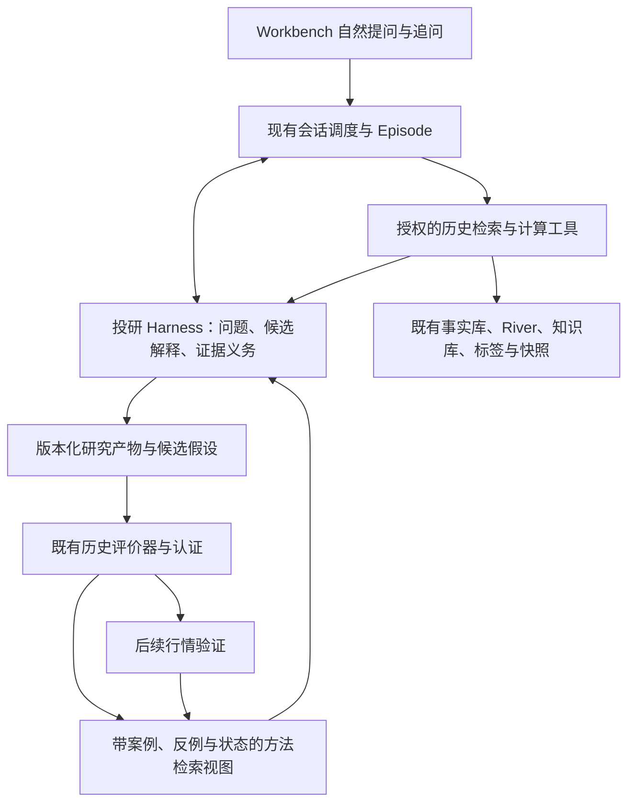

# 历史行情发现、假设生成与多样本检验设计

> 日期：2026-09-09。状态：设计提案；本轮交付 spec，未实施新增能力。
>
> 用户已确认的主线：**事后复盘发现特征 → 提出候选假设 → 历史同类与反例检验 → 总结有适用条件的规律 → 后续行情持续验证。**
>
> 本文聚焦领域研究应用。通用运行时、历史真实性与统计认证补强由已有任务负责。L2、晚间卖方、晨汇继续保留待同步占位。

## 0. 一句话与阅读入口

用户只问「这一波农业怎么走出来的」，Agent 就能重建这波行情，主动比较不同解释，发现值得研究的特征，再沿着「以前有没有类似情况」「为什么有些没走出来」继续计算和检验。用户不需要先列出双红、涨停扩散、弱转强、中军成交、旧主线退潮等所有研究角度。

**允许事后选择强势股和强势板块作为发现入口。** 发现阶段不要求事先锁定对象或完整规则；单次复盘产出假设，其他样本决定它能获得多少支持。发现后再明确验证口径，不能倒过来要求用户先有一条完整策略才能研究。

阅读顺序：产品行为见 §2；数据与工具优化见 §4–6；历史检验见 §7；实施顺序与验收见 §10–11。接口名和字段若未列为源码事实，均为**目标合同**，不代表当前已存在。

### 0.1 与已有工作的关系

| 已有工作 | 本文如何承接 |
|---|---|
| [个人研究校准终局](2026-09-06-personal-research-calibration-endstate-design.md)、[时间长河终局](2026-09-05-time-river-endstate-design.md) | 保留时间轴、多轨数据、个人框架与验证飞轮；补充开放式事后发现的产品入口与研究闭环 |
| [方法论结构化历史设计](2026-09-04-methodology-backtest-structured-history-design.md) | 复用标签、规则编译、结果窗口、收据与方法生命周期，不新建另一套统计器 |
| [历史类比与生命周期设计](2026-08-13-memory-analog-lifecycle-design.md) | 复用已有类比与阶段追溯，扩展为可由模型继续查询的研究过程 |
| [09-08 基础补强 spec](/Users/a77/fwp-wt-research-foundation-spec/docs/superpowers/specs/2026-09-08-research-foundation-optimization-design.md) | 依赖其 OPT-01/02 时间版本、OPT-03 数据质量、统计与晋升认证、运行时恢复合同；另一 agent 负责，不在本文复制实施 |
| [第一条方法验证应用](/Users/a77/fwp-wt-method-validation-loop/docs/workflows/method-validation-loop.md) | 固定双红候选的下游实验工具；不能冒充通用特征发现或所有假设的执行器 |
| [产品门](../../agent-product-door.md) | Workbench 继续走真实会话与 Episode，不新增产品门或通用 loop |

跨分支依赖审查快照：基础补强文档 `docs/research-foundation-optimization@5b821d4a`；方法验证应用 `feat/method-validation-loop@4b7c4917`（实现提交 `e41ef60b`）。上面绝对链接便于本机查看；迁移到另一机器时按这些 Git 引用和仓内同名路径取文件。实施前重新核对合入状态，不能按分支存在认定线上可用。

### 0.2 对旧措辞的精确补充

旧终局把 `hindsight=true` 与方法有效性统计隔离，这个保护继续成立；**它不禁止事后探索、描述性历史比较和假设生成**。本设计将用途明确拆开，避免整个历史研究因缺少当时快照而被一刀切拒绝。历史比较可以查询发现样本之前的年份，不要求先等未来。

用户本轮示例没有指定农业日期，也没有确认厄尔尼诺就是该波催化。本文所有农业路径都是研究问题和验收形状，不是事实结论。具体日期在首个实施切片中解析并公开，不捏造日期、收益或主因。

## 1. 已有基础与需要补齐的连接

源码基线：干净工作树 `/Users/a77/fwp-wt-historical-discovery-spec`，`gitea/main@f90af450b1be1fe80d5ad1515973503c646e15d0`。主工作树有他人改动，未用其混合状态作实现结论。本轮未运行农业研究、未核验对应数据窗口、未探测线上版本。代码地图只作路径索引，缺失的结构层不构成架构证据。

| 已核对的源码 | 已有能力 | 本文的优化对象 |
|---|---|---|
| `runtime/conversation_orchestrator.py::TurnOrchestrator`、`runtime/continuous_turn_adapter.py`（均位于 `intelligence/`） | Workbench 会话、调度与连续 Episode | 历史发现意图、解析后的历史范围与研究上下文要贯通，不能被归入单日确定性复盘后提前退出 |
| `intelligence/services/asof_prefetch.py::collect_prefetch_items / _history_analog_items` | 开场已可供给发酵盘面时间轴及条件触发的历史类比 | 预取是开场线索；需要模型依据新证据自主扩窗、换特征与找反例 |
| `intelligence/services/episode_tools.py`、`research_tool_registry.py` | 历史 `finance_query`、结构化证据检索、能力授权；Agent 查询有 25 行上限与历史窗口识别门 | 显式传递历史研究权限和范围；完整计算在工具内部完成，不能靠 25 行预览代表全集 |
| `intelligence/services/river_query.py::scan_cross_section / cohort_compare / range_aggregate`、`river_window.py` | 横截面、日期群组、区间收益/回撤/覆盖、窗口特征与类比计算 | 复用计算；在已核对的注册与 runner 路径中尚未确认模型可以主动调用这些接口，须用实际 Episode 轨迹验收 |
| `skills/theme-fermentation-tracer/scripts/trace.py` | 消息/认知/卖方线索与双红、涨停热度、个股启动日期对齐 | 提取可复用的只读计算；整段涨幅挑股可作发现，不能变成验证全集；消息日期和日频启动不自动证明先后因果 |
| `intelligence/services/market_analogs.py / market_regime_analogs.py / stock_analogs.py` 与既有类比块 | 已有题材、市场环境与个股类比积木 | 类比理由、差异、覆盖与样本来源需要被带入继续研究；相似榜单不是验证分母 |
| `intelligence/services/research_harness.py::ResearchHarness / FinanceResearchHarness` | 开场、计划解释、工具结果投影、终局准入等领域接缝 | 在既有接缝增加研究状态与证据义务；领域不持有第二个通用执行循环 |
| `intelligence/services/methodology_backtest/{compiler,runner,stats,lifecycle}.py` | 规则编译、历史结果、统计读数与生命周期 | 增加发现产物到现有规则/评价器的版本化转换；复杂序列不支持时明确返回不支持，不静默简化 |

上述为相关源码抽查，能力全集仍以 `.agent-memory/10_knowledge/finance-agent-capability-graph.md` 为权威入口。本文不宣布基础设施已经牢固，也不把未接通或未实测写成「系统没有」。

## 2. 用户能得到什么

### 2.1 一次自然提问的交付

输入：「这一波农业怎么走出来的？」

Agent 应逐步形成以下产物，证据不充分的部分明确保留未知：

1. **研究范围**：对应哪一波、起止日及前后观察窗、题材与供应商板块如何对应；存在多个候选时先展示候选，必要时只澄清日期。
2. **行情演化**：关键转折日、个股先动或板块先动、参与面如何扩大、成交如何变化、消息何时被报道，以及同一阶段其他题材的变化。
3. **竞争解释**：哪些证据支持天气叙事、少数股先行、板块共振、中军量能、旧主线退潮或市场普涨；哪些证据不支持，哪些暂时无法区分。不同阶段可以由不同因素共同解释。
4. **候选特征与假设**：本次发现了什么可复用的条件、顺序或环境组合，为什么值得跨案例检验。
5. **历史同类与反例**：以前发生过哪些类似过程，哪些成功、失败或尚无法判断；相似在哪里、差异在哪里。
6. **结论强度**：目前是单案例解释、探索性关联，还是已有独立检验支持；仍缺哪些数据或证据。

首轮不强迫穷尽六项。用户只要本波复盘时交付复盘和候选假设；用户继续问「以前呢」「检验一下」时沿原研究对象继续。明确要求完整研究时，可在授予预算内连续推进到历史比较。中断后保留已完成产物和待查问题。

### 2.2 允许的研究自由

Agent 可以主动追加用户没给出的视角，也可以发现用户给的角度无关；可以调整窗口、分析粒度和候选解释，但要保留变化理由和版本。不能固定成「先查双红，再查涨停，最后查中军」的唯一流程，也不能为了填满模板编造驱动因素。

例：先看到少数股启动，提出「个股带板块」；查询同期涨幅分布后发现绝大多数板块都在反弹，转而比较相对市场表现；再发现农业扩散早于对照题材，继续查扩散前后的公开事件。下一步由新的证据决定。

“主动思考”的可验收部分是**研究行动、可检验解释、证据变化和修正结果**，不是要求模型输出私有思维全文，也不是靠固定工具调用次数证明深度。

## 3. 研究用途与架构选择

### 3.1 三种用途共用事实，结论权限分别判断

| 用途 | 可以读取什么 | 可以得出什么 |
|---|---|---|
| 事后发现 `retrospective_discovery` | 所选行情的完整走势、事后赢家、后来补齐且有来源的材料；标明重建版本 | 这波有什么特征、可能怎样演化、候选假设；不宣称当时已经可识别 |
| 历史比较 `historical_comparison` | 按明确条件筛出的其他历史案例，含失败和对照；可使用注明等级的历史重建数据 | 特征分布、条件关联、差异与适用边界；没有当时可知证据时不宣称可预测 |
| 历史决策回放/前向验证 `point_in_time_validation` | 每个观察时点当时可知的特征版本，结果在之后另读 | 在所述时间、样本和统计条件下的检验结论；仍须通过已有认证门才可晋升 |

用途不替代 `pit_grade`（当时可知的数据等级）、覆盖质量和样本独立性；四者分别记录。发现时的后验峰值、后来才形成的中军名单可以作为**被解释结果**，不能偷偷变成当时的筛选条件。

### 3.2 方案取舍

| 方案 | 取舍 |
|---|---|
| **现有 Episode + 领域研究合同 + 少量深计算接口** | 采用。调用方学会范围、特征与比较条件，窗口对齐、去重和计算复杂度留在模块内 |
| 固定复盘模板串全部工具 | 可保留作基础报表，无法承担自主改假设和查反例，不能作为目标研究能力 |
| 新建独立研究平台、通用因子挖掘引擎和第二套方法库 | 本期不采用。先用真实研究问题验证需要的表达力，减少平行真本源与迁移成本 |



Runtime 负责预算预占、工具执行、绝对截止时间、取消、重试、持久化与恢复。领域 Harness 负责研究语义、选取线索、解释结果及结论准入。数值计算由确定性模块完成。评价器与晋升策略不允许由正在提出候选的 Agent 自行修改。

## 4. HD-01：历史对象、范围和多维联立

### 4.1 研究对象不是对话回合

新增的概念对象 `HistoricalResearchCase` 表示一项可跨回合继续的行情研究，不与 runtime 的 Episode 混用名称或 ID：

| 字段组 | 必须包含 |
|---|---|
| 身份 | `case_id / revision / parent_revision / user_id / visibility`，关联真实 `conversation_id / run_id` |
| 研究范围 | 原问题、主题/板块/个股实体 ID、观察窗口、前后环境窗口、时间粒度、选中该案例的理由 |
| 选样说明 | `selection_mode`（用户指定/事后赢家/条件命中/系统候选）、已观察的结果与来源引用 |
| 时间和来源 | 用途、知识截止、快照/数据版本、实体名单版本、时间可靠性、必需与可选字段覆盖 |
| 研究进展 | 候选解释、支持/反对引用、已执行查询、已暴露样本、待查问题、停止原因、产物引用 |

自然语言「这一波」「上一波」「当时」必须被解析为显式范围。沿现有 TaskFrame → context → 工具参数传递 `research_purpose / resolved_window / authorized_scope`；不能仅依赖原句含不含「历史」两个字。工具不因为模型自报一个用途就扩大权限，范围由领域请求、既有授权合同核准。

对象有歧义时先用已有上下文、实体映射和低成本元数据提出候选；仍无法定位才澄清。扩大到前序/同期题材应在授权的历史研究范围内自动进行，并展示所用窗口。授权外则返回结构化拒绝与所需范围，不无限扩到全库。

### 4.2 时间、实体和单位必须能联立

- 每条证据至少区分事件发生时间、可靠发布时间、系统取得时间与当前内容版本。只知道日期时用日级区间；同日事件不能强排成盘中先后。
- 使用交易日历对齐盘面，自然日保留给周末新闻；同时保留“原事件日”和“映射交易日”，映射规则版本化。
- 题材、供应商板块和成分股不是同一对象。别名、跨源代码、当时成分关系必须有版本与有效期；同名不直接拼接，重叠成员不重复累计。
- 原始值、单位、复权/价格口径、标准化值和变换参数分开保存引用。知识原文保留证据，不能只留下模型打出的情绪分。
- 数值、类别、事件、实体关系、时间顺序和带不确定性的文本提取都可以代码化。归一化不要求把所有信息压成单个数字或一个总分。
- 每次 join 返回应有/实有实体与日期数、关键字段非空数、缺口原因、映射来源及截断说明；查不到结果与数据不可用分开。
- 数据锁或快照失效沿现有只读错误合同处理；不绕锁、不临时写生产库、不启动第二条补数链。

内容历史版本与严格截止传播由基础 OPT-01/02 实现。本任务消费其验证结果；依赖未就绪时保留可解释的事后研究，相关结论不升级为严格回放。

### 4.3 三项待同步数据

| 数据 | 状态 | 当前分析规则 |
|---|---|---|
| L2 | `pending_sync`，用户确认，未排期 | 成交额只描述量能，不冒充主买净额、主动资金方向或机构流入 |
| 晚间卖方 | `pending_sync`，用户确认，未排期 | 缺批次不能解释为没有卖方关注；已有可用存量按具体日期核验 |
| 晨汇 | `pending_sync`，用户确认，未排期 | 不用其他日报冒充晨汇；缺批次不记作当天无催化 |

占位作用于实际未同步的目标范围；未指定的范围不猜成全历史。可选维度缺失不挡盘面研究；必需维度缺失时依赖它的假设不可验证，其他假设继续。不启动同步或安装日程。

## 5. HD-02：行情重建、特征发现与可计算表达

### 5.1 先能重建，再能解释

复用 tracer、River 与已有日报/阶段标签构建 `TimelineObservation`：日期或时间区间、实体、原值/派生值、单位、证据引用、计算定义、数据等级。曲线和时间轴只是这些对象的投影；不从生成的 Markdown 反解析事实。

候选观察轴可以包括：

| 观察轴 | 需要查证或计算的内容 |
|---|---|
| 板块整体 | 双红及持续、涨幅分布、上涨家数比例、强势股占比、相对市场表现；涨停家数同时给板块规模分母 |
| 个股先行/扩散 | 最早异常日、后续跟随比例、先行股与板块转折的间隔；“最早”受数据精度限制 |
| 弱转强 | 先明确“弱”的比较窗口与基准、再明确“强”的阈值与确认时点；不以某日涨幅大直接命名 |
| 中军量能 | 定义该研究中“中军”的选取口径、选取时间与流动性/市值证据，再比较成交变化；榜单与角色可随阶段变化 |
| 舆论与催化 | 原始事件、报道/转述、关注扩散、逻辑版本和反证；同源转载去重 |
| 诞生环境 | 大盘与风格、同期主线、前序题材的强弱变化、并行或接续区间；龙头连板交替不等于题材接棒 |

这些是可组合的研究轴，不是必须逐项打勾的模板。新视角可来自个人 know-how、已有方法、观察异常或模型提出的替代解释，并记录来源类别。

题材“接棒/并行”须同时给两段轨迹、重叠区间及各自转折定义；行情先后不证明资金从 A 流向 B。日频数据只能支持日级关系；无法区分的先后保留区间或并列。

### 5.2 从文字发现到特征定义

`FeatureDefinition` 是待计算内容的定义，不是已成立的规律。最少包括：名称与版本、自然语言解释、输入字段/来源、单位、实体粒度、计算表达式、观察窗口、锚点规则、缺失政策、变换参数、用途限制与来源案例。

表达力按真实需求递增：

1. 单点数值、比例、排名、相对基准与状态标签。
2. 持续天数、斜率、先后间隔、扩散率、拐点前后变化。
3. 事件顺序与条件组合，例如 A 出现后在窗口内出现 B，且处于环境 C；允许交互关系，不能全部压成独立布尔因子相加。

已有定义直接引用版本。新组合先使用受限表达式与已有算子，校验字段、类型、单位、窗口和成本后才能执行；模型不直接提交任意 Python、shell 或不受限 SQL。当前表达器不支持的定义保留为候选，返回 `unsupported_definition` 与缺少的算子，不编造计算结果或偷偷改成近似规则。

数值变换在探索数据上拟合并保存参数；验证数据只应用冻结参数。用完整走势识别峰值、后验领涨股等是合法描述性特征，但应明确依赖后续结果，禁止同名转成预测特征。

新算子、抽取器和隔离执行接基础 OPT-09 的候选特征目录；本任务负责提出定义、展示支持状态和传递授权输入，不再建一套 DSL 或候选执行沙箱。已有 `methodology_backtest/propose.py::build_rule_doc`、`rules.py::validate_rule` 能表达的规则优先复用。

## 6. HD-03/04：历史检索与自主研究 Harness

### 6.1 区分“找相似故事”和“检验条件”

| 路径 | 用途 | 返回合同 |
|---|---|---|
| 相似案例召回 | 帮助发现机制、相似点和差异 | 候选日期/实体、相似维度、关键差异、特征与距离版本、数据覆盖、召回范围和 Top-K 截断；未知维度不作相似 |
| 条件全集检索 | 建立跨样本验证分母 | 在声明历史宇宙内按冻结条件枚举命中、不命中和不可判案例；输出全集引用与排除原因，不能用 Top-K 代替 |

相似案例同时考虑盘面结构、事件语义、先后顺序和环境，先按实体/时间/覆盖过滤，再按可用维度检索或排序。不要求首期训练统一 embedding（把对象映射为可比较向量）模型；保留分维相似与不同意见，避免一句“相似度 90%”掩盖关键不相似。

召回另带匹配用途：**整段走势相似**允许用于发现与案例讲解；**触发时点相似**才可用于检验后续结果。后者的距离、排名、锚点和特征只使用触发时点及之前允许的数据，不能把后续涨幅或后验起涨日放入匹配条件。两类结果在报告中明确分开。

选择一个案例继续阅读会追加样本暴露记录。已有类比预取、跨回合记忆及用户主动贴入的样本也属于已暴露信息；不能只记录显式的新工具调用。

### 6.2 少量可组合工具操作

以下是领域接口的语义操作，实施时优先扩展现有 `finance_query` 的有类型操作和只读 adapter；只有现有合同确实无法容纳时才注册独立工具。不得把所有东西塞进无类型 `operation + 任意 JSON`。

| 操作 | 输入重点 | 输出重点 |
|---|---|---|
| `inspect_history` | 研究引用、实体、范围、维度、粒度 | 对齐时间轴、可用字段、元数据与缺口 |
| `compute_history` | 特征定义引用、快照、样本范围、聚合粒度 | 可复算数值、计算版本、完整结果引用、覆盖 |
| `find_analogues` | 来源案例、特征/结构、检索范围、排除集 | 相似与不相似理由、候选引用、覆盖与截断 |
| `compare_cases` | 假设版本、群组/分母合同、结果口径 | 命中/不命中/失败/不可判分布、案例明细引用；认证资格单列 |

授权、规范化、去重仍由 `ResearchToolRegistry` 管，超时和重试仍在 Episode。工具返回 `query_id / source_refs / definition_refs / total_matched / returned_count / truncated / coverage / result_ref`，摘要限长但完整原件可通过受控引用读取。总数与聚合必须在完整授权数据上算，不能把模型看到的 25 行当全市场。

缓存键至少覆盖用户权限、用途、数据/名单版本、时间范围、特征版本、参数及样本排除集；追问改条件必须得到新引用。服务端数据读取与计算同受 deadline、取消和行/窗口成本限制。长算应使用现有任务执行与产物合同，不能在领域函数里悄悄起后台循环。

### 6.3 研究状态与下一步选择

`ResearchPlan` 与运行状态承载以下可序列化内容：当前问题、候选解释集合、各解释可区分的观测、已查支持/反对证据、尚未解决的分歧、下一查询目的、预算下的优先级与停止理由。

领域策略引导模型循环：

```text
读取当前问题与已有证据
  → 提出或修订可检验解释
  → 选择最能区分解释、且当前可取得的观察
  → 调用历史工具并核对覆盖
  → 更新支持/反对/未知与候选特征
  → 继续查证、转入跨案例比较，或交付带边界的结果
```

不在代码里硬编码农业因果树。结构门检查引用有效性、数值一致性、样本口径和结论等级；语义评估检查替代解释是否实质相关、反例是否真正冲击假设。复杂单波解释应有替代解释或“当前无法构造可区分替代”的理由；单点事实问答不被强迫长研究。

停止条件：已满足问题且剩余解释无法由现有数据区分；关键数据缺失；新增查询无新信息；取消或预算不足。保存未决问题与部分产物，不能以“已查询多次”冒充证据充分。

Harness 使用现有 `assemble_prompt / interpret_plan / project_tool_result / admit_finish` 等接缝（实施时按实际接口名适配）。可恢复状态归 runtime 保存，Harness 仍作判定；恢复必须带原案例/假设版本、已暴露样本和待查问题，不能只恢复一段生成文本。

## 7. HD-05：候选假设到历史多样本检验

### 7.1 假设是可以被推翻的问题

`HypothesisDraft` 至少包含：`hypothesis_id / version / parent_version / source_case_refs / origin`、自然语言命题、要解释的结果、实体粒度、特征/序列定义、适用环境、替代解释、可能反例、已暴露样本范围、未解决的定义。

定义尚不完整时允许继续研究并保存草稿。**开始给某一版本做确认性评价之前**，生成不可静默修改的检验协议，冻结以下内容：

- 主问题与主要结果指标；辅助指标明确标记。
- 历史宇宙、可用时期、实体范围、样本单位、观察锚点及样本去重政策。
- 条件与计算版本、结果窗口、基准与匹配变量、数据质量和排除政策。
- 探索、检验及留出范围，已暴露范围和隔离政策；留出是未用于形成或调节该假设的样本。
- 所需精度/最小可关注差异、样本充分性与统计方案、检验家族和已尝试版本。

“冻结”发生在发现之后。并不要求事后复盘一开始就申请完整实验协议，也不强迫每个探索追问申请 R 号。正式实验沿 `claim_ledger_id.py` 预占 R 号并登记到现有台账。

### 7.2 验证分母与四类案例

针对明确的特征 X 与结果 Y，在协议范围内至少能够解释以下四格及不可判样本：

| | 后来出现所定义强势结果 Y | 后来没有出现 Y |
|---|---|---|
| 有特征 X | 支持案例候选；核对是否只是普涨或其他因素 | 失败反例，帮助寻找边界或推翻假设 |
| 无特征 X | 提醒 X 可能不是必要条件，寻找其他路径 | 基准的一部分，不能只挑极弱者充当对照 |

结果也可以是持续时间、扩散速度、相对表现或回撤等连续量，不强迫所有问题二值化。不能把“所有强股都有 X”直接解释成“出现 X 就会强”。未成熟结果、缺字段、停牌等按事先定义政策保留，不自动计失败或成功。

进行条件检验时，先冻结命中全集与基准，再读取结果；这不限制发现阶段浏览完整案例和自由追问。事后“展示几个典型成功/失败案例”是报告抽样，不得改变计算分母。历史宇宙按当时可用名单重建，若退市或消失对象缺失则披露覆盖偏差；不能只在今日仍存在的赢家里验证。

### 7.3 多记录不等于多次独立验证

同一波的多只股票、一个事件引发的多个板块、相邻且结果窗口重叠的日期，要保留所属行情/事件/时间簇。报告同时给实体数、记录数、不同日期数和独立性政策下的簇数；不直接把所有行送进独立伯努利试验的置信区间。

样本单位、聚合或按簇重采样等统计选择由基础评价器配置并写入协议。探索报告可以先给原始分布与案例对比；正式不确定性与晋升消费 OPT 认证结果。没有通过独立性和样本量门时，结论保持探索或证据不足，不阻止查看事实。

对照需考虑同期市场、规模/流动性及协议声明的环境变量；匹配变量不能包含被检验特征的后续结果。先看加入新特征是否增加区分能力，再评估结论对阈值、年份、环境和对象的敏感性。

### 7.4 避免不断调条件“调出规律”

- 来源案例不作为该假设的独立验证证据。所有已暴露的相关样本留痕，已看到的检验结果用于改条件后，该部分转为开发信息，新版本必须重新评估。
- 看到失败案例后添加“不适用于某阶段”属于假设修订，必须保留原失败及原分母，新条件另立版本；不能通过删掉反例让旧版变成通过。
- 留出集的分配与访问由评价侧控制，发现工具和默认预取不得偷偷读取它；用户明确希望探索该范围时可以解除留出并标记已消费，再另找未污染验证资料。
- 过去看过哪些历史无法证明时标记暴露范围未知，不伪称“完全未见”。历史探索仍可开展；确认性证据资格交由评估器决定，必要时依靠后续新数据补足。
- 记录同一假设家族所有已评版本、失败结果、换窗口/阈值/指标的原因，不能只保留最优版本。多重检验策略由评价器处理，不自行给每次试验套一个“95% 可信”。
- 时间切分按真实顺序和重叠关系进行；标准化、特征筛选及相似度调参也属于训练过程。隔离窗口须考虑标签跨度和事件关联，不能认为随机打散行或设置固定 gap 就自动独立。

这些限制是对**结论强度**的约束，不是对探索自由的禁止。多次试验与未来信息泄漏会影响回测解释，参考作者原文 [The Probability of Backtest Overfitting](https://www.davidhbailey.com/dhbpapers/backtest-prob.pdf) 和 [TimeSeriesSplit 官方说明](https://scikit-learn.org/stable/modules/generated/sklearn.model_selection.TimeSeriesSplit.html)。本文不据此强制引入论文算法或某个库；保护留出、时间分割本身也不足以替代统计审查。

### 7.5 与现有验证实现衔接

`HypothesisDraft → 已支持的 Rule/FeatureDefinition → 既有 runner/收据 → 基础认证结果` 是目标转换。每一步保留来源案例、定义版本与编译摘要；反向可以从结论回到假设、成员、原始事实和计算口径。OPT-04/05 尚未提供有效认证时，研究比较结果固定 `research_only=true / promotion_eligible=false / decision_eligible=false`，不把描述性读数包装为已获正式使用资格。

现有固定双红应用只支持其固定种子与三组比较。本任务可以复用不可变协议、成员冻结和原件读取的机制；通用扩展必须显式做 schema/支持能力版本升级，并保证旧档可读。复杂假设未获 compiler 支持时不得静默降为双红或单点上涨规则。

历史检验不依赖“必须先设未来开始日”；若当前固定应用合同不支持，就走现有历史评价器或经审查扩展合同，不伪造前向登记时间。新增严格认证仍由基础任务负责，不能在本应用中重算一个更宽松的通过结论。

## 8. HD-06：规律沉淀与后续迭代

规律的检索视图由**假设/规则版本 + 来源案例 + 支持/失败案例 + 适用环境 + 检验收据 + 当前认证状态**组成，不新增平行 `pattern_passed` 状态机或第二份方法事实库。

沿现有 `candidate → discovery/validation/holdout → personal_method` 的生命周期表达，具体枚举与晋升读正式评价器，并与 `intelligence/services/experience_cards.py::gate_promotion` 的消费资格衔接，不绕开现有门。历史研究可以产出待验证候选、描述性关联和反例资产；描述性关联不是新增晋升台阶。

检索使用时：

- 候选可以用于提示下一步要查什么，明确标记待验证，不当作已成立事实。
- 已获支持的方法仍须匹配适用环境、数据等级和版本；把反例与失效状态一并带入上下文。
- 新案例触发边界修订或证据减弱时追加记录，不覆盖旧结论；同族新版本不能继承旧版本的通过次数。
- 用户 know-how、模型提出的解释、历史事实与验证结论分别保留来源，避免模型重复引用自己的旧答案而形成“多份证据”。

后续行情验证接在这里：按当时版本记录特征和判断，到期读取结果，追加支持/反对证据。日程安装、自动采集或改模型权重不属于本 spec 的首期动作。

这个阶段主要优化可检索记忆、特征定义、研究策略与经验证的方法。未来若做模型后训练，必须另建由已审研究样本生成的数据集版本与离线评估，不能把所有 Agent 推断直接回灌成训练真值。

## 9. 持久化、展示与可追溯性

### 9.1 单一写入者

- 原始市场与知识事实继续在现有 canonical 落点，研究对象只持引用，不复制一套事实库。
- 研究案例、特征草稿和查询原件作为已有用户空间 run artifacts 的版本化产物，通过 `intelligence/services/run_store.py::RunStore` 保存；跨回合关联复用会话元数据。目标路径为 `userspace.user_space(user_id).root / runs / <run_id> / history-<kind>-<content_hash>.json`，kind 采用受控枚举；列表使用 run 产物索引。实施 S1 前在 `ledger-map.md` 登记这些 schema 与唯一 writer，再开始写入，不另起手工 JSONL 台账。
- 当前 `RunStore.add_artifact` 会覆盖同名文件，不能直接宣称它已满足不可变研究原件合同。新增研究产物需在该唯一写入者内落实完整性检查与不可覆盖提交；并发同内容幂等，不同内容产生新引用，内容写入与登记失败有明确恢复路径。复用基础持久化实现，不另起 writer。
- 正式方法协议/结果走现有评价器收据或已登记方法实验存储；两者衔接用引用，不对同一裁决双写两套真本源。
- 浏览列表和规律检索索引均可重建；源研究产物、不可变结果和版本沿革需要保留。新运行数据版本不同则建新修订，重跑不能覆盖旧证据。
- 产物访问绑定用户与可见范围；他人用户空间不得因猜到 `result_ref` 被读取。跨用户共享沿既有授权与认证机制。

### 9.2 用户展示

复用 Workbench 会话、原生进度和产物面板，按事实进度展示「正在核对起点」「发现一个反例，正在比较差异」等简明行动。若 `codex/feat-workbench-research-journey` 尚未合入，先在现有展示合同承接，避免平行重写前端。

首屏用简短结论、关键时间轴和证据强弱说明；展开可看特征对比、历史同类、失败案例、缺口与计算原件。追问修改日期/阈值/环境会生成新的查询与比较引用，界面明确这是一版新分析。

数值点击可追到实体、日期、来源版本和计算定义；叙述点击可追到原证据。必须区分“已观察”“推测解释”“待验证假设”和“检验结论”。多因素并存时不编造贡献百分比，也不把相关性写成已证明因果。

## 10. 实施切片与协作边界

以下是可独立验收的切片顺序，不是授权一次性改完所有基础设施。每片从当时最新主干复核依赖并拆实施计划。

| 切片 | 工作与交付 | 完成判据 |
|---|---|---|
| **S0 现状基线与样本定位** | 通过真实 Workbench 运行农业问题；定位日期候选，审计盘面/消息/名单等字段覆盖，保存路由、工具与回答原件；分类数据缺口、工具不可达、研究行为缺口 | 有准确窗口与可重放基线。若日期无法唯一解析则先澄清；不把示例改写成已知结论 |
| **S1 单波自主复盘** | HD-01/02/04：范围传递、只读计算接入、研究案例产物、时间轴、候选解释与反证；先完成可用盘面和已有可靠事件维度 | 用户不列视角，Agent 能依据证据选择调查与修订；必要维度缺失时诚实降档；关键结论可追证 |
| **S2 从发现追到历史同类** | HD-03 与特征定义：至少一项从 S1 得到的可计算假设，支持相似召回和条件全集、失败反例与差异比较 | 原对话追问「以前有没有」能沿原假设继续；候选榜单、统计分母、不可判分开 |
| **S3 历史检验与规则边界** | HD-05：假设版本、暴露记录、样本分割、完整对照与现有评价器桥接 | 对支持、无支持、数据不足三类结果都能正确交付；需要严格认证的结论等待 OPT 门，不能自证晋升 |
| **S4 可持续研究记忆** | HD-06：案例/反例/方法状态检索、旧版本复现、后续验证衔接 | 新研究能取回相关经验及失败边界；新证据改变状态且保留原件；不自动改共享方法 |

**首个用户可见里程碑是 S1+S2**：既能讲清一波行情，也能继续找其他历史案例。它不需要等待 L2、卖方、晨汇全部补齐；但不能声称回答了当前缺数据的资金机制。

与基础任务分工：本任务拥有研究意图、研究产物、特征表达、可调用的只读计算、主动查证与验证转换；基础任务拥有事实版本/严格截止、质量认证、依赖样本统计、晋升证书、通用持久化/取消/恢复。接口阻塞用明确依赖记录交接，不各修一份。方法验证应用保留为下游已有实验，不用其双红样本数推断整个历史库没有研究价值。

## 11. 验收：测真实行为和证据，不只测文章像不像

### 11.1 工程验收集

先准备 6 个开发场景和 6 个冻结迁移场景，迁移场景由独立评审选择，覆盖至少 3 个题材/对象类别与不同年份；这些数量是工程覆盖起点，不是证明金融规律成立的样本量门。

场景至少覆盖：明确日期与含糊“这一波”；板块先行与个股先行；同期普涨；新闻热但行情未持续；同一题材不同波次；关键轨待同步；数据修订或成员变化；原假设被反例削弱。可以组合在同一案例中。冻结原数据、预期证据范围和评分标准，不把预期驱动故事写进被测问题。

| 编号 | 必须验证的行为 |
|---|---|
| A01 意图与入口 | 真实 UI 的「这一波怎么走出来」进入可自主调用工具的研究路径；不用 CLI ask 结果冒充 UI；含糊范围按 §4.1 处理 |
| A02 自主性 | 用户不枚举研究轴；在提供关键反证的受控数据变体中，Agent 会改变下一查询或弱化原解释。只复述提示词不通过 |
| A03 数值与分母 | 人工/独立脚本可重算关键特征；超过 25 行的样本聚合正确，预览截断不影响总数；按条件命中率与按赢家特征频率不互换 |
| A04 时间与联立 | 同日新闻不被强定先后；改变名单/别名/单位有正确结果或可解释拒绝；L2 待同步不被成交额替代 |
| A05 发现自由 | 事后赢家、完整走势和后验峰值可用于生成假设；系统不得仅因事后选样拒绝复盘 |
| A06 验证隔离 | 来源案例和已用于调参的样本不能冒充独立留出；预取/记忆不能泄露保护集；修改条件产生新版本和新资格判断 |
| A07 失败与未知 | 同类失败、无特征但走强、数据缺失、未到期都被保留且口径不同；反例不被报告筛选器丢掉 |
| A08 依赖样本 | 复制同波股票或重复相邻窗口，不增加独立验证次数；正式不确定性消费评价器批准的样本政策 |
| A09 追问与复现 | 「换个年份」「去掉环境条件」「为何失败」能沿原案例继续；固定快照/定义重算一致，数据升级产生新修订 |
| A10 终止与恢复 | 授予预算耗尽或取消后停止执行；恢复保留范围、假设、已读样本和原件，报告已完成与未完成；无假成功终态 |
| A11 认证与记忆 | 单次支持不能进入 personal_method；负例/版本变化会影响检索呈现；缺正式认证不显示“规律已成立” |
| A12 迁移与权限 | 冻结题集不靠农业关键词或固定查询路径通过；不同用户不能互读私有原件；工具授权拒绝确实生效 |

验收按切片适用，不能把终局的全部条件提前变成首个里程碑的依赖：

| 切片 | 本片的硬验收范围 |
|---|---|
| S1+S2 | A01–05、A07、A09；A10 的既有预算/取消/部分产物和真实恢复能力说明；A12 的范围与用户权限，以及冻结场景迁移。A06 保留来源/暴露说明并遵守已有保护集权限；A08 给记录与行情分组信息但不输出未经认证的独立性统计；A11 必须禁越权晋升。描述性结果保持 research_only |
| S3 | A06 的完整隔离与版本检验、A08 的正式统计资格、A11 的认证衔接；新增恢复承诺仅在基础 OPT-08 已具备且通过 A10 相应测试后开放 |
| S4 | A11 的方法/反例记忆消费、新证据更新；A09/A10 的跨版本及跨会话恢复全链；重复核对 A12 私有权限 |

每个适用硬条件必须通过或阻断该片交付，不能用平均文风评分抵消数据泄漏和错分母。未具备的正式认证或新增恢复不阻挡 S1+S2 的受限交付，也不得在该片宣传为已支持。评分允许多个有证据的解释与“无法区分”；不要求 Agent 猜中人工预设的唯一故事。

### 11.2 测量与收据

记录真实问题、数据/名单/特征/模型/Harness/runtime 版本、代码 revision 与 dirty、实际能力授权、run/conversation ID、工具参数和结果引用、取消/结束原因、耗时与成本。

基线和改后在相同冻结数据与预算条件下比较关键事实正确率、引用可复算率、反例有效性、合理修订与迁移完成情况；模型波动明显时按预先声明的重复方案报告分布，不挑最好一次。记录预算内完成与降档的边界，不先承诺固定秒数或收益提升。

单元/集成检查覆盖确定性接口和门；脚本化模型覆盖证据变化后的可执行分支；真实 Workbench 运行覆盖自然意图、工具可达与连续追问。三者不可互相冒充。只改 spec 本轮不新增测试，也不声称通过这些待实施验收。

## 12. 本轮交付边界与下一动作

本轮完成可供实施者拆工单的领域研究设计。未改产品代码、生产数据、同步链、运行时配置、模型参数或自动化日程。没有对农业行情或某条规律做有效性判断。

下一动作从 **S0 → S1** 开始：固定一个能查到来源的农业历史窗口，用真实 Workbench 留下基线，按实际断点接通历史范围和可计算工具，再验收自主复盘；随后完成 S2 的相似与反例检索。不能跳成继续调一条固定双红规则，也不需要先重建通用 runtime。
