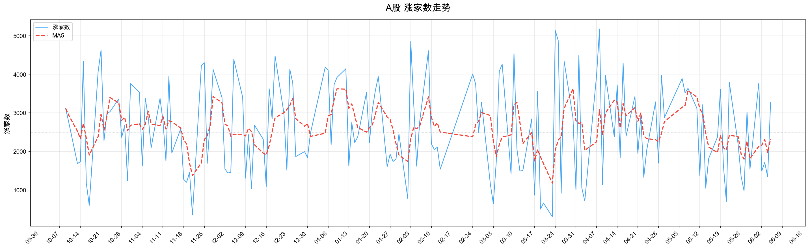

# 2026-06-05 每日市场复盘

> 自动生成自 `market_feature_store` 本地 DuckDB。报告只读取已入库数据，不临时编造缺失项。

## 核心看板
| 维度 | 结论 |
|---|---|
| 市场性质 | 普通交易日 / 顶部横盘阶段 第17天 |
| 指数表现 | 上证 4027.736，涨幅 -0.74%，偏离度 -0.98% |
| 量能状态 | 成交额 30688.10亿，较昨日 11.29%，相对20日均量 98.29% |
| 情绪状态 | 涨家数 3277，MA5 2320.6，涨停 73，跌停 11 |
| 成交集中 | 前三行业 49.00%，较昨日 +0.20pct |
| 题材量能 | 双红 49 个，单红 48 个；双红主线：机械设备(10)、国防军工(9)、计算机(9)、汽车(5)、电力设备(4) |
| 新高方向 | 120日新高 147 只；前三申万：电子(42)、机械设备(29)、通信(12)、基础化工(12)、有色金属(8) |
| 涨停方向 | 核心涨停题材：机器人概念(22)、芯片概念(17)、军工(13)、商业航天(13)、人工智能(11) |
| 强度状态 | 沸点，强度加权涨幅 9.09%，强度成交占比 9.03% |
| 加权强股 | 京东方Ａ、亨通光电、麦捷科技、国瓷材料、绿的谐波 |

## 目录
- [1. 指数 / 量能 / 偏离度 / 市场阶段](#1-指数--量能--偏离度--市场阶段)
- [2. 市场情绪](#2-市场情绪)
- [3. 成交前三行业](#3-成交前三行业)
- [4. 1/3/5/10 日板块涨幅前五](#4-13510-日板块涨幅前五)
- [5. 双红题材：按申万一级分组](#5-双红题材按申万一级分组)
- [6. 重点申万一级近15日子板块双红矩阵](#6-重点申万一级近15日子板块双红矩阵)
- [7. 单红题材：按申万一级分组](#7-单红题材按申万一级分组)
- [8. 120日新高](#8-120日新高)
- [9. 涨停题材](#9-涨停题材)
- [10. 3板及以上个股](#10-3板及以上个股)
- [11. 市场强度](#11-市场强度)
- [12. 近五日加权涨幅 Top10](#12-近五日加权涨幅-top10)
- [13. 数据覆盖检查](#13-数据覆盖检查)
- [14. 市场环境总评](#14-市场环境总评)

---

## 1. 指数 / 量能 / 偏离度 / 市场阶段
| 项目 | 数值 |
|---|---|
| 市场阶段 | 顶部横盘阶段 第17天 |
| 上证指数 | 4027.736 / -0.74% |
| 成交额 | 30688.10亿 |
| 较昨日比 | 11.29% |
| 20日均量 | 31222.07亿 |
| 相对量能比 | 98.29% |
| 周均线 | 4067.74 |
| 偏离度 | -0.98% |
| 价日 | 否 |
| 量日 | 是 |
| 双量日 | 否 |
| 市场性质 | 普通交易日 |

> **结论**：今日为 **普通交易日**；成交额较昨日变化 11.29%，相对20日均量 98.29%，偏离度 -0.98%。

---

## 2. 市场情绪
| 项目 | 今日 | 昨日 |
|---|---|---|
| 涨家数 | 3277 | 1344 |
| 涨家数 MA5 | 2320.6 | 1973.4 |
| 涨停 | 73 | 80 |
| 跌停 | 11 | 7 |

> [点击打开涨家数 MA5 图](file:///Users/lbq/Desktop/%E5%A4%8D%E7%9B%98/2026-06-05-advancers-ma5.png)

### 涨家数 MA5 波段区间
| 区间 | 日期区间 | 状态 | MA5区间 | 变化 |
|---|---|---|---|---|
| 波峰→波谷 | 2026-04-13→2026-04-28 | 下降 | 3329.2→2253.6 | -1075.6 |
| 波谷→波峰 | 2026-04-28→2026-05-08 | 上升 | 2253.6→3579.6 | +1326.0 |
| 波峰→波谷 | 2026-05-08→2026-05-27 | 下降 | 3579.6→1798.8 | -1780.8 |
| 当前震荡区间 | 2026-05-27→2026-06-05 | 震荡 | 1798.8→2320.6 | +521.8 |

> **MA5位置**：当前处于 **震荡区间**，趋势为 **震荡**；上一确认波峰 2026-05-08 MA5 3579.6，上一确认波谷 2026-05-27 MA5 1798.8。

> **结论**：涨家数 3277，MA5 2320.6；涨停较昨日减少7只，跌停较昨日增加4只。

---

## 3. 成交前三行业
| 日期 | 前三占比 | 集中度 | 行业1 | 占比1 | 行业2 | 占比2 | 行业3 | 占比3 |
|---|---|---|---|---|---|---|---|---|
| 昨日 | 48.80% | 集中 | 电子 | 31.40% | 电力设备 | 9.20% | 通信 | 8.60% |
| 今日 | 49.00% | 集中 | 电子 | 30.10% | 通信 | 10.90% | 机械设备 | 8.60% |

> **结论**：前三行业占比 49.00%，较昨日 +0.20pct；成交继续集中在 电子、通信、机械设备。

---

## 4. 1/3/5/10 日板块涨幅前五
### 1日
| 板块 | 申万一级 | 涨幅 | 成交额 | 边际量 |
|---|---|---|---|---|
| 太赫兹 | 国防军工 | 3.36% | 744.92亿 | 37.59 |
| 减速器 | 机械设备 | 3.27% | 946.68亿 | 33.75 |
| 电机 | 机械设备 | 3.12% | 126.60亿 | 56.05 |
| 自动化设备 | 机械设备 | 2.76% | 944.10亿 | 28.26 |
| 金属新材料 | 有色金属 | 2.76% | 219.90亿 | 42.68 |

### 3日
| 板块 | 申万一级 | 涨幅 | 成交额 | 边际量 |
|---|---|---|---|---|
| 太赫兹 | 国防军工 | 5.66% | 744.92亿 | 37.59 |
| 光刻机 | 电子 | 5.41% | 703.68亿 | 6.53 |
| 电子化学品 | 基础化工 | 5.30% | 718.87亿 | 11.24 |
| 金属新材料 | 有色金属 | 4.78% | 219.90亿 | 42.68 |
| 光纤 | 通信 | 4.41% | 3669.16亿 | 24.88 |

### 5日
| 板块 | 申万一级 | 涨幅 | 成交额 | 边际量 |
|---|---|---|---|---|
| MLCC | 电子 | 10.09% | 1001.60亿 | 59.08 |
| 煤炭开采加工 | 煤炭 | 9.67% | 294.69亿 | -16.78 |
| 光刻机 | 电子 | 5.96% | 703.68亿 | 6.53 |
| 金属新材料 | 有色金属 | 5.69% | 219.90亿 | 42.68 |
| 太赫兹 | 国防军工 | 5.27% | 744.92亿 | 37.59 |

### 10日
| 板块 | 申万一级 | 涨幅 | 成交额 | 边际量 |
|---|---|---|---|---|
| MLCC | 电子 | 21.12% | 1001.60亿 | 59.08 |
| 煤炭开采加工 | 煤炭 | 17.68% | 294.69亿 | -16.78 |
| 元件 | 电子 | 6.63% | 1799.95亿 | 1.67 |
| 超级电容 | 电力设备 | 6.33% | 874.63亿 | 5.28 |
| PET铜箔 | 电力设备 | 3.90% | 846.21亿 | 11.12 |

> **结论**：短期涨幅榜显示 太赫兹、减速器、电机、自动化设备、金属新材料、光刻机 等方向活跃；10日维度由 MLCC 领涨。多周期共振题材（出现≥2次）：太赫兹(3次)、金属新材料(3次)、MLCC(2次)、光刻机(2次)、煤炭开采加工(2次)；全周期共振题材：无。

---

## 5. 双红题材：按申万一级分组
> 双红题材数量：**49**；主线申万一级：机械设备(10)、国防军工(9)、计算机(9)、汽车(5)、电力设备(4)。

### 机械设备
| 题材 | 涨幅 | 边际量 | 成交额 |
|---|---|---|---|
| 减速器 | 3.27% | 33.75 | 946.68亿 |
| 新型工业化 | 2.21% | 28.65 | 1948.42亿 |
| 自动化设备 | 2.76% | 28.26 | 944.10亿 |
| 3D打印 | 1.59% | 21.59 | 1458.61亿 |
| 通用设备 | 2.17% | 21.57 | 951.86亿 |
| 传感器 | 0.86% | 18.95 | 2957.25亿 |
| 人形机器人 | 1.48% | 18.16 | 5168.65亿 |
| 机器视觉 | 1.19% | 15.25 | 1676.71亿 |
| 机器人 | 1.03% | 14.68 | 9466.60亿 |
| 工业母机 | 1.82% | 10.37 | 923.82亿 |

### 国防军工
| 题材 | 涨幅 | 边际量 | 成交额 |
|---|---|---|---|
| 军工信息化 | 2.18% | 65.92 | 582.74亿 |
| 太赫兹 | 3.36% | 37.59 | 744.92亿 |
| 军工装备 | 1.14% | 36.61 | 500.22亿 |
| 航空发动机 | 1.57% | 31.06 | 778.88亿 |
| 大飞机 | 1.47% | 25.42 | 1170.52亿 |
| 低空经济 | 0.96% | 24.98 | 3541.42亿 |
| 商业航天 | 1.09% | 23.87 | 5633.83亿 |
| 超导 | 0.05% | 23.35 | 565.07亿 |
| 军工 | 1.11% | 17.09 | 4364.84亿 |

### 计算机
| 题材 | 涨幅 | 边际量 | 成交额 |
|---|---|---|---|
| 多模态AI | 0.62% | 22.25 | 930.04亿 |
| 量子科技 | 0.08% | 19.95 | 1724.31亿 |
| AI智能体 | 0.72% | 19.11 | 2294.75亿 |
| 人工智能 | 0.69% | 18.20 | 6012.75亿 |
| AI应用 | 0.71% | 17.17 | 2164.68亿 |
| 数据要素 | 0.64% | 16.35 | 1760.56亿 |
| DeepSeek | 0.60% | 13.60 | 4317.57亿 |
| IT服务 | 0.60% | 12.81 | 569.58亿 |
| 华为昇腾 | 0.16% | 11.13 | 605.61亿 |

### 汽车
| 题材 | 涨幅 | 边际量 | 成交额 |
|---|---|---|---|
| 无人驾驶 | 0.40% | 20.17 | 4291.61亿 |
| 飞行汽车(eVTOL) | 0.96% | 17.22 | 790.99亿 |
| 汽车零部件 | 1.01% | 14.94 | 799.38亿 |
| 长安汽车 | 0.78% | 13.71 | 1764.51亿 |
| 毫米波雷达 | 0.98% | 13.24 | 1996.79亿 |

### 电力设备
| 题材 | 涨幅 | 边际量 | 成交额 |
|---|---|---|---|
| 钙钛矿电池 | 0.45% | 27.53 | 1387.42亿 |
| 燃料电池 | 0.53% | 13.57 | 1442.52亿 |
| 光伏 | 0.13% | 12.84 | 5877.04亿 |
| 氢能源 | 0.06% | 10.39 | 2663.91亿 |

### 通信
| 题材 | 涨幅 | 边际量 | 成交额 |
|---|---|---|---|
| 通信设备 | 1.12% | 42.94 | 3204.66亿 |
| 6G | 1.66% | 31.57 | 2394.21亿 |
| 光纤 | 0.04% | 24.88 | 3669.16亿 |
| 星闪 | 1.00% | 22.82 | 612.68亿 |

### 电子
| 题材 | 涨幅 | 边际量 | 成交额 |
|---|---|---|---|
| 光学光电子 | 1.20% | 31.50 | 1300.78亿 |
| MR(混合现实) | 0.75% | 24.56 | 842.77亿 |
| 消费电子 | 0.31% | 18.62 | 1291.67亿 |

### 传媒
| 题材 | 涨幅 | 边际量 | 成交额 |
|---|---|---|---|
| ChatGPT | 0.89% | 20.63 | 863.48亿 |
| AIGC | 0.96% | 15.30 | 1364.66亿 |

### 医药生物
| 题材 | 涨幅 | 边际量 | 成交额 |
|---|---|---|---|
| 创新药 | 0.20% | 15.24 | 579.96亿 |

### 基础化工
| 题材 | 涨幅 | 边际量 | 成交额 |
|---|---|---|---|
| 氟化工 | 0.64% | 19.15 | 723.12亿 |

### 综合
| 题材 | 涨幅 | 边际量 | 成交额 |
|---|---|---|---|
| 海峡两岸 | 0.22% | 12.00 | 3056.07亿 |

> **结论**：双红集中在 机械设备、国防军工、计算机、汽车、电力设备 等方向。

---

## 6. 重点申万一级近15日子板块双红矩阵
> 子板块单元格格式：当日涨幅/边际量/成交额亿；母板块行格式：成交占比/涨跌幅；上证指数行格式：120日均量比/涨跌幅；🔥 表示当日满足双红（日涨幅 > 0、边际量 > 10 且成交额 > 500亿）。

### 电子
| 子板块 | 05-18 | 05-19 | 05-20 | 05-21 | 05-22 | 05-25 | 05-26 | 05-27 | 05-28 | 05-29 | 06-01 | 06-02 | 06-03 | 06-04 | 06-05 |
|---|---|---|---|---|---|---|---|---|---|---|---|---|---|---|---|
| 申万一级：电子（占比/涨跌幅） | 26.9%/1.6% | 27.2%/2.2% | 28.9%/2.2% | 29.6%/-3.7% | 30.9%/4.3% | 32.7%/4.8% | 31.9%/-0.8% | 33.5%/-1.4% | 32.2%/1.7% | 30.7%/-4.4% | 30.0%/-4.2% | 29.1%/2.6% | 31.9%/2.3% | 31.4%/2.3% | 30.1%/-3.6% |
| 上证指数（120日均量比/涨跌幅） | 1.22x/-0.1% | 1.22x/0.9% | 1.24x/-0.2% | 1.45x/-2.0% | 1.21x/0.9% | 1.33x/1.0% | 1.33x/-0.2% | 1.33x/-1.2% | 1.21x/0.1% | 1.35x/-0.7% | 1.16x/-0.3% | 1.12x/0.4% | 1.25x/0.2% | 1.10x/-0.6% | 1.22x/-0.7% |
| AI PC | 1.8%/-13.7/1132 | 1.4%/-1.5/1116 | -0.0%/1.5/1132 | -2.9%/22.1/1383 | 4.4%/-8.1/1270 | 1.8%/7.0/1359 | -0.9%/11.7/1518 | -3.0%/-4.0/1458 | 1.3%/-21.8/1140 | -3.4%/12.4/1281 | 3.4%/-7.8/1181 | 🔥2.5%/14.2/1349 | -1.2%/20.8/1628 | 0.0%/0.6/1638 | -0.9%/10.5/1811 |
| AI手机 | 2.3%/-9.6/1194 | 2.3%/6.9/1277 | -0.7%/-13.1/1110 | -3.5%/23.5/1371 | 3.1%/-9.6/1239 | 1.6%/3.9/1287 | -1.4%/0.2/1291 | -1.2%/11.0/1432 | 1.3%/-15.0/1217 | -5.3%/7.2/1305 | -0.1%/-4.3/1249 | 1.0%/-12.5/1093 | 🔥0.8%/32.0/1443 | 0.9%/-6.1/1354 | -1.1%/5.2/1424 |
| AI眼镜 | 0.8%/-7.8/2552 | 1.5%/-3.7/2458 | 0.3%/-0.2/2452 | -3.3%/25.6/3081 | 3.4%/-10.0/2771 | 1.7%/5.4/2921 | -1.3%/4.9/3064 | -1.1%/11.2/3408 | 1.4%/-15.9/2866 | -4.5%/11.2/3185 | -0.5%/-15.9/2679 | 1.3%/-7.9/2467 | 🔥0.6%/30.6/3221 | 0.2%/-10.2/2891 | -0.0%/17.0/3384 |
| MCU芯片 | 1.1%/-5.6/1211 | 1.9%/2.0/1235 | 1.0%/4.2/1287 | -4.8%/15.2/1482 | 2.8%/-21.9/1158 | 🔥3.7%/25.3/1450 | -2.1%/0.1/1451 | -1.0%/15.9/1682 | 2.4%/-9.2/1527 | -5.8%/1.1/1544 | -1.6%/-21.4/1214 | 0.5%/-6.9/1130 | 🔥0.8%/17.7/1331 | 0.4%/-11.0/1185 | -1.1%/4.7/1240 |
| MLCC | 2.4%/10.2/341 | 3.7%/24.5/400 | 1.4%/30.3/430 | -2.0%/44.8/489 | 🔥8.7%/49.6/534 | 🔥4.0%/85.0/716 | -1.1%/90.0/737 | 🔥1.0%/79.2/731 | 🔥7.5%/89.2/823 | -1.4%/113.2/968 | -0.7%/84.0/886 | 🔥6.7%/64.7/887 | 🔥0.1%/68.2/967 | 🔥5.6%/47.5/911 | -1.7%/59.1/1002 |
| MR(混合现实) | 1.4%/-5.6/853 | 1.4%/-12.8/743 | -1.0%/8.0/803 | -2.9%/13.6/912 | 2.5%/-12.9/794 | 🔥1.1%/10.8/881 | -1.2%/-0.4/877 | -2.8%/-4.7/836 | 1.3%/-9.4/757 | -3.8%/15.1/872 | 0.7%/-12.4/764 | 0.7%/-11.5/676 | -0.4%/27.9/864 | -0.7%/-21.7/677 | 🔥0.8%/24.6/843 |
| PCB | 1.4%/-13.8/2527 | 1.5%/7.3/2713 | 0.8%/0.4/2723 | -3.5%/24.2/3382 | 6.3%/-1.0/3347 | 🔥2.4%/10.3/3692 | -0.5%/4.5/3860 | -2.0%/-4.9/3671 | 3.5%/-5.0/3488 | -3.7%/12.5/3922 | -2.1%/-11.7/3464 | 2.3%/-1.1/3426 | 🔥0.3%/15.8/3967 | 1.4%/-12.1/3486 | -0.4%/2.9/3588 |
| 元件 | 2.1%/-9.9/1047 | 🔥2.1%/10.3/1155 | 0.5%/-2.0/1132 | -2.6%/28.3/1452 | 🔥7.8%/10.7/1607 | 2.8%/7.9/1734 | 🔥1.0%/10.6/1917 | -1.4%/-5.0/1822 | 3.7%/-9.5/1649 | -2.1%/16.8/1927 | -2.9%/-0.8/1911 | 3.9%/-8.8/1742 | 🔥0.5%/12.7/1964 | 2.6%/-9.8/1770 | -1.4%/1.7/1800 |
| 先进封装 | 1.0%/-13.0/3222 | 2.1%/6.9/3445 | 2.0%/7.1/3689 | -4.0%/17.7/4341 | 3.9%/-18.9/3521 | 🔥4.6%/19.4/4203 | -0.4%/13.5/4769 | -1.3%/7.7/5136 | 2.8%/-15.6/4336 | -5.3%/8.4/4699 | -2.4%/-18.6/3826 | 2.0%/-7.2/3551 | 🔥1.2%/27.1/4512 | 1.7%/-14.2/3871 | -0.9%/7.2/4151 |
| 光刻机 | -0.3%/-17.7/595 | 2.0%/0.6/598 | 🔥3.1%/16.7/698 | -5.2%/19.5/835 | 3.9%/-19.7/670 | 1.1%/2.5/687 | -2.4%/4.9/720 | -2.8%/-10.1/647 | 2.2%/-6.5/605 | -5.2%/6.2/643 | -1.5%/-19.8/516 | 2.0%/3.9/536 | 🔥2.2%/27.9/685 | 2.8%/-3.6/661 | 0.3%/6.5/704 |
| 光刻胶 | 1.1%/-7.1/643 | 1.1%/-2.0/631 | 🔥2.3%/19.4/753 | -4.8%/19.7/901 | 3.0%/-24.3/683 | 🔥1.9%/19.5/816 | -1.7%/-4.4/780 | -3.4%/-12.4/683 | 2.6%/-7.6/631 | -5.6%/14.2/721 | -0.5%/-23.0/555 | 0.0%/-9.7/501 | 🔥1.3%/27.3/638 | 1.7%/0.2/639 | 0.9%/8.2/691 |
| 光学光电子 | 0.6%/-17.9/612 | 1.9%/7.7/659 | 0.3%/5.2/694 | -0.8%/61.1/1118 | 2.7%/4.4/1167 | 1.2%/-4.7/1113 | -0.0%/1.3/1127 | -1.2%/7.8/1215 | 1.4%/-20.2/969 | -5.8%/5.1/1019 | -0.4%/-19.6/819 | 1.1%/-8.5/750 | 🔥1.1%/44.7/1085 | 0.8%/-8.8/989 | 🔥1.2%/31.5/1301 |
| 共封装光学(CPO) | 1.5%/-15.7/4902 | 1.4%/9.4/5365 | 1.1%/0.6/5395 | -4.6%/11.7/6024 | 5.3%/-9.5/5450 | 🔥2.7%/13.7/6196 | -1.9%/2.9/6373 | -1.5%/3.5/6594 | 3.1%/-6.5/6165 | -3.6%/14.4/7054 | -3.5%/-14.9/6005 | 3.5%/1.7/6106 | 🔥2.5%/22.4/7471 | 1.2%/-16.9/6206 | -1.3%/18.8/7371 |
| 半导体 | 0.9%/-15.0/4072 | 2.9%/2.0/4152 | 🔥3.1%/15.1/4779 | -6.0%/16.2/5551 | 2.9%/-22.0/4329 | 🔥4.5%/23.5/5345 | -2.8%/-2.7/5201 | -1.3%/6.9/5562 | 2.2%/-14.3/4767 | -6.2%/2.4/4879 | -3.9%/-18.1/3997 | 0.6%/-11.9/3523 | 🔥2.3%/27.1/4478 | 1.4%/-13.9/3856 | -2.3%/-1.8/3786 |
| 半导体设备 | 0.6%/-17.9/654 | 3.7%/-1.9/642 | 🔥6.2%/16.8/750 | -6.3%/28.9/966 | 1.0%/-25.7/718 | 🔥3.7%/16.7/838 | -3.8%/-19.9/671 | -3.6%/-3.9/645 | 0.4%/-17.7/531 | -4.7%/8.1/574 | -4.1%/-12.1/504 | 1.3%/-9.8/455 | 🔥2.4%/24.1/564 | 3.0%/-15.6/476 | -3.0%/-11.6/421 |
| 华为手机 | 0.6%/-10.8/539 | 1.1%/-2.9/523 | 🔥0.5%/19.6/626 | -3.3%/22.3/765 | 4.6%/-11.3/679 | 🔥2.5%/18.4/804 | -0.8%/-14.8/685 | -2.6%/-3.6/660 | 2.4%/-4.9/628 | -3.6%/18.1/742 | -1.8%/-18.8/602 | 1.8%/8.4/653 | -0.6%/18.1/771 | 0.7%/-26.3/568 | -0.0%/18.9/676 |
| 存储芯片 | 1.8%/-9.1/4495 | 2.0%/-2.3/4391 | 🔥3.1%/21.2/5321 | -5.3%/15.1/6125 | 3.2%/-19.0/4961 | 🔥4.0%/21.1/6009 | -2.0%/-2.3/5870 | -2.5%/3.2/6058 | 2.4%/-14.6/5172 | -5.3%/4.8/5419 | -2.7%/-16.1/4544 | 1.5%/-6.9/4231 | 🔥1.9%/21.2/5127 | 2.4%/-8.1/4714 | -1.7%/-0.7/4681 |
| 消费电子 | 1.1%/-7.5/1140 | 1.0%/-10.8/1017 | -0.7%/-0.6/1011 | -2.7%/16.1/1173 | 3.1%/-13.2/1018 | 🔥1.4%/16.2/1183 | -1.1%/-7.0/1100 | -2.4%/13.9/1253 | 2.0%/-2.4/1224 | -3.8%/11.7/1367 | 1.5%/-15.6/1154 | 1.2%/3.8/1198 | -0.4%/20.3/1442 | -0.5%/-24.5/1089 | 🔥0.3%/18.6/1292 |
| 芯片 | 0.8%/-14.2/12095 | 1.6%/2.9/12448 | 1.0%/5.3/13112 | -4.2%/16.9/15321 | 3.1%/-15.7/12917 | 🔥2.2%/16.1/14989 | -2.0%/-2.0/14692 | -2.0%/1.9/14966 | 2.1%/-9.6/13523 | -4.7%/9.1/14759 | -1.3%/-17.5/12178 | 0.8%/-1.3/12017 | 🔥1.2%/21.4/14587 | 0.6%/-14.3/12503 | -0.1%/14.0/14251 |
| 英伟达 | 1.5%/-19.5/1591 | 1.2%/-5.3/1507 | -0.9%/-0.5/1500 | -3.0%/21.0/1815 | 3.9%/-0.5/1805 | 🔥1.8%/10.2/1990 | -1.9%/-4.5/1902 | -1.8%/-2.5/1853 | 1.3%/-7.6/1712 | -3.5%/18.1/2022 | 0.4%/-15.3/1712 | 0.8%/2.5/1754 | 🔥1.4%/23.9/2173 | 0.2%/-23.1/1672 | -0.7%/12.5/1882 |

### 通信
| 子板块 | 05-18 | 05-19 | 05-20 | 05-21 | 05-22 | 05-25 | 05-26 | 05-27 | 05-28 | 05-29 | 06-01 | 06-02 | 06-03 | 06-04 | 06-05 |
|---|---|---|---|---|---|---|---|---|---|---|---|---|---|---|---|
| 申万一级：通信（占比/涨跌幅） | -/0.8% | -/-0.6% | -/0.2% | -/-5.3% | -/4.2% | -/3.8% | -/-0.4% | -/-0.8% | -/4.6% | 8.2%/-1.5% | 7.4%/-3.3% | 8.7%/5.7% | 9.8%/4.8% | 8.6%/0.1% | 10.9%/-3.0% |
| 上证指数（120日均量比/涨跌幅） | 1.22x/-0.1% | 1.22x/0.9% | 1.24x/-0.2% | 1.45x/-2.0% | 1.21x/0.9% | 1.33x/1.0% | 1.33x/-0.2% | 1.33x/-1.2% | 1.21x/0.1% | 1.35x/-0.7% | 1.16x/-0.3% | 1.12x/0.4% | 1.25x/0.2% | 1.10x/-0.6% | 1.22x/-0.7% |
| 6G | 1.6%/-9.0/1759 | 🔥1.8%/11.1/1954 | -0.3%/-0.4/1946 | -4.2%/11.7/2174 | 3.1%/-22.6/1683 | 🔥1.4%/12.8/1899 | -2.1%/-2.5/1851 | -2.3%/-8.7/1690 | 2.5%/-2.1/1653 | -4.4%/30.5/2158 | -1.4%/-23.4/1654 | 1.8%/3.8/1716 | 🔥1.0%/19.7/2054 | -0.0%/-11.4/1820 | 🔥1.7%/31.6/2394 |
| 光纤 | 1.1%/-18.1/2350 | 1.0%/2.2/2402 | 0.9%/0.5/2414 | -4.9%/9.7/2648 | 3.8%/-3.4/2558 | 1.3%/2.7/2627 | -2.9%/-1.4/2590 | -2.1%/0.7/2607 | 3.3%/0.5/2620 | -2.6%/20.7/3162 | -3.4%/-15.5/2672 | 3.0%/4.1/2782 | 🔥3.9%/26.1/3508 | 0.5%/-16.2/2938 | 🔥0.0%/24.9/3669 |
| 星闪 | 0.9%/-11.1/401 | 1.4%/3.8/416 | -0.6%/-1.5/410 | -3.2%/33.5/548 | 1.6%/-24.0/416 | 1.6%/8.8/453 | -1.9%/0.2/454 | -2.2%/22.3/555 | 0.9%/-6.6/518 | -4.6%/11.1/576 | 1.4%/-18.6/469 | 🔥0.1%/11.8/525 | -0.3%/8.5/569 | -1.6%/-12.4/499 | 🔥1.0%/22.8/613 |
| 通信设备 | 1.5%/-16.8/1990 | 1.2%/3.7/2064 | -0.2%/-2.7/2008 | -5.6%/2.8/2064 | 3.1%/-10.6/1845 | 🔥1.8%/11.8/2064 | -2.8%/-0.3/2057 | -2.2%/0.2/2060 | 3.0%/4.6/2155 | -3.0%/22.4/2636 | -2.3%/-21.6/2066 | 🔥2.6%/12.7/2328 | 🔥1.9%/26.2/2938 | -0.6%/-23.7/2242 | 🔥1.1%/42.9/3205 |

### 机械设备
| 子板块 | 05-18 | 05-19 | 05-20 | 05-21 | 05-22 | 05-25 | 05-26 | 05-27 | 05-28 | 05-29 | 06-01 | 06-02 | 06-03 | 06-04 | 06-05 |
|---|---|---|---|---|---|---|---|---|---|---|---|---|---|---|---|
| 申万一级：机械设备（占比/涨跌幅） | 8.9%/0.0% | 8.8%/1.2% | 8.9%/0.2% | 8.8%/-2.5% | 8.8%/2.9% | 8.5%/1.1% | 8.9%/-1.6% | 8.2%/-2.5% | 7.8%/1.7% | -/-3.8% | -/-1.1% | -/1.2% | -/0.8% | -/1.1% | 8.6%/0.3% |
| 上证指数（120日均量比/涨跌幅） | 1.22x/-0.1% | 1.22x/0.9% | 1.24x/-0.2% | 1.45x/-2.0% | 1.21x/0.9% | 1.33x/1.0% | 1.33x/-0.2% | 1.33x/-1.2% | 1.21x/0.1% | 1.35x/-0.7% | 1.16x/-0.3% | 1.12x/0.4% | 1.25x/0.2% | 1.10x/-0.6% | 1.22x/-0.7% |
| 3D打印 | 0.4%/-8.9/1246 | 1.0%/3.3/1287 | -0.5%/-5.4/1218 | -2.7%/19.0/1449 | 2.7%/-16.6/1208 | 🔥0.6%/10.7/1337 | -1.6%/5.0/1403 | -2.1%/10.3/1548 | 1.7%/-11.6/1369 | -4.4%/5.5/1444 | -0.3%/-17.5/1191 | 0.1%/-2.3/1164 | 🔥0.8%/28.4/1494 | -0.9%/-19.7/1200 | 🔥1.6%/21.6/1459 |
| 人形机器人 | 0.7%/-8.2/4562 | 1.5%/-5.6/4307 | -0.7%/-3.4/4159 | -1.6%/29.3/5376 | 2.3%/-15.0/4572 | 0.3%/3.4/4725 | -0.9%/7.6/5084 | -2.6%/-1.8/4995 | 0.4%/-11.3/4428 | -4.5%/8.6/4810 | 0.2%/-13.5/4163 | 0.4%/-3.5/4019 | 🔥0.0%/15.4/4638 | -0.1%/-5.7/4374 | 🔥1.5%/18.2/5169 |
| 传感器 | 1.1%/-8.3/2216 | 1.7%/5.2/2332 | -0.1%/9.4/2551 | -2.8%/20.0/3062 | 2.9%/-9.9/2759 | 1.3%/6.4/2935 | -1.8%/10.6/3244 | -2.4%/6.0/3441 | 1.5%/-14.7/2936 | -4.9%/1.6/2982 | -0.2%/-16.3/2496 | 0.2%/-8.8/2276 | 🔥0.7%/24.8/2842 | 0.2%/-12.5/2486 | 🔥0.9%/18.9/2957 |
| 减速器 | -0.3%/-8.7/1062 | 1.0%/-17.6/875 | -1.8%/-6.4/819 | -0.4%/39.3/1141 | 1.4%/-19.8/915 | -0.6%/-9.2/831 | -1.1%/15.6/960 | -3.5%/-11.6/849 | 0.1%/-11.0/756 | -4.0%/0.8/762 | 0.0%/-17.1/632 | -0.1%/-6.5/590 | -0.6%/35.2/798 | -0.3%/-11.4/708 | 🔥3.3%/33.8/947 |
| 工业母机 | -0.3%/-13.6/845 | 1.4%/6.1/896 | -1.0%/-3.2/867 | -1.9%/26.2/1094 | 2.4%/-16.2/917 | 0.2%/3.1/946 | -1.6%/13.4/1073 | -2.8%/-13.5/928 | 1.3%/-11.0/826 | -4.2%/10.3/911 | -0.7%/-20.8/721 | 0.5%/-1.0/714 | 🔥0.3%/28.8/920 | 0.0%/-9.1/837 | 🔥1.8%/10.4/924 |
| 新型工业化 | 0.7%/-4.8/1897 | 1.3%/-2.7/1847 | -0.9%/-2.8/1796 | -2.5%/21.7/2185 | 2.2%/-21.2/1721 | 0.3%/8.6/1868 | -1.8%/9.2/2041 | -3.0%/-10.0/1836 | 0.9%/-14.5/1571 | -3.8%/12.3/1764 | 0.4%/-13.6/1523 | 0.1%/-3.0/1478 | -0.1%/23.8/1829 | -0.6%/-17.2/1514 | 🔥2.2%/28.6/1948 |
| 机器人 | 0.4%/-9.4/8400 | 1.3%/-1.7/8257 | -0.7%/0.6/8305 | -2.5%/21.9/10127 | 2.1%/-14.6/8651 | 0.2%/6.3/9198 | -1.4%/6.0/9747 | -2.5%/1.3/9873 | 0.7%/-12.8/8611 | -3.7%/12.9/9722 | 0.6%/-15.4/8227 | -0.1%/-3.3/7956 | -0.2%/15.7/9206 | -0.7%/-10.3/8255 | 🔥1.0%/14.7/9467 |
| 机器视觉 | 0.7%/-3.2/1694 | 1.5%/0.2/1697 | -0.5%/-2.4/1656 | -3.0%/25.8/2083 | 2.7%/-16.9/1731 | 0.2%/6.6/1846 | -1.7%/1.6/1875 | -2.5%/-2.0/1837 | 0.8%/-12.1/1615 | -3.9%/15.1/1858 | 0.2%/-14.9/1581 | -0.3%/-8.4/1448 | 🔥0.3%/20.6/1746 | -0.6%/-16.7/1455 | 🔥1.2%/15.2/1677 |
| 自动化设备 | 1.7%/-6.8/818 | 1.0%/6.8/874 | 0.3%/-4.0/838 | -2.4%/22.9/1030 | 2.2%/-20.7/817 | 0.8%/7.8/880 | -1.7%/14.4/1006 | -2.3%/-8.8/918 | 1.1%/-15.2/778 | -3.8%/6.5/829 | -1.3%/-15.3/702 | 1.5%/-6.5/657 | 🔥0.7%/35.2/888 | -0.1%/-17.1/736 | 🔥2.8%/28.3/944 |
| 通用设备 | -0.2%/-12.5/1001 | 1.4%/-1.7/984 | -0.7%/1.3/997 | -2.8%/23.3/1229 | 2.5%/-12.4/1076 | -0.6%/1.0/1087 | -2.2%/1.6/1104 | -3.1%/-10.3/990 | 1.9%/-12.5/867 | -4.3%/11.9/970 | 0.2%/-23.4/744 | 0.1%/2.7/764 | 🔥0.2%/11.9/855 | 0.0%/-8.4/783 | 🔥2.2%/21.6/952 |

> **结论**：重点观察申万一级为 电子、通信、机械设备；🔥越连续，说明子板块边际量与成交额越持续。

---

## 7. 申万一级行业个股发动机：成交占比前三行业
> 每个成交占比前三申万一级行业列出当日开根加权 Top20；当日开根加权 = sqrt(成交额亿) × 当日涨幅，用于和双红题材、新高状态做事实层对比。

### 电子
| 排序 | 股票 | 代码 | 涨幅 | 成交额 | 当日开根加权 | 新高状态 | 命中双红 | 双红题材 |
|---|---|---|---|---|---|---|---|---|
| 1 | 麦捷科技 | 300319.SZ | 14.43% | 58.9亿 | 110.74 | 历史新高 | 否 | - |
| 2 | 信维通信 | 300136.SZ | 8.50% | 133.2亿 | 98.10 | 否 | 是 | 消费电子 |
| 3 | 京东方Ａ | 000725.SZ | 4.55% | 356.9亿 | 85.95 | 3年新高 | 是 | 光学光电子 |
| 4 | 南大光电 | 300346.SZ | 8.44% | 65.3亿 | 68.22 | 否 | 否 | - |
| 5 | 奥比中光-W | 688322.SH | 10.05% | 43.4亿 | 66.22 | 历史新高 | 是 | 光学光电子 |
| 6 | 顺络电子 | 002138.SZ | 10.01% | 43.0亿 | 65.66 | 历史新高 | 否 | - |
| 7 | 汇成股份 | 688403.SH | 11.50% | 29.9亿 | 62.85 | 60日新高 | 否 | - |
| 8 | 雷曼光电 | 300162.SZ | 19.95% | 8.4亿 | 57.99 | 否 | 是 | 光学光电子 |
| 9 | 沃格光电 | 603773.SH | 8.17% | 47.5亿 | 56.29 | 历史新高 | 是 | 光学光电子 |
| 10 | 金安国纪 | 002636.SZ | 7.70% | 51.8亿 | 55.39 | 历史新高 | 否 | - |
| 11 | 凯盛科技 | 600552.SH | 9.98% | 29.8亿 | 54.48 | 历史新高 | 是 | 光学光电子 |
| 12 | 戈碧迦 | 920438.BJ | 12.32% | 16.0亿 | 49.25 | 历史新高 | 是 | 光学光电子 |
| 13 | 钧崴电子 | 301458.SZ | 11.24% | 18.8亿 | 48.76 | 历史新高 | 否 | - |
| 14 | 江化微 | 603078.SH | 10.01% | 23.4亿 | 48.39 | 历史新高 | 否 | - |
| 15 | 彩虹股份 | 600707.SH | 6.94% | 46.3亿 | 47.24 | 否 | 是 | 光学光电子 |
| 16 | 蓝思科技 | 300433.SZ | 4.51% | 103.0亿 | 45.77 | 历史新高 | 是 | 消费电子 |
| 17 | 春秋电子 | 603890.SH | 6.40% | 42.6亿 | 41.80 | 否 | 是 | 消费电子 |
| 18 | 中船特气 | 688146.SH | 5.44% | 58.9亿 | 41.73 | 历史新高 | 否 | - |
| 19 | 硕贝德 | 300322.SZ | 6.80% | 32.5亿 | 38.74 | 历史新高 | 是 | 消费电子 |
| 20 | 立昂微 | 605358.SH | 4.49% | 67.7亿 | 36.95 | 3年新高 | 否 | - |

### 通信
| 排序 | 股票 | 代码 | 涨幅 | 成交额 | 当日开根加权 | 新高状态 | 命中双红 | 双红题材 |
|---|---|---|---|---|---|---|---|---|
| 1 | 东土科技 | 300353.SZ | 20.02% | 14.9亿 | 77.38 | 否 | 是 | 通信设备 |
| 2 | 烽火通信 | 600498.SH | 7.07% | 118.3亿 | 76.91 | 否 | 是 | 6G、光纤、通信设备 |
| 3 | 鼎通科技 | 688668.SH | 9.26% | 38.6亿 | 57.57 | 历史新高 | 是 | 光纤、通信设备 |
| 4 | 中兴通讯 | 000063.SZ | 3.68% | 183.3亿 | 49.82 | 60日新高 | 是 | 6G、光纤、星闪、通信设备 |
| 5 | 特发信息 | 000070.SZ | 7.50% | 36.0亿 | 45.00 | 否 | 是 | 6G、光纤、通信设备 |
| 6 | 光迅科技 | 002281.SZ | 3.18% | 169.8亿 | 41.44 | 否 | 是 | 6G、光纤、通信设备 |
| 7 | 通宇通讯 | 002792.SZ | 6.92% | 18.5亿 | 29.78 | 否 | 是 | 6G、通信设备 |
| 8 | 信科移动-U | 688387.SH | 6.59% | 19.2亿 | 28.86 | 否 | 是 | 6G、通信设备 |
| 9 | 永鼎股份 | 600105.SH | 2.08% | 120.7亿 | 22.85 | 历史新高 | 是 | 光纤、通信设备 |
| 10 | 东方通信 | 600776.SH | 10.01% | 4.5亿 | 21.23 | 否 | 是 | 通信设备 |
| 11 | 武汉凡谷 | 002194.SZ | 9.96% | 4.3亿 | 20.68 | 否 | 是 | 6G、通信设备 |
| 12 | XD富士达 | 920640.BJ | 9.46% | 4.3亿 | 19.73 | 否 | 是 | 通信设备 |
| 13 | 吴通控股 | 300292.SZ | 5.31% | 13.5亿 | 19.51 | 否 | 是 | 光纤 |
| 14 | 海能达 | 002583.SZ | 5.80% | 5.6亿 | 13.70 | 否 | 是 | 6G、星闪、通信设备 |
| 15 | 铭普光磁 | 002902.SZ | 3.84% | 12.2亿 | 13.41 | 否 | 是 | 通信设备 |
| 16 | 三维通信 | 002115.SZ | 4.06% | 10.8亿 | 13.34 | 否 | 是 | 6G |
| 17 | 联特科技 | 301205.SZ | 1.74% | 52.9亿 | 12.66 | 历史新高 | 是 | 通信设备 |
| 18 | 长江通信 | 600345.SH | 3.23% | 12.0亿 | 11.18 | 否 | 是 | 光纤、通信设备 |
| 19 | 科瑞思 | 301314.SZ | 8.78% | 1.6亿 | 11.11 | 否 | 是 | 通信设备 |
| 20 | 大富科技 | 300134.SZ | 6.58% | 2.8亿 | 10.93 | 否 | 是 | 6G、通信设备 |

### 机械设备
| 排序 | 股票 | 代码 | 涨幅 | 成交额 | 当日开根加权 | 新高状态 | 命中双红 | 双红题材 |
|---|---|---|---|---|---|---|---|---|
| 1 | 绿的谐波 | 688017.SH | 20.00% | 79.3亿 | 178.09 | 历史新高 | 是 | 人形机器人、减速器、新型工业化、机器人、自动化设备 |
| 2 | 中控技术 | 688777.SH | 13.10% | 43.6亿 | 86.51 | 历史新高 | 是 | 人形机器人、传感器、新型工业化、机器人、自动化设备 |
| 3 | 海目星 | 688559.SH | 11.35% | 20.2亿 | 50.99 | 否 | 是 | 3D打印、新型工业化、自动化设备 |
| 4 | 昊志机电 | 300503.SZ | 8.90% | 31.6亿 | 50.00 | 否 | 是 | 人形机器人、传感器、减速器、工业母机、新型工业化、机器人、通用设备 |
| 5 | 中大力德 | 002896.SZ | 10.00% | 23.5亿 | 48.49 | 否 | 是 | 人形机器人、减速器、新型工业化、机器人、通用设备 |
| 6 | 创远信科 | 920961.BJ | 29.96% | 2.2亿 | 44.44 | 20日新高 | 是 | 通用设备 |
| 7 | 丰光精密 | 920510.BJ | 29.96% | 2.0亿 | 42.37 | 60日新高 | 是 | 人形机器人、减速器、机器人、通用设备 |
| 8 | 三丰智能 | 300276.SZ | 11.47% | 13.1亿 | 41.56 | 否 | 是 | 新型工业化、机器人、自动化设备 |
| 9 | 泰坦股份 | 003036.SZ | 10.01% | 13.4亿 | 36.64 | 历史新高 | 是 | 新型工业化、机器人 |
| 10 | 新天科技 | 300259.SZ | 14.39% | 6.4亿 | 36.38 | 否 | 是 | 传感器、通用设备 |
| 11 | 莱伯泰科 | 688056.SH | 20.01% | 3.1亿 | 35.00 | 3年新高 | 是 | 通用设备 |
| 12 | 真兰仪表 | 301303.SZ | 13.75% | 6.1亿 | 34.04 | 60日新高 | 是 | 通用设备 |
| 13 | 锐翔智能 | 920178.BJ | 12.46% | 6.9亿 | 32.71 | 否 | 是 | 机器视觉、自动化设备 |
| 14 | 新莱应材 | 300260.SZ | 5.91% | 30.3亿 | 32.54 | 否 | 否 | - |
| 15 | 五洋自控 | 300420.SZ | 7.24% | 17.9亿 | 30.67 | 3年新高 | 是 | 新型工业化、机器人、通用设备 |
| 16 | 步科股份 | 688160.SH | 11.35% | 6.9亿 | 29.79 | 否 | 是 | 人形机器人、减速器、新型工业化、机器人、自动化设备 |
| 17 | 同惠电子 | 920509.BJ | 16.13% | 3.1亿 | 28.63 | 60日新高 | 是 | 人形机器人、机器人、通用设备 |
| 18 | 慈星股份 | 300307.SZ | 12.83% | 5.0亿 | 28.60 | 60日新高 | 是 | 新型工业化、机器人、机器视觉 |
| 19 | 埃斯顿 | 002747.SZ | 5.19% | 29.0亿 | 27.93 | 3年新高 | 是 | 人形机器人、工业母机、新型工业化、机器人、机器视觉、自动化设备 |
| 20 | 多浦乐 | 301528.SZ | 13.62% | 4.0亿 | 27.38 | 2年新高 | 是 | 通用设备 |

> **结论**：先看行业内高开根加权个股是否集中命中双红题材，再结合新高状态判断行业发动机与题材归因是否一致；定性角色后续交给 serenity alpha 补全。

---

## 8. 单红题材：按申万一级分组
> 单红题材数量：**48**；主要分布：基础化工(7)、医药生物(5)、社会服务(5)、传媒(3)、商贸零售(3)。

### 基础化工
| 题材 | 涨幅 | 边际量 | 成交额 |
|---|---|---|---|
| 化学纤维 | 1.68% | 41.49 | 113.00亿 |
| 民爆 | 1.22% | 29.25 | 85.84亿 |
| 碳纤维 | 1.37% | 28.17 | 397.47亿 |
| 橡胶制品 | 0.99% | 28.10 | 38.77亿 |
| 塑料制品 | 1.09% | 18.23 | 360.29亿 |
| 化学制品 | 0.91% | 13.70 | 490.77亿 |
| 有机硅 | 1.61% | 12.75 | 287.85亿 |

### 医药生物
| 题材 | 涨幅 | 边际量 | 成交额 |
|---|---|---|---|
| 化学制药 | 0.25% | 23.78 | 316.36亿 |
| 辅助生殖 | 0.53% | 22.94 | 185.11亿 |
| 中药 | 0.78% | 13.56 | 72.19亿 |
| 医疗器械 | 0.69% | 12.55 | 203.27亿 |
| 脑机接口 | 0.53% | 11.93 | 350.27亿 |

### 社会服务
| 题材 | 涨幅 | 边际量 | 成交额 |
|---|---|---|---|
| 教育 | 0.75% | 26.17 | 19.09亿 |
| 旅游及酒店 | 0.91% | 14.31 | 36.66亿 |
| 三胎 | 0.62% | 12.55 | 321.71亿 |
| 宠物经济 | 0.68% | 12.46 | 199.18亿 |
| 冰雪产业 | 0.60% | 11.08 | 122.22亿 |

### 传媒
| 题材 | 涨幅 | 边际量 | 成交额 |
|---|---|---|---|
| 游戏 | 2.69% | 29.84 | 125.16亿 |
| Sora概念(文生视频) | 0.88% | 15.28 | 296.19亿 |
| 文化传媒 | 1.18% | 11.47 | 279.88亿 |

### 商贸零售
| 题材 | 涨幅 | 边际量 | 成交额 |
|---|---|---|---|
| 供销社 | 0.62% | 35.40 | 32.24亿 |
| 贸易 | 0.72% | 24.12 | 32.21亿 |
| 零售 | 1.36% | 14.18 | 192.61亿 |

### 家用电器
| 题材 | 涨幅 | 边际量 | 成交额 |
|---|---|---|---|
| 白色家电 | 1.40% | 21.90 | 231.96亿 |
| 小家电 | 0.78% | 17.15 | 33.60亿 |
| 黑色家电 | 0.14% | 13.51 | 37.64亿 |

### 机械设备
| 题材 | 涨幅 | 边际量 | 成交额 |
|---|---|---|---|
| 电机 | 3.12% | 56.05 | 126.60亿 |
| 工程机械 | 2.53% | 37.74 | 110.34亿 |
| 轨交设备 | 1.67% | 11.82 | 51.78亿 |

### 国防军工
| 题材 | 涨幅 | 边际量 | 成交额 |
|---|---|---|---|
| 成飞 | 1.54% | 37.63 | 210.98亿 |
| 军工电子 | 0.91% | 22.33 | 447.40亿 |

### 建筑材料
| 题材 | 涨幅 | 边际量 | 成交额 |
|---|---|---|---|
| 玻璃玻纤 | 2.24% | 12.99 | 234.87亿 |
| 建筑材料 | 1.15% | 11.28 | 330.68亿 |

### 有色金属
| 题材 | 涨幅 | 边际量 | 成交额 |
|---|---|---|---|
| 金属新材料 | 2.76% | 42.68 | 219.90亿 |
| 锂 | 1.08% | 34.04 | 141.46亿 |

### 计算机
| 题材 | 涨幅 | 边际量 | 成交额 |
|---|---|---|---|
| 计算机设备 | 0.61% | 17.41 | 395.20亿 |
| 时空大数据 | 0.54% | 11.83 | 220.81亿 |

### 轻工制造
| 题材 | 涨幅 | 边际量 | 成交额 |
|---|---|---|---|
| 包装印刷 | 0.86% | 51.84 | 142.64亿 |
| 家居用品 | 1.08% | 12.14 | 104.22亿 |

### 建筑装饰
| 题材 | 涨幅 | 边际量 | 成交额 |
|---|---|---|---|
| 建筑装饰 | 0.34% | 20.02 | 330.46亿 |

### 房地产
| 题材 | 涨幅 | 边际量 | 成交额 |
|---|---|---|---|
| 房地产 | 0.60% | 18.40 | 209.13亿 |

### 汽车
| 题材 | 涨幅 | 边际量 | 成交额 |
|---|---|---|---|
| 一体化压铸 | 1.19% | 21.88 | 304.01亿 |

### 环保
| 题材 | 涨幅 | 边际量 | 成交额 |
|---|---|---|---|
| 核污染防治 | 1.12% | 10.14 | 263.66亿 |

### 电子
| 题材 | 涨幅 | 边际量 | 成交额 |
|---|---|---|---|
| 空间计算 | 1.48% | 32.77 | 230.71亿 |

### 石油石化
| 题材 | 涨幅 | 边际量 | 成交额 |
|---|---|---|---|
| 石油加工贸易 | 1.06% | 49.44 | 98.70亿 |

### 银行
| 题材 | 涨幅 | 边际量 | 成交额 |
|---|---|---|---|
| 银行 | 1.13% | 16.10 | 256.85亿 |

### 非银金融
| 题材 | 涨幅 | 边际量 | 成交额 |
|---|---|---|---|
| 保险 | 0.43% | 75.71 | 110.50亿 |

### 食品饮料
| 题材 | 涨幅 | 边际量 | 成交额 |
|---|---|---|---|
| 食品加工制造 | 0.74% | 18.21 | 102.02亿 |

> **结论**：单红以 基础化工、医药生物、社会服务、传媒、商贸零售 等方向为主。

---

## 9. 120日新高
> 120日新高数量：**147**；前三申万一级：电子(42)、机械设备(29)、通信(12)、基础化工(12)、有色金属(8)。

| 申万一级 | 数量 |
|---|---|
| 电子 | 42 |
| 机械设备 | 29 |
| 通信 | 12 |
| 基础化工 | 12 |
| 有色金属 | 8 |
| 公用事业 | 6 |
| 电力设备 | 6 |
| 汽车 | 5 |
| 建筑装饰 | 3 |
| 环保 | 3 |
| 煤炭 | 3 |
| 家用电器 | 3 |
| 社会服务 | 3 |
| 国防军工 | 2 |
| 医药生物 | 2 |
| 房地产 | 2 |
| 计算机 | 1 |
| 建筑材料 | 1 |
| 银行 | 1 |
| 商贸零售 | 1 |

### 近15日120日新高映射矩阵
> 单元格为当日120日新高去重个股数；按申万一级分组，行是该申万一级内的题材映射。

### 电子
| 题材 | 05-18 | 05-19 | 05-20 | 05-21 | 05-22 | 05-25 | 05-26 | 05-27 | 05-28 | 05-29 | 06-01 | 06-02 | 06-03 | 06-04 | 06-05 |
|---|---|---|---|---|---|---|---|---|---|---|---|---|---|---|---|
| 共封装光学(CPO) | 9 | 16 | 19 | 18 | 14 | 31 | 25 | 26 | 18 | 21 | 7 | 10 | 10 | 2 | - |
| 先进封装 | 8 | 12 | 22 | 22 | - | 13 | 10 | 8 | 5 | 6 | 1 | 1 | 1 | 6 | - |
| PCB概念 | 6 | 9 | 9 | 12 | 7 | 16 | 12 | 8 | 8 | 10 | 1 | 3 | 1 | 4 | 2 |
| 芯片概念 | 5 | 5 | 18 | 16 | 4 | 14 | 8 | 8 | 6 | 3 | 1 | - | 1 | - | - |
| 存储芯片 | 8 | 6 | 16 | 17 | 3 | 9 | 4 | 7 | 5 | 2 | 1 | 1 | 2 | 7 | - |
| 光刻机 | 4 | 6 | 8 | 5 | 2 | 3 | 3 | 5 | 1 | 1 | 1 | 1 | 2 | 3 | 1 |
| AI眼镜 | 1 | 2 | 9 | 9 | 1 | 5 | 3 | 5 | 4 | 1 | 1 | - | 3 | 1 | - |
| 液冷服务器 | 2 | 2 | 4 | 2 | 2 | 4 | 4 | 3 | 3 | 2 | 1 | - | - | - | - |
| AI PC | 3 | 2 | 3 | 2 | 2 | 3 | 2 | 2 | - | 2 | 2 | 4 | - | - | - |
| 超级电容 | 1 | 2 | 2 | 1 | 2 | 2 | - | 1 | 2 | 2 | 1 | 1 | - | 2 | - |
| 未映射主板块 | 1 | 2 | 1 | 2 | - | 1 | 2 | 4 | 2 | 1 | - | - | 1 | 1 | 1 |
| 光纤概念 | - | 1 | 2 | 1 | 2 | 2 | 2 | 2 | 1 | - | 1 | - | 2 | 1 | 1 |
| 铜缆高速连接 | 1 | 2 | 2 | 3 | - | 2 | 1 | 1 | - | - | 1 | - | 1 | - | - |
| 6G概念 | - | 1 | 1 | 1 | 1 | 1 | - | - | - | - | - | - | - | - | 5 |
| MR(混合现实) | 1 | - | - | 1 | 1 | 1 | - | 1 | 1 | - | - | 1 | 1 | - | 2 |
| PET铜箔 | - | 1 | 1 | 1 | - | 1 | - | 1 | 1 | - | - | 1 | - | 2 | - |
| 军工 | - | 1 | - | 1 | 1 | 1 | - | 1 | 1 | - | - | 1 | 1 | - | - |
| 英伟达概念 | - | - | - | - | - | 1 | - | - | - | 2 | 1 | 1 | 3 | - | - |
| 光伏概念 | 1 | - | - | 1 | - | 1 | 1 | 1 | 1 | - | - | - | - | - | 2 |
| 人形机器人 | - | - | - | - | - | - | - | 1 | - | - | - | - | - | - | 5 |

### 通信
| 题材 | 05-18 | 05-19 | 05-20 | 05-21 | 05-22 | 05-25 | 05-26 | 05-27 | 05-28 | 05-29 | 06-01 | 06-02 | 06-03 | 06-04 | 06-05 |
|---|---|---|---|---|---|---|---|---|---|---|---|---|---|---|---|
| 共封装光学(CPO) | 4 | 5 | 3 | 1 | - | 3 | 5 | 3 | 4 | 6 | 2 | 6 | 3 | 1 | - |
| 光纤概念 | - | - | 1 | 1 | - | 1 | - | - | 1 | 1 | - | - | 6 | 1 | - |
| 铜缆高速连接 | 1 | 1 | - | - | - | - | - | 1 | 1 | 1 | - | - | 1 | 3 | - |
| 6G概念 | - | 2 | 2 | - | - | 1 | - | - | - | - | - | - | - | - | 1 |
| 短剧游戏 | 1 | - | - | - | - | 1 | 1 | 1 | - | - | - | 1 | - | - | - |
| 液冷服务器 | - | 2 | 2 | 1 | - | - | - | - | - | - | - | - | - | - | - |
| 高压快充 | - | - | - | - | - | - | 1 | - | - | 1 | 1 | 1 | - | - | - |
| 芯片概念 | - | - | - | 1 | - | 1 | - | - | - | - | - | - | - | - | 2 |
| 无人驾驶 | - | - | - | - | - | - | - | - | - | - | - | - | 1 | 1 | 1 |
| 商业航天 | - | 1 | 1 | - | - | - | - | - | - | - | - | - | - | - | - |
| 3D打印 | - | - | - | - | - | - | - | - | - | - | - | - | - | - | 2 |
| 储能 | 1 | 1 | - | - | - | - | - | - | - | - | - | - | - | - | - |
| MR(混合现实) | 1 | 1 | - | - | - | - | - | - | - | - | - | - | - | - | - |
| 太赫兹 | - | - | - | - | - | - | - | - | - | - | - | - | - | - | 2 |
| 海峡两岸 | - | - | - | - | - | - | - | - | - | - | 1 | 1 | - | - | - |
| 数据中心 | 1 | - | - | - | - | - | - | - | - | - | - | - | - | - | - |
| 新型工业化 | - | - | - | - | - | - | - | - | - | - | - | - | - | - | 1 |
| AI应用 | - | - | - | - | - | - | - | - | - | - | - | - | - | - | 1 |
| 固态电池 | - | - | - | - | - | - | - | - | - | - | - | - | - | - | 1 |
| 机器视觉 | - | - | - | - | - | - | - | - | - | - | - | - | - | - | 1 |

### 机械设备
| 题材 | 05-18 | 05-19 | 05-20 | 05-21 | 05-22 | 05-25 | 05-26 | 05-27 | 05-28 | 05-29 | 06-01 | 06-02 | 06-03 | 06-04 | 06-05 |
|---|---|---|---|---|---|---|---|---|---|---|---|---|---|---|---|
| PCB概念 | 6 | 9 | 12 | 14 | 9 | 16 | 9 | 8 | 9 | 8 | 3 | 3 | - | 4 | - |
| 共封装光学(CPO) | 4 | 4 | 7 | 6 | 6 | 9 | 8 | 6 | 4 | 6 | 1 | 2 | 5 | - | - |
| 芯片概念 | 5 | 4 | 6 | 11 | 5 | 8 | 6 | 2 | 2 | 3 | - | - | 5 | 5 | 2 |
| 人形机器人 | 7 | 8 | 5 | 5 | 1 | 2 | 2 | 2 | 3 | 2 | - | 1 | - | - | - |
| 新型工业化 | - | - | 1 | 2 | - | 2 | 1 | 1 | 1 | 1 | 1 | 2 | - | - | 11 |
| 传感器 | 3 | 3 | 2 | 3 | 3 | 3 | 1 | - | 1 | - | - | 1 | 1 | 1 | - |
| 液冷服务器 | 2 | 4 | 5 | 3 | 2 | 4 | 1 | - | - | - | - | - | - | - | - |
| 工业母机 | 2 | 3 | 1 | 3 | 1 | 1 | 2 | 1 | - | - | - | - | 1 | 1 | 3 |
| 未映射主板块 | 1 | - | 1 | 1 | 1 | 2 | 2 | 2 | 2 | 2 | - | - | 1 | - | 2 |
| 先进封装 | 1 | 2 | 3 | 2 | - | 2 | 1 | 2 | 1 | - | - | - | - | 2 | - |
| 无人驾驶 | 1 | 2 | 1 | 1 | 1 | 1 | 2 | 1 | 1 | - | - | 1 | - | - | - |
| 光纤概念 | 1 | 1 | - | 1 | - | 1 | - | 1 | 1 | 1 | - | - | 3 | - | - |
| 光刻机 | - | 1 | 2 | - | - | 1 | 1 | - | - | - | - | - | 2 | 2 | - |
| 固态电池 | - | - | - | 1 | 1 | 2 | 1 | 1 | 1 | 1 | - | - | - | - | - |
| 军工 | 1 | 1 | 2 | - | 1 | 2 | - | - | - | - | - | - | 1 | - | - |
| 机器人概念 | 2 | 1 | - | - | - | - | - | 1 | 1 | - | - | - | 1 | - | 2 |
| 减速器 | 1 | 1 | - | 1 | 1 | - | - | - | - | - | - | - | - | - | 3 |
| 存储芯片 | 1 | - | 1 | 1 | - | - | - | - | - | - | - | - | 1 | 2 | - |
| 数据中心 | 1 | - | - | - | - | 1 | - | - | - | - | 1 | - | 1 | 1 | - |
| 6G概念 | - | - | - | - | - | - | - | - | 1 | 1 | 1 | 1 | - | - | - |

> **结论**：120日新高主要承载在 电子、机械设备、通信；题材集中于 未映射主板块(15)、新型工业化(14)、人形机器人(12)、光伏概念(8)、机器人概念(8)。

---

## 10. 涨停题材
### 近15日子板块涨停矩阵
> 单元格为该申万一级子板块成分股中，当日涨停的去重个股数；行口径与第6节子板块双红矩阵一致。

### 电子
| 题材 | 05-18 | 05-19 | 05-20 | 05-21 | 05-22 | 05-25 | 05-26 | 05-27 | 05-28 | 05-29 | 06-01 | 06-02 | 06-03 | 06-04 | 06-05 |
|---|---|---|---|---|---|---|---|---|---|---|---|---|---|---|---|
| 芯片 | - | - | - | - | - | - | - | 6 | - | - | 14 | 25 | 23 | 21 | 17 |
| 共封装光学(CPO) | - | - | - | - | - | - | - | 2 | - | - | 4 | 13 | 7 | 8 | 2 |
| 先进封装 | - | - | - | - | - | - | - | 2 | - | - | 4 | 8 | 4 | 5 | 3 |
| MLCC | - | - | - | - | - | - | - | 4 | - | - | 3 | 7 | 2 | 9 | 1 |
| 存储芯片 | - | - | - | - | - | - | - | 1 | - | - | 3 | 7 | 4 | 6 | 4 |
| PCB | - | - | - | - | - | - | - | 3 | - | - | 5 | 5 | 4 | 4 | 3 |
| AI眼镜 | - | - | - | - | - | - | - | 2 | - | - | 7 | 7 | 2 | 4 | 2 |
| AI PC | - | - | - | - | - | - | - | 1 | - | - | 10 | 2 | 1 | 3 | - |
| 光学光电子 | - | - | - | - | - | - | - | 1 | - | - | 3 | 4 | 2 | 3 | 3 |
| 元件 | - | - | - | - | - | - | - | 3 | - | - | 1 | 4 | 2 | 4 | 1 |
| 消费电子 | - | - | - | - | - | - | - | - | - | - | 9 | 1 | 1 | 2 | - |
| 光刻机 | - | - | - | - | - | - | - | 1 | - | - | 1 | 1 | 1 | 4 | 1 |
| 英伟达 | - | - | - | - | - | - | - | - | - | - | 3 | 2 | 2 | 2 | - |
| 半导体 | - | - | - | - | - | - | - | - | - | - | 1 | 1 | 2 | 5 | - |
| 光刻胶 | - | - | - | - | - | - | - | - | - | - | 1 | 1 | 3 | 2 | 2 |
| MR(混合现实) | - | - | - | - | - | - | - | - | - | - | 1 | 3 | - | 2 | 1 |
| AI手机 | - | - | - | - | - | - | - | 1 | - | - | 1 | 3 | - | - | - |
| MCU芯片 | - | - | - | - | - | - | - | 1 | - | - | - | 1 | 2 | - | 1 |
| 华为手机 | - | - | - | - | - | - | - | - | - | - | 1 | - | - | 2 | 1 |
| 空间计算 | - | - | - | - | - | - | - | 1 | - | - | 2 | - | - | - | - |

### 通信
| 题材 | 05-18 | 05-19 | 05-20 | 05-21 | 05-22 | 05-25 | 05-26 | 05-27 | 05-28 | 05-29 | 06-01 | 06-02 | 06-03 | 06-04 | 06-05 |
|---|---|---|---|---|---|---|---|---|---|---|---|---|---|---|---|
| 光纤 | - | - | - | - | - | - | - | - | - | - | 2 | 8 | 6 | 3 | 2 |
| 通信设备 | - | - | - | - | - | - | - | 1 | - | - | - | 7 | 3 | 2 | 3 |
| 6G | - | - | - | - | - | - | - | 1 | - | - | 2 | 7 | 2 | - | 3 |
| 星闪 | - | - | - | - | - | - | - | - | - | - | 3 | - | 1 | 1 | 1 |

### 机械设备
| 题材 | 05-18 | 05-19 | 05-20 | 05-21 | 05-22 | 05-25 | 05-26 | 05-27 | 05-28 | 05-29 | 06-01 | 06-02 | 06-03 | 06-04 | 06-05 |
|---|---|---|---|---|---|---|---|---|---|---|---|---|---|---|---|
| 机器人 | - | - | - | - | - | - | - | 11 | - | - | 22 | 21 | 19 | 16 | 22 |
| 人形机器人 | - | - | - | - | - | - | - | 5 | - | - | 11 | 13 | 9 | 8 | 11 |
| 新型工业化 | - | - | - | - | - | - | - | 3 | - | - | 4 | 6 | 4 | 4 | 10 |
| 通用设备 | - | - | - | - | - | - | - | - | - | - | 3 | 4 | 2 | 5 | 8 |
| 专用设备 | - | - | - | - | - | - | - | 3 | - | - | 3 | - | 3 | 4 | 8 |
| 减速器 | - | - | - | - | - | - | - | 3 | - | - | 2 | 5 | 1 | 1 | 7 |
| 机器视觉 | - | - | - | - | - | - | - | 3 | - | - | 4 | 3 | 4 | 1 | 3 |
| 传感器 | - | - | - | - | - | - | - | - | - | - | 2 | 3 | 4 | 6 | 2 |
| 工业母机 | - | - | - | - | - | - | - | 2 | - | - | 2 | 2 | 1 | 1 | 3 |
| 3D打印 | - | - | - | - | - | - | - | - | - | - | - | 3 | 1 | - | 4 |
| 自动化设备 | - | - | - | - | - | - | - | - | - | - | 1 | 4 | 1 | - | 1 |
| 电机 | - | - | - | - | - | - | - | - | - | - | 2 | - | - | - | 2 |
| 轨交设备 | - | - | - | - | - | - | - | - | - | - | 1 | - | - | 1 | - |

### 当日涨停题材 Top20
| 题材 | 申万一级映射 | 涨停数 | 市场占比 | 封单金额 | 代表涨停股 |
|---|---|---|---|---|---|
| 机器人概念 | 机械设备 | 22 | 30.14% | 13.07亿 | 绿的谐波、顺络电子、达实智能、中大力德、东土科技 |
| 芯片概念 | 电子 | 17 | 23.29% | 8.84亿 | 顺络电子、凯盛科技、三孚股份、江化微、东土科技 |
| 军工 | 国防军工 | 13 | 17.81% | 10.27亿 | 神剑股份、东土科技、泰和新材、能科科技、光洋股份 |
| 商业航天 | 国防军工 | 13 | 17.81% | 10.62亿 | 凯盛科技、神剑股份、东土科技、怡亚通、能科科技 |
| 人工智能 | 计算机 | 11 | 15.07% | 7.20亿 | 达实智能、东土科技、怡亚通、能科科技、雷曼光电 |
| 人形机器人 | 机械设备 | 11 | 15.07% | 6.81亿 | 绿的谐波、中大力德、东土科技、能科科技、光洋股份 |
| 光伏概念 | 电力设备 | 11 | 15.07% | 5.85亿 | 顺络电子、凯盛科技、皖维高新、三孚股份、三峡新材 |
| 新型工业化 | 机械设备 | 10 | 13.70% | 6.27亿 | 绿的谐波、中大力德、东土科技、泰坦股份、能科科技 |
| DeepSeek概念 | 计算机 | 9 | 12.33% | 7.50亿 | 达实智能、东土科技、怡亚通、能科科技、雷曼光电 |
| 数据中心 | 计算机 | 9 | 12.33% | 6.90亿 | 顺络电子、达实智能、东土科技、怡亚通、中超控股 |
| 通用设备 | 机械设备 | 8 | 10.96% | 4.02亿 |  |
| 专用设备 | 机械设备 | 8 | 10.96% | 2.58亿 |  |
| 低空经济 | 国防军工 | 7 | 9.59% | 6.26亿 |  |
| 云计算 | 计算机 | 7 | 9.59% | 6.64亿 |  |
| 减速器 | 机械设备 | 7 | 9.59% | 5.47亿 |  |
| 信创 | 计算机 | 7 | 9.59% | 4.97亿 |  |
| 储能 | 电力设备 | 7 | 9.59% | 3.06亿 |  |
| AI智能体 | 计算机 | 6 | 8.22% | 4.41亿 |  |
| 风电 | 电力设备 | 6 | 8.22% | 2.90亿 |  |
| AI应用 | 计算机 | 5 | 6.85% | 3.33亿 |  |

### 涨停个股所属申万一级分布
| 申万一级 | 涨停个股数 |
|---|---|
| 机械设备 | 16 |
| 电力设备 | 6 |
| 基础化工 | 5 |
| 电子 | 5 |
| 传媒 | 4 |
| 建筑材料 | 3 |
| 汽车 | 3 |
| 通信 | 3 |
| 计算机 | 2 |
| 轻工制造 | 2 |
| 商贸零售 | 1 |
| 国防军工 | 1 |
| 钢铁 | 1 |
| 家用电器 | 1 |

> **结论**：涨停题材核心集中在 机器人概念、芯片概念、军工、商业航天、人工智能、人形机器人、光伏概念。

---

## 11. 3板及以上个股
| 股票 | 代码 | 连板数 | 首板日期 | 题材 | 涨幅 | 晋级率 |
|---|---|---|---|---|---|---|
| 大有能源 | 600403.SH | 5 | 2026-06-01 |  | 10.00% | 1/3=33% |
| 中重科技 | 603135.SH | 3 | 2026-06-03 |  | 10.04% | 1/6=17% |

> **结论**：3板及以上个股 2 只，最高连板 5 板。

---

## 12. 市场强度
| 指标 | 今日 | 昨日 |
|---|---|---|
| 强度加权涨幅 | 9.09% | 9.12% |
| 强度成交占比 | 9.03% | 18.94% |
| 强度成交额 | 2798.99亿 | 5263.77亿 |
| 强度成交环比 | -46.83% | -17.01% |
| 强度 MA5 | 9.25% | 8.85% |
| 强度 MA20 | 8.80% | 8.81% |
| 强度状态 | 沸点 | 沸点 |

> **结论**：市场强度状态为 **沸点**，强度成交占比 9.03%。

---

## 13. 近五日加权涨幅 Top10
| 股票 | 代码 | 5日涨幅 | 成交额 | 加权涨幅 | 申万一级 | 主要题材 |
|---|---|---|---|---|---|---|
| 京东方Ａ | 000725.SZ | 25.83% | 356.85亿 | 92.17 | 电子 | AI PC、光伏、光纤、钙钛矿电池、人工智能 |
| 亨通光电 | 600487.SH | 24.64% | 247.42亿 | 60.96 | 通信 | 光纤、液冷服务器、芯片、通信设备、人形机器人 |
| 麦捷科技 | 300319.SZ | 52.71% | 58.89亿 | 31.04 | 电子 | AI眼镜、共封装光学(CPO)、芯片、存储芯片、储能 |
| 国瓷材料 | 300285.SZ | 28.61% | 90.15亿 | 25.79 | 电子 | 电子化学品、商业航天、芯片、共封装光学(CPO)、固态电池 |
| 绿的谐波 | 688017.SH | 28.43% | 79.29亿 | 22.54 | 机械设备 | 自动化设备、人形机器人、新型工业化、机器人、减速器 |
| 新易盛 | 300502.SZ | 5.88% | 341.65亿 | 20.09 | 通信 | 通信设备、数据中心、芯片、共封装光学(CPO) |
| 光迅科技 | 002281.SZ | 11.59% | 169.78亿 | 19.68 | 通信 | 通信设备、数据中心、量子科技、液冷服务器、芯片 |
| XD红星发 | 600367.SH | 54.24% | 35.55亿 | 19.28 | 基础化工 | 固态电池、小金属、化学原料、MLCC、钠离子电池 |
| 永鼎股份 | 600105.SH | 15.92% | 120.66亿 | 19.21 | 通信 | 芯片、军工、数据中心、可控核聚变、通信设备 |
| 中船特气 | 688146.SH | 32.32% | 58.85亿 | 19.02 | 电子 | 光刻机、氟化工、芯片、电子化学品、固态电池 |

> **结论**：近五日加权强股前列为 京东方Ａ、亨通光电、麦捷科技、国瓷材料、绿的谐波，主要关联 芯片、光纤、人形机器人、共封装光学(CPO)、AI PC。

---

## 14. 数据覆盖检查
| 表 | 最新日期 | 总行数 | 目标日行数 | 状态 |
|---|---|---|---|---|
| fact_market_daily | 2026-06-05 | 160 | 1 | OK |
| fact_sector_daily | 2026-06-05 | 45186 | 224 | OK |
| fact_sw_l1_daily | 2026-06-05 | 162 | 31 | OK |
| fact_sector_stock_daily | 2026-06-05 | 688844 | 27998 | OK |
| fact_stock_high_daily | 2026-06-05 | 65580 | 249 | OK |
| fact_theme_limit_heat_daily | 2026-06-05 | 3138 | 20 | OK |
| fact_theme_limit_stock_daily | 2026-06-05 | 11248 | 194 | OK |
| fact_limit_advance_daily | 2026-06-05 | 86 | 2 | OK |
| fact_stock_daily | 2026-06-04 | 821500 | 0 | 缺目标日 |

---

## 15. 市场环境总评
> 2026-06-05 市场性质为 **普通交易日**，市场阶段为 **顶部横盘阶段**。成交额 30688.10亿，较昨日 11.29%；前三行业占比 49.00%。主线集中在 机械设备、国防军工、计算机、汽车、电力设备 相关方向，强度状态为 **沸点**。

生成时间：2026-06-07 12:46:16