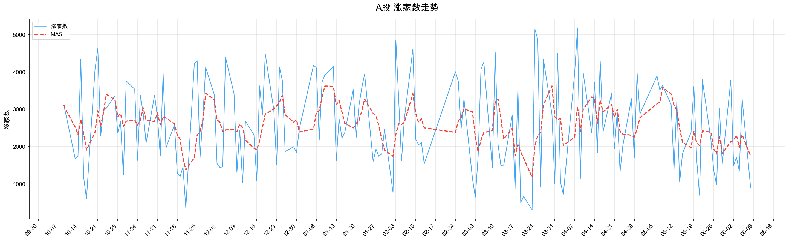

# 2026-06-08 每日市场复盘

> 自动生成自 `market_feature_store` 本地 DuckDB。报告只读取已入库数据，不临时编造缺失项。

## 核心看板
| 维度 | 结论 |
|---|---|
| 市场性质 | 普通交易日 / 下跌阶段 第1天 |
| 指数表现 | 上证 3959.338，涨幅 -1.70%，偏离度 -2.22% |
| 量能状态 | 成交额 27925.23亿，较昨日 -9.00%，相对20日均量 90.52% |
| 情绪状态 | 涨家数 899，MA5 1745.2，涨停 57，跌停 35 |
| 成交集中 | 前三行业 46.40%，较昨日 -2.60pct |
| 题材量能 | 双红 0 个，单红 4 个；双红主线：无 |
| 新高方向 | 120日新高 82 只；前三申万：机械设备(18)、电子(15)、基础化工(9)、煤炭(5)、有色金属(4) |
| 涨停方向 | 核心涨停题材：机器人概念(18)、人工智能(13)、AI应用(11)、芯片概念(11)、商业航天(10) |
| 强度状态 | 强势，强度加权涨幅 7.67%，强度成交占比 10.47% |
| 加权强股 | 中天科技、亨通光电、绿的谐波、京东方Ａ、中船特气 |

## 目录
- [1. 指数 / 量能 / 偏离度 / 市场阶段](#1-指数--量能--偏离度--市场阶段)
- [2. 市场情绪](#2-市场情绪)
- [3. 成交前三行业](#3-成交前三行业)
- [4. 1/3/5/10 日板块涨幅前五](#4-13510-日板块涨幅前五)
- [5. 双红题材：按申万一级分组](#5-双红题材按申万一级分组)
- [6. 重点申万一级近15日子板块双红矩阵](#6-重点申万一级近15日子板块双红矩阵)
- [7. 单红题材：按申万一级分组](#7-单红题材按申万一级分组)
- [8. 120日新高](#8-120日新高)
- [9. 涨停题材](#9-涨停题材)
- [10. 3板及以上个股](#10-3板及以上个股)
- [11. 市场强度](#11-市场强度)
- [12. 近五日加权涨幅 Top10](#12-近五日加权涨幅-top10)
- [13. 数据覆盖检查](#13-数据覆盖检查)
- [14. 市场环境总评](#14-市场环境总评)

---

## 1. 指数 / 量能 / 偏离度 / 市场阶段
| 项目 | 数值 |
|---|---|
| 市场阶段 | 下跌阶段 第1天 |
| 上证指数 | 3959.338 / -1.70% |
| 成交额 | 27925.23亿 |
| 较昨日比 | -9.00% |
| 20日均量 | 30849.02亿 |
| 相对量能比 | 90.52% |
| 周均线 | 4049.10 |
| 偏离度 | -2.22% |
| 价日 | 否 |
| 量日 | 否 |
| 双量日 | 否 |
| 市场性质 | 普通交易日 |

> **结论**：今日为 **普通交易日**；成交额较昨日变化 -9.00%，相对20日均量 90.52%，偏离度 -2.22%。

---

## 2. 市场情绪
| 项目 | 今日 | 昨日 |
|---|---|---|
| 涨家数 | 899 | 3277 |
| 涨家数 MA5 | 1745.2 | 2320.6 |
| 涨停 | 57 | 73 |
| 跌停 | 35 | 11 |

> [点击打开涨家数 MA5 图](file:///Users/lbq/Desktop/%E5%A4%8D%E7%9B%98/2026-06-08-advancers-ma5.png)

### 涨家数 MA5 波段区间
| 区间 | 日期区间 | 状态 | MA5区间 | 变化 |
|---|---|---|---|---|
| 波谷→波峰 | 2026-04-03→2026-04-13 | 上升 | 2028.4→3329.2 | +1300.8 |
| 波峰→波谷 | 2026-04-13→2026-04-28 | 下降 | 3329.2→2253.6 | -1075.6 |
| 波谷→波峰 | 2026-04-28→2026-05-08 | 上升 | 2253.6→3579.6 | +1326.0 |
| 当前震荡区间 | 2026-05-28→2026-06-08 | 震荡 | 2263.4→1745.2 | -518.2 |

> **MA5位置**：当前处于 **震荡区间**，趋势为 **震荡**；上一确认波峰 2026-05-08 MA5 3579.6，上一确认波谷 2026-04-28 MA5 2253.6。

> **结论**：涨家数 899，MA5 1745.2；涨停较昨日减少16只，跌停较昨日增加24只。

---

## 3. 成交前三行业
| 日期 | 前三占比 | 集中度 | 行业1 | 占比1 | 行业2 | 占比2 | 行业3 | 占比3 |
|---|---|---|---|---|---|---|---|---|
| 昨日 | 49.00% | 集中 | 电子 | 30.10% | 通信 | 10.90% | 机械设备 | 8.60% |
| 今日 | 46.40% | 集中 | 电子 | 28.10% | 通信 | 9.60% | 机械设备 | 9.30% |

> **结论**：前三行业占比 46.40%，较昨日 -2.60pct；成交继续集中在 电子、通信、机械设备。

---

## 4. 1/3/5/10 日板块涨幅前五
### 1日
| 板块 | 申万一级 | 涨幅 | 成交额 | 边际量 |
|---|---|---|---|---|
| 工程机械 | 机械设备 | 1.04% | 163.77亿 | 48.42 |
| 油气开采及服务 | 石油石化 | 0.94% | 93.05亿 | 53.14 |
| 银行 | 银行 | 0.42% | 314.23亿 | 22.34 |
| 空间计算 | 电子 | 0.41% | 265.45亿 | 15.06 |
| 减速器 | 机械设备 | -0.13% | 991.54亿 | 4.74 |

### 3日
| 板块 | 申万一级 | 涨幅 | 成交额 | 边际量 |
|---|---|---|---|---|
| 减速器 | 机械设备 | 2.82% | 991.54亿 | 4.74 |
| 工程机械 | 机械设备 | 2.73% | 163.77亿 | 48.42 |
| 自动化设备 | 机械设备 | 2.16% | 901.44亿 | -4.52 |
| 电子化学品 | 基础化工 | 1.44% | 632.79亿 | -11.97 |
| 电机 | 机械设备 | 1.35% | 116.92亿 | -7.64 |

### 5日
| 板块 | 申万一级 | 涨幅 | 成交额 | 边际量 |
|---|---|---|---|---|
| 自动化设备 | 机械设备 | 4.41% | 901.44亿 | -4.52 |
| 电子化学品 | 基础化工 | 3.67% | 632.79亿 | -11.97 |
| MLCC | 电子 | 3.62% | 886.24亿 | 35.30 |
| 金属新材料 | 有色金属 | 3.42% | 197.40亿 | -10.23 |
| 光刻机 | 电子 | 3.19% | 622.87亿 | -11.48 |

### 10日
| 板块 | 申万一级 | 涨幅 | 成交额 | 边际量 |
|---|---|---|---|---|
| 煤炭开采加工 | 煤炭 | 12.09% | 276.75亿 | -6.09 |
| MLCC | 电子 | 8.87% | 886.24亿 | 35.30 |
| 超级电容 | 电力设备 | 1.55% | 857.57亿 | -1.95 |
| 银行 | 银行 | 1.44% | 314.23亿 | 22.34 |
| 非金属材料 | 基础化工 | 0.57% | 91.49亿 | -8.83 |

> **结论**：短期涨幅榜显示 工程机械、油气开采及服务、银行、空间计算、减速器、自动化设备 等方向活跃；10日维度由 煤炭开采加工 领涨。多周期共振题材（出现≥2次）：MLCC(2次)、减速器(2次)、工程机械(2次)、电子化学品(2次)、自动化设备(2次)、银行(2次)；全周期共振题材：无。

---

## 5. 双红题材：按申万一级分组
> 双红题材数量：**0**；主线申万一级：无。

> **结论**：今日无满足“双红（日涨幅 > 0、边际量 > 10、成交额 > 500亿）”条件的题材。

---

## 6. 重点申万一级近15日子板块双红矩阵
> 子板块单元格格式：当日涨幅/边际量/成交额亿；母板块行格式：成交占比/涨跌幅；上证指数行格式：120日均量比/涨跌幅；🔥 表示当日满足双红（日涨幅 > 0、边际量 > 10 且成交额 > 500亿）。

### 电子
| 子板块 | 05-19 | 05-20 | 05-21 | 05-22 | 05-25 | 05-26 | 05-27 | 05-28 | 05-29 | 06-01 | 06-02 | 06-03 | 06-04 | 06-05 | 06-08 |
|---|---|---|---|---|---|---|---|---|---|---|---|---|---|---|---|
| 申万一级：电子（占比/涨跌幅） | 27.2%/2.2% | 28.9%/2.2% | 29.6%/-3.7% | 30.9%/4.3% | 32.7%/4.8% | 31.9%/-0.8% | 33.5%/-1.4% | 32.2%/1.7% | 30.7%/-4.4% | 30.0%/-4.2% | 29.1%/2.6% | 31.9%/2.3% | 31.4%/2.3% | 30.1%/-3.6% | 28.1%/-4.4% |
| 上证指数（120日均量比/涨跌幅） | 1.22x/0.9% | 1.24x/-0.2% | 1.45x/-2.0% | 1.21x/0.9% | 1.33x/1.0% | 1.33x/-0.2% | 1.33x/-1.2% | 1.21x/0.1% | 1.35x/-0.7% | 1.16x/-0.3% | 1.12x/0.4% | 1.25x/0.2% | 1.10x/-0.6% | 1.22x/-0.7% | 1.11x/-1.7% |
| AI PC | 1.4%/-1.5/1116 | -0.0%/1.5/1132 | -2.9%/22.1/1383 | 4.4%/-8.1/1270 | 1.8%/7.0/1359 | -0.9%/11.7/1518 | -3.0%/-4.0/1458 | 1.3%/-21.8/1140 | -3.4%/12.4/1281 | 3.4%/-7.8/1181 | 🔥2.5%/14.2/1349 | -1.2%/20.8/1628 | 0.0%/0.6/1638 | -0.9%/10.5/1811 | -4.0%/-20.8/1433 |
| AI手机 | 2.3%/6.9/1277 | -0.7%/-13.1/1110 | -3.5%/23.5/1371 | 3.1%/-9.6/1239 | 1.6%/3.9/1287 | -1.4%/0.2/1291 | -1.2%/11.0/1432 | 1.3%/-15.0/1217 | -5.3%/7.2/1305 | -0.1%/-4.3/1249 | 1.0%/-12.5/1093 | 🔥0.8%/32.0/1443 | 0.9%/-6.1/1354 | -1.1%/5.2/1424 | -4.5%/-23.0/1096 |
| AI眼镜 | 1.5%/-3.7/2458 | 0.3%/-0.2/2452 | -3.3%/25.6/3081 | 3.4%/-10.0/2771 | 1.7%/5.4/2921 | -1.3%/4.9/3064 | -1.1%/11.2/3408 | 1.4%/-15.9/2866 | -4.5%/11.2/3185 | -0.5%/-15.9/2679 | 1.3%/-7.9/2467 | 🔥0.6%/30.6/3221 | 0.2%/-10.2/2891 | -0.0%/17.0/3384 | -4.3%/-17.1/2805 |
| MCU芯片 | 1.9%/2.0/1235 | 1.0%/4.2/1287 | -4.8%/15.2/1482 | 2.8%/-21.9/1158 | 🔥3.7%/25.3/1450 | -2.1%/0.1/1451 | -1.0%/15.9/1682 | 2.4%/-9.2/1527 | -5.8%/1.1/1544 | -1.6%/-21.4/1214 | 0.5%/-6.9/1130 | 🔥0.8%/17.7/1331 | 0.4%/-11.0/1185 | -1.1%/4.7/1240 | -4.4%/-9.1/1127 |
| MLCC | 3.7%/24.5/400 | 1.4%/30.3/430 | -2.0%/44.8/489 | 🔥8.7%/49.6/534 | 🔥4.0%/85.0/716 | -1.1%/90.0/737 | 🔥1.0%/79.2/731 | 🔥7.5%/89.2/823 | -1.4%/113.2/968 | -0.7%/84.0/886 | 🔥6.7%/64.7/887 | 🔥0.1%/68.2/967 | 🔥5.6%/47.5/911 | -1.7%/59.1/1002 | -6.5%/35.3/886 |
| MR(混合现实) | 1.4%/-12.8/743 | -1.0%/8.0/803 | -2.9%/13.6/912 | 2.5%/-12.9/794 | 🔥1.1%/10.8/881 | -1.2%/-0.4/877 | -2.8%/-4.7/836 | 1.3%/-9.4/757 | -3.8%/15.1/872 | 0.7%/-12.4/764 | 0.7%/-11.5/676 | -0.4%/27.9/864 | -0.7%/-21.7/677 | 🔥0.8%/24.6/843 | -2.7%/-16.1/707 |
| PCB | 1.5%/7.3/2713 | 0.8%/0.4/2723 | -3.5%/24.2/3382 | 6.3%/-1.0/3347 | 🔥2.4%/10.3/3692 | -0.5%/4.5/3860 | -2.0%/-4.9/3671 | 3.5%/-5.0/3488 | -3.7%/12.5/3922 | -2.1%/-11.7/3464 | 2.3%/-1.1/3426 | 🔥0.3%/15.8/3967 | 1.4%/-12.1/3486 | -0.4%/2.9/3588 | -3.3%/-7.1/3332 |
| 元件 | 🔥2.1%/10.3/1155 | 0.5%/-2.0/1132 | -2.6%/28.3/1452 | 🔥7.8%/10.7/1607 | 2.8%/7.9/1734 | 🔥1.0%/10.6/1917 | -1.4%/-5.0/1822 | 3.7%/-9.5/1649 | -2.1%/16.8/1927 | -2.9%/-0.8/1911 | 3.9%/-8.8/1742 | 🔥0.5%/12.7/1964 | 2.6%/-9.8/1770 | -1.4%/1.7/1800 | -3.2%/-7.1/1673 |
| 先进封装 | 2.1%/6.9/3445 | 2.0%/7.1/3689 | -4.0%/17.7/4341 | 3.9%/-18.9/3521 | 🔥4.6%/19.4/4203 | -0.4%/13.5/4769 | -1.3%/7.7/5136 | 2.8%/-15.6/4336 | -5.3%/8.4/4699 | -2.4%/-18.6/3826 | 2.0%/-7.2/3551 | 🔥1.2%/27.1/4512 | 1.7%/-14.2/3871 | -0.9%/7.2/4151 | -3.6%/-16.0/3486 |
| 光刻机 | 2.0%/0.6/598 | 🔥3.1%/16.7/698 | -5.2%/19.5/835 | 3.9%/-19.7/670 | 1.1%/2.5/687 | -2.4%/4.9/720 | -2.8%/-10.1/647 | 2.2%/-6.5/605 | -5.2%/6.2/643 | -1.5%/-19.8/516 | 2.0%/3.9/536 | 🔥2.2%/27.9/685 | 2.8%/-3.6/661 | 0.3%/6.5/704 | -4.1%/-11.5/623 |
| 光刻胶 | 1.1%/-2.0/631 | 🔥2.3%/19.4/753 | -4.8%/19.7/901 | 3.0%/-24.3/683 | 🔥1.9%/19.5/816 | -1.7%/-4.4/780 | -3.4%/-12.4/683 | 2.6%/-7.6/631 | -5.6%/14.2/721 | -0.5%/-23.0/555 | 0.0%/-9.7/501 | 🔥1.3%/27.3/638 | 1.7%/0.2/639 | 0.9%/8.2/691 | -3.8%/-14.4/592 |
| 光学光电子 | 1.9%/7.7/659 | 0.3%/5.2/694 | -0.8%/61.1/1118 | 2.7%/4.4/1167 | 1.2%/-4.7/1113 | -0.0%/1.3/1127 | -1.2%/7.8/1215 | 1.4%/-20.2/969 | -5.8%/5.1/1019 | -0.4%/-19.6/819 | 1.1%/-8.5/750 | 🔥1.1%/44.7/1085 | 0.8%/-8.8/989 | 🔥1.2%/31.5/1301 | -3.5%/-11.6/1150 |
| 共封装光学(CPO) | 1.4%/9.4/5365 | 1.1%/0.6/5395 | -4.6%/11.7/6024 | 5.3%/-9.5/5450 | 🔥2.7%/13.7/6196 | -1.9%/2.9/6373 | -1.5%/3.5/6594 | 3.1%/-6.5/6165 | -3.6%/14.4/7054 | -3.5%/-14.9/6005 | 3.5%/1.7/6106 | 🔥2.5%/22.4/7471 | 1.2%/-16.9/6206 | -1.3%/18.8/7371 | -4.5%/-17.7/6064 |
| 半导体 | 2.9%/2.0/4152 | 🔥3.1%/15.1/4779 | -6.0%/16.2/5551 | 2.9%/-22.0/4329 | 🔥4.5%/23.5/5345 | -2.8%/-2.7/5201 | -1.3%/6.9/5562 | 2.2%/-14.3/4767 | -6.2%/2.4/4879 | -3.9%/-18.1/3997 | 0.6%/-11.9/3523 | 🔥2.3%/27.1/4478 | 1.4%/-13.9/3856 | -2.3%/-1.8/3786 | -5.1%/-16.9/3145 |
| 半导体设备 | 3.7%/-1.9/642 | 🔥6.2%/16.8/750 | -6.3%/28.9/966 | 1.0%/-25.7/718 | 🔥3.7%/16.7/838 | -3.8%/-19.9/671 | -3.6%/-3.9/645 | 0.4%/-17.7/531 | -4.7%/8.1/574 | -4.1%/-12.1/504 | 1.3%/-9.8/455 | 🔥2.4%/24.1/564 | 3.0%/-15.6/476 | -3.0%/-11.6/421 | -4.0%/-8.4/386 |
| 华为手机 | 1.1%/-2.9/523 | 🔥0.5%/19.6/626 | -3.3%/22.3/765 | 4.6%/-11.3/679 | 🔥2.5%/18.4/804 | -0.8%/-14.8/685 | -2.6%/-3.6/660 | 2.4%/-4.9/628 | -3.6%/18.1/742 | -1.8%/-18.8/602 | 1.8%/8.4/653 | -0.6%/18.1/771 | 0.7%/-26.3/568 | -0.0%/18.9/676 | -3.5%/-16.5/564 |
| 存储芯片 | 2.0%/-2.3/4391 | 🔥3.1%/21.2/5321 | -5.3%/15.1/6125 | 3.2%/-19.0/4961 | 🔥4.0%/21.1/6009 | -2.0%/-2.3/5870 | -2.5%/3.2/6058 | 2.4%/-14.6/5172 | -5.3%/4.8/5419 | -2.7%/-16.1/4544 | 1.5%/-6.9/4231 | 🔥1.9%/21.2/5127 | 2.4%/-8.1/4714 | -1.7%/-0.7/4681 | -4.4%/-16.5/3907 |
| 消费电子 | 1.0%/-10.8/1017 | -0.7%/-0.6/1011 | -2.7%/16.1/1173 | 3.1%/-13.2/1018 | 🔥1.4%/16.2/1183 | -1.1%/-7.0/1100 | -2.4%/13.9/1253 | 2.0%/-2.4/1224 | -3.8%/11.7/1367 | 1.5%/-15.6/1154 | 1.2%/3.8/1198 | -0.4%/20.3/1442 | -0.5%/-24.5/1089 | 🔥0.3%/18.6/1292 | -4.5%/-23.6/987 |
| 芯片 | 1.6%/2.9/12448 | 1.0%/5.3/13112 | -4.2%/16.9/15321 | 3.1%/-15.7/12917 | 🔥2.2%/16.1/14989 | -2.0%/-2.0/14692 | -2.0%/1.9/14966 | 2.1%/-9.6/13523 | -4.7%/9.1/14759 | -1.3%/-17.5/12178 | 0.8%/-1.3/12017 | 🔥1.2%/21.4/14587 | 0.6%/-14.3/12503 | -0.1%/14.0/14251 | -3.6%/-14.9/12122 |
| 英伟达 | 1.2%/-5.3/1507 | -0.9%/-0.5/1500 | -3.0%/21.0/1815 | 3.9%/-0.5/1805 | 🔥1.8%/10.2/1990 | -1.9%/-4.5/1902 | -1.8%/-2.5/1853 | 1.3%/-7.6/1712 | -3.5%/18.1/2022 | 0.4%/-15.3/1712 | 0.8%/2.5/1754 | 🔥1.4%/23.9/2173 | 0.2%/-23.1/1672 | -0.7%/12.5/1882 | -3.1%/-15.5/1590 |

### 通信
| 子板块 | 05-19 | 05-20 | 05-21 | 05-22 | 05-25 | 05-26 | 05-27 | 05-28 | 05-29 | 06-01 | 06-02 | 06-03 | 06-04 | 06-05 | 06-08 |
|---|---|---|---|---|---|---|---|---|---|---|---|---|---|---|---|
| 申万一级：通信（占比/涨跌幅） | -/-0.6% | -/0.2% | -/-5.3% | -/4.2% | -/3.8% | -/-0.4% | -/-0.8% | -/4.6% | 8.2%/-1.5% | 7.4%/-3.3% | 8.7%/5.7% | 9.8%/4.8% | 8.6%/0.1% | 10.9%/-3.1% | 9.6%/-3.2% |
| 上证指数（120日均量比/涨跌幅） | 1.22x/0.9% | 1.24x/-0.2% | 1.45x/-2.0% | 1.21x/0.9% | 1.33x/1.0% | 1.33x/-0.2% | 1.33x/-1.2% | 1.21x/0.1% | 1.35x/-0.7% | 1.16x/-0.3% | 1.12x/0.4% | 1.25x/0.2% | 1.10x/-0.6% | 1.22x/-0.7% | 1.11x/-1.7% |
| 6G | 🔥1.8%/11.1/1954 | -0.3%/-0.4/1946 | -4.2%/11.7/2174 | 3.1%/-22.6/1683 | 🔥1.4%/12.8/1899 | -2.1%/-2.5/1851 | -2.3%/-8.7/1690 | 2.5%/-2.1/1653 | -4.4%/30.5/2158 | -1.4%/-23.4/1654 | 1.8%/3.8/1716 | 🔥1.0%/19.7/2054 | -0.0%/-11.4/1820 | 🔥1.7%/31.6/2394 | -4.0%/-13.2/2079 |
| 光纤 | 1.0%/2.2/2402 | 0.9%/0.5/2414 | -4.9%/9.7/2648 | 3.8%/-3.4/2558 | 1.3%/2.7/2627 | -2.9%/-1.4/2590 | -2.1%/0.7/2607 | 3.3%/0.5/2620 | -2.6%/20.7/3162 | -3.4%/-15.5/2672 | 3.0%/4.1/2782 | 🔥3.9%/26.1/3508 | 0.5%/-16.2/2938 | 🔥0.0%/24.9/3669 | -4.4%/-16.0/3082 |
| 星闪 | 1.4%/3.8/416 | -0.6%/-1.5/410 | -3.2%/33.5/548 | 1.6%/-24.0/416 | 1.6%/8.8/453 | -1.9%/0.2/454 | -2.2%/22.3/555 | 0.9%/-6.6/518 | -4.6%/11.1/576 | 1.4%/-18.6/469 | 🔥0.1%/11.8/525 | -0.3%/8.5/569 | -1.6%/-12.4/499 | 🔥1.0%/22.8/613 | -3.4%/-18.2/501 |
| 通信设备 | 1.2%/3.7/2064 | -0.2%/-2.7/2008 | -5.6%/2.8/2064 | 3.1%/-10.6/1845 | 🔥1.8%/11.8/2064 | -2.8%/-0.3/2057 | -2.2%/0.2/2060 | 3.0%/4.6/2155 | -3.0%/22.4/2636 | -2.3%/-21.6/2066 | 🔥2.6%/12.7/2328 | 🔥1.9%/26.2/2938 | -0.6%/-23.7/2242 | 🔥1.1%/42.9/3205 | -4.1%/-20.6/2546 |

### 机械设备
| 子板块 | 05-19 | 05-20 | 05-21 | 05-22 | 05-25 | 05-26 | 05-27 | 05-28 | 05-29 | 06-01 | 06-02 | 06-03 | 06-04 | 06-05 | 06-08 |
|---|---|---|---|---|---|---|---|---|---|---|---|---|---|---|---|
| 申万一级：机械设备（占比/涨跌幅） | 8.8%/1.2% | 8.9%/0.2% | 8.8%/-2.5% | 8.8%/2.9% | 8.5%/1.1% | 8.9%/-1.6% | 8.2%/-2.5% | 7.8%/1.7% | -/-3.8% | -/-1.1% | -/1.2% | -/0.8% | -/1.1% | 8.6%/0.3% | 9.3%/-1.6% |
| 上证指数（120日均量比/涨跌幅） | 1.22x/0.9% | 1.24x/-0.2% | 1.45x/-2.0% | 1.21x/0.9% | 1.33x/1.0% | 1.33x/-0.2% | 1.33x/-1.2% | 1.21x/0.1% | 1.35x/-0.7% | 1.16x/-0.3% | 1.12x/0.4% | 1.25x/0.2% | 1.10x/-0.6% | 1.22x/-0.7% | 1.11x/-1.7% |
| 3D打印 | 1.0%/3.3/1287 | -0.5%/-5.4/1218 | -2.7%/19.0/1449 | 2.7%/-16.6/1208 | 🔥0.6%/10.7/1337 | -1.6%/5.0/1403 | -2.1%/10.3/1548 | 1.7%/-11.6/1369 | -4.4%/5.5/1444 | -0.3%/-17.5/1191 | 0.1%/-2.3/1164 | 🔥0.8%/28.4/1494 | -0.9%/-19.7/1200 | 🔥1.6%/21.6/1459 | -3.0%/-7.6/1348 |
| 人形机器人 | 1.5%/-5.6/4307 | -0.7%/-3.4/4159 | -1.6%/29.3/5376 | 2.3%/-15.0/4572 | 0.3%/3.4/4725 | -0.9%/7.6/5084 | -2.6%/-1.8/4995 | 0.4%/-11.3/4428 | -4.5%/8.6/4810 | 0.2%/-13.5/4163 | 0.4%/-3.5/4019 | 🔥0.0%/15.4/4638 | -0.1%/-5.7/4374 | 🔥1.5%/18.2/5169 | -1.8%/-10.5/4627 |
| 传感器 | 1.7%/5.2/2332 | -0.1%/9.4/2551 | -2.8%/20.0/3062 | 2.9%/-9.9/2759 | 1.3%/6.4/2935 | -1.8%/10.6/3244 | -2.4%/6.0/3441 | 1.5%/-14.7/2936 | -4.9%/1.6/2982 | -0.2%/-16.3/2496 | 0.2%/-8.8/2276 | 🔥0.7%/24.8/2842 | 0.2%/-12.5/2486 | 🔥0.9%/18.9/2957 | -2.9%/-12.6/2584 |
| 减速器 | 1.0%/-17.6/875 | -1.8%/-6.4/819 | -0.4%/39.3/1141 | 1.4%/-19.8/915 | -0.6%/-9.2/831 | -1.1%/15.6/960 | -3.5%/-11.6/849 | 0.1%/-11.0/756 | -4.0%/0.8/762 | 0.0%/-17.1/632 | -0.1%/-6.5/590 | -0.6%/35.2/798 | -0.3%/-11.4/708 | 🔥3.3%/33.8/947 | -0.1%/4.7/992 |
| 工业母机 | 1.4%/6.1/896 | -1.0%/-3.2/867 | -1.9%/26.2/1094 | 2.4%/-16.2/917 | 0.2%/3.1/946 | -1.6%/13.4/1073 | -2.8%/-13.5/928 | 1.3%/-11.0/826 | -4.2%/10.3/911 | -0.7%/-20.8/721 | 0.5%/-1.0/714 | 🔥0.3%/28.8/920 | 0.0%/-9.1/837 | 🔥1.8%/10.4/924 | -0.9%/0.4/928 |
| 新型工业化 | 1.3%/-2.7/1847 | -0.9%/-2.8/1796 | -2.5%/21.7/2185 | 2.2%/-21.2/1721 | 0.3%/8.6/1868 | -1.8%/9.2/2041 | -3.0%/-10.0/1836 | 0.9%/-14.5/1571 | -3.8%/12.3/1764 | 0.4%/-13.6/1523 | 0.1%/-3.0/1478 | -0.1%/23.8/1829 | -0.6%/-17.2/1514 | 🔥2.2%/28.6/1948 | -1.5%/-1.3/1923 |
| 机器人 | 1.3%/-1.7/8257 | -0.7%/0.6/8305 | -2.5%/21.9/10127 | 2.1%/-14.6/8651 | 0.2%/6.3/9198 | -1.4%/6.0/9747 | -2.5%/1.3/9873 | 0.7%/-12.8/8611 | -3.7%/12.9/9722 | 0.6%/-15.4/8227 | -0.1%/-3.3/7956 | -0.2%/15.7/9206 | -0.7%/-10.3/8255 | 🔥1.0%/14.7/9467 | -2.2%/-8.4/8669 |
| 机器视觉 | 1.5%/0.2/1697 | -0.5%/-2.4/1656 | -3.0%/25.8/2083 | 2.7%/-16.9/1731 | 0.2%/6.6/1846 | -1.7%/1.6/1875 | -2.5%/-2.0/1837 | 0.8%/-12.1/1615 | -3.9%/15.1/1858 | 0.2%/-14.9/1581 | -0.3%/-8.4/1448 | 🔥0.3%/20.6/1746 | -0.6%/-16.7/1455 | 🔥1.2%/15.2/1677 | -1.6%/-1.6/1650 |
| 自动化设备 | 1.0%/6.8/874 | 0.3%/-4.0/838 | -2.4%/22.9/1030 | 2.2%/-20.7/817 | 0.8%/7.8/880 | -1.7%/14.4/1006 | -2.3%/-8.8/918 | 1.1%/-15.2/778 | -3.8%/6.5/829 | -1.3%/-15.3/702 | 1.5%/-6.5/657 | 🔥0.7%/35.2/888 | -0.1%/-17.1/736 | 🔥2.8%/28.3/944 | -0.5%/-4.5/901 |
| 通用设备 | 1.4%/-1.7/984 | -0.7%/1.3/997 | -2.8%/23.3/1229 | 2.5%/-12.4/1076 | -0.6%/1.0/1087 | -2.2%/1.6/1104 | -3.1%/-10.3/990 | 1.9%/-12.5/867 | -4.3%/11.9/970 | 0.2%/-23.4/744 | 0.1%/2.7/764 | 🔥0.2%/11.9/855 | 0.0%/-8.4/783 | 🔥2.2%/21.6/952 | -1.4%/2.7/977 |

> **结论**：重点观察申万一级为 电子、通信、机械设备；🔥越连续，说明子板块边际量与成交额越持续。

---

## 7. 申万一级行业个股发动机：成交占比前三行业
> 每个成交占比前三申万一级行业列出当日开根加权 Top20；当日开根加权 = sqrt(成交额亿) × 当日涨幅，用于和双红题材、新高状态做事实层对比。

### 电子
| 排序 | 股票 | 代码 | 涨幅 | 成交额 | 当日开根加权 | 新高状态 | 命中双红 | 双红题材 |
|---|---|---|---|---|---|---|---|---|
| 1 | 奥比中光-W | 688322.SH | 14.37% | 57.4亿 | 108.90 | 历史新高 | 否 | - |
| 2 | 中巨芯-U | 688549.SH | 20.01% | 28.2亿 | 106.19 | 否 | 否 | - |
| 3 | 唯特偶 | 301319.SZ | 19.80% | 25.2亿 | 99.41 | 历史新高 | 否 | - |
| 4 | 中船特气 | 688146.SH | 9.12% | 62.7亿 | 72.22 | 历史新高 | 否 | - |
| 5 | 北京君正 | 300223.SZ | 7.10% | 80.6亿 | 63.73 | 否 | 否 | - |
| 6 | 华正新材 | 603186.SH | 10.00% | 32.7亿 | 57.16 | 否 | 否 | - |
| 7 | 源杰科技 | 688498.SH | 5.24% | 95.4亿 | 51.19 | 否 | 否 | - |
| 8 | 金安国纪 | 002636.SZ | 10.01% | 24.6亿 | 49.68 | 历史新高 | 否 | - |
| 9 | 鹏鼎控股 | 002938.SZ | 5.51% | 62.4亿 | 43.54 | 否 | 否 | - |
| 10 | 聚飞光电 | 300303.SZ | 9.34% | 20.8亿 | 42.60 | 否 | 否 | - |
| 11 | 经纬辉开 | 300120.SZ | 13.91% | 9.2亿 | 42.19 | 否 | 否 | - |
| 12 | 赛微微电 | 688325.SH | 13.28% | 8.6亿 | 38.99 | 历史新高 | 否 | - |
| 13 | 光智科技 | 300489.SZ | 9.82% | 15.6亿 | 38.75 | 否 | 否 | - |
| 14 | 沪电股份 | 002463.SZ | 2.84% | 155.4亿 | 35.41 | 否 | 否 | - |
| 15 | 南亚新材 | 688519.SH | 7.39% | 20.4亿 | 33.42 | 历史新高 | 否 | - |
| 16 | 麦捷科技 | 300319.SZ | 3.86% | 60.0亿 | 29.89 | 历史新高 | 否 | - |
| 17 | 沃格光电 | 603773.SH | 3.10% | 51.8亿 | 22.31 | 历史新高 | 否 | - |
| 18 | 弘信电子 | 300657.SZ | 3.00% | 35.8亿 | 17.96 | 否 | 否 | - |
| 19 | 江化微 | 603078.SH | 3.08% | 30.7亿 | 17.05 | 历史新高 | 否 | - |
| 20 | 科森科技 | 603626.SH | 4.17% | 14.3亿 | 15.78 | 否 | 否 | - |

### 通信
| 排序 | 股票 | 代码 | 涨幅 | 成交额 | 当日开根加权 | 新高状态 | 命中双红 | 双红题材 |
|---|---|---|---|---|---|---|---|---|
| 1 | 中天科技 | 600522.SH | 7.51% | 252.1亿 | 119.23 | 历史新高 | 否 | - |
| 2 | 东方通信 | 600776.SH | 6.65% | 13.9亿 | 24.78 | 否 | 否 | - |
| 3 | 长盈通 | 688143.SH | 4.52% | 15.5亿 | 17.81 | 否 | 否 | - |
| 4 | *ST元道 | 301139.SZ | 12.01% | 1.6亿 | 15.29 | 否 | 否 | - |
| 5 | 嘉环科技 | 603206.SH | 10.03% | 1.0亿 | 10.13 | 否 | 否 | - |
| 6 | 通鼎互联 | 002491.SZ | 1.13% | 62.0亿 | 8.90 | 否 | 否 | - |
| 7 | 武汉凡谷 | 002194.SZ | 2.31% | 11.3亿 | 7.76 | 否 | 否 | - |
| 8 | 中国电信 | 601728.SH | 1.64% | 14.2亿 | 6.18 | 否 | 否 | - |
| 9 | 移远通信 | 603236.SH | 1.69% | 11.1亿 | 5.64 | 20日新高 | 否 | - |
| 10 | 万隆光电 | 300710.SZ | 2.78% | 3.4亿 | 5.16 | 否 | 否 | - |
| 11 | 蘅东光 | 920045.BJ | 1.96% | 6.4亿 | 4.95 | 否 | 否 | - |
| 12 | 美格智能 | 002881.SZ | 1.50% | 7.3亿 | 4.05 | 否 | 否 | - |
| 13 | 会畅科技 | 300578.SZ | 2.99% | 1.7亿 | 3.90 | 否 | 否 | - |
| 14 | 映翰通 | 688080.SH | 1.72% | 1.1亿 | 1.83 | 否 | 否 | - |
| 15 | 云里物里 | 920374.BJ | 2.42% | 0.3亿 | 1.30 | 否 | 否 | - |
| 16 | ST恒信 | 300081.SZ | 1.64% | 0.6亿 | 1.22 | 否 | 否 | - |
| 17 | 利尔达 | 920249.BJ | 1.16% | 0.9亿 | 1.09 | 否 | 否 | - |
| 18 | 广脉科技 | 920924.BJ | 0.96% | 0.4亿 | 0.61 | 否 | 否 | - |
| 19 | 移为通信 | 300590.SZ | 0.07% | 2.7亿 | 0.12 | 否 | 否 | - |
| 20 | ST通脉 | 603559.SH | 0.12% | 0.7亿 | 0.10 | 否 | 否 | - |

### 机械设备
| 排序 | 股票 | 代码 | 涨幅 | 成交额 | 当日开根加权 | 新高状态 | 命中双红 | 双红题材 |
|---|---|---|---|---|---|---|---|---|
| 1 | 绿的谐波 | 688017.SH | 8.97% | 119.5亿 | 98.06 | 历史新高 | 否 | - |
| 2 | 丰光精密 | 920510.BJ | 29.97% | 4.1亿 | 60.76 | 120日新高 | 否 | - |
| 3 | 中大力德 | 002896.SZ | 9.72% | 39.0亿 | 60.69 | 120日新高 | 否 | - |
| 4 | 埃斯顿 | 002747.SZ | 9.99% | 36.8亿 | 60.60 | 3年新高 | 否 | - |
| 5 | 国机精工 | 002046.SZ | 10.00% | 25.3亿 | 50.31 | 否 | 否 | - |
| 6 | 联讯仪器 | 688808.SH | 6.99% | 41.6亿 | 45.10 | 否 | 否 | - |
| 7 | 南方泵业 | 300145.SZ | 13.06% | 11.0亿 | 43.35 | 否 | 否 | - |
| 8 | 昊志机电 | 300503.SZ | 6.41% | 37.8亿 | 39.40 | 否 | 否 | - |
| 9 | 劲拓股份 | 300400.SZ | 11.60% | 11.1亿 | 38.68 | 3年新高 | 否 | - |
| 10 | 鼎泰高科 | 301377.SZ | 7.25% | 27.1亿 | 37.78 | 历史新高 | 否 | - |
| 11 | 锋龙股份 | 002931.SZ | 9.99% | 12.5亿 | 35.28 | 否 | 否 | - |
| 12 | 巨能股份 | 920578.BJ | 30.00% | 1.2亿 | 33.41 | 20日新高 | 否 | - |
| 13 | 中重科技 | 603135.SH | 9.98% | 11.2亿 | 33.40 | 2年新高 | 否 | - |
| 14 | 三一重工 | 600031.SH | 4.61% | 45.0亿 | 30.91 | 否 | 否 | - |
| 15 | 创远信科 | 920961.BJ | 13.71% | 4.8亿 | 30.10 | 20日新高 | 否 | - |
| 16 | 快克智能 | 603203.SH | 10.00% | 8.2亿 | 28.58 | 否 | 否 | - |
| 17 | 天奇股份 | 002009.SZ | 8.30% | 11.8亿 | 28.55 | 否 | 否 | - |
| 18 | 宁波东力 | 002164.SZ | 9.98% | 7.8亿 | 27.93 | 否 | 否 | - |
| 19 | 大业股份 | 603278.SH | 10.04% | 7.7亿 | 27.91 | 否 | 否 | - |
| 20 | 凌云光 | 688400.SH | 5.82% | 22.6亿 | 27.66 | 否 | 否 | - |

> **结论**：先看行业内高开根加权个股是否集中命中双红题材，再结合新高状态判断行业发动机与题材归因是否一致；定性角色后续交给 serenity alpha 补全。

---

## 8. 单红题材：按申万一级分组
> 单红题材数量：**4**；主要分布：机械设备(1)、电子(1)、石油石化(1)、银行(1)。

### 机械设备
| 题材 | 涨幅 | 边际量 | 成交额 |
|---|---|---|---|
| 工程机械 | 1.04% | 48.42 | 163.77亿 |

### 电子
| 题材 | 涨幅 | 边际量 | 成交额 |
|---|---|---|---|
| 空间计算 | 0.41% | 15.06 | 265.45亿 |

### 石油石化
| 题材 | 涨幅 | 边际量 | 成交额 |
|---|---|---|---|
| 油气开采及服务 | 0.94% | 53.14 | 93.05亿 |

### 银行
| 题材 | 涨幅 | 边际量 | 成交额 |
|---|---|---|---|
| 银行 | 0.42% | 22.34 | 314.23亿 |

> **结论**：单红以 机械设备、电子、石油石化、银行 等方向为主。

---

## 9. 120日新高
> 120日新高数量：**82**；前三申万一级：机械设备(18)、电子(15)、基础化工(9)、煤炭(5)、有色金属(4)。

| 申万一级 | 数量 |
|---|---|
| 机械设备 | 18 |
| 电子 | 15 |
| 基础化工 | 9 |
| 煤炭 | 5 |
| 有色金属 | 4 |
| 汽车 | 4 |
| 电力设备 | 3 |
| 环保 | 3 |
| 计算机 | 3 |
| 银行 | 3 |
| 房地产 | 3 |
| 建筑材料 | 3 |
| 家用电器 | 2 |
| 社会服务 | 2 |
| 通信 | 1 |
| 医药生物 | 1 |
| 传媒 | 1 |
| 纺织服饰 | 1 |
| 公用事业 | 1 |

### 近15日120日新高映射矩阵
> 单元格为当日120日新高去重个股数；按申万一级分组，行是该申万一级内的题材映射。

### 电子
| 题材 | 05-19 | 05-20 | 05-21 | 05-22 | 05-25 | 05-26 | 05-27 | 05-28 | 05-29 | 06-01 | 06-02 | 06-03 | 06-04 | 06-05 | 06-08 |
|---|---|---|---|---|---|---|---|---|---|---|---|---|---|---|---|
| 共封装光学(CPO) | 16 | 19 | 18 | 14 | 31 | 25 | 26 | 18 | 21 | 7 | 10 | 10 | 2 | - | - |
| 先进封装 | 12 | 22 | 22 | - | 13 | 10 | 8 | 5 | 6 | 1 | 1 | 1 | 6 | - | - |
| PCB概念 | 9 | 9 | 12 | 7 | 16 | 12 | 8 | 8 | 10 | 1 | 3 | 1 | 4 | 2 | 2 |
| 芯片概念 | 5 | 18 | 16 | 4 | 14 | 8 | 8 | 6 | 3 | 1 | - | 1 | - | - | 1 |
| 存储芯片 | 6 | 16 | 17 | 3 | 9 | 4 | 7 | 5 | 2 | 1 | 1 | 2 | 7 | - | - |
| AI眼镜 | 2 | 9 | 9 | 1 | 5 | 3 | 5 | 4 | 1 | 1 | - | 3 | 1 | - | - |
| 光刻机 | 6 | 8 | 5 | 2 | 3 | 3 | 5 | 1 | 1 | 1 | 1 | 2 | 3 | 1 | - |
| 液冷服务器 | 2 | 4 | 2 | 2 | 4 | 4 | 3 | 3 | 2 | 1 | - | - | - | - | - |
| AI PC | 2 | 3 | 2 | 2 | 3 | 2 | 2 | - | 2 | 2 | 4 | - | - | - | - |
| 超级电容 | 2 | 2 | 1 | 2 | 2 | - | 1 | 2 | 2 | 1 | 1 | - | 2 | - | - |
| 光纤概念 | 1 | 2 | 1 | 2 | 2 | 2 | 2 | 1 | - | 1 | - | 2 | 1 | 1 | - |
| 未映射主板块 | 2 | 1 | 2 | - | 1 | 2 | 4 | 2 | 1 | - | - | 1 | 1 | 1 | - |
| 铜缆高速连接 | 2 | 2 | 3 | - | 2 | 1 | 1 | - | - | 1 | - | 1 | - | - | - |
| 6G概念 | 1 | 1 | 1 | 1 | 1 | - | - | - | - | - | - | - | - | 5 | - |
| MR(混合现实) | - | - | 1 | 1 | 1 | - | 1 | 1 | - | - | 1 | 1 | - | 2 | 1 |
| PET铜箔 | 1 | 1 | 1 | - | 1 | - | 1 | 1 | - | - | 1 | - | 2 | - | - |
| 英伟达概念 | - | - | - | - | 1 | - | - | - | 2 | 1 | 1 | 3 | - | - | - |
| 军工 | 1 | - | 1 | 1 | 1 | - | 1 | 1 | - | - | 1 | 1 | - | - | - |
| 人形机器人 | - | - | - | - | - | - | 1 | - | - | - | - | - | - | 5 | 2 |
| 光伏概念 | - | - | 1 | - | 1 | 1 | 1 | 1 | - | - | - | - | - | 2 | - |

### 通信
| 题材 | 05-19 | 05-20 | 05-21 | 05-22 | 05-25 | 05-26 | 05-27 | 05-28 | 05-29 | 06-01 | 06-02 | 06-03 | 06-04 | 06-05 | 06-08 |
|---|---|---|---|---|---|---|---|---|---|---|---|---|---|---|---|
| 共封装光学(CPO) | 5 | 3 | 1 | - | 3 | 5 | 3 | 4 | 6 | 2 | 6 | 3 | 1 | - | - |
| 光纤概念 | - | 1 | 1 | - | 1 | - | - | 1 | 1 | - | - | 6 | 1 | - | - |
| 铜缆高速连接 | 1 | - | - | - | - | - | 1 | 1 | 1 | - | - | 1 | 3 | - | - |
| 6G概念 | 2 | 2 | - | - | 1 | - | - | - | - | - | - | - | - | 1 | - |
| 液冷服务器 | 2 | 2 | 1 | - | - | - | - | - | - | - | - | - | - | - | - |
| 高压快充 | - | - | - | - | - | 1 | - | - | 1 | 1 | 1 | - | - | - | - |
| 短剧游戏 | - | - | - | - | 1 | 1 | 1 | - | - | - | 1 | - | - | - | - |
| 芯片概念 | - | - | 1 | - | 1 | - | - | - | - | - | - | - | - | 2 | - |
| 无人驾驶 | - | - | - | - | - | - | - | - | - | - | - | 1 | 1 | 1 | - |
| 商业航天 | 1 | 1 | - | - | - | - | - | - | - | - | - | - | - | - | - |
| 太赫兹 | - | - | - | - | - | - | - | - | - | - | - | - | - | 2 | - |
| 海峡两岸 | - | - | - | - | - | - | - | - | - | 1 | 1 | - | - | - | - |
| 3D打印 | - | - | - | - | - | - | - | - | - | - | - | - | - | 2 | - |
| 固态电池 | - | - | - | - | - | - | - | - | - | - | - | - | - | 1 | - |
| AI应用 | - | - | - | - | - | - | - | - | - | - | - | - | - | 1 | - |
| 新型工业化 | - | - | - | - | - | - | - | - | - | - | - | - | - | 1 | - |
| MR(混合现实) | 1 | - | - | - | - | - | - | - | - | - | - | - | - | - | - |
| 储能 | 1 | - | - | - | - | - | - | - | - | - | - | - | - | - | - |
| 机器视觉 | - | - | - | - | - | - | - | - | - | - | - | - | - | 1 | - |
| 数据要素 | - | - | - | - | - | - | - | - | - | - | - | - | - | - | 1 |

### 机械设备
| 题材 | 05-19 | 05-20 | 05-21 | 05-22 | 05-25 | 05-26 | 05-27 | 05-28 | 05-29 | 06-01 | 06-02 | 06-03 | 06-04 | 06-05 | 06-08 |
|---|---|---|---|---|---|---|---|---|---|---|---|---|---|---|---|
| PCB概念 | 9 | 12 | 14 | 9 | 16 | 9 | 8 | 9 | 8 | 3 | 3 | - | 4 | - | 1 |
| 共封装光学(CPO) | 4 | 7 | 6 | 6 | 9 | 8 | 6 | 4 | 6 | 1 | 2 | 5 | - | - | - |
| 芯片概念 | 4 | 6 | 11 | 5 | 8 | 6 | 2 | 2 | 3 | - | - | 5 | 5 | 2 | 1 |
| 人形机器人 | 8 | 5 | 5 | 1 | 2 | 2 | 2 | 3 | 2 | - | 1 | - | - | - | - |
| 新型工业化 | - | 1 | 2 | - | 2 | 1 | 1 | 1 | 1 | 1 | 2 | - | - | 11 | 5 |
| 工业母机 | 3 | 1 | 3 | 1 | 1 | 2 | 1 | - | - | - | - | 1 | 1 | 3 | 3 |
| 传感器 | 3 | 2 | 3 | 3 | 3 | 1 | - | 1 | - | - | 1 | 1 | 1 | - | - |
| 液冷服务器 | 4 | 5 | 3 | 2 | 4 | 1 | - | - | - | - | - | - | - | - | - |
| 未映射主板块 | - | 1 | 1 | 1 | 2 | 2 | 2 | 2 | 2 | - | - | 1 | - | 2 | 1 |
| 先进封装 | 2 | 3 | 2 | - | 2 | 1 | 2 | 1 | - | - | - | - | 2 | - | - |
| 无人驾驶 | 2 | 1 | 1 | 1 | 1 | 2 | 1 | 1 | - | - | 1 | - | - | - | - |
| 减速器 | 1 | - | 1 | 1 | - | - | - | - | - | - | - | - | - | 3 | 3 |
| 光刻机 | 1 | 2 | - | - | 1 | 1 | - | - | - | - | - | 2 | 2 | - | - |
| 光纤概念 | 1 | - | 1 | - | 1 | - | 1 | 1 | 1 | - | - | 3 | - | - | - |
| 固态电池 | - | - | 1 | 1 | 2 | 1 | 1 | 1 | 1 | - | - | - | - | - | - |
| 军工 | 1 | 2 | - | 1 | 2 | - | - | - | - | - | - | 1 | - | - | - |
| 机器人概念 | 1 | - | - | - | - | - | 1 | 1 | - | - | - | 1 | - | 2 | - |
| 存储芯片 | - | 1 | 1 | - | - | - | - | - | - | - | - | 1 | 2 | - | - |
| 6G概念 | - | - | - | - | - | - | - | 1 | 1 | 1 | 1 | - | - | - | - |
| 3D打印 | - | - | - | - | 2 | 1 | 1 | - | - | - | - | - | - | - | - |

> **结论**：120日新高主要承载在 机械设备、电子、基础化工；题材集中于 未映射主板块(17)、人形机器人(7)、新型工业化(5)、机器人概念(5)、减速器(4)。

---

## 10. 涨停题材
### 近15日子板块涨停矩阵
> 单元格为该申万一级子板块成分股中，当日涨停的去重个股数；行口径与第6节子板块双红矩阵一致。

### 电子
| 题材 | 05-19 | 05-20 | 05-21 | 05-22 | 05-25 | 05-26 | 05-27 | 05-28 | 05-29 | 06-01 | 06-02 | 06-03 | 06-04 | 06-05 | 06-08 |
|---|---|---|---|---|---|---|---|---|---|---|---|---|---|---|---|
| 芯片 | 5 | - | - | 9 | 27 | - | 6 | - | - | 14 | 25 | 23 | 21 | 17 | - |
| 共封装光学(CPO) | 4 | - | - | 18 | 13 | - | 2 | - | - | 4 | 13 | 7 | 8 | 2 | 1 |
| PCB | 3 | - | - | 9 | 11 | - | 3 | - | - | 5 | 5 | 4 | 4 | 3 | 2 |
| 先进封装 | 2 | - | - | 4 | 13 | - | 2 | - | - | 4 | 8 | 4 | 5 | 3 | 3 |
| 存储芯片 | 1 | - | - | 5 | 12 | - | 1 | - | - | 3 | 7 | 4 | 6 | 4 | 3 |
| AI眼镜 | 4 | - | - | 6 | 8 | - | 2 | - | - | 7 | 7 | 2 | 4 | 2 | 1 |
| MLCC | 5 | - | - | 3 | 9 | - | 4 | - | - | 3 | 7 | 2 | 9 | 1 | - |
| 元件 | 5 | - | - | 8 | 4 | - | 3 | - | - | 1 | 4 | 2 | 4 | 1 | 1 |
| AI PC | 1 | - | - | 4 | 5 | - | 1 | - | - | 10 | 2 | 1 | 3 | - | 1 |
| 光学光电子 | 3 | - | - | 2 | 3 | - | 1 | - | - | 3 | 4 | 2 | 3 | 3 | - |
| 半导体 | 1 | - | - | - | 9 | - | - | - | - | 1 | 1 | 2 | 5 | - | - |
| 消费电子 | 1 | - | - | - | 2 | - | - | - | - | 9 | 1 | 1 | 2 | - | - |
| 英伟达 | 1 | - | - | 3 | 2 | - | - | - | - | 3 | 2 | 2 | 2 | - | - |
| MR(混合现实) | 2 | - | - | 2 | 1 | - | - | - | - | 1 | 3 | - | 2 | 1 | 2 |
| 空间计算 | 2 | - | - | 1 | 2 | - | 1 | - | - | 2 | - | - | - | - | 4 |
| 光刻机 | 1 | - | - | - | 2 | - | 1 | - | - | 1 | 1 | 1 | 4 | 1 | - |
| 光刻胶 | - | - | - | - | 2 | - | - | - | - | 1 | 1 | 3 | 2 | 2 | - |
| 华为手机 | 1 | - | - | 3 | 2 | - | - | - | - | 1 | - | - | 2 | 1 | - |
| AI手机 | 1 | - | - | 2 | 1 | - | 1 | - | - | 1 | 3 | - | - | - | - |
| MCU芯片 | - | - | - | - | 2 | - | 1 | - | - | - | 1 | 2 | - | 1 | - |

### 通信
| 题材 | 05-19 | 05-20 | 05-21 | 05-22 | 05-25 | 05-26 | 05-27 | 05-28 | 05-29 | 06-01 | 06-02 | 06-03 | 06-04 | 06-05 | 06-08 |
|---|---|---|---|---|---|---|---|---|---|---|---|---|---|---|---|
| 6G | 2 | - | - | 3 | 3 | - | 1 | - | - | 2 | 7 | 2 | - | 3 | 1 |
| 光纤 | - | - | - | - | 1 | - | - | - | - | 2 | 8 | 6 | 3 | 2 | 1 |
| 通信设备 | - | - | - | 1 | 2 | - | 1 | - | - | - | 7 | 3 | 2 | 3 | - |
| 星闪 | - | - | - | - | 1 | - | - | - | - | 3 | - | 1 | 1 | 1 | - |
| 通信服务 | 2 | - | - | - | - | - | - | - | - | - | - | - | - | - | - |

### 机械设备
| 题材 | 05-19 | 05-20 | 05-21 | 05-22 | 05-25 | 05-26 | 05-27 | 05-28 | 05-29 | 06-01 | 06-02 | 06-03 | 06-04 | 06-05 | 06-08 |
|---|---|---|---|---|---|---|---|---|---|---|---|---|---|---|---|
| 机器人 | 30 | - | - | 9 | 28 | - | 11 | - | - | 22 | 21 | 19 | 16 | 22 | 18 |
| 人形机器人 | 11 | - | - | 4 | 8 | - | 5 | - | - | 11 | 13 | 9 | 8 | 11 | 5 |
| 新型工业化 | 4 | - | - | 3 | 11 | - | 3 | - | - | 4 | 6 | 4 | 4 | 10 | 7 |
| 机器视觉 | 2 | - | - | 4 | 4 | - | 3 | - | - | 4 | 3 | 4 | 1 | 3 | 7 |
| 专用设备 | 1 | - | - | 1 | 8 | - | 3 | - | - | 3 | - | 3 | 4 | 8 | 2 |
| 传感器 | 5 | - | - | 2 | 7 | - | - | - | - | 2 | 3 | 4 | 6 | 2 | - |
| 通用设备 | 5 | - | - | - | 2 | - | - | - | - | 3 | 4 | 2 | 5 | 8 | - |
| 减速器 | 3 | - | - | - | 3 | - | 3 | - | - | 2 | 5 | 1 | 1 | 7 | 2 |
| 工业母机 | - | - | - | - | 2 | - | 2 | - | - | 2 | 2 | 1 | 1 | 3 | 3 |
| 自动化设备 | - | - | - | 2 | 4 | - | - | - | - | 1 | 4 | 1 | - | 1 | - |
| 3D打印 | 1 | - | - | - | 1 | - | - | - | - | - | 3 | 1 | - | 4 | 1 |
| 电机 | - | - | - | - | 1 | - | - | - | - | 2 | - | - | - | 2 | - |
| 轨交设备 | - | - | - | - | - | - | - | - | - | 1 | - | - | 1 | - | - |

### 当日涨停题材 Top20
| 题材 | 申万一级映射 | 涨停数 | 市场占比 | 封单金额 | 代表涨停股 |
|---|---|---|---|---|---|
| 机器人概念 | 机械设备 | 18 | 31.58% | 19.89亿 | 埃斯顿、达实智能、国机精工、凡拓数创、锋龙股份 |
| 人工智能 | 计算机 | 13 | 22.81% | 11.66亿 | 达实智能、能科科技、凡拓数创、中望软件、快克智能 |
| AI应用 | 计算机 | 11 | 19.30% | 9.24亿 | 达实智能、能科科技、凡拓数创、中望软件、天娱数科 |
| 芯片概念 | 电子 | 11 | 19.30% | 10.81亿 | 华正新材、中巨芯-U、国机精工、亚翔集成、盈新发展 |
| 商业航天 | 国防军工 | 10 | 17.54% | 10.01亿 | 神剑股份、国机精工、能科科技、中天火箭、大业股份 |
| DeepSeek概念 | 计算机 | 10 | 17.54% | 8.75亿 | 达实智能、能科科技、天娱数科、居然智家、华如科技 |
| 军工 | 国防军工 | 9 | 15.79% | 9.76亿 | 神剑股份、国机精工、能科科技、泰和新材、中天火箭 |
| AI智能体 | 计算机 | 9 | 15.79% | 7.93亿 | 达实智能、能科科技、盈新发展、天娱数科、居然智家 |
| 光伏概念 | 电力设备 | 9 | 15.79% | 9.91亿 | 埃斯顿、国机精工、中天火箭、国晟科技、粤桂股份 |
| 储能 | 电力设备 | 7 | 12.28% | 5.71亿 | 华正新材、国晟科技、宗申动力、易事特、龙源技术 |
| 风电 | 电力设备 | 7 | 12.28% | 6.03亿 |  |
| 新型工业化 | 机械设备 | 7 | 12.28% | 6.59亿 |  |
| 机器视觉 | 机械设备 | 7 | 12.28% | 7.85亿 |  |
| 数据要素 | 计算机 | 7 | 12.28% | 5.93亿 |  |
| 通用设备 | 机械设备 | 6 | 10.53% | 4.22亿 |  |
| IP经济(谷子经济) | 传媒 | 5 | 8.77% | 4.76亿 |  |
| 信创 | 计算机 | 5 | 8.77% | 5.55亿 |  |
| 云计算 | 计算机 | 5 | 8.77% | 5.97亿 |  |
| 人形机器人 | 机械设备 | 5 | 8.77% | 6.52亿 |  |
| 数据中心 | 计算机 | 5 | 8.77% | 4.75亿 |  |

### 涨停个股所属申万一级分布
| 申万一级 | 涨停个股数 |
|---|---|
| 机械设备 | 10 |
| 计算机 | 6 |
| 建筑装饰 | 3 |
| 商贸零售 | 3 |
| 电子 | 2 |
| 国防军工 | 2 |
| 基础化工 | 2 |
| 传媒 | 2 |
| 电力设备 | 1 |
| 有色金属 | 1 |
| 公用事业 | 1 |
| 通信 | 1 |
| 建筑材料 | 1 |
| 环保 | 1 |
| 综合 | 1 |
| 房地产 | 1 |

> **结论**：涨停题材核心集中在 机器人概念、人工智能、AI应用、芯片概念、商业航天、DeepSeek概念、军工。

---

## 11. 3板及以上个股
| 股票 | 代码 | 连板数 | 首板日期 | 题材 | 涨幅 | 晋级率 |
|---|---|---|---|---|---|---|
| 大有能源 | 600403.SH | 6 | 2026-06-01 | 低价股 | 9.95% | 1/1=100% |
| 中重科技 | 603135.SH | 4 | 2026-06-03 | 机器人 | 9.98% | 1/1=100% |
| 祥和实业 | 603500.SH | 3 | 2026-06-04 | AI硬件 | 9.98% | 1/4=25% |

> **结论**：3板及以上个股 3 只，最高连板 6 板。

---

## 12. 市场强度
| 指标 | 今日 | 昨日 |
|---|---|---|
| 强度加权涨幅 | 7.67% | 9.09% |
| 强度成交占比 | 10.47% | 9.03% |
| 强度成交额 | 2955.72亿 | 2798.99亿 |
| 强度成交环比 | 5.60% | -46.83% |
| 强度 MA5 | 8.82% | 9.25% |
| 强度 MA20 | 8.66% | 8.80% |
| 强度状态 | 强势 | 沸点 |

> **结论**：市场强度状态为 **强势**，强度成交占比 10.47%。

---

## 13. 近五日加权涨幅 Top10
| 股票 | 代码 | 5日涨幅 | 成交额 | 加权涨幅 | 申万一级 | 主要题材 |
|---|---|---|---|---|---|---|
| 中天科技 | 600522.SH | 25.74% | 252.05亿 | 64.88 | 通信 | 共封装光学(CPO)、氢能源、商业航天、数据中心、固态电池 |
| 亨通光电 | 600487.SH | 26.35% | 236.89亿 | 62.42 | 通信 | 光纤、DeepSeek、人形机器人、数据中心、液冷服务器 |
| 绿的谐波 | 688017.SH | 49.06% | 119.50亿 | 58.63 | 机械设备 | 人形机器人、减速器、机器人、新型工业化 |
| 京东方Ａ | 000725.SZ | 17.35% | 297.02亿 | 51.53 | 电子 | 光纤、人工智能、AI PC、传感器、机器人 |
| 中船特气 | 688146.SH | 48.35% | 62.71亿 | 30.32 | 电子 | 氟化工、电子化学品、固态电池、光刻机 |
| 麦捷科技 | 300319.SZ | 49.68% | 59.96亿 | 29.79 | 电子 | 存储芯片、元件、人形机器人、储能、共封装光学(CPO) |
| 源杰科技 | 688498.SH | 29.48% | 95.43亿 | 28.13 | 电子 | 数据中心、共封装光学(CPO)、半导体、光纤 |
| 奥比中光-W | 688322.SH | 39.92% | 57.43亿 | 22.93 | 电子 | 3D打印、MLOps、光学光电子、智能座舱、空间计算 |
| 沪电股份 | 002463.SZ | 11.83% | 155.45亿 | 18.39 | 电子 | 元件、数据中心、海峡两岸、PCB、无人驾驶 |
| 联讯仪器 | 688808.SH | 40.90% | 41.63亿 | 17.03 | 机械设备 | 存储芯片、共封装光学(CPO) |

> **结论**：近五日加权强股前列为 中天科技、亨通光电、绿的谐波、京东方Ａ、中船特气，主要关联 数据中心、固态电池、光纤、人形机器人、机器人。

---

## 14. 数据覆盖检查
| 表 | 最新日期 | 总行数 | 目标日行数 | 状态 |
|---|---|---|---|---|
| fact_market_daily | 2026-06-08 | 161 | 1 | OK |
| fact_sector_daily | 2026-06-08 | 45410 | 224 | OK |
| fact_sw_l1_daily | 2026-06-08 | 290 | 31 | OK |
| fact_sector_stock_daily | 2026-06-08 | 1050447 | 22888 | OK |
| fact_stock_high_daily | 2026-06-08 | 65727 | 147 | OK |
| fact_theme_limit_heat_daily | 2026-06-08 | 3309 | 20 | OK |
| fact_theme_limit_stock_daily | 2026-06-08 | 12219 | 166 | OK |
| fact_limit_advance_daily | 2026-06-08 | 91 | 3 | OK |
| fact_stock_daily | 2026-06-04 | 821500 | 0 | 缺目标日 |

---

## 15. 市场环境总评
> 2026-06-08 市场性质为 **普通交易日**，市场阶段为 **下跌阶段**。成交额 27925.23亿，较昨日 -9.00%；前三行业占比 46.40%。主线集中在 机械设备、计算机、电子、国防军工 相关方向，强度状态为 **强势**。

生成时间：2026-06-08 20:44:14